# Big data Analysis

## SEMMA

**The steps in Data Mining**

First, what is data mining?

> The process of extracting ('mining') **insights** from data.

Tipical steps:

1. **S**ample: Take a sample from the dataset; pratition into training, validation, and test dataset
2. **E**xplore: Examine the dataset statistically and graphically
3. **M**odify: Transform the variables and impute missing values
4. **M**odel: Fit predictive models
5. **A**ssess: Compare model using a validation dataset

Step 4 and 5 are general tasks which is the focus of this course.

We will talk about them in the followings.

Sample, easy to understand, is used to avoid **overfitting**.

Explore, first it needs to determine the types of data, usually there are four types of data:

- Qualitative or categorical
  - Nomial, e.g. nationality, color
  - Ordinal, e.g. food spiciness: not spicy, mild spicy, very spicy
- Quantatitive
  - Discrete
  - Continuous

Data can also be classified as structured or unstructured, which is depend on whether it can be stored in the excel sheet. For now, we focus on structured data. And always visualize data first.

In reality, data are often incomplete, contain outlier and skewed, so we need to fillna, clip and log-transform, which is 'modify'.

The modeling approach boils down to 

$$
y = f(X;\theta,\lambda) + \varepsilon
$$

where
- $y$ is the target
- $X$ are the features
- $\lambda$ are the hyperparameters
- $f$ is the machine learning functionjk

## Data Visulaization

We have various ways to show data distribution. For some skewed wealth, the median (50% quantile) is more meaningful than mean.

When visualize the data, error bar is an important aspect. The plausible trend could be random after adding error bar.

**Bootstrapping** is a straight forward war to get error bars. For each bootsrapped dataset, we sample $K$ times with **replacement** from the original dataset.

## Optimiztion

Even for seemingly simple functions, sometimes no analytical solution exists. **Numerical solutions** are required.

Newton's method is one of the most common root-finding algorithms. The method is inspired by Taylor approximation.

A first-order Taylor approximation allows us to approximate $g(x)$ at a point $x_k$ as:

$$
\hat{g}(x):=g(x_k)+g^{\prime}(x_k)(x-x_k)\approx g(x)
$$

then the function $\hat{g}$ has a root at 

$$
x^*=x_k-\frac{g(x_k)}{g^{\prime}(x_k)}
$$

initialize a $x_0$ and iterates:

$$
x_{k+1} = x_k - \frac{g(x_k)}{g'(x_k)}
$$

when the first-order derivative is hard to get, then use discrete difference to approximate, then it is called Quasi-Newton method.

**Gradient Descent**

> get down the mountain with the steepest descent.

What is Gradient?

Consider a function $f: A\subset\mathbb{R}^n\to\mathbb{R}$, its gradient $\nabla f(x_k)\equiv\left(\frac{\partial f}{\partial x_1},...,\frac{\partial f}{\partial x_n}\right)$ always points into **the direction of steepest ascent**.

mathematically, GD amounts to iterating

$$
\theta_{k+1} = \theta_k - \alpha \nabla f(\theta_k)
$$

When the gradient is not always available, so we sometimes need to rely on **metaheuristic** method such as **simulated annealing**(SA).

SA is a useful metaheuristic to approximate **global** optimization in the presence of large numbers of local optima. It is also useful when the objective function is **discrete or non-differentiable**.

Starting from an initial guess $x_0$, SA proceeds in two steps.

1. Propose a move $x_k \rightarrow x_{k+1}$, where $x_{k+1}$ according to a problem-specific stochastic rule, and typically close to $x_k$.
2. Accept the move if $\Delta c_k:=c(x_{k+1})-c(x_k)<0$ and else accept with probability $\propto\exp\left(-\frac{1}{T_k}\frac{\Delta c_k}{\eta}\right)$.

The parameter $T$ is known as temperature and it is typically decreased as $k$ increases. In the limit of zero temperature only steps that decrease the function are accepted.

The **genetic algorithm** is a metaheuristic inspired by the process of natural selection. 

Four phases are considered in a genetic maximization algorithm:

- initial population
  - Typically, the initial population is randomly generated.
- selection
  - The fitness of individual $A_i$ is given by $f_i = f(A_i)$.
  - In the selection phase we select two individuals at random, with probability proportional to their fitness, so that high fitness have more change of being selected for reproduction
- crossover
  - The two selected individuals (say $A_1$ and $A_2$) are to be mated. To this end, a crossover point is chose **at random** from within the genes. Offspring is created by exchanging the genes of parents among themselves until the crossover point is reached.  
- mutation
  - In certain new offspring formed, some of their genes can be subjected to a mutation with a **low** and **random** probability. This implies that some of the bits in the string can be **flipped**. 

The population has a fixed size. The newly added offspring **replaces** the individuals with lowest fitness in the population.

The algorithm terminates if the population has **converged**, e.g. if the maximum fitness does not improve over multiple mating rounds.

The GA can be rather efficient in high dimensions and does not require a gradient. However, taking into consideration boundary is not so straightforward.

As a means of last resort, one can use a **brute force optimization** that evaluates the objective on a grid, compares all values and thereby finds the optimum.

This method is very inefficient and suffers from the **curse of dimensionality**.

Advantage: Taking into consideration boundary constraints and other restrictions is straightforward.

To improve efficiency, one can start on a coarse grid and find the optimum here. Then, one draws a more refined grid around the area. This process can be iteratively repeated for many steps. This is a so-called **hierarchical brute force** optimization.

## Linear Regression

**Least-Square**

Least square is a standard approach to data fitting. Given a function $y=f(x;\theta)$, we are interested in finding the function parameter $\theta$ that best explain the observed data.

Given $n$ observations $(x_i, y_i)$ where $i=1,\cdots,n$, we minimize the objective

$$
C(\theta)=\sum_{i=1}^n\left(y_i-f(x_i;\theta)\right)^2.
$$

We call $y_i - f(x_i;\theta)$ the i-th **residual**, which is not explained by the regression.

One uses least-square rather than "least absolute values" because the square function is differentiable. Hence, gradient descent can be used.

when we have multivariates, we have multivariate Linear Regression,

$$
y=f(x;\theta)+\epsilon=f(x;\beta_0,...,\beta_k)+\epsilon=\beta_0+\beta_1x_1+\beta_2x_2+...+\beta_px_k+\epsilon
$$

$\beta_0, \cdots,\beta_k$ are regression coefficients and $\varepsilon$ is the noise or the residuals. $\beta_0$ is the intercept.

The value of the fitted parameter is not necessarily unique but depends on the exact shape of our cost function.

Typically, the objective function is the MSE,

$$
\hat{\beta}_0,\ldots,\hat{\beta}_k=\mathrm{argmin~}O(\beta)\equiv\mathrm{argmin}\frac{1}{n}\sum_{i=1}^n\left(y_i-\hat{y}_i\right)^2.
$$

but when we report, we need to report **root-MSE** instead of MSE because it is a clearer description of the difference of error.

To better interpret the regression coefficient, the independent variables are typically **standardized**.

**Regularization**

> [!TIP|label:Motivation]
> When two features are highly correlated, the estimated regression coefficients can become highly correlated, which is known as **multi-collinearity** problem.
>
> For regression problem, we have analytical solution for $\beta$
$$
\beta=\left(X^TX\right)^{-1}X^Ty
$$
> but when there is multi-collinearity, the inverse of the matrix $X^TX$ become numerically unstable.
>
> Similarly, $X^TX$ does not have a well-defined inverse if $k >> n$, which is often the case in machine learning, and simply removing the highly correlated features is not (always) feasible.

We deal with multi-collinearity problem by 'punishing' large regression coefficient. With regularization, we minimize

$$
\begin{aligned}\hat{\beta}_{0},\ldots,\hat{\beta}_{p}&=\operatorname{argmin}\sum_{i=1}^{n}\left(y_{i}-\hat{y}_{i}\right)^{2}+\lambda\sum_{j=1}^{p}\beta_{j}^{2}\end{aligned}
$$

In other words, we want to minimize the prediction error and also keep the coefficients samll, which is called the Ridge-regression.

A related approach is Lasso-regression, which uses $\lambda\sum_{j=1}^p|\beta_j|$.

The parameter $\lambda$ specifies the relative weighting of the two objectives (minimizing the prediction error and keeping the coefficients low).

Technically, regularization **biases** the estimation coefficients but reduce the variance (because it is not easily misled by individual datapoints). In machine learning, we care mostly about stable predictions (**generalization**), we thus need to determine values that provides a good **trade-off** between bias and variance.

Consider the $n\times(k+1)$ feature matrix $X$ and the n-dimensional target vector $y$ for $n$ datapoints. The objective function can be writen as

$$
\hat{\beta}=\operatorname{argmin}_\beta\left\{(y-X\beta)^T(y-X\beta)+\lambda\beta^T\beta\right\}.
$$

the analytical solution is

$$
\hat{\beta}=\left(X^TX+\lambda I\right)^{-1}X^Ty.
$$

here the $\lambda I$ **regularizes** the non-invertible $X^TX$.

Ridge makes regression coefficient **arbitrarily small**, where Lasso sets some of them **exactly to zero**. So Lasso is sometimes used for feature selection.

**Categorial Data**

Categorical data is typically handled via **dummy variable** or **indicator variables**. When handling dummy variables we can not give them everyone an indicator, because there will be multi-collinearty problem, which is can be handled by Ridge. But Ridge will harm the interpretability of intercept.

## Logistic Regression

Most ML applications (that we will encounter) are either **classifications** or **regressions**.

There is generally no ordering relationship between the classes (nominal data), but regression targets can be ordered. So Logistic regression are useful where the outcome variable, $Y$ is binary and **categorical**.

Logistic regression needs to classify the data in two steps:

1. Estimate the **probabilities** of belonging to each class.
2. Use a **cutoff** value on these probabilities in order to classify each case into one of the classes.

Logistic regression uses **sigmoid** functions as predictors of the form:

$$
p=\frac{1}{1+e^{-(\beta_0+\beta_1x_1+\ldots+\beta_px_p)}}
$$

The odds of belonging to class 1 is just the ratio of the probability $p$ of belonging to class 1 to the probability of belonging to class 0:

$$
\text{Odds}(Y=1)=p/(1-p)=e^{\beta_0+\beta_1x_1+\ldots+\beta_px_p}
$$

Taking the log on both sides, we get the logistic model:

$$
\mathrm{logit}\equiv\log\mathrm{Odds}(Y=1)=\beta_0+\beta_1x_1+...\beta_px_p
$$

**Fitting the Logistic Regression**

Assume we have $n$ observations $(x_k, y_k)$, $k=1, \cdots, n$ where $x_k$ denotes, with slight abuse of notation, the vector of the $k$-th observation $x_k = (x_1, \cdots, x_p)_k$, and $y_k \in {0,1}$. Denote by $p_k\equiv p(x_k;\beta)\equiv p(x_k)$ the predicted probability.

The parameter $\beta_0, \cdots, \beta_p$ are determined such that they maximize the objective

$$
O(\beta)=\sum_{k=1}^n\left(y_k\ln(p_k)+(1-y_k)\ln(1-p_k)\right).
$$

Alternatively, the expression $-y_{k}\ln(p_{k})-(1-y_{k})\mathrm{ln}(1-p_{k})$ is also known as the **cross-entropy** of the **predicted distribution** $(p_k, (1-p_k))$ from the **actual distribution** $(y_k, (1-y_k))$. In other words, we minimize the cross-entropy.

## Assessing predictive performance

For **regression tasks**, we could use (R)MSE or MAE or R square. When it comes to compare the model, we usually need a benchmark, then we could simply use mean as the naive prediction model, which is the denominator of R square. Besides, we also have **Correlation**.

Just like for regression tasks, we care about performance of **Classifier**. However, since the $y_i$-targets cannot be ordered, we require other metrics rather than RMSE, MAE, etc.

The most common and most intuitive metric is the accuracy score, and the **confusion matrix** dissects the accuracy score.

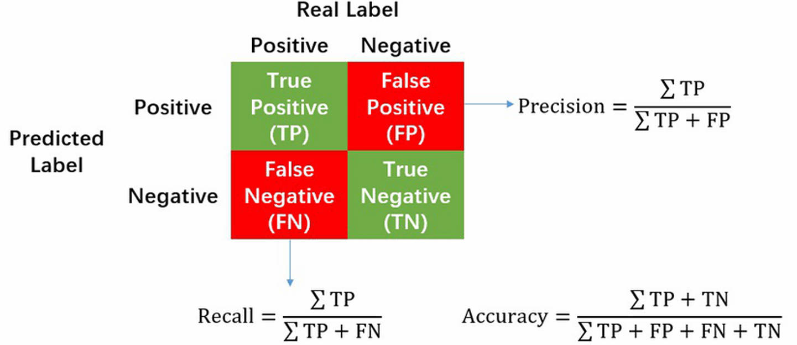

**Precision** talks about how precise your model is out of those predicted positive, how many of them are actual positive.

Precision is a good measure when the **costs of False Positive is high**.

> spam email detection.

**Recall** calculates how many of the actual positives our model captures through labeling as positive. 

> cancer detect.

F1 Score is a useful balance between precision and recall:

$$
F1 = 2 \times \frac{Precision*Recall}{Precision+Recall}
$$

AUC and ROC, AUC is just the area under the curve.

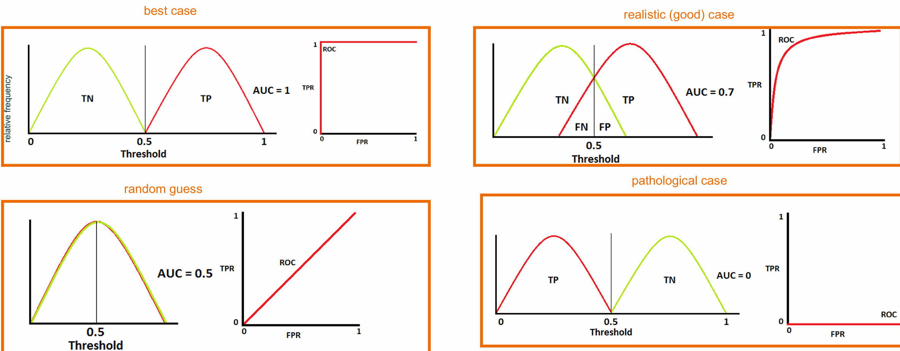

## From Linear to Non-Linear models

The machine learning function we used defines the so-called **inductive bias** or **learning bias**.

The inductive bias is a set of assumptions that we make about our ML algorithm to predict outputs of given inputs that it has not yet encountered.

Machine learning is more focused on **prediction** and **statistics** more about **description**. In explanatory models the focus is on coefficients $\beta$, whereas in predictive models the focus is on the predictions.

> [!NOTE|label:Basis Function Expansion for Linear Models]
> Linear regression is limited by its assumption of a linear relationship between the features $X$ and the target $y$.
> A powerful way to improve linear models is to **transform** the input features and hence expand the feature space, and a popular transformation involves **polynomial expansions**. For instance, given three features $x_1, x_2, x_3$, we can also consider the features $x_1^2, x_1x_2 \cdots$.
>
> The theory is, in the limit of large $n$, we can approximate an arbitrary analytical function $f$ via **Taylor approximation**.
>
> In practice, generalization to $n$-th order is growing polynomially, and hence only viable for relatively small amounts of featurs.

## Decision Trees

Decision tree based methods are among the most useful, versatile machine-learning algorithms. Reasons for its success:

- can handle both classification and regression
- handles non-linearities
- few parameter to tune
- robust to noise and outliers
- robust to correlated features
- handle high-dimensional data very well

Regression trees are based on partitioning the feature space into aset of **rectangles**. The tree selects the feature and split point which best **separates** the data into homogeneous sub-groups. 

Key idea: **recursive partitioning**. Divide up the p-dimensional space of the $X$ predictor variables into non-overlapping multidimensional rectangles.

**Homogeneity Measure: Gini Score**

As we grow the decision tree, we want the final leaves to be as **homogeneous** (pure) as possible.

For classification, the level of *impurity* is measured by means of the Gini Score. Decision trees are optimized to **minimize the Gini score in its terminal leaves.**

For each feature, iterate through all possible split points, and for each split point, meansure the resulting (sample-weighted) **average** Gini score in the two child leaves.

In principle, we can grow the tree until the Gini coefficient in each terminal leaf if zero. In practive, such a tree is almost certainly overfit. We thus need to **regularize** the trees. Instead, one often tries to keep the trees **shallow**.

Assume we have $K$ classes $1, \cdots, K$ and $p_i$ is the percentage of data points of class $i$ that are in a given leaf.

Then, the loss functions are

$$
\text{Gini}=1-\sum_{i=1}^Kp_i^2 , \quad \text{Entropy}=-\sum_{i=1}^Kp_i\log p_i.
$$

For regression, the level of impurity or homogeneity is measured by means of the sum of squared estimate of errros (SSE). Given a set of data points $y_i$ in a leaf, we first define its average as $\mu = \frac{1}{n}\sum_{i=1}^n y_i $. The SSE is then defined as 

$$
SSE=\frac{1}{n}\sum_{i=1}^n\left(y_i-\mu\right)^2
$$

In other words, we want the **variance** in each leaf to be small, and hence the data-points as close to each other as possible.

**Advantages and Shortcomings**

- *Advantages*
  - intrinsically robust to outliers
  - once constructed, they are computationally cheap to deploy even on large samples
  - Transparent and easy to interpret
- *Shortcomings*
  - sensitives to changes in the data, and even a slight change can cause very different splits

For the shortcomming, we could combine (shallow) trees via boosting and bagging.

## Ensembles

> combines multiple supervised models into a "super-model".

The principle of combining methods is for reducing risk.

In predictive modeling, "risk" is equivalent to **variation** in prediction error. The more our prediction errors vary, the more volatile our predictive model.

**Bagging**

> short for "bootstrap-aggregating" is an ensemble algorithm.

- Fit multiple models on different subsets of training dataset (**bootstrapping**)
- combine the predictions of all models (**aggregating**)

**Random Forest**

Problems of bagging: if a few features dominate, all trees will always only split on the same feature. Hence, all trees look similar, and the averaging across trees is less useful.

In the randome forest, each node only gets to see a randomly selected **subset** of all available features. This guarantees **heterogeneous** trees.

Typical random forest hyper-parameters to be fixed with k-fold cross-validation:

- number of trees (not so important, just choose large enough)
- decision criterion (Gini score or Cross-Entropy, not very important in practice)
- tree depth (**very important**)
- fraction of data per final leaf (very important, but correlated with tree depth)

**Boosting**

The idea of boosting is to train weak learners **sequentially**, each trying to correct its **predecessor**. 

> The randome forest are trained in parallel.

The most common form of boosting is **gradient boosting** but there are other methods.

We start with a naive prediction and calculate its value when $L$ is the least-squares loss function, as is typically used:

$$
\begin{aligned}\frac{\partial}{\partial\gamma}\sum_{i=1}^nL&=\frac{\partial}{\partial\gamma}\sum_{i=1}^{n}(y_{i}-\gamma)^{2}\\&=-2\sum_{i=1}^{n}(y_{i}-\gamma)\\&=-2\sum_{i=1}^{n}y_{i}+2n\gamma\end{aligned}
$$

setting this derivative equal to zero and solving for $\gamma$ yields that starting value is just the data average $\gamma = \bar{y}$.

Next, we calculate the residuals as the difference between each data point and the prediction $F_0$. Still use the MSE to train.

Denote the prediction of the residuals by $\gamma_1(x)$.

Then, we update the prediction of the targets as $F_1(x)=F_0 + v \gamma_1(x)$. The learning rate $v$ is a hyper-parameter typically chosen between 0.1 and 0.9 and determined via (k-fold) cross-validation.

> The learning rate is very **important**.

**But why gradient boosting?**

$$
r_{im}=-\left[\frac{\partial L(y_{i},F(x_{i}))}{\partial F(x_{i})}\right]_{F(x)=F_{m-1}(x)}fori=1,...,n
$$

This is very similar to gradient descent method, where we always walk into the direction where we improve the error the most.

- Gradient descent method: new parameter = old parameter - learning rate * gradient
- Gradient boosting: new model = old model + learning rate * baseline learner
  - the objective of baseline learner is to fit the negative gradient of current model

In the special, but typical case where the loss function is just the MSE, IN this case, we recover actual residuals. Because gradient boosting works for any loss function, so we call this generalized residual.

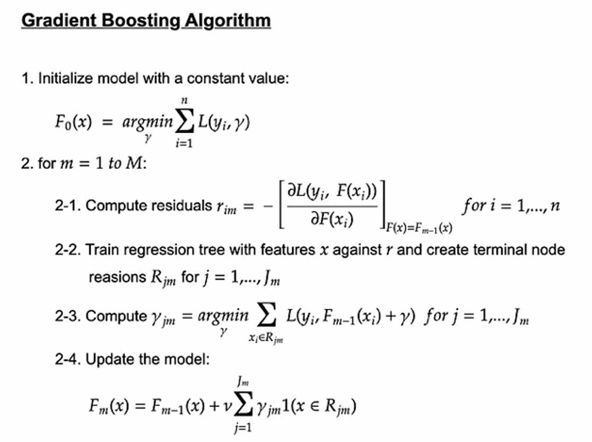

other trees

- **non-greedy trees**. Decision trees are greedy because each split just care about the performance of current node, but local maximazition is not equal to the global maximazition, and tends to overfitting. But non-greedy trees consider the whole performance when split.
- **smart trees**. Smart trees are smooth and symmetric. Decision trees are inherently discret. Smooth trees replace the step-function by a sigmoid. And symmetrics is a form of regularization. 

## Overfitting

**Overfit**: a large difference between the training and validation errors.

For Random forest criteria to avoid overfitting, 

- tree depth
- minimum number of datapoints in a terminal node
- minimum reduction in impurity 

Via k-fold cross-validation we aim at finding the sweet-spot between under- and over-fitting. That's because, typically, **the model is not continuously differentiable in the hyper-parameters**, which is why we cannot use the gradient decesnt.

***Bias-Variance Tradeoff***

**Bias**: error from enorneous assumptions in the learning algorithm (under-fitting)
**Variance**: error from sensitivity to small fluctuations in the training set (overfitting).

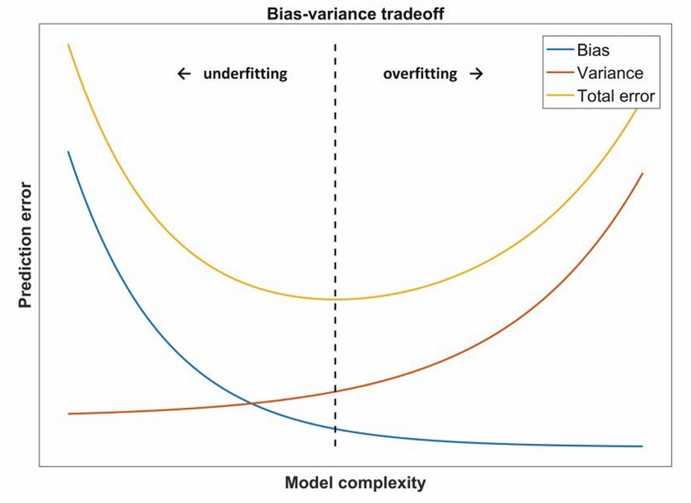

## K-Nearest Neighbors & Naive Bayes Classifier

***K-Nearest Neighbors***

**Idea**: identify $k$ datapoints in the training dataset that are **similar** to a new datapoint that we wish to classify.

Use these similar (neighboring) datapoints to classify the new datapoint into a class, assigning the new datapoint to the **predominant** (majority) class among these neighbors.

This is a **nonparametric** method (no parameter $\theta$ to fit) and there is just one hyperparameter $k$.

Typical metric to measure the distance between datapoints based on their predictor values is the **Euclidean distance**.

Predictors should first be **standardized**.

**Classification rule**: to assign a class to the datapoint to be classified, based on the classes of its neighbors.

- For the simplest case $k=1$, we just need to choose the **closest** neighbor.
- Extended to $k>1$ neighbors: use **majority** decision rule to classify the datapoint.

Choosing $k$

- if the $k$ is too low, we may be fitting to the noise in the data (overfitting).
- if $k$ is too high, we will miss th local structure in the data.

The more complex and irregular the structure of the data, the lower the optimum value of $k$. Similarly, we could use $k$-fold to determine optimal $k$.

*Advantages*

- simplicity
- lack of parametric assumptions
- works for regressions and classifications

*shortcomings*

- doesn't work for categorical data
- Curse of dimensionality

***Naive Bayes Classifier***

The Naive Bayes Classifier is applied to data with only **categorical features**. The NBC is conceptually similar to KNN.

**Basic idea**

- Find all the other datapoints with **same predictor profile**.
- Determine what classes the datapoints belong to and which class is most prevalent.
- Assign the class to the new datapoint.

Main Problem: still curse of dimensionality.
Solution: Make the naive assumption that individual features are independent.

Baye's Formula

Assume we have $n$ (training) datapoints with $p$ categorical features to be classified into $m$ classes $C_1, \cdots, C_m$.

$$
\begin{aligned}
p(C_i \mid x_1, \ldots, x_p) &= \frac{p(x_1, \ldots, x_p \mid C_i) \, p(C_i)}{p(x_1, \ldots, x_p \mid C_1)p(C_1) + \ldots + p(x_1, \ldots, x_p \mid C_m)p(C_m)} \\ 
&\propto p(x_1, \ldots, x_p \mid C_i) \, p(C_i)
\end{aligned}
$$

In principle, we now use training data to empirically estimate $p(C_i)$ and $p(x_1,\cdots,x_p|C_i)$ as fractions of the data.

First, consider only data-points of class $C_i$. Denote the number of such datapoints by $|C_i|$. Then, calculate all datapoints in class $C_i$ which have exactly the feature values $x_1,\cdots,x_p$, denote this number by $|x_1,\cdots,x_p|$. Then we can approximate

$$
p(x_1,...,x_p\mid C_i)\approx\frac{\mid x_1,...,x_p\mid}{\mid C_i\mid}
$$

However, when $p$ is large, many values of $|x_1,\cdots,x_p|$ will be a 0,1 or any other small number, which is the **curse of dimensionality**.

**Solution: Naive Bayes**

Let's **naively** assume that **the features are independent of each other**. It then holds:

$$
p(x_1,\ldots,x_p\mid C_1)=p(x_1\mid C_i)\cdotp(x_2\mid C_i)\cdot\ldots\cdotp(x_m\mid C_i)
$$

We then empirically approximate $p(x_j|C_i)$ as the fraction of all training data in class $i$ which has feature category $j$.

Thus training the NBC amounts to calculate all pairs of $p(x_j|C_i)$.

*Advantages*

- Simplicity
- Computational efficiency
- Good classification performance, especially when the number of predictors is very large.
- The ability to handle categorical variables directly

*Shortcommings*

- Require a very large number of datapoint to obtain good results
- May encounter a "zero-frequency problem" when there is a category in the test set that is not the training set.
- Strong assumptions.

## Neural Networks

> Linear / Logistic regressions are special cases of neural networks.

three types of layer

- input layer
- output layer
- hidden layer

The key-ingredient of NNs is to add a monotone, non-linear activation function which is then the output of node $j$. The most comonly used activation function is ReLU(rectified linear unit).

Last layer, or **output layer** is special since its output represents the final prediction. For regression tasks, the final layer is (typically) just a single neuron with a linear or no activation. For classification with $K$ classes, the final layer is (typically) composed of $K$ neurons and a **soft-max** output that combines their outputs through normalization.

when training NN, it is easy to get overfit, we could

- early stop
- weight-decay: L1 or L2 regularization
- Dropout
  - prevents the network from becoming too dependent on any one (or any small combination) of neurons

even so, gradient descent may aid in escaping shallow local minima, but often fails when dealing with deep local minima. One way to counter-balance this issue is to introduce momentum, and a popular implementation is the Adam algorithm.

For most deep learning practitioners, the best way to push the cutting edge of deep learning is not by building more advanced optimizers. Instead, the vast majority of breakthroughs in deep learning over the past several decades have been obtained by discovering architectures that are easier to train instead of trying to wrangle with nasty error surfaces.

However, neural networks are particularly strong on unstructured data, and do not outperform tree based methods on structured data.

Reasons:

- neural nets assume objective landscape is relatively smooth
- neural nets have a rotation symmetry, which is not inherent to structured data
- neural nets tend to be thrown off by noise features

## Benigh Overfits

The bias-variance trade-off implies that a model should balance underfitting and ovefitting: Rich enough to express underlying structure in data and simple enough to avoid fitting spurious patterns.

In this view, **interpolating** the training indicates an overfit.

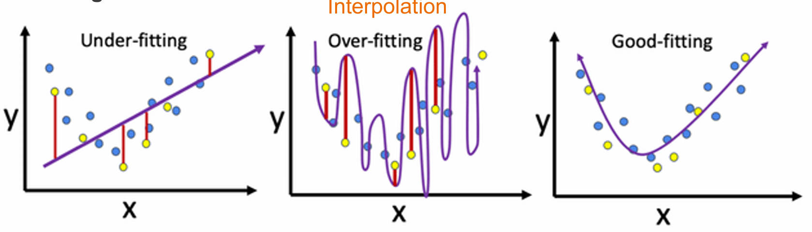

However, sometimes, those from richer functions classes have lower test risk than others, which is called **benigh overfit**.

Denote the number of data-points by $T$,  the number of model parameters by $P$, and define model complexity as $C=P/T$.

Classical statistics operates in the regine $C << 1$. As $C>>1$ we need to **regularize**. The area where $C \approx 1$ is the worse (maximal variance).

Intuition why $C>>1$ improves out of sample performance: The more parameters we have, the more functional shapes we have to pick from, and regularization picks the **smoothest** among all those solutions.

Choosing the smmothest function that perfectly fit observed data is a form of Occam's razor.

**Grokking** 

Grokking refers to a suden spike in out of sample accuracy long past the point of perfect training accuracy.

The difference between grokking and benigh overfitting is that the benigh overfit makes a statement about the number of parameters, and then each network is fully trained. Grokking make is about what happens if you just keep training for a fixed set of parameters.

## Feature Selection

The main problem is that, by chance, a feature, or a combination of features, happens to be highly correlated with (training data) of the target.

- Solution: apply a **feature selection technique** to determine which features matter in the prediction
- First step: use commen sense and domain knowledge to **discard** or **transform** some features.
- Second step: discard highly correlated features.
- Third step: use a more refined feature selection technique.

**Principle Component Analysis**

PCA is a projectino such that the variance in that projection is as high as possible. PCA is unsupervised, which means we only need the feature $X$, and no targets $y$.

For this to work, the $(n \times k)$-feature matrix $X$ is expected to be normalized, and calculate the $(k \times k)$-covariance matrix $C$. 

$C$ is symmetric, and the spectral theorem guarantees us that $C$ has $k$ real eigenvalues and associated orthogonal eigenvectors. The eigenvector associated with the largest eigenvalue (in magnitude) is associated with the first principle component, and so forth.

In order to select features, we consider only the first $m$ PCs where $m < k$, and the value of $m$ can be considered a hyperparameter. The $m$ "new" feature are **linear combinations** of the original $k$ features.

Alternatively to PCA, one can use the **singular vector decomposition** (SVD) which works for general, non-symmetric matrices, and hence can be applied straight to $X$ without first calculating the covariance matrix.

**Feature selection with Random Forest**

Random Forests provide an intuitive measure of feature importance: **Mean Decrease in Impurity** (MDI). 

Problems:

- Derived from the training dataset: the importances can be high for features that are not predictive of sthe target variable, as long as the model has the capacity to use them to **overfit**.
- Impurity-based feature importance can inflate the importance of **numerical features**.

**Feature Selection with Boruta**

The Boruta feautre selection technique is more robust against overfitting.

1. Assume we have **n features**. Create a **shadow feature** for each feature by permuting along the feature column
2. Train algorithm with 2n features $k$ times
3. Check how many times (out of maximally $k$ times) each of the $n$ actural features outperformed all of the $n$ shadow features.
4. Only features which outperform above a certain number of times are kept.
5. This decision threshold can be determined more quantitatively via **binomial test**.

## SHAP values

- Common critique: ML models are black boxes.
- **Shapely values** attribute a model's prediction to the model's input features.

Shapley values measure the importance of feature $x_1$ by testing how much the model output changes when $x_1$ is withheld from as input.

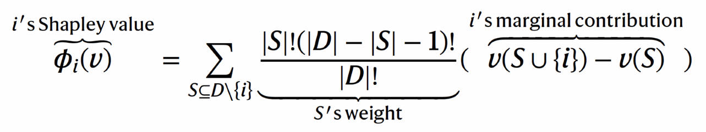

## Deep learning 

Deep learning involves complex networks with **many layers**, incorporating processes for dimension reduction and feature discovery.

In the process of training the weights of the network, the output distribution of the neurons in the bottom layer begins to **shift**. The result of the changing distribution means that top layers not only has to learn how to make the appropriate predictions, but also needs to somehow modify itself to accommondate the shifts in incoming distribution. This significantly slow down training, and the magnitude of the problem compounds the more layers we have in deep neural network.

In **batch normalization**, one thus normalizes inputs to every layer of the neural network **before** they are fed into the activation function.

**Recurrent Neural Networks**

Unlike a feed-forward layer, recurrent layers also have current connections, which is useful to process **sequence** of information.

It can be shown that the information that is propagated $k$ steps ahead is proportional to $\omega^k$ where $\omega$ is the network weight. Because typically $\omega < 1$, this relationship places a strong upper bound on how much a change in the input at $t-k$ can impact the hidden state at time $t$.

However, the gradient quickly diminishes when it is computed with respect to inputs several time steps into the past, severely limiting the models's ability to learn long-term dependencies. This issue is commonly referred to as the problem of **vanishing gradients**, and it severely impacts the learning capabilities of vanilla RNN.

**LSTM**

LSTM architecture was designed for the purpose of reliably transmitting important information many time steps into the future.

one of the core components of the LSTM architecture is the **memory cell**. It holds critical information that it has learned over time. At every time step, the LSTM unit modifies the memory cell with new information with three different phases

- The keep gate figures out which elements in the memory state are still relevant and which elements are irrelevant.
- The relevant information is written into the memory state.
- The output is created.

Another related architecture is GRU.

## Convolutional Neural Networks

CNN are arguably the most important contribution to recent advances in **image** processing.

**Limitations of Fully Connected Networks**

- Each layer of neural network is responsible for learning and building up features to represent the input data that it receives. However, for high **resolution** image data, the needed neurons would be huge. Instead, neurons in a convolutional layer are only connected to a small, local region of preceding layer, so we avoid the wastefulness of fully-connected neurons.
- **Lack of translation invariance**. If we slightly shift the content of an image. A fully connected feed forward NN would be thrown off, because each input neuron typically expects a similar input during training and prediction. To counter-act this problem, CNN learns different **filters**, each aimed at predicting different features of an image.

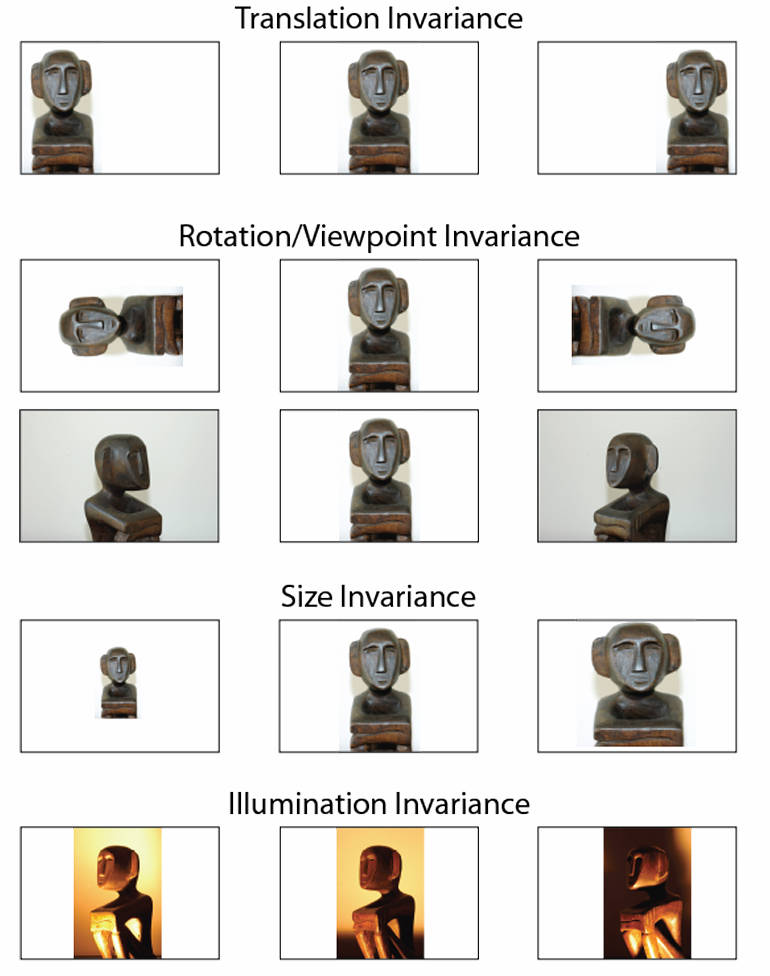

CNN are based on filters. A filter is essentially a **feature detector**.

We **slide** each filter across the entire image, and each time we have a match, we keep track on our **feature map**. A neuron in the feature map is **activated** if the filter contributing to its activity detected an appropritate feature at the corresponding position fo the previous layer. **Each filter correspond to a filter map**.

And the output feature maps get stacked together into a new **tensor**, upon which another set of filters are applied. 

Sliding over an $(n,m,3)$-dimensional image with $k$ filters yields what shape of the output tensor.

$$
\begin{pmatrix}\lceil\frac{n-e+2p}{s}\rceil+1,\lceil\frac{m-e+2p}{s}\rceil+1,k\end{pmatrix}\approx\left(\frac{n}{s},\frac{m}{s},k\right)
$$

The exact answer depends on the 
- filter's spatial extent $e$ (height and width)
- the choise of **stride** $s$ 
- its zero padding $p$

To aggressively reduce dimensionality of feature maps and sharpen the located features, one sometimes inserts a **max-pooling layer** after a convolutional layer.

## Autoencoder

**Embeddings**

In ML, embeddings are **"low"-dimensional** representations of our (typically unstructured) features that are obtained in an **unsupervised** or **self-supervised** fashion.

Here, we consider embeddings into an $n$-dimensional vector space, where $n$ is typically between 2 and 500. This is also a form of **dimensionality reduction**. The most **naive** embedding is the so-called **1-hot-encoding**.

PCA fails to capture important relationships that are **nonlinear**.

Goal: We want that **similar** data-points are embedded in **similar** locations in the embedding space.

**Autoencoders**

The autoencoder architecture attempts to construct a **high-dimensional input into a low dimension embedding** and then uses that low dimensional embedding to **reconstruct** the input.

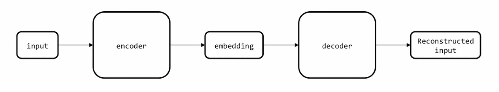

this approach is known as **self-supervised learning**.

In practice, one doesn't just use an MLP architecture, but rather one that is best suited for the task at hand. For images, this is typically a CNN. For text, this is typically a transformer.

By convention, the embeddings are typically **normalized** to one. Therefore, the $n$-dimensinoal embedding can be represented as lying on an $n$-dimensional hypersphere. A convenient distance metric that is typically used is the **cosine similarity**.

$$
Sim(A,B) = cos(\theta) = \frac{A\cdot B}{||A|| ||B||}
$$

## Text Embeddings

**Natural Language Processing (NLP)** is studies the prediction of unstructured speech (mostly in form of test, but also audio). Its most important neural network architecture is the **transformer**.

***Text Pre-Processing***

- Tokenization: The process of taking a text and dividing it into separate "tokens" or terms. Roughly speaking, one word punctuation is one **token**.
- Stopword: list of frequently occurring terms that are often removed (words like "and", "or", "thus")
- Stemming: reduce different variants of words to a common core. ("he is running" becomes "he is run")

***Tabular Representation of Text***

The simple-most way to transform (pre-processed) text to features is via word-counts. We can represent the words (called **terms**) in these three sentences (called **documents**) in a term-document matrix. Typically, the counts are **normalized** by the number of terms.

**Bag-of-words** approach: the document is a collection of words in which order, grammer and syntax do not matter. The number in the cell indicates the frequency of that term in that sentenec. Bag of Words is essentially just counting the **term-frequency**.

***TF-IDF***

Problem with TF: Generic words ("the", "he", etc) are over-represented.

**Term Frequency-Inverse Document Frequency** is a slightly more sophisticated approach.

**Idea**: increase importance of a word proportionally to the number of times a word appears in a document (TF), but **offset** by the number of documents that contain the word.

**Result**: Words that are **common in every document rank low** even though they may appear many times, since they don't mean much to that document in particular.

***N-Grams***

**Bag of words** does not account for word-combinations. So we could extend TF and TF-IDF from single tokens (1-grams) to **n-grams**.

***Text Embedding***

**Problem with TF-IDF**: Synonyms and similar words ("mouse" and "rat") give rise to completely different features.

**Goal**: Assign each word to an $n$-dimensional vector (embedding vector), such that words with similar meaning are close to each other in that vector space.

**Idea**: Take a sentence (or a fraction of a sentence), and train a neural net to **predict a missing word**.

Unlike in the encoding of images, here we focus more on the **context** of the word, rather than the word itself.

*Technical intuition*: Train an encoder-decoder architecture as follows:

- start with **one-hot-encodings** of each word in the corpus
- NN input: the sentence, with one word missing
- Nn output: the one-hot-encoding of the missing word
- An n-dim embedding layer which contains the **vector representation** of the missing word.

**Advantage**: All we need for training the embeddings is a **large collection of texts**. This gives us access to hug amounts of training data.

Create training data in 3 steps:

1. Get a lot of data (all text from the internet)
2. Apply some text pre-processing
3. Create a sliding window (e.g. of 7 words), and slide over the text
4. The sliding window generates the training data (the middle word is to be predicted)

As a consequence, words with similar meaning will have similar embeddings.

There are two types of implementations:

- construct context from word
- construct word from context

Both methods give good results, but it turns out that approach A provides more robust results. This implementation is the basis of the famous **word2vec** algorithm.

***Word2vec***

These embeddings are also known as **distributed vector representations**.

**Generalized embeddings**

Observe how people change between institutions during their career. Each person's career is thus a "sentence" and each university is a "word".

## Transformer

***Limitations of word2vec***

While word2vec is intuitive and relatively easy to train, it suffers two shortcomings:

- **caveat 1**: The embedding is not context aware:
  - I *can* bud a *can* of tuna
- **caveat 2**, it ignores word orderings
  - I live to eat
  - I eat to live

Nowadays, the state-of-the-art approach is to train **context-aware** embeddings via **attention**-based transformers.

Consider the following sentence: "The river is by the bank".

The word "river" hints that the word "bank" does not have the meaning of the "bank where you store your money". To embed the word "bank", it would thus be useful if I also "pay attention" to the word "river".

A dictionary maps **keys** to **values** $: D=\{1:\nu_{1},2:\nu_{2},3:\nu_{3}\}.$

A **query** retrieves information realted to a key $:D[2] \rightarrow v_2$.

Soft-Indexing: We intrepret $a$ as **distribution over the keys** and compute it based on **similarity** of **query** and **key**.

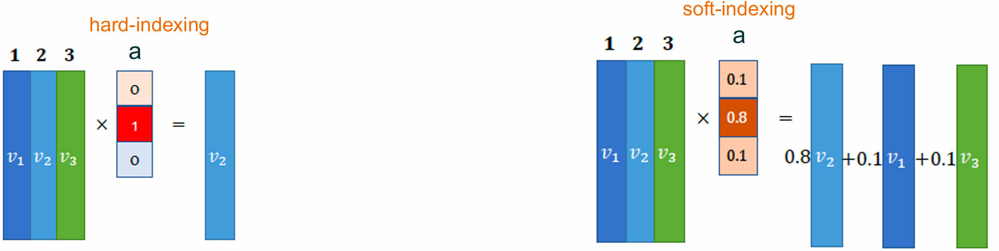

**Self-attention** helps decoder to look at other words in the input sentence as it decodes a specific word. As such, it learns **context-aware embeddings**.

**Self-Attention**

1. For **each** of the encoder's input (i.e. words in the first layer), we calculate three vectors: **query**, **key** and **value**. These three vectors are created by multiplying the embedding by three matrics $W^Q, W^K, W^V$ that are **learnt** during the training process.
2. To calculate attention, we need to **score** each word of the input sentence against this word via **dot product**.
3. We need to normalize by $\sqrt{dim of key}$ (~more stable gradients)
4. We apply a softmax so the weights sum to 1. The softmax score determines how much each word will be expressed at this position. Typically, the word itself will have the highest score.
5. We multiply each value vector by the softmax score. 
6. Sum up the weighted value vectors.

Self-attention "only" creates context-aware embeddings, but doesn't change the number of tokens. The resulting vectors are then passed to another NN architecture.

**Positional Encoding**

To account for the ordering of words, the transformer **adds** a vector to each input embedding. These vectors follow a specific **pattern** that the model learns, which helps it determine the position of each word, or the distance between different words in the sequence.

In practice, one uses a set of **cosine- and sine-functions**. One key advantage is that the positional embedding of a word at position $i$ can be obtained by matrix multiplication of a word at position $i+k$ by matrix multiplication with a matrix $M$ that depends only on $k$, not on $i$. This makes it easy for the transformer to learn about **relative differences** between words.

**Multi-Head Attention**

One doesn't implement a CNN with just one filter, since one "feature" is not enough to detect an image. Similarly, one attention-layer is not enough to capture the different aspects of natural language. Each word serves multiple roles.

One applies $h$ different attention blocks, called '**heads**' in **parallel** to the same sequence. Each matrix is **randomly initiallized**, and hence, they typically learn different things (converge to different local minima).

Recall that each transformer block consists of "self-attention + feed forward". The feed forward part is an MLP, and turns out to be the essential component to **store facts** in the network, which is what makes LLMs so useful.

About $2/3$ of all parameters are actually in the feed forward network, not the self-attention.

The MLP block consists of one **up-projection** (typically 4 times input dimension), and activation function (typically ReLu) and a **down-projection** back to original dimension.

Different directions in the embedding space encode different meanings (e.g. gender). As they flow through deeper layers of the transformer blocks, they encode deeper meanings, not just single concepts. However, it is not fully understood how this works. Roughly speaking, the dimensionality in the up-projection can be interpreted as the “number of questions asked” to the input token and the down-projection decides which answers to add (see link below for visualizations). 

The model is then trained on a large amount of text, and the goal is to predict the next word. The next word is usually sampled probabilistically, and added to the next to predict the next word.

The transformer architecture faces some inherent challenges. Self-attention **scales** like "input sequence"-**squared**. Long sequences are therefore difficult to process. So we have alternative implementations like LinFormer, Mamba.

## Large Language Models

LLMs are based on the transformer architecture. At its core is the self-attention-mechanism which uses key, query, and value vectors. There are different ways in which these are integrated into architectures. In particular, there are **encoder-decoder sytle**, **encoder-style** and **decoder-style** LLMs.

Encoders can pay attention to **all tokens** in a sequence. Decoders are causally **masked**.

In data science, we usually use **Encoder-style**, for example, **BERT** (Bidirectional Encoder Representations from Transformers).

In addition to mask language modeling, BERT is trained to predict **whether the original documents's sentence order of two randomly shuffled sentences is correct.** These two training tasks allow BERT to learn rich contextual representations of the input texts, which can then be **fine-tuned** for various **downstream tasks** like sentiment analysis, question-answering, and named entity recognition.

Unlike an encoder, a decoder is **masked** to prevent the model from attending to future positions. The decoder generates the output word by word. Several **decoder-only** models have proven to be very powerful for language prediction, especially the **GPT family**.

***GPT Temperature***

In GPT models, the **temperature** is used to control the **randomness** of path dependency. The lower the temperature, the more **deterministic** the output.

In practice, the temperature is just a scaling factor that rescales the GPT outputs of the linear layer, just **before applying the softmax**. This essentially rescales the probability distribution over the next tokens from either very uniform (high temperature) to highly skewed around the most probably word (low temperature).

***Reinforcement Learning from Human Feedback***

Out of the box, **pretrained** LLMs are only capable of completions. You can't talk back and forth with a pretrained LLM like it's a chatbot. To enable them to conduct dialogue with people, LLMs are fine-tuned **with people**.

Reinforcement Learning from Human Feedback (RLHF) is a training process to teach an LLM for instruction-following and multi-turn conversations using reinforcement learning.

***Fine-Tuning***

Some models are open source and can be **fine-tuned** for specific tasks. 3 ways to **fine-tune** pretrained LLMs:

- **Feature-based**: use LLM to extract the **embeddings**, and use them as features for downstream tasks.
- conventional fine-tuning by updating the model parameters
  - only update the weights of the final output layers to specific tasks
  - Update all layers (expensive)
- in-context prompting
  - also called **zero-shot** or **few-shot** learning in this context, is a way of fine-tuning the LLM directely via **prompt**.
  - aims to provide context or examples of the task within the input or prompt, allowing the model to infer the desired behavior and generate appropriate responses.

***RAGs***

Each trained LLM has **world knowledge** up to a certain time. RAG (Retrieval Augmented Generation) enhances LLMs by incorporating **external world data**.

***LLM Scaling Laws***

Scaling laws allow us to precisely **predict** some coarse-but-useful measures of how capable future models will be as we scale them up along three dimensions: 

- the **amount of data** they are fed
- their **size** (measured in parameters)
- the amount of **computation** used to train them (measured in FLOPs)

Scaling laws generally only predict a model's ability to predict the next token. LLM's are not trained to do your homework. This is just an **emergent property**.

> In statistical physics, emergence refers to the phenomenon where complex macroscopic behavior arises from the collective interactions of simpler microscopic components, often displaying properties that are not evident in the individual components alone. 

It is largely **not possible** to predict when models will start to show specific skills or become capable of specific tasks. Often, a model can fail at some task consistently, but a new model trained in the same way at five or ten times the scale will do well at that task.

> scale is all you need?

Transformers have been primarily developed to process language. In principle, they can be applied to any type of sequence prediction (with decent amount of regularity).

## Generative AI

**The Problem with Autoencoders**

The main purpose of a vanilla autoencoder is to find the best **encoder/decoder-pair** among a given family of encoders $E$ and decoders $D$ parametrized by the neural network architecture. However, the latent space lacks of regularity. In a sense, the autoencoder **overfits**.

***Variational Autoencoders***

A VAE is an autoencoder whose encoding distribution is **regularized** during the training in order to ensure that its latent space has good properties allowing us to generate som **new data**.

**Intuition**: First, take an image $x$ and encode it into a latent space $z$. Instead of passing on $z$ to the decoder for reconstruction, first randomly sample a datapoint near $z$ and pass that random sample onto the decoder.

Practically, instead of encoding an input as a single point, we **encode it as a distribution over the latent space** which makes the latent space regualrization natural.

The loss function of VAE is composed of a **reconstruction term** (on the final layer), that tends to make the encoding-decoding scheme as performant as possible, and a **regularization term** (on the latent layer), that tends to regularize the organization of the latent space by making the distribution returned by the encoder close to a standard normal distribution.

Formally, we replace the **point-embedding** of the autoencoder by a **distribution embedding**.

The regularity in the latent space to make generative process possible relies on two properties: 

- **continuity**: two close points in the latent space should not give two completely different contents once decoded.
- **completeness**: for a chosen distribution, any point sampled from it should give similar content once decoded.

**Kullback-Leibler Divergence**

To make progress, we need to "measure distances between distributions".

Imagine with have two random variables $P$ and $Q$ with respective pdf $p(x)$ and $q(x)$. A typical metrix that captures such a **distance** is the Kullback-Leibler Divergence.

$$
D_{\mathsf{KL}}(p\mid\mid q)=\sum_xp(x)\mathrm{log}\left(\frac{p(x)}{q(x)}\right)=\mathbb{E}_{x\sim p}\left(\log(p(x))-\log(q(x))\right)
$$

The KL is not a metrix in the strict mathematical sense because it is not symmetric and does not satisfy the triangle inequality. Its **interpretation**: KL tells us how much information we are expected to lose if we use $Q$ instead of $P$. And if $P$ and $Q$ are Gaussians, the KL even allows for an analytical expression.

**Reparametrization Trick**

> how can we apply gradient descent to an objective that involves sampling from a distribution?

The reparametrization tricks make gradient descent possible despite the random sampling that occurs halfway of the architecture. It uses the fact that 

$$
z=\mathcal{N}(g(x),h(x))=h(x)\zeta+g(x),\quad\zeta\in\mathcal{N}(0,1)
$$

In summary, VAE tackle the problem of the latent space irregularity by making the encoder return a distribution over the latent space instead of a single point and by adding in the loss function a regularization term over that returned distribution.

***Diffusion Models***

Another class of generative models are the **diffusion models**.

Diffusion Models learn to generate data by **reversing** a gruadual **noising process** that gradually adds noise to an image to corrupt it, eventually resulting in **pure Gaussion noise**.

The Diffusion Model learns to navigate backwards along this chain, gradually removing the noise over a series of timesteps to reverse this process.

***GANs***

Yet another class of generative models are Generative Adversarial Network. 

**Idea**: Train a **generator** of fake images and its **discriminator** in tandem.

Although VAE and GAN are designed and used basically for the main reason, which is image generation, their approach is quite different.

One of the key differences between VAEs and GANs lies in their training approach, as VAEs' training follow an **unsupervised** approach in contrast with GANs that follow a **supervised** technique.

VAEs are frequently **simpler** to train than GANs as they don't need a good synchronization between their two components. Nevertheless, once this balancing is achieved, GANs are likely to recognize more complicated insights of the input and generate **higher** and **more detailed** plausible data than VAEs.

**Dall-E**

At the highest level, DALL-E works as follows:

1. A text prompt is input into a text encoder that is trained to map the prompt to a **representation space**.
2. A model called the prior maps the text encoding to a corresponding **image encoding** that captures the semantic information of the prompt contained in the text encoding.
3. An image decoder stochastically **generates** an image which is a visual manifestation of this semantic information.

**CLIP**

> Contrastive Language-Image Pre-training

Rather than trying to predict a caption given an image, CLIP instead just learns how relate any given caption to an image. This **contrastive** rather than **predictive** obejective allows CLIP to learn the link between textual and visual representations of the same abstract object.

## Reinforcement learning

**Motivation**

**Reinforcement learning** (RL) is commonly used in robotics. Generally, RL works well in, but is not restricted to, somewhat stationary environments.

In reinforcement learning, there is no training data. The RL agent has to learn from **experience** the best **action** in an **environment** through **trail-and-error**. The goal is to maximize long-term reward. RL is usually best understood in terms of a game.

The game can be formalized as a Markov Decision Process (MDP) that has specified transition probabilities from state to state.

MDPs include:

1. A finite set of states (all possible places the mouse can go)
2. A set of actions per state ({forward, back})
3. Transitions between states 
4. Rewards associated with each transition
5. A discount factor $\gamma$ between 0 and 1 (quantifies difference between immediate and future reward)
6. Memorylessness (the history of the past decisions is irrelevant. Only the current state decides the next action)

The goal is to maximize the sum of rewards in the long term

$$
\sum_{t=0}^{\infty} \gamma^t R(s_t, a_t)
$$

where $R(s_t,a_t)$ is the reward you get for taking action $a$ when in state $s$ at time $t$.

**Q-Learning**

Q-Learning evaluates which action to take based on an action-value function that determines the value of being in a certain state and taking a certain action at that state.

The Q-function returns the expected reward of that action (**including all subsequent actions**). Higher Q means higher chances of getting (future) rewards.

Procedure

1. All values are initialized as 0 and updated during training
2. In state $s$, with probability $\epsilon$ pick a random action, and with probability $1-\epsilon$ pick the action that gives maximum $Q-value$ in the next state.
3. Move to next state and update $Q$-value in previous state using the above equation
4. Iterate untile values in Q-table converged

## Complex networks

(Complex) **Networks** (or **graphs**) are entities and the **connections** among them.

The basic elements of a network are

- **Nodes** (also called versices or vertexes)
- **Edges** (connections or links between nodes) can be directed or undirected. Edges can also be **weighted** to reflect attributes of the connection.

**Adjacency Matrix**

Edges can be directed. Any network can be represented by its **adjacency matrix**.

Type of Networks

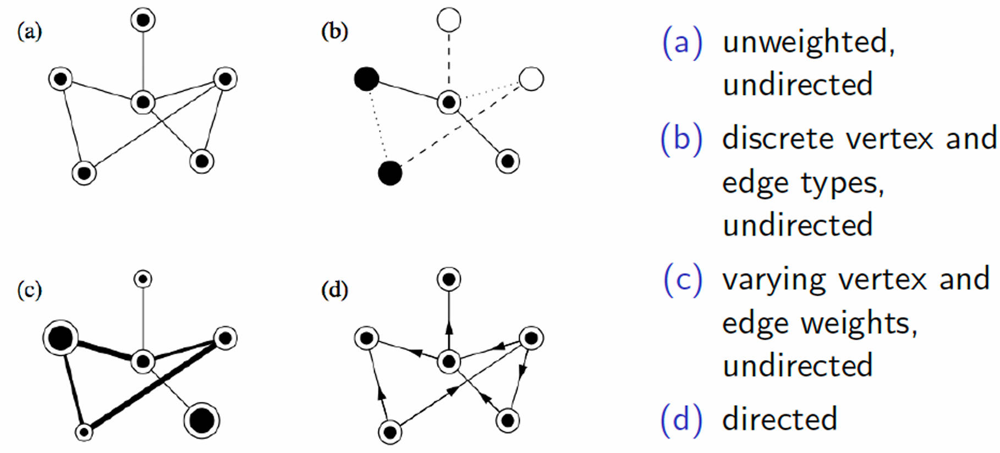

- **A fully connected graph**: each node in the network has a path to all other nodes.
- In most networks a significant fraction of the nodes are connected to form a large contiguous cluster or **giant component**.
- A network with no giant component is, for most practical purposes, not really a network at all and so would not be studied in the first place.
- Going forward, we thus always (implicitly) assume that we consider the giant component and hence that the network is fully connected.

**Shortest Path**

- **Path length** is the number of edges in that route. Typically this refers to the shortest route.
- In a **weighted** network, the shortest path does not necessarily reflect the path with the fewest edges, but rather the path with the least weight.
- Exact solutions are often expensive, but many reliable **meta-heuristics** exist, and are used in modern navigation systems.

**Dijkstra's algorithm**

*Goal*: Find the shortest path from a to b.

1. Start from $a$, with distance 0. Initialize each unexplored node as distance $\infty$.
2. For current node, pick the unvisited neighbor with **lowest distance**.
3. Calculate the distance through it to each **unvisited** neighbor.
4. **Update** neighbor's distance if smaller.
5. Mark visited (set to red) when done with neighbors.
6. Once the destination node has been marked visited: stop. Else, back to (2).

**Node-Level Centrality Metrics**

*Centrality* of a node: the importance or influence of a particular individual or node.

- Degree centrality: how many edges are connected to the node. Nodes with many connections are more central
- Closeness centrality: how close the node is to the other nodes in the network. This is measured by finding the shortest path from that node to all the other nodes, then taking the reciprocal of the average of these path lengths.
- Betweenness centrality: the extent to which a given node lies on the shortest path between pairs of nodes.
- Eigenvector centrality: measure of influence of a node in the network

**Page-Rank**

Core idea of page-rank: a node is important if it is connected to imporant nodes (self-consistency). This gives risk to the so-called **eigenvector centrality**.

Denote by $A=A_{i,j}$ the **binary** $n \times n$ adjacency matrix and by $c_i$ the centrality of node $i$.

By self-consistency, it holds $c_i\sim\sum_{j=1}^nA_{ij}c_j$. This is an eigenvector problem.

Introducing a normalization $\lambda$ leads to $Ac = \lambda c$. In general: many eigenvectors. However, the Perron-Frobenius theorem asserts that the only valid eigenvector is the one that corresponds to the unique largest eigenvalue.

**Graph Random Walks**

A slightly more intuitive concept to arrive at graph centralities is via **random walks**. The random walker starts at a randomly chosen node, and then, with some probability (which may depend on the nodes) will walk to any of the connected nodes.

For each node, we keep track how often it has been visited by the walker. Normalizing these counts by the total number of steps results in the **visitation frequency distribution**.

We stop the walk once our visitation frequency distribution comes asymptotically stable. We interpret the **relative** visitation frequencies of the nodes as centraliteis.

In the special case where the nodes are chosen uniformly at random (and under some additional technical conditions), it can be shown that the asymptotic visitation frequency converges to the eigenvector centrality.

**Line Graphs**

So far, we have only talked about node centralities. All these concepts can be translated to edge centralities via their line graph (sometimes also called **dual graph**), but this one can also have a different meaning.

Given a graph $G$, its line graph $L(G)$ is such that:

- each node of $L(G)$ represents an edge of $G$ and 
- two nodes of $L(G)$ are adjacent if and only if their corresponding edges share a common endpoint in $G$

**Network Characterization**

Beyond node (and edge) properties, we can also measure attributes of the network as a whole. Two metrics are common:

- **Density**: the overall connectedness of network data which focuses on the edges
- **Degree distribution**: describes the range of connectedness of the nodes

In (social) networks, most networks have a power-law degree distribution. One considers different ensembles to explain different structural properties of networks.

The Erdos-Reini ensemble is known to give rise to **homogeneous graphs** (that is non-power-law degree distribution), while the Barabasi-Albert ensemble give rise to **heterogeneous graphs** with power-law degree distribution.

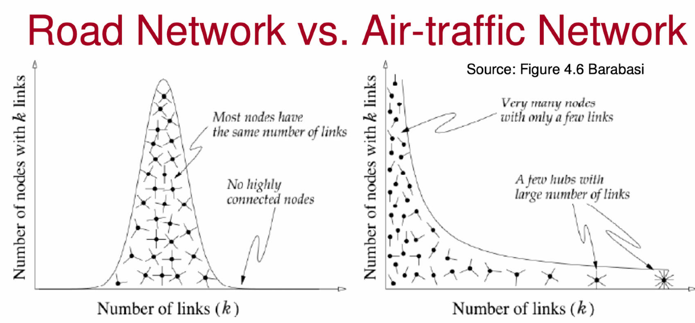

Most real-world networks are **power-law** distributed:

$$
p(k) \sim k^{-\alpha}
$$

**Erdos-Renyi Graph**

The ER random graph model constructs a random network $G(n,p)$ as follows: For a fixed set of $n$ nodes, connect any two nodes with independent probability $p$.

The graph $G(n,p)$ has on average $\binom{n}{2}p$ edges.

$$
\binom{n-1}{k}p^k(1-p)^{n-1-k}
$$

**Power-Laws**

Power law or **Pareto** probability distribution 

$$
p(x) = \frac{\alpha - 1}{x_{\mathrm{min}}} \left(\frac{x}{x_{\mathrm{min}}}\right)^{-\alpha} \propto \frac{1}{x^{\alpha}}
$$

for some $x_{min}>0$.

Expected value for a RV $X$ is given by

$$
\mathbb{E}[X]\equiv\mu=\int_{x_{ \min }}^\infty dx x p(x)
$$

Variance for a RV $X$ is given by 

$$
\mathbb{V}[X] =\int_{x_{\mathrm{min}}}^{\infty}dx\left(x-\mu\right)^{2}p(x)\propto\int_{x_{\mathrm{min}}}^{\infty}dxx^{2}p(x)
$$

The $m$-th moment calculates to 

$$
\langle X^m\rangle=\int_{x_{\min}}^\infty dxx^mp(x)=\frac{\alpha-1}{\alpha-1-m}x_{\min}^m
$$

This holds **only** for $m < \alpha -1$. Otherwise, the moments are not defined (or divergent).

Practically speaking, this means that it is sometimes misleading and statistically wrong to talk about the **sample average** or the **sample standard deviation** if the quantity is power-law distributed. Such quantities end up being dominated by the larest oberved value and do not converge. Instead, the more we sample, the large the values will get.

**Scale-Freeness**

Power-laws capture scale-free quantities. Scaling the argument $x$ by a constant factor causes only a proportionate scaling of the function itself:

$$
p(cx)\sim(cx)^{-\alpha}\sim c^{-\alpha}p(x)\sim p(x).
$$

In nature, such scale-free, self-similar patterns are ubiquitous and known as **fractals**.

**Scale-Free Graphs**

We call graphs with power-law degree distribution scale-free graphs. Why are most real-world graphs scale-free? Because of **preferential attachment**.

This is also known as **the rich get richer**-phenomenon. Assume a network is growing one node at the time. Each **new** node $j$ will connect to already an existing node $i$ with some probability that is **proportional** to node $i$'s degree $k_i$, that is $p_i \propto k_i$.

In other words: the more connections a node already has, the more likely it is to attract new ones. It can be shown that this type of growth pattern gives rise to power-law distributed degree distributions.

These graphs are also called Barabassi-Albert graphs.

**ER vs BA Graphs**

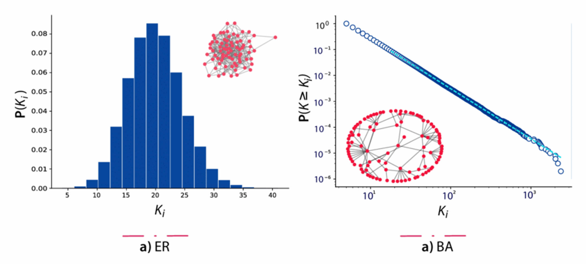

**Small-World Networks**

> Famously observed by Stanley Milgram in 1967.

Six degrees of separation: send letter either to **target** or to someone **likely to know** the target. Send letter only to **personally known** friends.

Finding: the shortest path between any two randonly chosen nodes in a small-world social network typically scales **logarithmically** with the total number of nodes in the system.

Social networks typically have the small-world property (also known as **Watts-Strogatz** network)

Small-world networks can be modeled by randomly rewiring a fraction $p$ of all edges in an otherwise localized regular network.

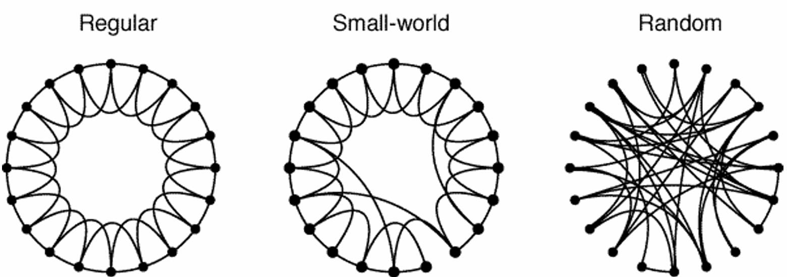

**Cliques**

- A **graph** is complete if each node is connected to each other one.
- A **subgraph** of a graph is the graph induced by a subset of nodes.
- A **clique** is a subgraph that is complete.

Cliques are omnipresent in social networks. Finding all cliques in a graph is NP-hard.

**Clustering Coefficient**

Most real-world networks, and in particular social networks, tend to create tightly knit groups characterized by relatively high density of ties.

This can be measured by the **global clustering coefficient** $C$ that is based on **triplets** of nodes.

A triplet is three nodes that are connected by either two (open) or three (closed) triplets:

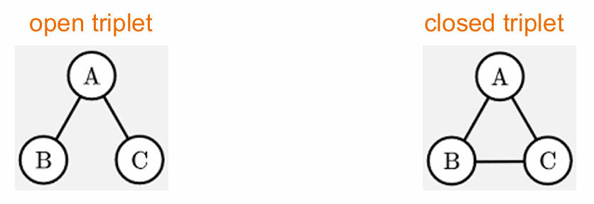

$$
C = \frac{\text{number of all closed triplets}}{\text{number of all triples}} = \frac{3 \times \text{number of triangles}}{\text{number of all triples}}
$$

Sine any graph is fully specifies by its adjacency matrix $A$, the global clustering coefficent for an undirected graph can be expressed in terms of $A$ as 

$$
C=\frac{\sum_{i,j,k}A_{ij}A_{jk}A_{ki}}{\sum_{i}k_{i}(k_{i}-1)}\mathrm{~where~}k_{i}=\sum_{j}A_{ij}.
$$

**Real-World Networks**

Denote by $d_{i,j}$ the shortest path between node $i$ and $j$. The network **diameter** is the longest shortest-path distance $d = \max d_{ij}$.

Real-world networks exhibit three key properties: **small diameter**, **high clustering**, **scale-freeness**. Different network models capture these properties to different degress.

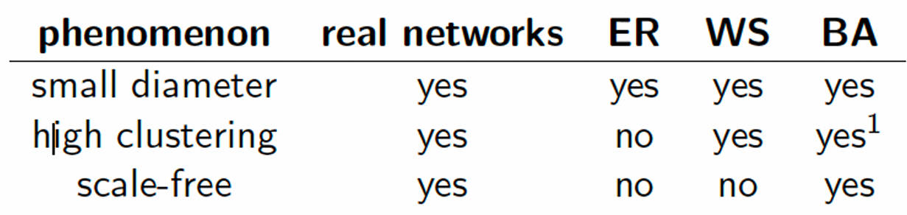

**Clustering**

Detect network elements with similar propertis is of great importance, especially in large network. Nodes that are "similar" according to some metric are grouped into clusters. This process is called **clustering**. Dozens of different clustering methods exist, and often it is very case specific which one is to be used.

For instance, **edge betweenness clustering** detects clusters in a graph network by progressively removing the edge with the highest betweenness centrality from the graph. The method stops when there are no more edges to remove or it the algorithm has reached the requested maximum number of clusters.

**Hierarchical Clustering**

Hierarchical clustering partitions the graph into a hierarchy of clusters. Starting from individual nodes, agglomerative strategy merges pairs of clusters until the entire network is covered.

Just like in normal clustering we need a distance metric between any two datapoints, here we need a weight that defines a "distance" between any two nodes. A common metric in the shortest path between two nodes.

Once the distance metric has been defined, everything is analogous to normal hierarchical clutering.

The value of a company that provides user interactions scales **quadratically** in the number of users. Origin of **Metcalfe's Law**: A simple combinatorial exercise (handshake problem). Recall that 

**The Friendship Paradox (FP)**

FP: Most people have fewer friends than their friends have, on average.

The FP is an example of how network structure can significantly distort an individual's **local** observations.

We need two quantities: mean number of friends for a random person and the mean number of friends of friends. Assume person $i$ has $d_i$ friends (their degree) and there are $n$ people. Average number of friends: $\mu = \frac{1}{n} \sum_{i=1}^n d_i $.

***FP:Applications***

- **Social Contagion**: People emulate behaviors of connected individuals; can be leveraged to promote health, wealth, and sustainability.
- **Challenge**: Identifying individuals who effectively trigger desirable cascades without mapping entire social networks.
- **Study**: Large randomized trail tested "friendship-nomination targeting" to spread health interventions.
- **Key Finding**: Friendship-nomination targeting improved health outcomes more than random targeting.
- **Conclusion**: Strategic targeting of social networks can yield widespread benefits without targeting entire populations, enhancing welfare cost-effectively.

**Bipartite Graphs**

A bipartite graph is a graph whose nodes can be divided into two **disjoint** and **independent** sets. Bipartite graphs can be projected into a regular graph along either of the two types of nodes. Application example: create startup graph via startup-projection, apply page-rank and invest into the most central startups.

**Why Complex?**

Why are networks also called complex networks? **Complex** is more than **complicated**. Complex means that **the whole is more than the sum of its parts.**

Complex systems may exhibit behavior that cannot be understood only in terms of the laws governing their microscopic constituents.

This goes against the reductionist hypothesis, stating that a complex system can be understood through the understanding of the smaller parts of the system.

