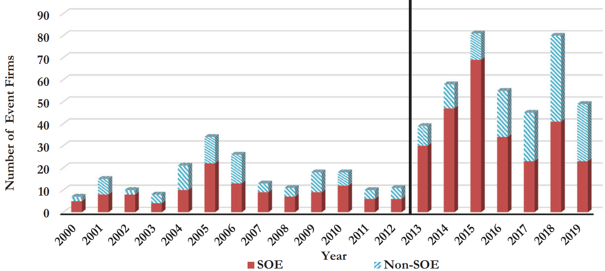
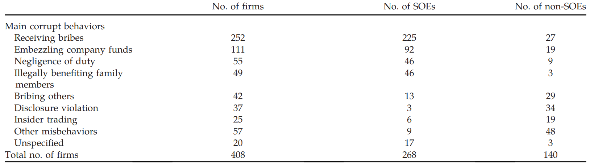
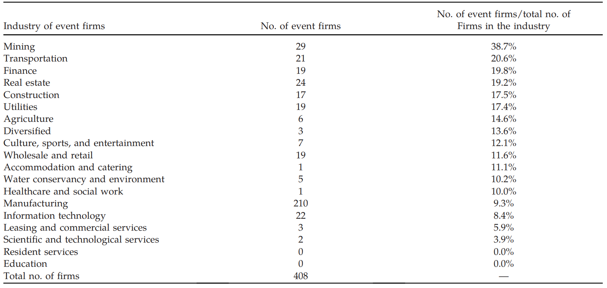
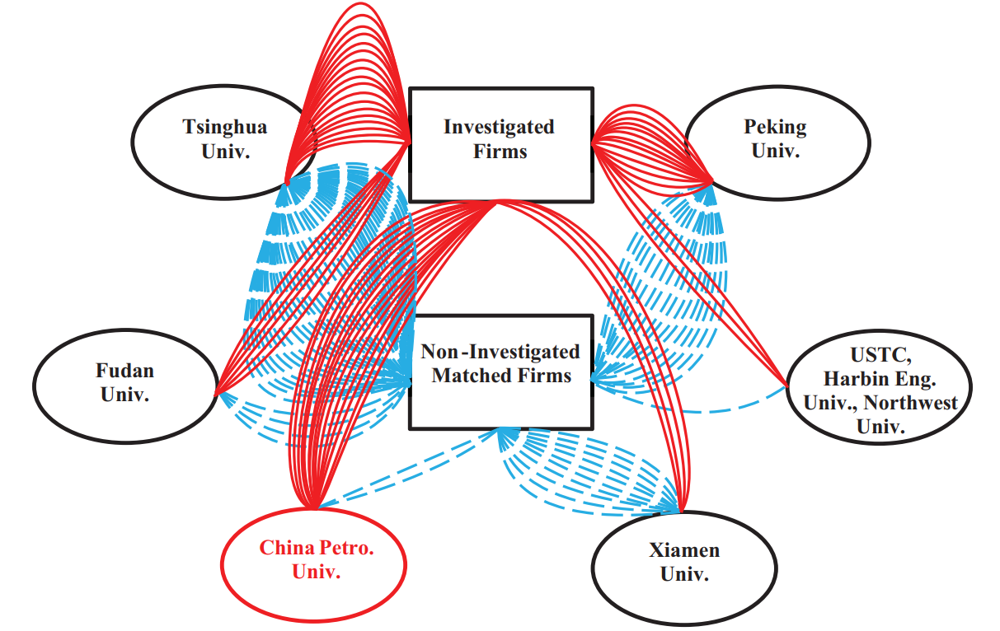

# Anti-Corruption and Financial Market – II

## Refenrence

1. Rising and Fading Hope – Indonesia's Experience in Mitigating Corruption, Xiaodan Gao, Morck, Randall, Ishtiaq P Mahmood, Bernard Yeung, ***Working Paper***, 2023.

2. What Do We Learn from Stock Price Reactions to China’s First Announcement of Anti-Corruption Reforms? Chen Lin, Randall Morck, Bernard Yeung, and Xiaofeng Zhao, ***Journal of Finance and Data Science***, forthcoming.

3. Is the Chinese Anticorruption Campaign Authentic? Evidence from Corporate Investigations, John M. Griffin, Clark Liu, and Tao Shu, ***Management Sciences***, 2022. 

4. Equilibrium Consequences of Corruption on Firms: Evidence from China’s Anti-Corruption Campaign,” Haoyuan Ding, Hanming Fang, Shu Lin, and Kang Shi, ***NBER Working Paper***, 2020.

## What Do We Learn from Stock Price Reactions to China’s First Announcement of Anti-Corruption Reforms? 
Chen Lin1, Randall Morck2, Bernard Yeung3, and Xiaofeng Zhao4, ***Journal of Finance and Data Science***, forthcoming.

1. *Faculty of Business and Economics, The University of Hong Kong*
2. *Faculty of Business, University of Alberta*
3. *National University of Singapore*

关于腐败的影响一直有许多讨论。最符合认知的说法就是腐败会导致资源的错配，进而拖慢经济发展，减少社会福利。但也有另外一种说法是这些官员不给好处不干活，因此通过贿赂反而能让事情顺利推进，进而提高经济发展。

> *bribing officials to grease jammed bureaucratic gears to “get things done”*
>
> Fisman, 2001; Wei, 2001; McMillan and Woodruff, 2002; Li et al., 2008, Agarwal et al., 2019; Zeume, 2016

而本文认为这种讨论的前提是**市场机制是否是有效的**。

在市场机制较健全的地区，不需要领导出面就能解决很多问题，因此，贿赂是作为一种**过路费**形式存在；而对于市场机制不健全的地区，关系网错综复杂，没有领导点头事情根本办不了，因此，通过贿赂而建立起来的政府联系作为企业的一种**资源**。

因此对于民企来说，如果在市场化程度低的地区，反腐导致领导没办法接受好处，因此事情办不下来，所以**企业效益下降**；对于市场化程度高的地区，反腐使得企业用于贿赂的资源减少，因此反而对于**提升企业效益**是大有裨益的。

对于国企来说则没有太大分别，**反腐运动能够减少所有国企的铺张浪费**，因此所有的国企效益都会提升。

因此，文章的implication就是，在反腐运动前要先推动市场机制的建设。

2012年12月4日，习近平总书记上任**仅20天**，反腐活动就拉开了序幕。不同于之前重在传达精神而言辞含糊、内容空泛的政策内容，**八项规定**详细地列出了政策的执行细节。随后中央指派在文革时期同习近平同志一起在陕西从事体力劳动的**王岐山**出任纪委书记。

本文利用八项规定的出台作为一个外生冲击，通过股市的反应验证了假设。

> [!NOTE]
> 在2012年八项规定出台后，2013年烟酒、鱼翅、燕窝、Gucci包和法拉利的销量急剧下滑。(Ke et al., 2016)

利用Fan et al. (2011) 提出的市场化指数 (Marketization index)作为衡量尺度，文章实证结果发现：在市场化高程度的省份中，公司分别在3天和5天的窗口期内上涨了 3.20% 和 4.46%，与之相反，在市场化较低的省份中，公司样本只获得了**不显著的** 0.54% 和 0.98%。

上市公司中包括国企和民企【非国企】。结果显示，**国企在两类地区中上涨幅度相似**，**而对于民企则出现了显著差异**：在市场化程度高的地区中，民企在两个时间窗口期内分别上涨 3.30% 和 4.38%，而对于在不太市场化的地区的民企来说，则显著下跌（-2.72%，-3.00%）。

## Is the Chinese Anticorruption Campaign Authentic? Evidence from Corporate Investigations
John M. Griffin1, Clark Liu2, and Tao Shu3, ***Management Sciences***, 2022. 

1. *McCombs School of Business, University of Texas*
2. *People's Bank of China School of Finance (PBCSF), Tsinghua University*
3. *School of Management and Economics, Shenzhen Finance Institute, Chinese University of Hong Kong*

反腐运动通常由透明度较低的法律或金融机构进行，通常被认为是对于政治反对派的清洗。因此，本文意在证明，中国的反腐运动是否是真正的反腐运动。

### Is the Corporate Anticorruption Campaign Capturing More Corrupt Firms? <!-- {docsify-ignore} -->

这次反腐运动从2013-2019年，共处置了290万人，包括七位国家领导人和上百位高级官员和军队领导。

> [!ATTENTION|label: Investigated national leaders]
> 薄熙来，郭伯雄，令计划，苏荣，孙政才，徐才厚，周永康

2013年后，反腐调查数量显著增加，并且其中大多数为国企，这反映了国企是本次反复活动的重点，例如，八项规定的直接规范对象就是国企，而非民企。

所有涉事公司中，国企和民企的犯罪表现也有很大差别。国企中最常见的腐败行为是收受贿赂，而民企则是披露违规和贿赂他人。

反腐活动最高发的5个行业为：采矿、交通运输、金融、房地产和建筑。

在反腐运动中被调查的公司通常具有以下特点：

- **lower minority shareholder ownership**
- **higher abnormal CEO compensation**
- **more near-retirement CEOs**
- more related-party loans and receivables from parent
- higher business entertainment expenditures
- more operational and investment inefficiencies
- more corruption postings than their matched-firm counterparts

利用这些腐败特征来解释被调查的概率，发现具有很高的解释力度。其中，公司治理的指标【bold indicators】具有最强的解释力度，这也意味着**有效的公司治理机制在遏制腐败中可以起到非常重要的作用**。

为了研究本次反腐活动与之前的差别，作者收集了从2000年1月1日到2012年12月3日的样本作为benchmark，结果发现许多在2013-2019有解释力度的变量在2000-2012这段时期内并不具有解释力度。这在一定程度上说明了本次反腐活动的确比之前要更加全面和真实。

> [!NOTE]
> 但是这个结果也受到许多其他因素的干扰，因此影响了其最终的解释效力。例如，在2012年之前的样本量太小，以及许多用于衡量腐败的指标在2000-2012这段时间并不公开或不要求披露。

### Are Political Factors Related to Corporate Investigations? <!-- {docsify-ignore} -->  

政治因素可能通过两个渠道影响公司腐败调查。

- **Protection effects**。与尚未被调查的领导有关系的公司被调查的可能性低。
- **Spillover effects**。然而，出于以下两个方面，有政治关联也可能使得公司被调查的概率提高：
  1. 公司因卷入政治斗争而被起诉
  2. 与公司有关系的领导被抓了

作者通过14个衡量政治关联度的指标来解释政治因素对于反腐活动的影响。

#### General Government Connection <!-- {docsify-ignore} -->  

如果一个公司的高级官员曾经是政府的领导，那么就被称之为有政府关系。

被调查公司中的25%拥有政府关系，三倍于未被调查公司的7.8%，并且在回归中，政府联系也有很强的解释力度，这一结果与the spillover effect相符。

但是，反腐活动这一决策是由中央制定的，因此可能地方政府没办法提供保护然而中央政府可以。结果显示的确如此，地方政府联系对应the spillover effect，然而在全国层面，Protection effects仍然生效。

#### Specific Connections with Noninvestigated and Investigated Officials <!-- {docsify-ignore} -->  

**School Ties**

通过对比第18届或第19届中央政治局常委12名委员的相关学校【清北，复旦，厦大等】与周永康的相关学校【中国石油大学】，发现与中国石油大学相关的领导被调查的几率更高，而与清华或北大相关的领导则被调查的可能性低。

> [!TIP|label:Endogeneity]
> 当然，这其中有无法回避的内生性问题就是：相比于中国石油大学，清北的学生前景更加光明，因此没有必要腐败而获取利益。
>
> 为了解决内生性，作者又把复旦，厦大作为一个对照组【同样属于PSC】，上交、浙大作为一个对照组【不属于PSC】，结果发现这两组对照组都不具有解释力度。
>
> 因此，结果表明清北确实在反腐活动中有很强的影响力。

**Work experience**

如果有领导与目前政治局常委曾经在一个省份一起共事过，那么与这个领导有关的公司被调查的概率就会降低。

### Discussion and Interpretations <!-- {docsify-ignore} -->  

将两大类指标放在一起回归，结果显示二者都具有一定程度的解释力度和经济学意义，那么该如何解释这个结果呢？

最自然的解释就是：*反腐活动主要是为了政治因素，顺带牵扯出了腐败公司*。但是当然也可以反过来说，*这次反腐活动就是为了惩治腐败，调查公司的同时牵扯出了许多政治人物*。

从周永康的案例着手，可以获取一些信息。按照官方的说法，周永康密谋篡夺党的领导权并夺取国家政权，因此对于他的调查，**至少会有一定的政治成分存在**。事实上，与他相连的公司确实被调查的概率大幅增加，这表明政治清洗的幅度非常广，同时，与之形成鲜明对比的是，与PSC相关的政治领导被调查的可能性又显著降低了。

有没有可能是本次活动主要是为了政治因素，而用以衡量公司腐败的指标之所以显著是因为腐败公司还有一些我们没有观察到政治关联呢？当然，这种可能性很难完全排除，但是在14个政治关联指标之下，我们认为这种可能性已经非常小了。

因此，**此次反腐活动的确大范围惩治了腐败公司，但也不可避免地含有一定的政治因素**。

### Is the Anticorruption Campaign Effective at Reducing Corporate Corruption in China  <!-- {docsify-ignore} -->  

那么反腐活动过后，公司表现是否得到提升了呢？

对于被调查公司来说，短期公司表现会下降，但长期来看公司业绩和股价都会增长。另外，在同一省份或地区内，当国企被调查后，民企的股价会上升。

本文通过检测corporate governance and managerial incentives, self-dealing, earnings manipulation, or the informational environment of financial markets等几个指标是否得到广泛改善，来验证公司的治理环境是否得到了提升。结果显示公司的business entertainment expenditures肉眼可见的减少了，并且国企的CEO薪资也有所下降，**但是公司的腐败指标和中国所有公司的企业文化并没有得到提升**。这是因为下降的指标是反腐运动中的明确目标，但是对于其他不是明确目标但同样是非常重要的腐败指标来说，则不会得到改善。**这也意味着真正有效的反腐还需要在法律、监管与信息层面做出提升**。

> [!ATTENTION|label:problems]
> 文章并不是causality，而是一种描述性的结果。在这个过程中，用以描述的变量选择就极为重要。
> 
> 然而，文章变量选择有较大问题，实际上这些变量并不能衡量真正的corruption，例如related transaction，并没有给出确切的定义，而实际上从生活中就能发现，能够transfer favor的方式远多于文章所定义的。
   

## Equilibrium Consequences of Corruption on Firms: Evidence from China’s Anti-Corruption Campaign 
Haoyuan Ding1, Hanming Fang2, Shu Lin3, and Kang Shi4, ***NBER Working Paper***, 2020.

1. *Shanghai University of Finance and Economics*
2. *Department of Economics, Ronald O. Perelman Center for Political Science and Economics*
3. *Department of Economics Chinese, University of Hong Kong Shatin*
4. *Department of Economics Chinese, University of Hong Kong Shatin*

文章讨论了腐败对经济的传导机制，

#### The grabbing hands <!-- {docsify-ignore} -->    

腐败是一种资源扭曲，会提高企业的经营成本，减慢经济发展。在这种视角下，消除腐败将会提高社会经济效益。

#### The grease for the squeaking wheels <!-- {docsify-ignore} -->    

然而，另一种十分流行的观点是：在官僚主义盛行的环境中，行贿可能有助于避免官僚主义的拖延，并使政府官员更加努力地工作。

> [!TIP|Source]
> 这种观点最早出自于 Leff (1964), *Economic Development Through Bureaucratic Corruption*。
>
> Leff 认为政府并不关心企业家的发展，甚至对其抱有敌意 (hostile)，并且政府会出台与市场机制背道而驰的政策，而行贿则可以帮助行贿的企业避开这些束缚。

这两种观点并不一定相互冲突。官员为了创造寻租空间，会选择设置一些反市场机制的监管条例，从而导致资源错配，同时，行贿在一定程度上也确实可以帮助企业规避这些限制。

腐败在这种均衡框架下对经济的影响非常微妙。如果不存在寻租机会，那么官员也就没有必要设置一些繁文缛节，进而也就没有必要讨论 grease-of-the-wheel 的作用。

然而，官僚腐败究竟是推动还是阻碍经济，关键取决于根除腐败时将建立的制度（包括政府法规）。

文章将2013年3月17日中央纪律监督委员会的成立作为一个外生性的事件，来研究腐败对于公司的影响。

为什么选纪委公告而不选八项规定。

文章结论为，**消除grabbing hands的好处要远远大于【dominate】失去grease for the squeaking wheels的坏处**。

