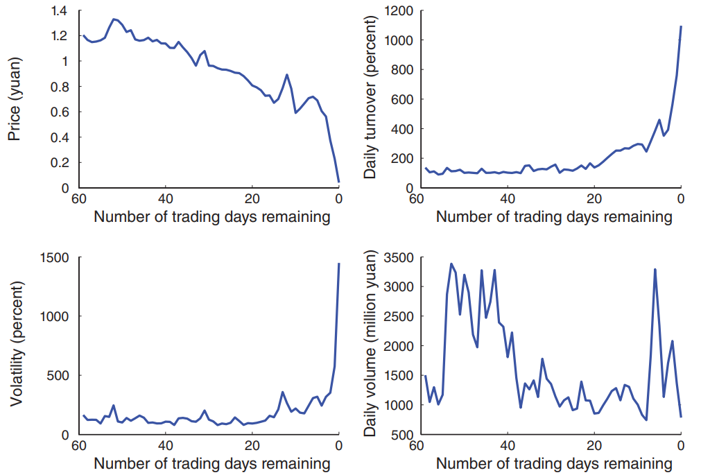

# (Ir)Rational Investors

## Reference 

1. Do Behavioral Biases Affect Order Aggressiveness? Jiangze Bian, Kalok Chan, Donghui Shi, and Hao Zhou, ***Review of Finance***, 2019.

2. The Chinese Warrant Bubble, Wei Xiong and Jialin Yu, ***American Economic Review***, 2011.

3. Behavioral Bias in Haze: Evidence from Air Pollution and the Disposition Effect in China, Jennifer Jie Li, Massimo Massa, Hong Zhang, Jian Zhang, ***Journal of Financial Economics***, 2019.

## Do Behavioral Biases Affect Order Aggressiveness? 

Jiangze Bian1,, Kalok Chan2, Donghui Shi3, and Hao Zhou4, ***Review of Finance***, 2019.

1. *University of International Business and Economics*
2. *CUHK Business School*
3. *Shanghai Stock Exchange*
4. *Tsinghua University, PBC School of Finance*

中国投资者是存在行为偏差的，张晓燕做过个人投资者的研究，美国投资个股的人中，50-60%都是亏钱的，中国80-90%是亏钱的。根据anecdotal，中国教授在中国投资中挣钱的基金都是利用行为偏差的【例如袁宇】。

> ***当市场机制是完善的，那么进行投资者教育是有效的。但如果市场制度就是扭曲的，是纠正市场偏差更重要还是纠正投资者行为偏差更重要？***

本文最主要的贡献是，行为偏差也会影响order submission strategies，而这是之前的文献没有研究过的。

具体来说，是投资者的order aggressiveness，例如买卖各有五档，在卖五档中，挂单越靠近买方的档则越aggressive。举例来说，market order更加aggressive，因为代表要立即成交，即使价格不是最优，而limit order则愿意承担等待而不被交易的风险，只要价格上得到好处。

在行为金融里没有统一的理论框架，常常不同理论会相互冲突，也就是对于不同的情况适用不同的理论。例如disposition effect和house money effects。

**Disposition effects**: investors show a greater propensity to sell stocks trading at a gain rather than a loss。目前学术界对于Disposition effects的机制还没有达成共识，但是获得更多认同的理论是前景理论（prospect theory），当投资者盈利时，效用曲线是concave的，而当浮亏时则是convex的，因此形成了处置效用。

但是也有一些理论研究（Barberis and Xiong, 2009; Kaustia, 2010）指出前景理论不足以导致处置效用。但是尽管在处置效应这一解释上没有明确的共识，但的确有大量的实证（see Odean, 1998; Grinblatt and Keloharju, 2001; Liu et al., 2010; Ben-David and Hirshleifer, 2012）显示前期的投资结果会影响接下来投资者的风险决策（risk-taking decisions）。

> [!TIP|label:House money effects]
> The term is first borrowed from **casinos**, refering to a gambler who takes winnings from previous bets and uses some or all of them in subsequent bets.
>
> 指的是当一个人从赌场赚了钱之后，就觉得这个钱不是自己的了，进而用于投资更具风险的项目。在投资中，可以理解为当投资者从一笔投资中赚了很多钱后，往往会提高自己的风险容忍程度，进行更具风险的投资。

本文则是在实证层面证明了二者可以同时存在，尽管没有给出理论解释。文章发现在处置效应的基础上，当收益高到一定程度时，投资者反而不愿意卖出。

> The relationship between sell order aggressiveness and losses is significantly negative, but between sell order aggressiveness and gains is quadratic—order aggressiveness first increases with gains, and then declines after a certain level is reached.

## The Chinese Warrants Bubble

Wei Xiong1 and Jialin Yu2, ***American Economic Review***, 2011.

1. *Department of Economics and Bendheim Center for Finance, Princeton University*
2. *Graduate School of Business, Columbia University*

在分析泡沫的时候，非常重要的问题是，*这个泡沫是否是真的泡沫*？

因为泡沫指的是：**价格远远偏离基础价值**。然而，如何准确的衡量基础价值是一个很难定义的问题。对此，普遍认为有以下三个历史上存在过的泡沫：

- Dutch tulip mania (1634-37)
- Mississippi bubble (1719-20)
- South Sea bubble (1720)

对于1990年代末的互联网泡沫则仍有一些争议 (Lubos Pastor and Pietro Veronesi, 2006)。

中国2005-2008年的权证市场则提供了一个很好的experiment，因为深度虚值的权证基础价值基本为0，并且这些价格都可以被投资者观测到，但是这些权证日均换手率超过300%，并且是以一个极为夸张的价格。

在2005-2008，18家中国公司发行了看跌权证，并且有着long maturity，从九个月到两年不等。2005-2007年的牛市让这些put warrant成为深度虚值，然而这些毫无价值的权证却成为了狂热投机的对象。

就如同历史上存在过的泡沫一样，权证泡沫一样伴随着狂热的交易和异常的价格波动，平均每日成交额为12.9亿元，年平均收益波动率为 **271%** 。在最极端的一天，ZhaoHang put warrant 成交额为**456.8亿**。在这些权证到期的最后一天，平均换手率为 **1175%** ，由于交易时间只有4个小时，因此这意味着每隔20分钟，换手率就达到了100%。

### China's Warrants Markets <!-- {docsify-ignore} -->

尽管在过去30年中国经济飞速发展，但是中国的资本市场十分不健全。实际上，自1995年的327国债事件以来，政府取消了所有的金融衍生品市场。直到2005年的股权分置改革才使得证监会有机会重新将金融衍生品引入市场。正如之前在股权分置改革那一讲提过的，只有当上市公司对投资者做出补偿，改革法案才能推行。而权证，就是补偿的一部分。

因为金融衍生品固有特性，权证的交易环境要比股票好很多，例如 “T+0” 的交易规则、更低的交易费用【免除印花税和注册费】以及更宽的涨跌停幅度【大约是20-30%，不过实际上权证很少涨跌停】。

### The Price Bubble in Put Warrants <!-- {docsify-ignore} -->

#### WuLiang Warrant <!-- {docsify-ignore} -->

**五粮液权证是这一泡沫生动的例子。**

2006年4月3号，五粮液发行了313 million shares的put warrant，期限两年。在权证刚发行时，属于实值期权：股价为7.11元而行权价为7.96元。然而，仅仅两周之后，牛市中的五粮液就已经超过了7.96元，并且再也没有回到这一价格，一路上涨到2007年10月15号的71.56元。

从图中可以看到，当权证基础价值已经为零时，权证的价格却疯狂的上涨。

> [!TIP|label:BS caveats]
> BS公式要求无套利的环境，然而由于中国在2011年前完全不允许做空股票或权证，这一点是不太符合的。
>
> BS的假设之一是股票价格遵循布朗运动，然而中国股市的特点与此并不相符。
>
> 但是对于仅用BS公式来部分展现权证价值变化还是足够的。

像所有泡沫一样，权证泡沫也伴随着狂热的交易，显示出了极为夸张的日均换手率和日均成交额，

对比来看换手率也很有意思。纽约证券交易所年均换手率才只有100%，而五粮液权证平均换手率是NYSE stocks的340倍，在最后一个交易日达到了4600倍。

即使对于互联网泡沫中的股票Palm stock，五粮液的换手率也是其7倍，在最后一天达到了90倍。

#### Other Warrants  <!-- {docsify-ignore} -->

上述是其他权证的基本信息，这些权证与上文提到的五粮液权证基本有着类似的特征。

#### Maturity effects  <!-- {docsify-ignore} -->

*随着到期日的临近*，权证呈现出许多有意思的特征。

- 权证价格是逐渐下跌的，直到临近交易日才出现了急速下降
- 与此相反，权证交易量和换手率则是在临近交易日之时**猛烈上涨**
- 叠加价格下跌的影响，成交规模的变化也十分有趣。离到期日有段距离之时【40~60天】，成交很活跃，随后较为沉寂，直到到期日的临近，交易量再次爆发。

以下是WanHua put warrant在最后一个交易日的价格变化，尽管实际基础价值为0，但是仍然有许多人参与交易。

下面是所有put warrant在最后一天的交易情况。

### Motivation of bubbles <!-- {docsify-ignore} -->

#### Hedge like other finacnial derivatives？ <!-- {docsify-ignore} -->

当这些权证基础价值为0时，他们的收益率与其underlying return基本毫无相关性，因此，这些投资这并不是将权证作为**daily**对冲工具。

还有一种说法是，投资者将权证作为对冲股票 jump-to-ruin risk。由于权证实际上在最后一个交易日后五天才会被行权，因此其最后一天的价格包括了对于这种 jump-to-ruin risk的预期。然而，这种 jump premium 远远不能衡量权证在最后一个交易日的价格变动。

> [!NOTE|label:Jump-to-ruin risk]
> 由于没有做空机制，股价就会被对未来十分乐观的投资者高估，此时就隐含了一种高估股价被修正的风险。这种修正风险就是由于put warrant被大量行权而导致的。
>
> 在权证结算中，还有一种方式是cash settlement，这种现金结算的方式则**不会对股价带来冲击**，因为没有卖股票的行为。

#### Rational bubble？ <!-- {docsify-ignore} -->

根据 Olivier Blanchard and Mark Watson (1983)，如果一个资产没有到期时间并且投资者有着一致的信念【homogeneous rational investors】，那么只要这个泡沫以 discount rate的速率成长，那么就会出现理性泡沫。

然而，**权证明确的到期日并不支持这一理论**。

#### Investor's agency problems <!-- {docsify-ignore} -->

*Franklin Allen and Gary Gorton (1993) and Allen and Douglas Gale (2000)*.

当基金经理和投资者之间存在信息不对称，并且二者之间有contract friction，那么管理人就有动机以牺牲投资者的利益为代价来寻求风险，因而导致了资产以高于基础价值的价格被交易。

尽管机构投资者在中国近几年发展迅速，然而相比中国金融市场来说体量还是太小了。更重要的是，在权证泡沫中，机构投资者基本没有参与，在2006年短暂的一段时间里达到了1-2%，其余绝大多数时间里维持0.2%左右，因此，这一泡沫也不会是由于Investor's agency的问题引起的。

#### Gambling Behavior <!-- {docsify-ignore} -->

*Nicholas Barberis and Ming Huang (2008).*

也许投资者会将权证疯狂的波动看作彩票，尽管概率很小，但是仍然有机会赢大钱。彩票的收益分布有显著的positive skewness，代表有很大的概率亏少部分钱而很小概率挣大钱。

然而，根据[Other Warants](#other-warrants) ，在权证收益率中基本没有正偏度（positive skewness）的现象，甚至大部分呈现出负negative skewness，因此，也不能说明投资者将权证交易看作买彩票。

> [!ATTENTION]
> 此处有些小问题，因为尽管权证收益呈现positive skewness，但并不能说明投资者能够意识到这一点，因此仅通过偏度分析就证明不存在Gambling Behavior是否有些牵强？

### The Resale Option Theory <!-- {docsify-ignore} -->

本文说明，中国的权证泡沫是由**做空限制**（short-selling constraints）和**投资者异质性信念**（investors' heterogeneous beliefs）共同作用而导致的。

> [!TIP|label:Related literature]
> *Michael Harrison and David Kreps (1978), Stephen Morris (1996), Jose Scheinkman and Xiong (2003), and Harrison Hong, Scheinkman, and Xiong (2006)*

尽管存在异质性信念，但由于做空限制的存在，会使得资产价格偏向乐观者一方，因为看空者啥也干不了。更为重要的是，投资者的信念是会发生变化的，**乐观的投资者倾向于为他已经赋予乐观信念的资产付出更高的价格**，因为他期望在未来能够卖给更乐观的人。

Resale theory由来已久：

Scheinkman and Xiong (2003) 指出，**泡沫的规模与交易量和交易频率【换手率】正相关**。投资者对于未来股价的信念越不一致，交易则越剧烈，此时也代表未来越有可能发生resale。其次，泡沫的规模也与波动性有关，当资产价格波动剧烈，投资者也就会越不一致，反过来也会使得泡沫的规模更大。

Hong, Scheinkman, and Xiong (2006) 认为**泡沫的规模与资产流动性和剩余期限负相关**。当资产流动性很高，例如流通股数量很多，那么就很难形成泡沫，从而无法resale。而当剩余期限很短时，resale的机会也会变少，因此很难形成规模较大泡沫。

实证结果支持这两种模型。

### Noncommon Knowledge of Rationality <!-- {docsify-ignore} -->

由于在现实中很难准确衡量资产基础价值，大多数的分析都只局限于实验。中国权证泡沫数据则为这些实验结论提供了一些重要的分析结论。

其中最为重要的是：本文的研究证实了：当资产基础价值可以被公开观测到，并且资产有明确的到期日时，泡沫就可以出现。

> [!NOTE|label:Related paper]
> This phenomenon was first discovered by the classic study of Smith, Suchanek, and Williams (1988) and since then has been replicated in many other studies, e.g., Porter and Smith (1995); 
Lei, Noussair, and Plott (2001); Dufwenberg, Lindqvist, and Moore (2005); Ackert et al. (2006); Haruvy and Noussair (2006); Haruvy, Lahav, and Noussair (2007); Hirota and Sunder (2007); and Hussam, Porter, and Smith (2008), under a variety of treatments.

Smith, Suchanek, and Williams (1988) 将泡沫解释为投资者对其他投资者行为的不信任，具体来说，交易者并不信任其他交易者的rationality，并对此进行speculate，因此往往导致价格与基础价格不符，进而引发泡沫。

因为权证在中国是个新鲜玩意，因此投资者不相信其他人也是有道理的。根据数据，在期权到期后，明明是亏损状态不该行权，但仍然有投资者选择了行权，也许是混淆了put 和 call。

但是权证市场历经三年，在这个过程中，投资者会不断学习，因此一个合理的假设是：随着时间流逝，投资者对于其他投资者的不信任程度应该逐渐降低。然而，实证结果显示没有发现任何投资者确实学习的证据。这一结果可能是由于新投资者的不断涌入造成的。 

### Riding the Bubble <!-- {docsify-ignore} -->

对权证数据使用动量策略，发现buy winner并不能赚钱，而short loser却可以make profit，这更加说明了做空机制的重要性。

## Behavioral Bias in Haze: Evidence from Air Pollution and the Disposition Effect in China

Jennifer Jie Li1, Massimo Massa2, Hong Zhang3, Jian Zhang4, ***Journal of Financial Economics***, 2019.

1. *Shanghai Advanced Institute of Finance, Shanghai Jiao Tong University*
2. *INSEAD*
3. *PBC School of Finance, Tsinghua University*
4. *Faculty of Business and Economics, University of Hong Kong*

> That yellow haze of smog hovering over the skyline isn’t just a stain on the view. It may also leave a mark on your mind.
>
> Weir(2012)

文章探讨了环境因素对认知偏误（即disposition effects）的影响。

对于发展中国家来说，经济发展和工业化通常会带来严重的污染问题，而污染也会影响人们的身体健康，减少社会福利和个人参与经济活动的积极性和有效性（effectiveness），因此降低经济发展速度。然而，不同于定量测量工厂烟尘污染空气的程度，除了上述对健康的影响之外，污染和经济发展之间的causal relationship是非常难以衡量的，因此有关这方面的文献还十分缺乏。

而本文将污染问题与行为金融联系在了一起。

> [!NOTE|label:Literature Background]
> The new intuition is built on health science literature’s recent heuristic finding that air pollution, “the biggest environmental risk to health” according to the World Health Organization (2016), can affect humans’ moods, cognition, and mental well-being—e.g., by increasing the risk of anxiety, depression, and cognitive decline (e.g., Block and Calderón-Garcidueñas, 2009; Fonken et al., 2011; Mohai et al., 2011; Weuve et al., 2012; Weir, 2012 summarizes recent findings)—in addition to its better-known impacts on respiration, vascular health, and mortality (e.g., Pope, 1989; Pope et al., 2002, 2011). Given that investors’ trading behavior is influenced by their mental condition (e.g., Kamstra et al., 2003) and brain functioning (e.g., Frydman et al., 2014) and that limited cognitive resources are known to give rise to biases (e.g., Kahneman et al., 1982; Hirshleifer, 2015),

作者将空气污染与处置效应联系了起来。尽管处置效应的成因和后果尚未有定论，但其通常被认为是投资者由认知偏误引起的最重要的交易错误。

文章通过三步来研究空气污染对处置效应的影响。

#### Step 1 <!-- {docsify-ignore} -->

首先，作者对这两个变量进行double sort来观察二者之间的相关性。结果显示处置效应与空气污染高度相关：在高污染的地区，高处置效应的投资者是低处置效应的3-4倍。并且空气质量好的地区投资收益高于空气质量差的地区。

#### Step 2 <!-- {docsify-ignore} -->

尽管有很高的相关性，但这不足以识别其背后的因果关系。因此，第二步就是来研究这种交易偏差背后的因果性。

作者巧妙地应用了两个exogenous identification test来识别这种关系。

**Test 1**

空气质量会受到风力的影响，当风力大于5m/s，那么就会显著改善当地的空气质量。借助这一外生条件，作者采用了DID方法，发现当空气质量明显改善后，处置效应的程度也显著降低了。

**Test 2**

中国有一条地理分界线：秦岭淮河，秦岭淮河以北称之为北方，以南称之为南方。这条分界线的两侧的政策也有所不同：中国政府对于北方的城市居民提供免费的供暖，而南方则不适用于这一政策。因为这种类型的供暖通常是通过煤炭来进行，因此其燃烧物造成了大量的污染。换言之，也就是说在秦岭淮河两侧存在**空气质量的不连续性**，一侧明显高而另一侧明显低。

这一外生条件为断点回归创造了极佳的实验环境。通过断点回归，作者发现在断点两侧呈现出明显的不连续性，也即分界线北边一点地区的处置效应要显著高于南边一点的地区。并且这种效应**只在供暖季显著**，这就进一步降低了内生性的考虑。

#### Step 3 <!-- {docsify-ignore} -->

进一步文章还研究了投资者**个人特征**对与空气质量之间关系的影响，结果显示，当投资者**更年长、受教育程度更高、以及更加有经验时**，空气质量带来的影响就减弱了。

### Mechanism <!-- {docsify-ignore} -->

**情绪管理**（mood regulation），指的是人们会主动去调整坏情绪来维持好心情。

当空气污染导致了坏情绪时，人们会觉得亏损难以接受，因此不想卖出，而当盈利时，人们会想要卖出来作为一种对于空气污染的心理补偿，因此产生了处置效应。但是还有一种解释是，人们会采取确定性的（confirmative）行动来保持好心情，例如即使在没有污染的天气也会卖出微小盈利的股票。

因此作者还做了更多的检验来排除其他的可能性。

首先，因为污染天气引起的情绪变化会使得投资者realize more gains than losses，因此会使得投资者trade against momentum，进而错过可能的动量盈利。结果显示投资者在污染严重的天数更频繁的做出sell winners的举动，而如果继续持有，后续20天内的收益率则会很高。

这种也有可能是realization preference/utility 导致的，在污染天气中，*sign realization*【挣钱而不是亏钱】和*magnitude realization*【挣大钱而不是挣小钱】都会使得投资者效用增加。

但是情绪管理的理论则不支持这种解释。具体来说，污染越严重就会导致越坏的情绪，因此需要投资者卖出更大金额的盈利来作为补偿，进而引起magnitude effects，或者多次的非大额交易也可以达到这种效果，尽管因为在污染天气下的焦虑和沮丧情绪，多次交易可能不太合理。

结果显示在污染更加严重的天气中的确出现了magnitude effects。因此支持了情绪管理的理论。

> [!ATTENTION|label:Caveats]
> 1. The evidence is indirect and the mechanism is not exclusive.
>
> 2. What we refer to as moods may be influenced by a variety of mental, psychological, and cognitive sources among which we cannot further differentiate

**Implications**

严重的污染会导致错误的交易，会使得财富从受污染影响更大的投资者流向受影响没那么大的投资者，而前者通常是没有意识到污染问题或者是他们负担不起改善空气质量的措施【如空气净化器】，因此好的政策不能只关注交易的活跃程度，还要关心在retail investor之间的财富分配。

