# Corporate Bond Market – II – Micro

## Reference

1. Issuance Overpricing of China’s Corporate Debt Securities, Yi Ding, Wei Xiong, and Jingfan Zhang, ***Journal of Financial Economics***, 2022.

2. Pledgeability and Asset Prices: Evidence from the Chinese Corporate Bond Markets, Hui Chen, Zhuo Chen, Zhiguo He, Jinyu Liu, and Rengming Xie, ***Journal of Finance*** forthcoming, 2022.

## The Impact of Municipal Corporate Bond on China’s Corporate Debt Market

Keqi Chen, Yi Huang, Kathy Yuan, Hao Zhou

从Panel B来看，中国的债市比股市发展得好，基于股市的比较有趣的研究都属于行为金融方面的研究。

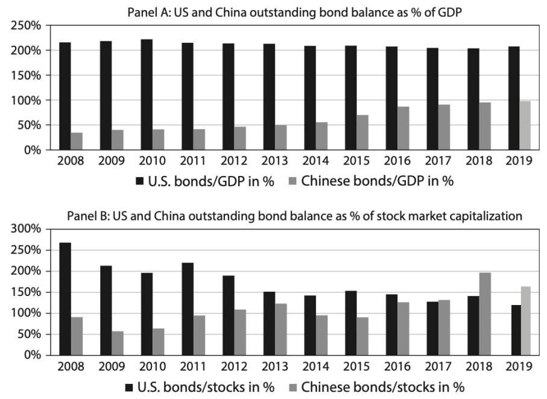

之前债券都是在交易所交易，96-97年股市暴涨，当时大家把债券当作融资来炒股，因此成立银行间市场，当时主要是为了防止银行在交易所不断抵押去炒股。最开始是上市公司才能发债券，其中一半国企一半民企，后续债券发行标准下降，差不多的企业都可以发债，标准比上市要宽松很多，因此债券市场快速发展。

银行间市场的主要参与者中不包括城商行，这是因为其在城市竞争不过四大行，因此是银行间市场中资金的借入方

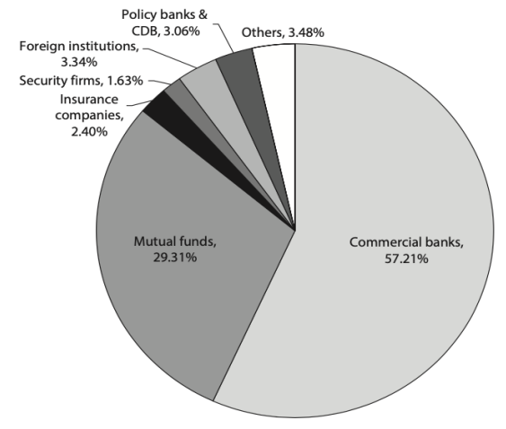

由于流动性不足，所以国债的价格发现功能实际上是有缺陷的。一般认为政策性银行发行的债券（policy bank bonds）等同于国债，同时由于其流动性好【turnover高】，所以可以用来画利率曲线。

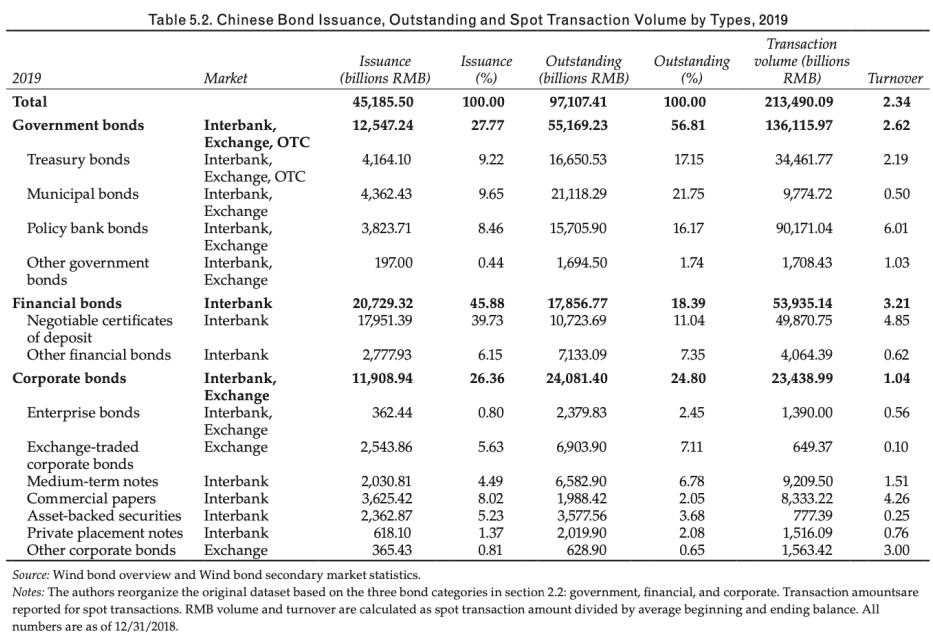

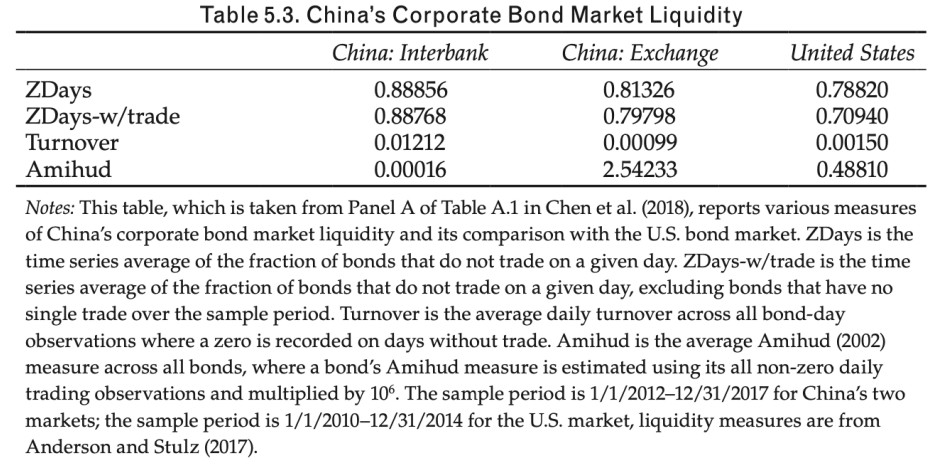

在交易所的散户交易次数多，但是银行间市场交易额是占据了**绝对多数**。

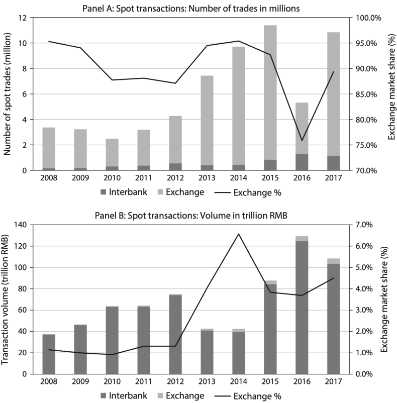

本文主要关注MCB债券【城投债】。

*城投债作为一种新的资产，同时具有企业债和公司债的特性，是如何影响债券市场的呢？*

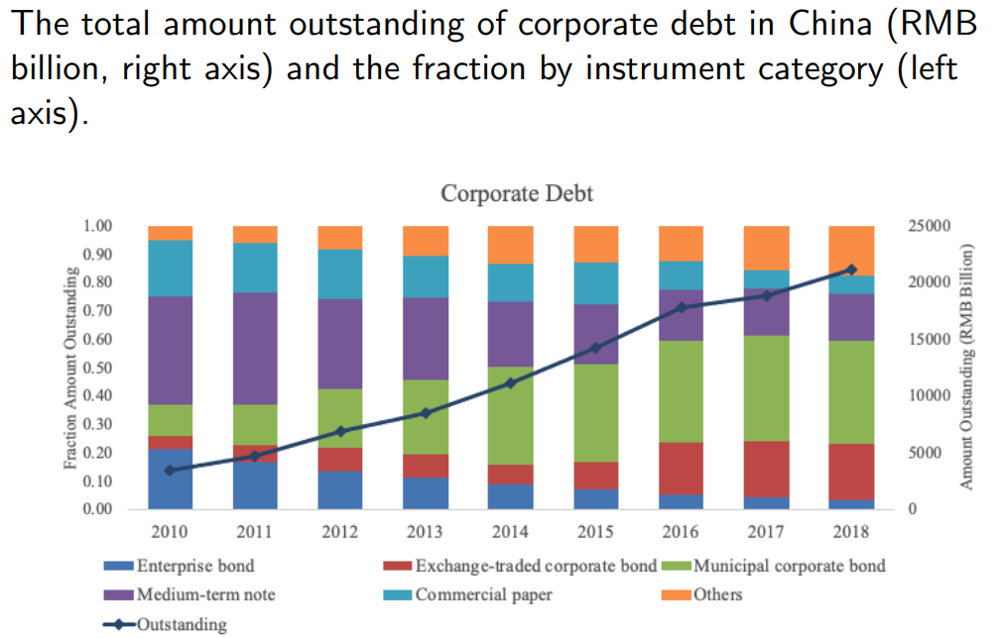

***Main findings***

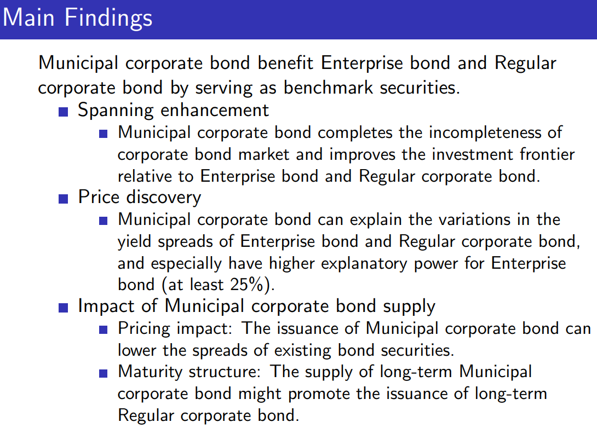

国企央企发行的企业债yield最低，而城投债和公司债的利率差不多，但城投债实际上既享有隐性担保，因此被众多机构投资者追捧。

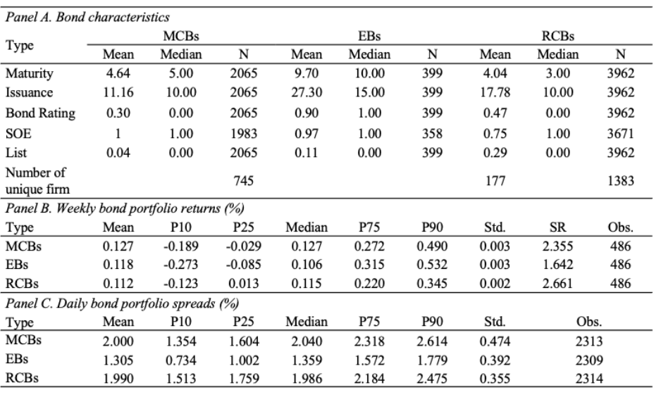

#### Price impact <!-- {docsify-ignore} -->

过往的研究结论有以下两种【*其看似相互矛盾，实则可能同时存在*】：

1. **crowd out**：过多的政府发债，占据了更多流动性，企业债买的人就少了

2. **crowd in**：假如发行能够完善国债的利率曲线，那么公司债定价更好，反而会促进公司债的发行

> [!TIP]
> 当国债流动性好，定价比较准确，那么公司债就是国债基础上加上违约风险，因此公司债的定价能力也会得到提升。

当选用bank loan作为data，则得到挤出效应，用债券则是crowd in。这是因为债券价格由交易得出，价格发现功能更加完善。

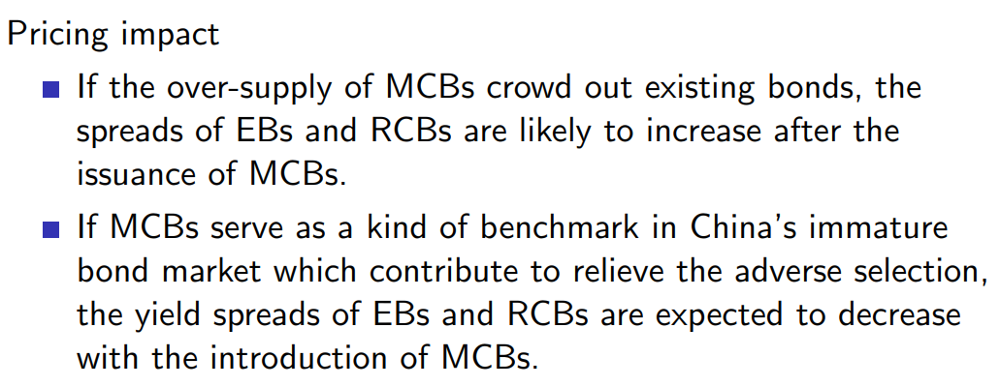

#### 期限结构  <!-- {docsify-ignore} -->

国企发的债都很长，而民企短很多

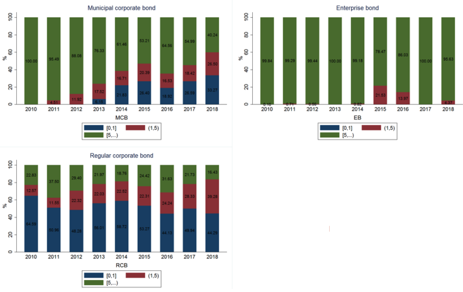

> [!NOTE|label:Insight]
> 债券期限越长，越能为保险公司提供reference。英国国债都是五十年、一百年，而中国现在是五年、十年。

国企发长期债，对其他公司发长期债券也会有帮助。

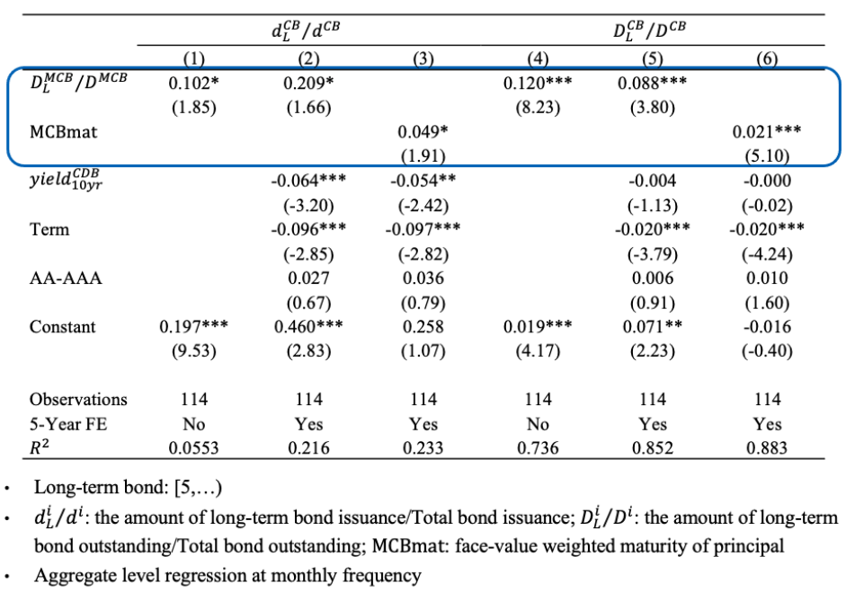

具体来看，城投债长期存量会促进公司债发长期债，然而特别好的公司或国企并不需要城投债提供的crowd in effects【系数为负】。

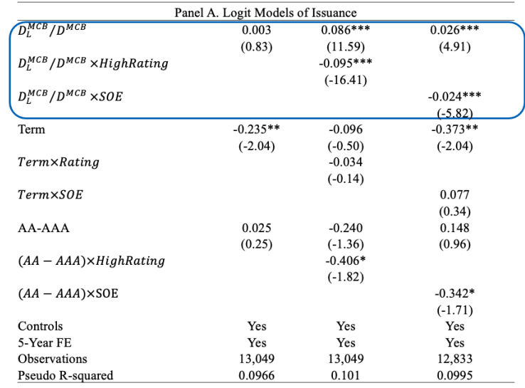

进一步将lower rating 和non-SOE单独拿出来看：

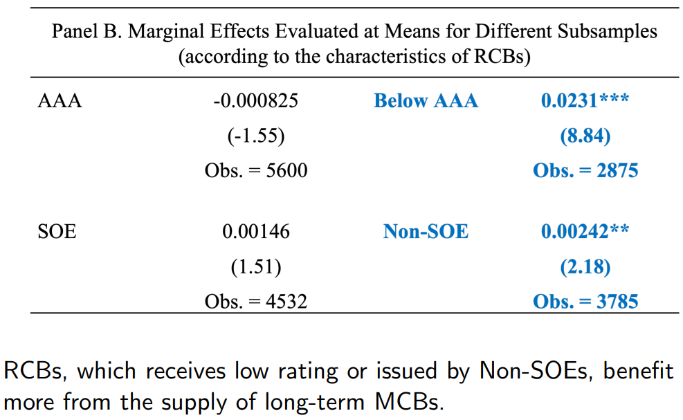

**Conclusion**

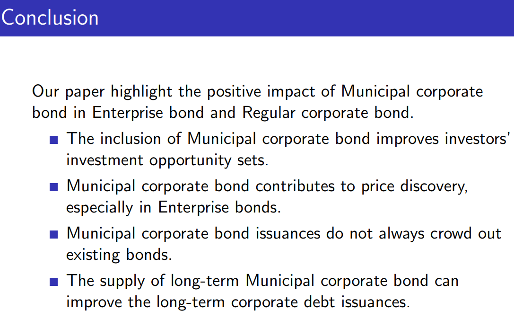

## Issuance Overpricing of China’s Corporate Debt Securities
Yi Ding1, Wei Xiong2, and Jingfan Zhang1, ***Journal of Financial Economics***, 2022.

1. *Chinese University of Hong Kong, Shenzhen, China*
2. *Princeton University, Chinese University of Hong Kong, Shenzhen, China*

中国的债券市场在过去几年发展迅速:

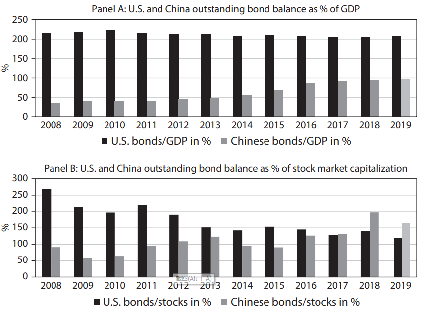

在这个过程中，中国的债券市场呈现出了不同于成熟市场的几个特征：

1. **银行间债券市场**规模在2019年底占了中国总债券规模的 **90%** ，这意味着银行是债券市场的主要参与者。而债券意味着替换对银行贷款的需求，也就是说，银行在大量参与自己竞争对手的融资

2. 银行间债券市场主要发行商业票据（commercial paper）和中期票据（medium-term notes），平均期限为1.74年，对比来看**这一期限非常之短**。

3. 在中国，一般只有信用评级高、违约率低的大公司才会发行债券，这可能代表了政府对于**发行的严格管控和隐性担保**。

### Institutional background  <!-- {docsify-ignore} -->

中国的债券市场分为交易所市场和银行间市场，故此，银行间属于场外市场。交易所市场主要是个人和中小机构通过中心化的交易平台参与。商业银行只能在银行间市场交易，散户只能在交易所市场，而其他的机构如共同基金、保险公司等则在两侧都可以交易。

As a legacy of China's credit plan，银行一直是根据PBC公布的利率放贷款，而不是市场化的利率。为了改革金融系统，中国政府仍然采用了双轨制的策略，于1997年引入了*market track*。具体来说就是政府成立了银行间市场，允许公司向银行发债券。这样就可以加强与银行贷款市场的竞争，也就是state track。

也就是说，当公司打算融资时，既可以通过银行间市场发债券，也可以向银行借贷，这一举措的目的就是使得银行贷款更加市场化。

不同于其他国家的金融市场，中国的银行间市场主要参与者是银行，因为银行持有绝大多数的国民存款。成立不久后银行间市场就成为了公司债发行和交易的主要场所。银行有着充足的 investment capital，同时他也是公司债的underwriter和investor。因为大公司发行的债券通常来说违约率极低，因此银行之间也会compete for the issuance。

2010年，几乎100%的债券都在银行间市场发行，在2016达到最低点，占比88%。

### Economic mechanisms  <!-- {docsify-ignore} -->

银行间市场有四方参与者，the issuer，the underwriter，the investor，and the regulator。

Issuer

对于发行人来说，其需要选择一个underwrite帮助其发行债券。发行人面临的成本主要包括两方面：

- *The underwriting fee paid to the underwriter*
- *The interest cost paid to investors*

通常来说underwriting fee大约为30 bps，NAFMII不允许通过降低underwriting fee的方式来竞争。既然不允许降低underwriting fee，那么就只有降低第二项，也就是提高发行价格。

在全球范围内来说，债券的二级交易市场流动性都很差，交易成本高并且交易频率很低。中国同样如此，因此在中国，industrial report中衡量企业融资成本时，通常采用issuance yield而不是yield from secondary market trading。

Underwriter

Underwriter主要面临来自其他Underwriters的竞争，如果underwriter没有达到issuer的预期，那么就可能被替换掉。同时，在中国，underwriter没有义务维持二级市场的价格平稳【如果发行价格很高，那么在二级市场就卖不出去，价格会大幅下跌】。**因此，underwriter并不会在乎发行价格带来的问题，只会关心能不能满足issuer的要求**。

在中国，公司债的发行是single price auction，不允许overallocate，并且只有一个价格。但是underwriter可以通过两种渠道提高发行价格。

1. **Offer personalized rebate to some participants of the issuance auction**

underwriter可以向那些出价低于intended issuance price的参与者提供回扣，使得其提高报价。而因为underwriter不需要公开回扣数额，因此可以对不同的participants提供不同的回扣，在一定程度上减少回扣成本。

2. **Bid more aggressively for its own investment account**

因为绝大多数 licensed underwriter都是银行，银行也有投资需求，例如经常购买债券。underwriter在购买债券的过程中，不仅要overpay for the issuance【其实也就相当于支付回扣】，还要自己承担债券风险。**因此回扣是最好的策略**。

> [!TIP|label:Issuance mechanism in US]
> A syndicate allocates the issuance of a corporate bond among potential investors and usually sets the offering price below the level that is expected to prevail in secondary market trading to induce investors to reveal their demand. 
> 
> Furthermore, the syndicate assumes the obligation to stabilize the issuance in the secondary market should demand prove to be weaker than expected

Investor

由于流动性很差，二级市场的交易成本大概在10.11 bps，甚至比一级市场的overpricing还要多，因此，即使意识到了一级市场的overpricing，这些投资者仍然会选择在发行时认购。

Regulator

全国金融市场机构投资者协会（NAFMII）是市场的监管者。由于回扣是不公开的，会影响发行过程的公平和质量，因此于2017年10月1日出台法规纠正这一利益输送行为。

#### Underwriter repeat business <!-- {docsify-ignore} -->

根据上述conceptual framework，underwriter之所以要提高定价是因为想要获得未来更多的发行机会，那么此时就存在incentive effects，可以检验**underwriter当前的发行表现与未来获得发行机会的概率之间的关系**。

发行表现可以通过对比当前债券发行价差（issuance spread）与全银行间市场可比债券（comparable bond）平均发行价差来衡量。【issuers prefer a lower spread】

可比债券需要满足以下三个条件：

- same rating
- the maturity difference between a comparable issuance and the referenced issuance must be less than one month
- a comparable issuance must be within a one-month window before the referenced issuance.

实证结果验证了这一假设。

#### The underwriter rebate channel <!-- {docsify-ignore} -->

当法规出台后，average issuance overpricing大幅下降，在2017第四季度甚至接近于零。

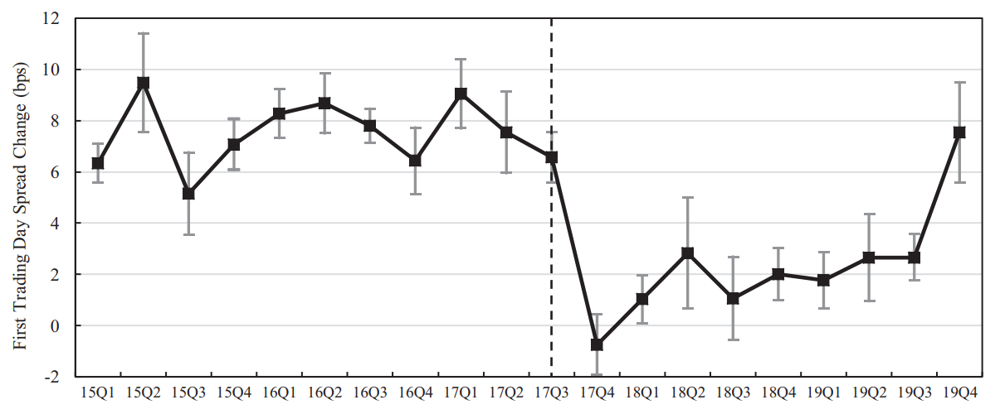

进一步研究，对于underwriters来说，提高债券定价可以帮助其赢得该公司未来的发行机会，使得其在众多underwriters的竞争中脱颖而出，那么underwriters就有很强的动机这么做。而对于央企来说，相比于正常的大公司还拥有中央政府隐形背书，违约率更低，因此对这些公司来说，underwriters会把债券价格定的更高，那么当rebate ban出台后，其issuance overpricing下降也应该更多。

反过来想，对于银行中的巨头四大来说，他们不缺债券承销业务，因此incentive for overpricing就更少，那么当rebate ban出台后这些公司承销的债券overpricing应该下降幅度更轻微。

实证结果支持这两种逻辑。

#### The underwriter bidding channel <!-- {docsify-ignore} -->

underwriter自掏腰包参与发行这一假设中，也有三种解释：

1. **Information advantage**

Underwriter根据自己的信息优势，认为当前即使在overpricing下债券仍然被低估，因此自掏腰包是为了赚取超额收益。

2. **Price support**

Underwriter purchases to support the issuance price *at the fundamental level*

3. **Overbidding hypothesis**

Underwriter在以overprice的价格申购，这也意味着承受损失。

通过统计性指标，可以看出在overpricing bond中，underwriter的购买要高于非overpricing bond【0.37 vs 0.29】。

由于数据可得性，在这里并没有区分underwriter自掏腰包是给自己买还是给clients买。但是一般来说clients不会频繁允许underwriter overbidding，因此，很有可能是underwriter给clients提供回扣，进而使其允许over bidding。通过对比rebate ban前后的份额，发现在不允许回扣后，underwriter的购买明显降低了。

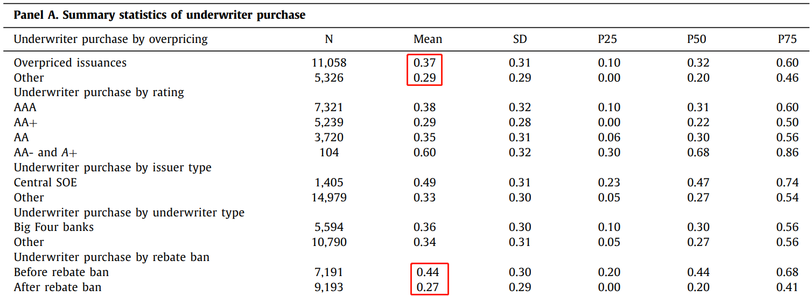

实证结果显示*underwriters generate losses by bidding in issuances they underwrite*，印证了第三种假设。

在rebate ban后，这种overbidding 仍然存在，使得债券仍然处于高估的状态。

#### Pricing quality  <!-- {docsify-ignore} -->

各类基本面因子或特征对于价格的解释程度变高了，说明pricing quality 提高了。

## Pledgeability and Asset Prices: Evidence from the Chinese Corporate Bond Markets
Hui Chen1, Zhuo Chen2, Zhiguo He3, Jinyu Liu4, and Rengming Xie5, ***Journal of Finance*** forthcoming, 2022.

1. *MIT Sloan School of Management*
2. *Tsinghua University*
3. *Booth School of Business, University of Chicago*
4. *University of International Business and Economics*
5. *CITIC Securities*

文章从实证角度研究资产的质押能力（pledgeability）对资产价值的影响。

尽管理论上质押能力如何提高资产价值的机制已经研究的比较透彻了，但是实证方面证据仍然比较缺乏。文章基于中国特色的制度特征，利用政策这一外生冲击清晰地探讨了这一问题。

中国存在两个债券交易市场，商业银行只能在银行间市场交易，散户只能在交易所市场，而其他的机构（non-bank financial institutions，NBFIs）如共同基金、保险公司等则**在两侧都可以交易**。截至2014年底，NBFIs在交易所市场和银行间市场的企业债持仓占比分别为76%和57%，相比之下，retail investor只持有0.6%【交易所】而商业银行持有银行间市场的35%。

文章主要研究在两个市场双重上市（dual-list）的**企业债**（enterprise bonds）。企业债一般是由非上市国企发行，由发改委监管。*企业债在2014年政策冲击发生时大概占了公司债的25%* 。

这两个市场在回购规则上有很大差别。银行间市场回购（interbank repos）与美国的三方回购系统（tri party repo system）类似，关键的交易细则如抵押物，haircut，以及repo rate都由买卖双方协商确定；而交易所则充当了中央清算方（central clearing counterparty）的功能，给所有的买方和卖方都确定了可抵押债券列表以及对应的haircut，而这些细则的确定很大程度上是根据债券评级来决定的。

回购规则的不同使得**同样的债券可能在两个市场拥有不同的价格**。

文章定义了**交易所溢价**（exchange premium）这一概念：银行间市场的收益率（yield）减去交易所市场的收益率。由于NBFIs能够同时参与两个市场，那么同一债券在两个市场的价格应该都包括了基本面价值，因此二者的价格差异，也就是exchange premium只包括非基本面的差异，也就是质押能力以及其他的流动性因素。

为了进一步分离出质押能力的影响，文章利用了政策带来的冲击。

2014年12月8日，交易所突然宣布评级在AAA以下的债券不能作为回购抵押标的。*这一政策主要影响评级为AA+和AA的债券的质押能力，因为AA-在这之前已经不能用于抵押了*。但是与此同时，在银行间市场，这两类债券的haircut并没有发生变化。

这一政策实际上还是与地方债务问题有关。从2014年初，中央经济工作会议就把控制地方债提上日程，后续在2014年出台了多项控制地方债务的规定。在政府调整四万亿的宽松信贷政策后，地方政府不得不通过LGFs去在债券市场寻找资金，并且大量的发行市政公司债（municipal corporate bonds， MCBs），因此企业债中MCB的比例快速上升，从2010年的10%到2014年的87%。

> [!TIP|label:Potential concerns]
> 这一政策的出台可能会引起相关债券的抛售（fire sale），从而影响其exchange premium。但是基于该政策的两个特点，这一点并不会影响实验：
>
> 1. 由于政府也想尽量减少对于市场的影响，这一政策只适用于在政策出台前从来没有做过抵押的债券【类似于新人新办法，老人老办法】
>
> 2. 本文的实证设计使得由retail investor带来的恐慌并不会影响实验结果。理论框架证明了，NBFIs会捕捉这种恐慌带来的套利空间。

实验组（AA+ and AA）与对照组（AAA and AA-）在这一政策出台前，exchange premium呈现相同的趋势，而政策后实验组的exchange premium下降，对照组无变化。同时，因为对照组里同时包含高评级债券和低评级债券，因此也排除了许多alternative fundamental-based explanations。

结果显示，将haircut从0提升到100%会导致债券收益率提高0.39%。haircut率越低代表资产质押能力越强，越安全，则收益率会越低。

但是这一估计仍然有可能被其他因素影响，从而使得其被低估。

最大的影响因素就是套利。尽管存在很多交易摩擦（trading frictions），套利也会使得exchange permia不会偏离零太远，从而使得对于质押能力价值的估计产生偏差。这是因为当不存在套利限制时，exchange premium会始终为零，从而使得质押能力的估计也始终为零。

由于制度的设计，债券市场有许多套利限制。最严重的限制是settlement delays。如果一个投资者想要在交易所卖掉银行间市场的债券，那么他需要提交一份申请，而在2014年，这一转移流程通常需要五个交易日以上。反向的操作需要两到三个工作日。这一delay使得套利者会承受很大的价格风险。此外，由于市场流动性不佳，想要在两个市场买卖大量的同一债券会很困难。

> [!NOTE|label:Arbitrage]
> 这一点可以理解为，对于完全一样的东西，二者之间的差别就应该为零。但是存在套利限制后，就出现了差异，而这种**差异的变化**可以反映出质押能力的变化。
>
> 如果不存在套利限制，二者差别是零元，而存在后是5元，质押能力的变化使得其变为4元。

另外一个影响因素是，这一政策冲击会在银行间市场带来 “flight-to-quality” 效应，从而推高AAA债券的价格，从而降低了该类债券的exchange premia。进而低估质押能力的价值。

作者通过工具变量法来处理这一影响，发现修正后的收益率提升为0.85%，作者想了想还是觉得0.39%靠谱一些。

> [!NOTE|label:Comparison]
> 本文的质押能力变化区间为39-85 bps，Ashcraft,G arleanu, and Pedersen (2011) 的实证指出在2009年3月【一般认为是金融危机最严重的时期】，haircut从0上升到100% 会带来 28-52 bps的提升。

