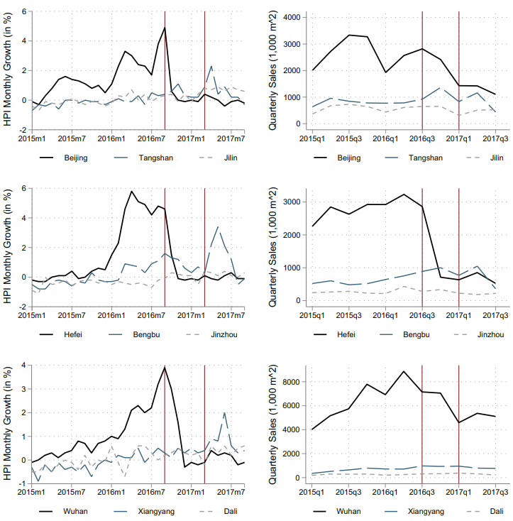
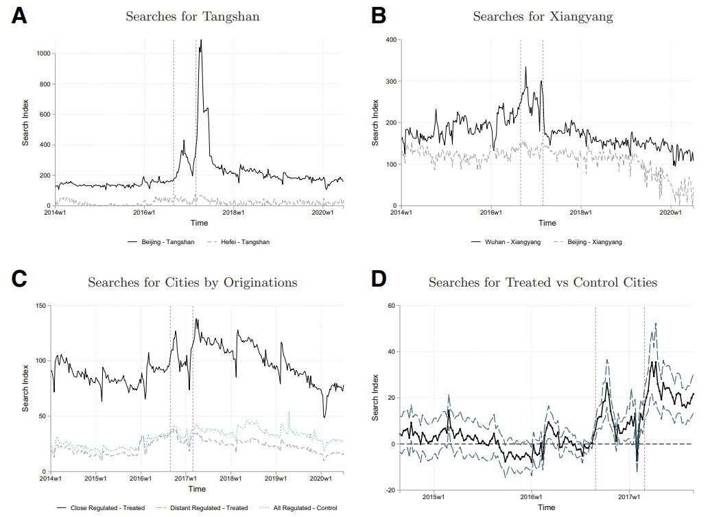
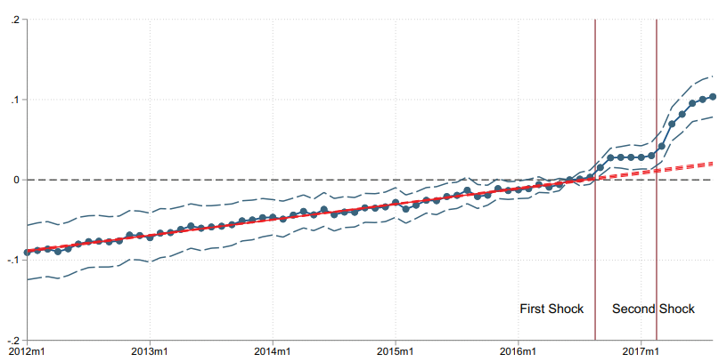

# Real Estate Market - Micro

## Reference

1. Real Estate Boom and Misallocation of Capital in China, Ting Chen, Laura Xiaolei Liu, Wei Xiong, and Li-An Zhou, Guanghua School of Management, Peking University, 2017.

2. Capital Spillover, House Prices, and Consumer Spending: Quasi-Experimental Evidence from House Purchase Restrictions, Yinglu Deng, Li Liao, Jiaheng Yu, and Yu Zhang, ***Review of Financial Studies***, 2022.

3. Housing Booms and Shirking, Quanlin Gu, Jia He, Wenlan Qian, and Yuan Ren, ***NUS Working Paper***, 2022

为什么微观比宏观有意思，因为宏观都在讨论有没有泡沫，价格和基本面的背离

但实际上根据fama的joint hypothesis，如果没有一个合适的模型，是否背离就无从谈起。

但微观会比较precise，研究对于上班，买房的影响。但是尽管微观非常准确，但是对于较为宏观的wellfare loss说不太清楚，没有一般均衡的分析。

## Real Estate Boom and Misallocation of Capital in China
Ting Chen1, Laura Xiaolei Liu2, Wei Xiong3, and Li-An Zhou2, Guanghua School of Management, Peking University, 2017.

1. *Princeton University and Chinese University of Hong Kong*
2. *Guanghua School of Management, Peking University*
3. *Princeton University and NBER*

***Main findings***

在房地产传导机制中，最为常见的就是 collateral channel，即房地产升值可以减少公司面临的 financial constraints，因此抵押物价值上升进而**增加投资**。实证结果的确显示房价提升会导致land-holding firms的总投资增加。

然而进一步细化来看，投资可以被分为三类：

- *与房地产无关的投资*
- *工业用地投资*
- *商业用地投资*

> [!NOTE|label:Land in China]
> 中国的土地分为三类：工业用地（industrial land），商业用地（commercial land），住宅用地（residential land）。根据这个分类，非常明显的是**商业用地和住宅用地与制造业公司的主营业务无关**。以下将商业用地和住宅用地统称为商业用地。
>
> 正是这种细分的土地分类、以及银行信贷的异质性允许研究另外两种channel。

除了collateral channel，还存在**The speculation channel**：房地产的快速增值会使得manufacturing and service firms更多的投身与主营业务无关的房地产，并减少在投资和创新方面的资金投入。

实证结果显示，土地增值，会导致公司对于这三类投资总额均上升，然而从**比例**上来看，商业用地投资份额增加了，而非土地投资的份额减少了。对于省会城市来说，土地价值的增加会导致**商业用地投资增加而非土地投资减少**。

以及**The crowding out channel**：银行会给予land-holding firms更多的信贷资源，因此挤出了non-land-holding firms。

通过Loan-level data，作者发现在房价快速提升的地区中，银行会更多的贷款给有抵押的公司【特别是房地产抵押】，而减少给无抵押的公司的贷款。从公司的角度来看，数据显示 firms without land holdings 的投资显著减少了。

***Implications***

通过对比 firms with and without land holdings，发现有土地的公司更有可能是国有企业，并且有土地的公司 tend to be more inefficient。结合这些特征与文章发现，可以得到许多有意思的结论，

1. 房地产泡沫进一步加剧了国企和民企之间的信贷错配。
2. 即使对于那些 land-holding frims【more likely to be inefficient SOE】，房价的不断提高也会使得他们投身于房地产投机中，而这又进一步推高了房价泡沫并引致了挤出效应。

因此，尽管collateral channel会增加公司的投资，但是另外两种channel的存在会影响这一效果。具体量化来看，通过这两种channel，房价提升100%会带来TFP损失 **26%** due to misallocation of capital。

commercial 比 residential 泡沫还要大，
P2

从04到15的bubble，在历史上只有日本楼市和美国07年前楼市的规模可以比。

04-07也翻倍了，但是并没有企业增加土地投资，因为正常来说，企业就不会买地。实际上是4万亿后，国企有钱，但是没项目，就去买地了

P10
数据忽视了一半的sector交易，所以wellfare考虑不足

P28

四万亿使得国有企业大幅增加土地持有。政府要分项目，实在是没有项目，就把地先分下去

## Capital Spillover, House Prices, and Consumer Spending: Quasi-Experimental Evidence from House Purchase Restrictions

Yinglu Deng1, Li Liao1, Jiaheng Yu2, and Yu Zhang3, ***Review of Financial Studies***, 2022.

1. *PBC School of Finance, Tsinghua University*
2. *MIT Sloan School of Management*
3. *Guanghua School of Management, Peking University*

当政府管控房价时，邻近区域的房价会上升，同时邻近区域的汽车销量也会上升。

### Institutional Background <!-- {docsify-ignore} -->

过去几十年，中国在房价增长方面存在很高的异质性，从2012到2016年9月，一线城市年均增速能达到 14.9%，但三线城市的增速低于3%。

在2016年9月末和2017年3月初，政府对所有的一线城市和许多二线城市实行了两轮的policy changes，意在通过限制the demand of speculators来压制这些城市的房价。

这些policy changes被称为房产购买限制（House purchase restrictions，**HPR**），包括提高首付比例，提高贷款利率，以及occasionally禁止投资性购买【指的是有超过两套房子的owner的购买行为】等。 

这些房价限制措施是非常有效的，在2016年9月，regulated cities平均月增速达到 4%，而在第一轮的HPR后，次月增速直接跌至 1.8%，随后始终低于 1% 的水平。在第二轮的HPR后，2017年3月平均月增速在22个regulated cities中当月跌至0.7%，随后维持在 0.1% 附近。

这些举措成功地限制了管控区域的房价增速，然而同时也带来了严重的溢出效应（spillover effects），相邻区域未被管控地区的房价大幅上升。

|**Regulated city**|**Unregulated city**|**Distant city**|
|:--:|:--:|:--:|
|北京|唐山|吉林|
|合肥|蚌埠|锦州|
|武汉|襄阳|大理|

从图中可以看出政策的有效性。在北京、合肥和武汉，房价明显停止了增长，同时伴随着交易量的暴跌，特别是在北京和合肥，季度房价销售量在第一轮HPR后跌幅超过50%。与此同时，在临近区域观察到了量价同时上升，而地理区位较远的地区则不受影响。

这种unexpected spillover effect惊动了邻近区域的政府部门：

> In order to prevent the spillover effect of Changsha’s regulation and control from impacting and affecting the surrounding areas, it is necessary to effectively strengthen the coordination of the policies ... Zhuzhou and Xiangtan should pay close attention to their real estate market. Once the market shows signs of overheating, timely targeted control measures should be introduced.
>
> *Hunan Province*
>
> Prepare to implement purchase and loan restrictions for non-local residents, in areas with surging house prices and home purchases of non-local residents
>
> *Hubei province*

直到2017年9月，邻近区域的房价增长越来越显著，这些城市也纷纷实施HPR来给房地产市场降温。此后类似于唐山这些临近城市的房价虽然仍在增长，但是速率却越来越慢了。为了避免收到这些follow-on措施的干扰，文章的分析主要聚焦在2017年9月之前。

文章还利用了搜索指数等数据侧面证实了这些nearby unregulated city的房地产关注度显著提高了。

一个技术性的难点就是如何识别出**pre-exsiting trend**。文章发现了在policy shock后，出现了显著异于pre-exsiting trend的变化：

### Empirical  <!-- {docsify-ignore} -->

邻近区域属于treaded cities，HPR实施的区域属于control cities。

***Main Results***

*House wealth effects*

treated cities的房价在两轮HPR后分别涨了 **2.4%** 和 **6.4%**，并且在这个过程中并没有明显的租金变化，而房屋销量分别上升了 **10%** 和 **28%** 。同样，侧面来看，百度home search index同样增长明显，并且显著。

*Automobile effects*

Consistent with positive housing wealth effects，汽车消费同样在上升。在两轮HPR过后，相比于control city，treated city在汽车上的消费分别增长了 **7.8%** 和 **11.6%** ，进一步来说，在豪车上的消费增长了 **12.3%** 和 **15.7%** 。

### Mechanism  <!-- {docsify-ignore} -->

房价增长比较容易理解，但汽车消费的增长应该如何解释呢？

#### 'pure' housing wealth effect  <!-- {docsify-ignore} -->

> An individual’s spending response to house prices depends on the gap **between the value of owned housing assets and the discounted value of housing consumption**.

对于计划买房的租户来说【为了获得户口和当地的医疗、教育等资源】，当房价上升，会**减少消费**，尽管租金并没有改变。对于房主来说，则会**增加消费**。

The varied spending responses also indicate **the substantial redistributions** caused by the HPR shocks

文章通过研究本地住户【大多数为homwowener】和非本地住户【大多数为renter】的数据来验证这一假设。

#### Alternative explanations  <!-- {docsify-ignore} -->

**Permanent income channel**

> Improvements in the growth prospects of the treated cities may lead to a simultaneous increase in spending and house prices

这种解释是建立在economic fundamental change的基础上，并且对于本地住户和非本地住户来说二者消费增长应该十分相似，这两点在数据中都没有体现。

**Labor relocation channel**

> The imposition of HPR leads workers to migrate to nearby cities, which leads to spending and house price increases.

这一解释同样会带来economic fundamental change，并且会导致非本地住户的消费增加，这同样与数据不符。

**Collateral channel**

> The increase in house prices enables households to finance their consumption by pledging the more valuable housing assets.

在这种解释下，租户的消费水平不应该变化，因为租金并没有发生改变。

## Housing Booms and Shirking
Quanlin Gu1, Jia He2, Wenlan Qian3, and Yuan Ren4, ***NUS Working Paper***, 2022

1. *China Center for Internet Economy Research, Central University of Finance and Economics*
2. *School of Finance, Nankai University*
3. *Department of Finance, Business School, National University of Singapore*
4. *School of Economics and Academy of Financial Research, Zhejiang University*

### Background <!-- {docsify-ignore} -->

自1998年起，中国的房地产市场发生了巨大的转变。政府宣布不再将房产作为福利分配，意在建立一个private housing market，从此人们都需要买房或者租房。

过去十几年中国房地产飞速发展，尽管存在着一定的异质性，但是全国范围内来看，房地产仍然扮演者非常重要的角色，根据 *China Household Finance Survey* (2018)，房产价值占了一般家庭财富的三分之二。

中国的土地供应是由地方政府决定，并且卖地收入是政府收入来源中不可或缺的一部分。第一场土地拍卖于1987年在深圳举行，但是从1987到2004，拍卖流程均不公开。开发商需要接触当地政府，二者协商出一个价格。直到2004年，新的政策要求所有住宅和商业用地均需要**公开招拍挂**。

随着工业化进程，民众对于房地产的刚需不断提高，同时拍卖机制使得开发商之间的竞争不断推高土地价格，经常出现破纪录的价格。而当拍卖价格破了全国的记录时，就被称之为**地王**（land king）。

地王通常会被媒体大肆报道，这也会提高人们对于未来土地价格的预期，反过来进一步推高房产价格，例如当重庆的地王出现后，**两个月的时间里，土地价格上涨了17%** ，而南京的地王出现后，隔壁街区的房产价格**三天内上涨了7%** 。

### Data <!-- {docsify-ignore} -->

本文的数据很有特点，选择了一家商业银行【占有中国10%的信用卡市场】提供的信用卡消费数据。数据时限之长，范围之广令人咂舌。

怎么用这个信用卡数据呢，其思路也十分独特。因为数据记录了时间戳（timestamp），作者也就得到了每一笔消费的时间，如果这笔消费发生在工作时间内，那么就属于**work shirking behavior**【摸鱼】。

沿着这个思路，作者构造了work-hour personal transaction dummy，如果在一个月内发生了work shirking就记为1，反之记为0。工作时间的设定为 9 am-12 pm and 2 pm- 5 pm。

进一步查看信用卡交易数据，其中 68.32% 都花费在 goods and services，剩余的 31.68% 与 payment of credit card bills、fees associated with government services等有关。在当时线上交易的数据还很少，占比很低。

后续作者还对于其中的交易数据做了划分，例如不在本地消费的数据属于旅游，因此不算，或者在酒吧、夜店、高尔夫消费的数据也不算，因为可能不属于shirking。乱七八糟一顿分，实在是麻烦。

> [!ATTENTION|label:Question]
> 为啥不直接用消费数据得了？你这不也是消费吗。所以可能就是消费数据来做根本不显著，说明大部分人的消费是没增长的。因为信用卡出去消费作为指标有很大的问题：
>
> 1. 有几个正常打工人敢上班出去消费的。最多位置上摸摸鱼。
>
> 2. 在当时的2004-2012年，有几个拿着信用卡嘎嘎刷的，更不要说在上班时间嘎嘎刷，本身样本选择就是有钱人。
>
> 3. 因此，信用卡消费的增长可能仅仅是有钱人【很有可能是老板】感觉自己更有钱了【纯粹的wealth channel】，而不是用摸鱼来解释。

### Results <!-- {docsify-ignore} -->

文章利用地王的宣布作为外生冲击，研究了地王出现后人们的消费情况。

结果发现，地王出现后，当地employed owner【工作中的有房一族】会增加上班摸鱼的可能性，准确来说是增加 2.5%。

**The Economic Mechanism**

上班摸鱼一方面可以带来更高的效用，另一方面如果被老板抓住就会降低工资。此时如果房价提高了，由于wealth channel，employed owner就抵消了对于工资降低的担心程度。

文章通过以下两种方式检验了这一逻辑：

1. *The role of housing wealth*

按照这种理论，房子越值钱的owner摸的应该越厉害。通过实证，发现确实房子越多的owner摸鱼越厉害。

> [!ATTENTION|label:Question]
> 有没有可能房子越多越可能是老板，老板全天都在消费。根本不属于摸鱼。

2. *The role of the cost of shirking*

如果摸鱼的惩罚越大（a higher cost of shirking），那么这种逻辑应该就越不显著。

文章给了两个例子，我觉得都不太行。

**Example 1**

退休年龄作为proxy，如果一个人越到了退休的年纪，那么向上升的可能性就越小，因此更不怕摸鱼的惩罚，所以摸得更狠。

但实际上，有没有可能是越老有多套房子的可能性越大，因此越老越有可能是老板，因此摸得更狠。

**Example 2**

摸鱼被抓的可能性越小，则摸鱼越严重，例如教师、律师、会计等上班时间灵活的职业。

文中说的这些都属于白领中的高收入人群，比普通人群更加有钱，因此摸得更狠，而不是在正常情况下比别人更能摸。

3. *The role of housing wealth access*

> Chinese households **do not have easy access** to their housing collateral; cash-out refinancing is **not allowed** in China, and **selling is the predominant method** to access housing wealth.

找到**同等财富水平**的single home owner和multiple home owner，因此二者的区别只在于能否快速的将房产升值变现【有很多房的人可以卖，而只有一套房就不会卖】。

结果发现二者在摸鱼方面没有差别，因为同等财富水平，但是multiple home owner消费水平高很多。

