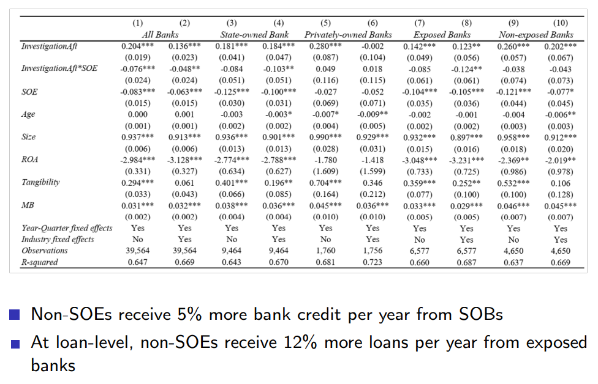

# Anti-Corruption and Financial Market – I

## Reference
- China’s Anti-Corruption Campaign and Credit Reallocation to from SOEs to Non-SOEs, Bo Li, Zhengwei Wang, and Hao Zhou, Tsinghua University PBC School of Finance, 2022.

- The Impacts of Political Uncertainty on Asset Prices: Evidence from the Bo Scandal in China, Laura Xiaolei Liu, Haibing Shu, and K.C. John Wei, ***Journal of Financial Economics***, 2017.

- Busting the ‘Princelings’: The Campaign against Corruption in China’s Primary Land Market, Ting Chen and James Kai-sing Kung, ***Quarterly Journal of Economics***, 2019.

## China’s Anticorruption Campaign and Credit Reallocation From SOEs to Non-SOEs
Bo Li, Zhengwei Wang, and Hao Zhou, working paper.
1. *all PBC School of Finance, Tsinghua University*
   
文章主要运用DID方法研究反腐工作对信贷配置的调整作用，实际上，调整银行的信贷资源能够促进经济增长

> ***2012会是历史性的一年***

### 【资本】国进民退 or 无序扩张？

07-09金融危机，私人投资意愿减弱，因此4万亿刺激后通过国有企业实施，而后信贷资源由民营配置居多到国有企业比例不断上升。

左图反应**长期**以来市场SOE与non-SOE信贷资源的巨大剪刀差。右图是中纪委宣布查处重要官员后，与之相关联的行业中，民营企业随后得到的贷款增加，然而，五个季度后就不显著了【**短期**】。

### Hypothesis

腐败也许是润滑剂？但并不一定dominate

### Literature
- Economic cost of corruption or "grabbing the hand"(腐败到底是好是坏)
  - Shleifer and Vishny (1993); Shleifer and Vishny (1994); Mauro (1995); Fisman (2001); Fisman and Svensson (2007)
- Effectiveness of audit programs in curbing corruption(announcement effect)
  - Besley and Pratt (2006); Ferraz and Finan (2008); Avis, Ferraz, and Finan (2018); Colonnelli and Prem (2020)
- 信贷错配（credit misallocation）
  - China: Brandt and Zhu (2001); Boyreau-Debray and Wei (2005); Song, Storesletten, and Zilibotti (2011); Cong, Gao, Ponticelli, and Yang (2019); Hsieh and Klenow (2009)
  - Political connection and bank lending: Khwaja and Mian (2005);Claessens, Feijen, and Laeven (2008); Leuz and Oberholzer-Gee(2006)
- China anti-corruption campaign
  - Liu, Shu, and Wei(2017); Chen and Kung (2019); Griffin, Liu, and Shu (2022); Lin, Morck, Yeung, and Zhao (2023); Ding, Fang, Lin, and Shi (2020)

Cong, Gao, Ponticelli, and Yang(2019) 指出，四万亿进一步加剧了信贷错配

> [!NOTE|label:Idea]
> 新冠疫情对于信贷影响?

### High profile investigation <!-- {docsify-ignore} -->

由于土地资源管理权下放，导致这一部分省里权力大，然而，12年后房地产限制变严格，中央官员的权力整体来看上远远大于地方。例如，省级领导排队见中央处级领导。

中央和地方的差距是实证检验的一部分佐证。

2012年之前，并不立即公开谁被抓起来了,一般是审着审着才会公开，12年之后改变为【**immediate information disclosures**】。

### High profile case: oil and gas <!-- {docsify-ignore} -->

直接关联的样本是dirty的，背后具有mechanically relationship，非直接的才有研究意义【B,C】。

在调查后效率高的民企贷款增加，但国企内无反应

相比国有银行，非国有银行更倾向于贷款给民营企业

### Conclusion

文章研究了demand-side【SOE and non-SOE】与supply-side【bank】，最终从 supply-side channels解释。

## The impacts of political uncertainty on asset prices: Evidence from the Bo scandal in China

Laura Xiaolei Liu1, Haibing Shu2, and K.C. John Wei3, ***Journal of Financial Economics***, 2017
1. *Guanghua School of Management, Peking University*
2. *Antai College of Economics and Management, Shanghai Jiao Tong University*
3. *The Hong Kong Polytechnic University (PolyU)*

文章研究了中国股市中的政治风险，利用薄熙来事件作为外生的事件冲击（shock），论证了政治上的不确定性会作为一种风险来源造成股票价格变化，暴露在这种风险下越多，受此事件影响也越多。

[Week 1 Review Report](Week1_RR.md)

### [Background](http://en.wikipedia.org/wiki/Bo_Xilai)

### Proxy
构建指标衡量暴露在政治风险中的程度：

（1） The first one is related to ***monetary policies*** and is the average of the absolute returns of a firm around the time when the People’s Bank of China (China’s central bank) announced its plans to adjust the reserve requirement ratio (RRR)

中国人民银行（以下简称央行）本身并不属于完全独立的金融机构，其货币政策通常会配合政府方针。因此，在央行货币政策颁布后收益率变化更大的股票与政治相关性也就越高。

（2） The second measure is associated with ***fiscal policies*** and is the proportion of state-owned enterprise (SOE) expenditures in total expenditures on fixed asset investment in each province

如果一个省份固定资产投资中政府占比更多，那么也代表着该省份经济等方面与政治更加挂钩，因此，该省份内的企业与政治相关性会越高。

（3） The third measure is related to ***political connection*** and is the number of board of directors in a firm who have political connections.

如果一个公司董事会中，有过或正在政府任职的越多，说明该企业与政治相关性更高。

### Hypothesis

依据三个proxy，文章提出三个假设，进而开展随后的实证部分来test这些假设。

（1）**风险溢价解释（risk based explanation）**。薄熙来事件对股票收益会有负向影响，而那些根据以上指标度量来看暴露在政治风险中越多的公司，受到的影响应该更大。

（2）在风险溢价之外，通过**折现现金流模型（discounted cash flow model）** 来解释也完全说得通：折现率提高或未来现金流下跌都会引起股票价格下跌。文章中用**分析师盈利预测**作为衡量现金流的指标。
如果在事件前后盈利预测没有发生较大变化，那么就说明这个假设不成立。

（3）除却政治不确定性之外，**政治关联（political connection）的减少**也会导致公司价值的下跌。
在这种情况下，公司价格是一种确定性的方式下跌，在一段时间内股票价格不会发生剧烈波动（可以理解为单向下跌），而如果是由政治风险引致的不确定性，在一段时间内来看则会导致波动性的提升（上蹿下跳）。文章以**波动性**作为衡量指标。

### Results

在事件前后的三个工作日的窗口期内，构造累计异常收益指标（CAR），控制变量后发现回归结果显著，通过假设1

显著性并不强，并且低政治相关公司比高政治相关公司下跌更多，不符合假设2。

波动性取值都在上升，并且部分显著，不符合假设3。

假设结果并不是完美符合，作者最后也表明：***并非在试图证明另外两种假设都是无用的，而是在说并不只有这两种假设起作用，政治风险也是不可忽视的一部分***。

> [!NOTE|label:问题]
> 严格来说这篇文章只采用了一个事件，统计方法上有一定的问题。

## Busting the ‘Princelings’: The Campaign against Corruption in China’s Primary Land Market 
Ting Chen1 and James Kai-sing Kung2, Quarterly Journal of Economics, 2019

1. *Hong Kong Baptist University*
2. *the University of Hong Kong*

文章指出太子党相比于正常的地产商，在土地交易中以更低的价格拿了更多的土地，而这一现象实际上作为一种bribe存在，因为那些提供廉价土地的负责人在随后更容易得到晋升

### Findings：
- Politburo princelings享受折扣力度 55.4%
- Standing politburo 享受比 normal member还要多 17.6–20.7%
- 提供折扣的省委书记 23.4% 更容易得到晋升
  - 但对省长不起作用，作者给出的解释是省长负责经济发展，晋升与否与GDP直接挂钩
- 反腐运动使这一折扣降低 11.7–15.1%

### Anti-corruption
习近平的反腐运动部分遏制了这一现象，该运动与前几次的反腐运动有较大差异：
1. 加强纪委权力
2. 强度更高，持续时间更长，抓捕人数更多
3. 房地产被单独列为重点审查行业
4. 地方官员一把手必须来自于其他地方，制度上减少贪污可能
5. 决心更大，忽略了最高权力人员隐含的“外交豁免权”（diplomatic immunity）：抓捕政治局常委周永康

  

中国政治经济的两大制度特征（institutional feature）：
- 晋升对于官员来说极其重要，而且往往由上级领导直接决定
- 自90年代末期以来，土地以及自然资源控制权下放至地方，因此地方政府获得了自由裁量权

当权力下放地方后，结合体制内的晋升制度，大大强化了腐败发生的可能性