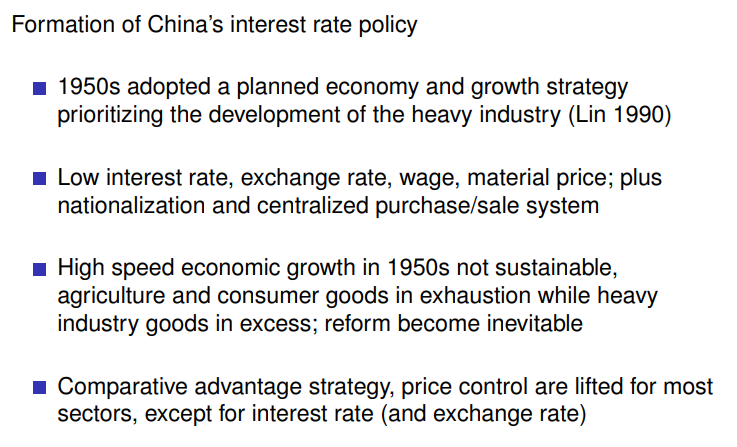
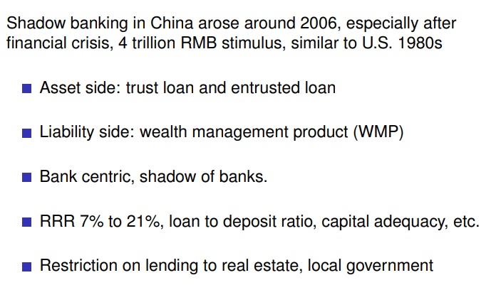
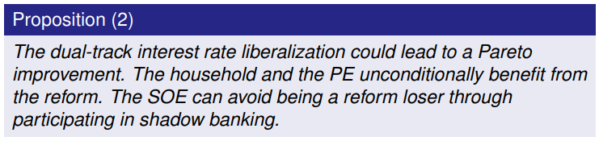
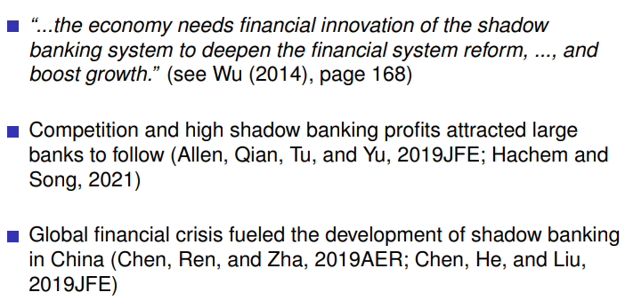
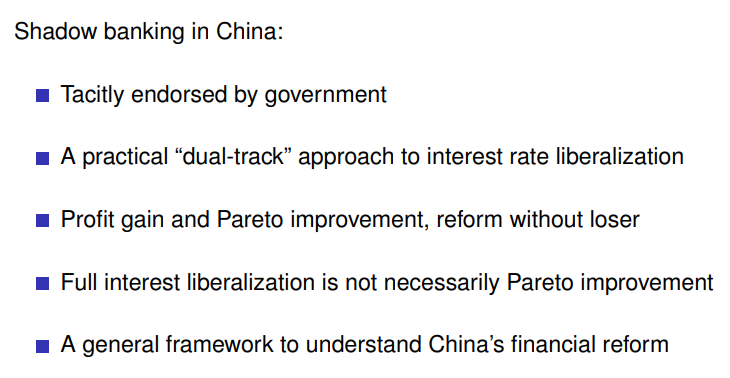
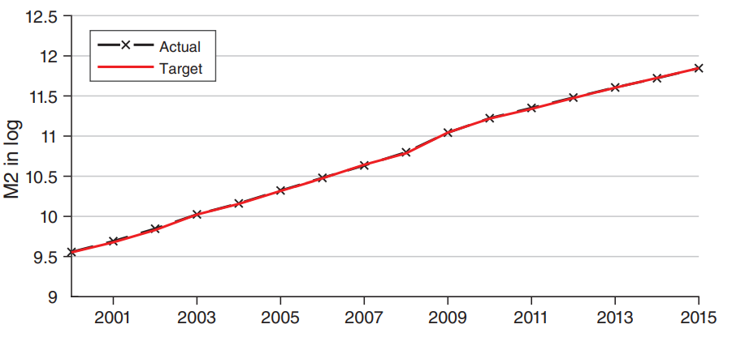
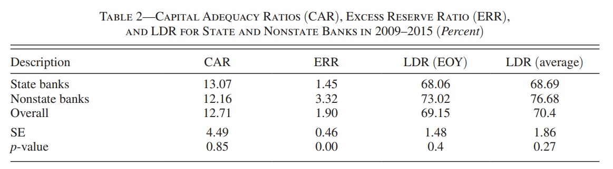

# Shadow Banking Macro
本节是影子银行的第一节课，着眼于宏观【投行经济学家角度，宏观分析】，后续会有微观角度【实务操作】。
## Reference
- Shadow Banking: China’s Dual-Track Interest Rate Liberalization, with Hao Wang, Honglin Wang, Lisheng Wang, and Hao Zhou, Tsinghua University PBC School of Finance, 2019.
- China’s Gradualistic Economic Approach and Financial Markets, Markus Brunnereier, Michael Sockin, and Wei Xiong, ***American Economic Review***, 2017.
- The Nexus of Monetary Policy and Shadow Banking in China, Kaiji Chen, Jue Ren, and Tao Zha, ***American Economic Review***, 2018.
- Fiscal Stimulus, Deposit Competition, and the Rise of Shadow Banking: Evidence from China, Viral V. Acharya, Jun Qian, Yang Su, and Zhishu Yang, NYU Stern Working Paper, 2022.

## Shadow Banking: China’s Dual-Track Interest Rate Liberalization

中国的影子银行与发达国家的影子银行有根本性的差别。

中国利率改革领域的双轨制，影子银行是利率从纯计划到市场转化过程中的有意无意的制度设计。在这个过程中，由完全管制到完全市场，中间会经历双轨制阶段。而**shadow banking就是这个阶段的试验产物**。体现在影子银行有专门监管机构监管审查，有试点，有计划有步骤有预谋，当然也有政府审批。中国所有业务没有监管机构的设计和批准是不允许的。

钱颖一关于双轨制的定义：*保证低效部门活着，同时更多供血高效部门*。

> [!NOTE|label:利率改革终极目标]
> 改革终极目标：管制利率转化为市场利率。

影子银行最早以理财形式出现，6%高息吸储，再以更高的利率贷给房地产等高利润行业，其中影子银行50-60的行业是产业链上下游企业。影子银行广义来说应该包括民间借贷。而在中国仅狭义指理财信托委托贷款以及城投债，民间借贷规模极其的小，就算1000亿，而影子银行实际上35万亿，相比之下非常非常小。银行业150万亿，相比之下保险和股市的规模小很多。因此， ***中国改革的所有关键都在银行（体量）。***  
- 大型国企基本按照4%的最低基准利率（LPR）拿到贷款，民企8%，平均一般6%。这是一种信贷资源的misallocation。
- 国家保障的大国有银行的贷款利率差
  
因此谁会反对利率市场化改革？大国企，因为它们能够拿到非常稳定的低利率贷款。怎么在改革的过程中压下去反对的声音，双轨制。这也是大多数改革的途径【**reform without losers**】。

**Advantage of dual-track**：相比于overnight改革，稳步改革最后并轨更加稳定。利率并轨会导致影子银行业务的萎缩。市场下行时适合并轨。

13-15之后计划存款利率和贷款利率都开始放松了，存款利率的高线和贷款低线都取消了。目前长期利率和计划长期利率正在逐渐接轨。这就说明市场利率改革正在逐渐完成。如果完成，那么SOE和NON-SOE的信贷剪刀差就会缩小。

### Background of low interest  <!-- {docsify-ignore} -->
低利率政策来源于50年代，当时的赶英超美政策需要通过**扭曲价格**来实现：压低农产品价格【工人生活成本】，抬高人民币压低美元【方便进口】，降低利率【工业企业需要钱】，统购统销等，这些都是赶超型政策的主要工具。

然而，DYJ与WG几乎抹杀了所有的增长。政策失败了，被逼无奈必须走改革之路。

比较优势战略和赶超型战略而言，更可能成功。但是需要放松许多利率管制。价格改革是表象，所有制改革是本质。
纯粹的价格改革（吴敬琏）是不会成功的。要先改微观机制，是个人和企业适应市场化后，再慢慢放开。
【所以改革开放一百人中，有林毅夫和厉以宁，但没有吴敬琏。】

中国原本只有PBC。80年代出现四大行，因为除了国企，还有许多集体企业等多种所有制，银行体制的丰富对应企业所有制的丰富。

### Shadow banking in China  <!-- {docsify-ignore} -->
影子银行为了绕过国家对暴利行业的限制。但大国企往往有自己的金融子公司，银行会把钱给该子公司，子公司负责处理资产。

中国的影子银行99%是银行干的，所以叫shadow of banks，是银行的影子。影子银行能够回避准备金、存贷比、利率等限制。存款准备金率和存贷比在理论研究中实际是一回事，一层叠加一层。

双轨制能够带来帕累托最优。

吴晓宁行长：易纲也有类似表述，影子银行。

**Conclusion**

## China’s Gradualistic Economic Approach and Financial Markets

Markus Brunnereier1, Michael Sockin2, and Wei Xiong3, American Economic Review Papers & Proceedings, 2017.

1. *Princeton University*
2. *McCombs School of Business, University of Texas at Austin*
3. *Princeton University*

过去几十年中国“**摸着石头过河**”（cross the river by touching the stones）的渐进式改革取得了很多的成果。

渐进式改革的机制如下：首先做出微小的政策调整，随后根据实施效果反馈不断调整。政策实施后，往往会有持续几个月甚至几个季度的观察和反馈阶段，因此给与了政策制定者充分时间学习和调整。因为政策制定者也会有错误的时候，例如16年的股市熔断政策，几天之内就被认为是错误的决定，证监会主席肖钢引咎辞职。

这时，有一个能够渐进式的改革环境就显得极为重要。但是这种环境是有一定条件的。特别是反应在股市上。因为股市不仅给了民众参与投资的机会，也给了股民们预测和推断上级政策的手段。

因为政策制定者需要通过观察政策实施后的社会反映来进行调整，如果股民们由于推测而提前采取了行动（front-run the policymaker），那么渐进式改革的政策环境就失效了。

根据这种tension，文章提出了新的模型。

wei xiong认为金融市场的政府干预会导致市场失衡

## The Nexus of Monetary Policy and Shadow Banking in China

Kaiji Chen1, Jue Ren2, and Tao Zha3, ***American Economic Review***, 2018

1. *Economics Department, Emory University and Federal Reserve Bank of Atlanta*
2.  *Department of Finance, Neeley School of Business, Texas Christian University*
3.  *Emory University, NBER, and Federal Reserve Bank of Atlanta*

***Main Results***

为了给在 4 万亿刺激后过热的信贷市场降温，政府在 2009-2015实施了紧缩的货币政策。然而，尽管对银行系统的信贷确实起到了一定的作用，但**预料之外的影子银行大规模增长很大程度上对冲了货币政策的预期效果**。

### Institutional details  <!-- {docsify-ignore} -->

#### Facts about Shadow Banking during the Period of Monetary Policy Tightening  <!-- {docsify-ignore} -->
自2009年以来，M2增速和银行贷款得到有效控制，然而影子银行贷款规模急剧上升。
影子银行中占比最大的是**委托贷款**（entrusted loans），占比接近50%。
委托贷款指的是由金融机构作为受托人（trustee）促成两家非金融机构的借款。
而委托贷款发生最多（60%）的行业就是房地产、高能耗以及其他被政府限制贷款的风险行业。
而在房地产行业所获得的影子贷款中，绝大多数（73.5%）都是由**非国有**的金融机构促成的。
相比于正常的商业贷款，这些委托贷款不仅期限短，而且利率高。

#### Quantity-Based Monetary Policy  <!-- {docsify-ignore} -->

货币政策有中介指标和最终目标的说法，美国最终目标有两个：通胀和就业率，中介指标为联邦基金利率。

不同于美国是发达国家，将通胀作为货币政策的首要目标，中国发展中国家的身份使得其不得不在控制稳定通胀水平（CPI）的基础上，**首先考虑保持GDP增速**。中国中介指标自1999年以来由银行信贷转向**M2增速**。

用于控制中介指标的两个主要的货币政策工具是：**公开市场操作**（open market operation）和**存款准备金**（reserve requirement）。前者过去二十年一直是PBC的主要操作手段。

中国央行，也即中国人民银行（People Bank of China），并不作为一个独立的机构而存在，其货币政策也受到该GDP增速目标以及中央政府的政策意图的显著影响。在实际操作中，PBC会以季度为频率调整M2增速以达到国务院所设定的目标。从下图可以看出中国对于中介指标的信号控制还是比较好的。

通过银行来影响M2增速有两条限制：
- **LDR regulation，存贷比** 【control the quantity】
- **safe-loan regulation，限制贷款行业** 【control the quality】

#### Regulation difference  <!-- {docsify-ignore} -->

国有银行由中央政府控制，余下的商业银行都属于非国有银行。

国有银行隶属于政府，因此受到政策的影响更大，参与影子银行业务时受限更多。而非国有银行则不同，非国有银行占了整个银行系统规模的一半，并且密切地参与并推动了影子银行业务的发展，并且将影子银行打包成一个特殊的投资种类，称之为 ARI (account-receivable investment)。这种 ARI **不受存贷比和贷款行业限制**。

#### State versus Nonstate Commercial Banks  <!-- {docsify-ignore} -->

**（1） Three requirements**

非国有会有更多cushion (ERR)。但其他方面没有显著差别，意味着通过这些比率并不能解区分二者。

**（2） Institutional Asymmetry**

政府并不能直接干预非国有银行的运行，因此其收到的监管会少一些（lax regulation）。相比于非国有银行，国有银行做影子银行业务的motivation会少一些。

并且在2013年，政府依然认为影子银行是金融结构多元化的表现。

### Two micro datasets at the level of individual banks  <!-- {docsify-ignore} -->

作者后续通过建模得到了外生的M2增长序列，并且自建了两个数据库，通过这些数据库估计出影子银行中国有银行和非国有银行行为的不一致性。

从微观角度，作者自建了两个数据库，用以评估两类银行在影子银行业务中的不同表现。

#### （1）委托贷款数据库  <!-- {docsify-ignore} -->

通过2009-2015期间非金融公司的委托贷款数据，发现当货币政策紧缩时，由非国有银行主导的委托贷款数量显著增长，而国有银行则不显著。

#### （2）银行资产数据集  <!-- {docsify-ignore} -->

该数据集包括了两个银行资产的重要组成部分：银行贷款和除去中央银行票据和政府债的ARI，也称之为ARIX。
ARIX的主要组成部分是以银行提供的委托贷款的受益权的形式出现的，因此ARIX能够用来衡量银行参与影子银行活动的程度。

同样地，尽管M2 增速下降，但是非国有银行持有ARIX的数量显著上升，而国有银行则并不明显。

### The impact of rising shadow banking   <!-- {docsify-ignore} -->

文章通过组合最优化的理论模型论证了紧缩性货币政策和影子银行的影响。

对于银行来说，资产组合中包括两部分：银行贷款和非贷款资产。前者安全但受到诸多限制，后者风险高但收益也高，并且不受监管。每一个银行都会在二者之间做权衡。

当紧缩性货币政策实施时，银行会面临流动性收紧的风险，也就是取款的人变多了。那么银行进一步就会面临存款亏空的问题 (deposit shortfalls)，并且弥补存款亏空的成本也提高了，从而不得不在组合中配置更多的非贷款资产。最终综合来看，总信贷量反而提升了。

