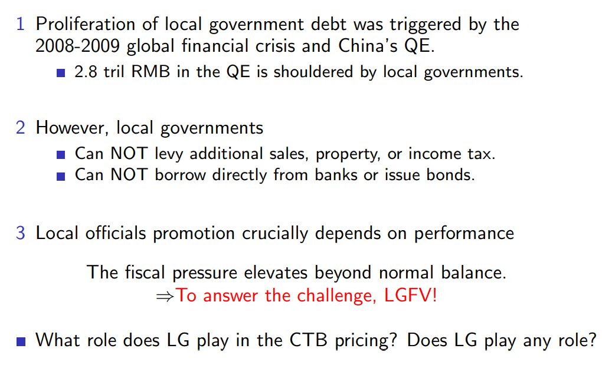

# Local Government Debt

## Reference 
1. Local Crowding Out in China, Yi Huang, Ugo Panizza, and Marco Pagano, Graduate Institute Geneva, ***Journal of Finance***, 2020. 
   
2. The Financing of Local Government in China: Stimulus Loan Wanes and Shadow Banking Waxes, Zhuo Chen, Zhiguo He, and Chun Liu, ***Journal of Financial Economics***, 2020
   
3. Local Government Implicit Debt and the Pricing of LGFV Bonds, Laura Xiaolei Liu1, Yuanzhen Lyu2, and Fan Yu3, ***Journal of Financial Research (in Chinese)***, 2021

## The Great Wall of Debt: Real Estate, Political Risk, and Chinese Local Government Financing Cost

### 从城投债到地方财政

房地产占城投债大头。

14年的债务置换，允许的置换也只局限于公益债，由省级担保，然而省委书记也是中央派出的，所以本质还是中央担保。

利润性的地方债务例如房地产债并不允许被置换。

发的都是**短期债**

且经济条件好的地方才能发的出去

> [!TIP|label:为什么中国没有市政债]
> 市政债券发行流程：地方申报，中央同意，财政代发。这本质上和国债就没有区别了，也有中央担保。
> 
> 市政债只有地方和中央是独立之时，才能有效发行。**地方享有发行权力，也要独立承担还款职责**，但在单一体制下，地方不还的话上级也要出面。

城投债与腐败联系起来，可以建立有中国特色的研究，比如薄熙来被抓了，那么可能他主导发行的项目就没机会了，如后续的大连房地产市场。

研究房地产，势必要和地方政府行为联系起来。这里列出的文献试图通过种种理论解释泡沫，而没有联系到本质。

- **China’s economy and policy:**
  - Brandt and Zhu (1995, 2000), Jiang (2015), Chen, He, and Liu (2017), Hsieh and Song (2015), Cong, Gao, Ponticelli, and Yang (2017), and Chen, Ren, and Zha (2018)
  - Real estate as important driver: Fang, Gu, Xiong, and Zhou (2015), Wu, Gyourko, and Deng (2015), and Chen and Wen (2017)
- **Political risk, especially anti-corruption campaign:**
  - Butler, Fauver, and Mortal (2009); Fisman and Wang, 2015; Griffin, Liu, and Shu, 2016; Lin, Morck, Yeung, and Zhao, 2016
- **Economic analysis on Chengtou bonds:**
  - The function of LGFVs and role in credit expansion: Lu and Sun (2013)
  - Firm characteristics of LGFVs’ issuers and pricing: Liu, Lyu, and Yu (2017a)

### 城投债怎么来的？

金融危机之前城投债是很少的

4万亿中中央政府的财政和信贷只提供1.1万亿，剩下的靠地方自己解决，只是国家放松了管制，允许搞项目和扩大投资，因此地方不得不通过其他手段融资。

云南省仅仅是一个假违约（psuedo），但却造成了恐慌，在出现恐慌之时，政府必须介入。云南省违约事件的背后是中央政府。

中央的隐形担保代表着，如果是个别公司，就不管，如果形成恐慌，中央就管，正是这种隐形，造成了城投债不同的收益率情况（定价）

Main Finding
真正能解释城投债的变量是房地产GDP

房地产的重要性，在省份内至少36%

### 结论

腐败、房地产和城投债紧密地结合在了一起。

- 房地产规模越大、增速越快，发债成本越低
- 政治不确定性越高、贪腐越盛行，发债成本越高
- 而当政治不确定性很高，此时房地产规模增加反而会增加发债成本，只有当贪污水平较低时，房地产增速才能起到作用（广东）
一个地区高层腐败对于城投债定价也有影响

对于流动性定价来说，一般来说流动性风险越大，收益率应该偏低。但在中国，收益率反而偏高，这是因为流动性风险越大，越有可能被接管，隐形担保的存在反而使其成为一种溢价。

## The Financing of Local Government in China: Stimulus Loan Wanes and Shadow Banking Waxes
Zhuo Chen1, Zhiguo He2, and Chun Liu3, ***Journal of Financial Economics***, 2020

1. *PBC School of Finance, Tsinghua University*
2. *Booth School of Business, University of Chicago*
3. *School of Economics and Management, Tsinghua University*

文章与上一章并不同，并没有着眼于影子银行业务整体的发展，而是聚焦于**政府债务的构成**。

**Two contributions**:
- Hangover effects
  - 将政府13年后的影子银行活动大幅增长与刺激政策联系起来
- 与美国铁路大建设时期对比
  - 都是由于某些实业部门急剧扩张的资金需求和政府对于信贷的严格监管共同导致

### Institutional Background

事情的起源还要追溯到1994分税制改革，这次改革使得地方政府失去了对本地税收的控制权，并且不能够（**illegal**）产生财政赤字。因此，地方政府只能通过地方政府融资平台（Local Government Financing Vehicles, LGFV）来进行资金运作，从而规避这一点。

在2009年之前，LGFV的业务作为政府的表外资产，在融资上受到很严重的限制。

然而，在经济危机之后，为了推行四万亿的刺激政策（意味着大幅增加负债），中央放松了这一限制，并且银监会也出面表态鼓励当地政府通过LGFV接受银行贷款。

> Local governments are allowed to finance the investment projects by all sources of funds, including budgetary revenue, land revenue, and funds borrowed by local financing vehicles.
>
> ***No. 631 Document, Ministry of Finance, October 12, 2009***

> Encourage local governments to attract and to incentivize banking and financial institutions to increase their lending to the investment projects set up by the central government. This can be done by a variety of ways including increasing local fiscal subsidies to interest payments, improving rewarding mechanisms for loans, and establishing government investment and financing platforms compliant with regulations.” 
>
> ***No. 92 Document,CBRC, March 18, 2009***

***本身当地政府就受到GDP锦标赛的影响，结合中央明确的鼓励态度和融资渠道的放松，前所未有的通过LGFV大量负债来推动经济的刺激政策就此开始实施了。***

在四万亿刺激政策出台后，新增银行贷款占GDP比重大幅上升，并且大多数新增贷款流向了非住房贷款。

### Bank loan wanes and shadow banking waxe

在09年的贷款高峰后，中央很快意识到了由政策导致的信贷猛增已经有些不受控制了，随机收紧了信贷政策，上图中的新增贷款量也回归了正常水平。

然而，突如其来的信贷紧缩使得地方政府不得不寻找其余的资金来源。这里存在一个久期错配的问题（maturity mismatch）。数据显示，09年开展的项目背后的贷款资金平均4.1年到期，也就是说，在13年后政府不得不需要大量的银行之外的资金来偿还贷款。下图中可以看到，MCB和munibond在快速增长。

> [!TIP|label:久期错配]
> 用短期贷款【利率低】去支持长期项目【利率高】。

先不考虑下图中两个纵轴的规模差异。可以看到在10年后用于投资的政府债仍然在不断发行，然而，在13年后，用于偿还贷款的MCB规模急剧增长。

14年底，国务院发布了43号文件，使得LGFV在为新的投资项目筹集资金时受到严重限制，而在为偿还负债而借钱则不受限制。并且鼓励当地政府通过市政债券（munibond）来替换到期债务。

### US versus China: history and today
 

## Local Government Implicit Debt and the Pricing of LGFV Bonds
Laura Xiaolei Liu1, Yuanzhen Lyu2, and Fan Yu3, ***Journal of Financial Research (in Chinese)***, 2021

1. *Peking University*
2. *UCLA*
3. *Claremont McKenna College*

文章讨论了地方债背后的**隐形担保主体**。

从时间维度分为三个阶段，结果还显示，市场及投资者认定的市属城投债的隐性担保责任主体是 ***从中央政府，到市级政府，再到市级加省级政府*** 变化的。

**（1）2008年5月至2011年4月**

在城投债市场发展的初步阶段，投资者普遍将**中央政府**解读为隐性担保主体

**（2）2011年4月至2015年4月**

2011年4月，云南省公路开发投资有限公司( 以下简称“滇公路”) 向债权银行发函表示本金无法兑付。在该事件所引发的信用危机后，市场开始关注与城投公司关系最为密切的**市级政府**的隐性债务负担情况。

**（3）2015年4月后**

2014年10月，《国务院关于加强地方政府性债务管理的意见》( 以下简称“43号文”)对外公布，明确了建立“借、用、还”相统一的地方政府债务管理机制，要求剥离融资平台的融资职能，建立规范的地方政府融资机制。43 号文是对城投公司和地方政府关系的进一步厘清，会对投资者关于地方政府隐性债务负担在债券定价中的看法产生重要影响。

据中债资信统计，2013年末城投债存量债券规模为2.23万亿元，而审计署在2013年6月公布的审计结果中认定的地方政府负有及或有偿还责任的除地方政府债券外的存续债券规模为1.18万亿元，故而有**至少47.03%的存量债券将被认定为企业债券而不纳入财政预算**。

43号文也**第一次将鼓励以地方政府为主体发行政府债券进行债务置换写入政府官方文件**，而该举措会把融资平台的部分债务转移至省级地方政府资产负债表内。

由于43号文发布时间2014年10月并不临近本文年度频率数据的结束月份，本文使用2015年4月为样本分割点进行研究。

