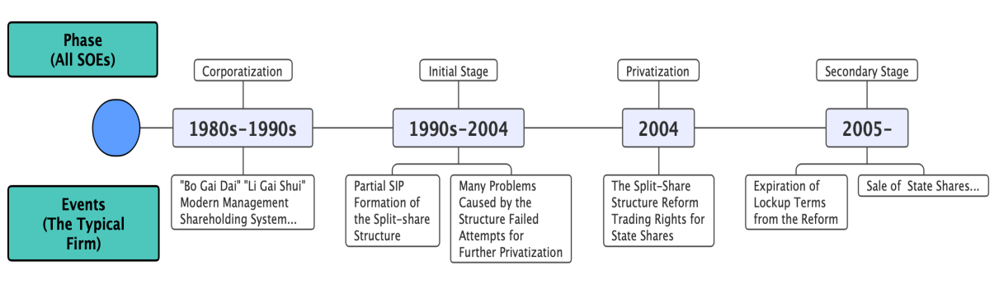
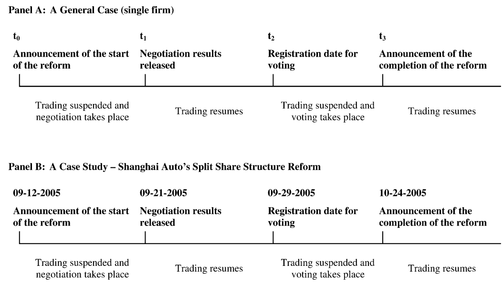

# Split Share Reform

在大多数人不认可的时候，厉以宁力主推行国有制改革。同样，在大多数人不认可的时候，林毅夫主张中国政府对产业政策有积极作用。

***如果这个环境不方便说话，你可以不讲话，但不能说假话。***

## Reference
1. 【TOP】China’s Secondary Privatization: Perspectives from the Split-Share Structure Reform, Li Liao, Bibo Liu, and Hao Wang, ***Journal of Financial Economics***, 2014.
   
2. Privatization and Risk Sharing: Evidence from the Split Share Structure Reform in China, Kai Li, Tan Wang, Yan-Leung Cheung, and Ping Jiang, ***Review of Financial Studies***, 2011.
   
3. Profiting from Government Stakes in a Command Economy: Evidence from Chinese Asset Sales, Charles W. Calomiris, Raymond Fisman, and Yongxiang Wang, ***Journal of Financial Economics***, 2010.
   
4. China Share Issue Privatization: The Extent of Its Success, Qian Sun and Wilson Tong, ***Journal of Financial Economics***, 2003.

## 【TOP】China’s Secondary Privatization: Perspectives from the Split-Share Structure Reform 

> [!NOTE|label:TOP]
> TOP paper代表是这一研究课题的经典之作，带有独到的观点和深刻的见解。

Li Liao1, Bibo Liu2, and Hao Wang3, ***Journal of Financial Economics***, 2014.
1. *Tsinghua University, PBC School of Finance*
2. *Tsinghua University and CITIC Securities*
3. *Tsinghua University, School of Economics and Management*

第一次改革：上证深证成立，企业上市发行一部分流通股。为了给予老百姓保障，要求大股东不卖股票。

第二次：股权分置改革。

国有企业改革背后的目的：提高效率【民营化】以及优化公司治理问题【两类股票同时存在会引起治理问题】

90年代看到家庭联产承包责任制的成功，想在公司也试一试。因此推出：拨改贷【提高企业压力】，利改税【激励企业】。

但是与农村情况不同，农村单户，产权清晰，公司中一大群人，产权并不清晰，利益不一致。所以效果有限，可以说是不成功的。

***Main Results***
- 通过股权分置改革，在不损失运营效率的情况下，国有企业的产出和就业率大幅提高，根本原因在于公司管理层与投资者的利益变为一致
- 由于对私有化的预期，国有企业有动力去提高其业绩表现
  - 正是这一点使得中国与其他转型经济体的结果不同。其他国家实证表明私有化后，新的管理层有助于提高公司业绩表现。而中国是私有化前的管理层（incumbent management）起到这种作用。
- 在股权改革中，市场机制要优于自上而下粗暴的私有化行政命令，特别是当中国进入到了深入改革的阶段

### Review of the Split-Share Structure Reform
股权分置指的是在一家上市企业内，存在两种不同的股份结构，两类股票权力完全相同，区别在于能否在二级市场交易。可交易的股份面向公众发行，可以在二级市场自由交易，而另一种不能交易的股票仅能在指定的参与者之间做交割，并且这种交割还需要相关机构的批准。

这种股份双轨制起源于1978年的股份所有制结构改革。在当时，中国只有两种企业所有制结构：国有企业（SOEs），贡献了78%的工业产出；集体企业，相比之下属于小企业，且由农村市镇（rural municipality）或城市社区（urban community）运营。

在1980年初，为例提高国有企业的生产效率以及财务状况（financially palgued），中国政府实行了一系列改革措施。然而收效甚微，因为这些措施不足以解决从计划经济时代继承下来的复杂的所有制结构。

随后，在1980年代中期，中国开始将一些中小国有企业法人化，并将这些企业的私有化作为1988年开始的经济改革第二阶段的核心任务，上海和深圳交易所的成立标志着中国股份私有化（share issue privatization， SIP）的开端。

这种部分的私有化并不能改变政府在公司运行中的绝对话语权因为其只将SOE的一小部分股份向大众投资者发行。经过这种SIP，中国的部分股权分置结构就此形成了。

中国政府不允许让渡国有企业股票的交易权有以下几个原因：
- 在中国集中所有权的框架下，国有企业股份的转让不必通过交易，而可以通过行政命令来完成
- 在1990年代，经济改革还仅局限于上市国有企业的行政设计和管理，并且，这些企业上式也主要是为了筹集资本以及试行新的管理体制。
- 中国的股票市场还处于试验阶段，并不成熟，不具备交易国有股份的条件

### Problems caused by the split-share structure

股权分置结构对股票市场的运行和发展造成了很多的困难。

其中最根本的原因就是两类股东利益的不同。在股权分置结构下，两类股票的定价机制是不同的。对于非流通股持有者来说，其定价主要依据公司的资产的账面价值，而这些持有者通常是控股方，占据了超过三分之二的股票，他们并没有充分的动机去提高公司股票价值。

这带来了下列三个问题：

**（1）关联交易，利益输送**

在缺乏内外监管缺位的情况下，控股股东会通过二次发售（seasoned cash offering）大肆融资，因为非流通股持有者并不能享受资本利得以及绝对的控制权，他们并不在乎控股权的稀释和市场的负面反应。在筹得资本后，他们就会通过关联交易来获利，例如用这些钱购买他们本人名下公司的产品或资产，或者向他们的私人公司发行贷款或做担保。

**（2）过度交易**

既然公司所有者并不在乎公司股价的涨跌，那么最终股市就会沦为投机之地。

在2007年，上海和深圳交易所的平均换手率是927%和987%，作为对比，2005年美国、英国和日本的换手率分别是129%，142%和119%。中国股市的波动率也是世界最高，深圳和上海月均波动率为10.7和8.9%，是纽约交易所的19倍和16倍。

**（3）融资能力低下**

在股权分置机构下，控股股东并没有通过债券来融资的动机，并且因为畸形的所有制结构，公司债定价也受到了很大的影响。2007年，中国债券市场资本与GDP的比值是35.3%，远远低于美国的的188.5%和日本的201.0%。公司债占仅仅是中国债券市场的4.2%。

### Failed early privatization attempts

面对着股份双轨制的尴尬处境，政府部门做出了一些尝试来改变现有局面，然而都失败了。

1999年9月，十五届四中全会作出决议，决定私有化一定数量的国有股份，以此来为社保基金筹集资金，缓解国有企业的福利压力（welfare burden）。

1999年12月，证监会挑选了十家上市公司来试行这一政策，同时，现有股东享有优先认购权（preferential subscription rights）。股票发售价格被粗暴地设置为公司的EPS乘上固定的PE——10。

随后，在试行了两家公司后，这次发售很快便被暂停了。出售价格与市场期望价格相差过大，市场给出了猛烈的负反馈，在这25天的发售期内，上证指数跟深圳指数分别下跌了7.3%和6.8%。

2001年6月12日，国务院颁布了《国务院国有股减持和社会保障基金募集管理暂行办法》，要求在IPO阶段私有化10%的国有企业股份，国有股的价格就是发行价格。紧接着，这次发售在四个月后也被暂停了，并且激起了市场极为剧烈的反应，四个月内，上证和深证分别下跌了31%和32.9%。

在2002-2004，股票市场始终处于熊市阶段，交易量萎缩了30%。上证指数从2001年6月12日破纪录的2245跌到了2005年6月6日的998。

***为什么市场反应如此负面呢？***

根本原因是市场投资者没有得到补偿。

2000初，以命令的方式的要求卖股票，股票暴跌。究其原因，是上市之初，承诺了不卖，如今要卖，是一种违约，要给予对方补偿。后续通过谈判进行。

### The Split-Share Structure Reform

中国政府逐渐意识到了，如果不彻底废除股权的双轨制，是无法完成私有化的改革的。

2004年1月31日，国务院颁布《国务院关于促进资本市场改革开放和稳定增长的若干意见》，这一意见作为股权分置改革蓝本。随后，中国证券监督管理委员会关于试点上市公司股权分置改革的通知于2005年4月30日出台，标志着股权分置改革正式出台。

不同于之前直接将国有股份出售给大众投资者，这一改革要求与流通股投资者充分协商，并且，为了鼓励改革，证监会将改革作为二次发售的必备条件。

改革通常包括以下几个流程：
1. 如果超过三分之二的非流通股股东要求改革，那么公司就必须找一个证券公司来帮助推行改革，起草改革日程。
2. 然后非流通股股东需要提出一个改革方案，方案需要细化对流通股股东的补偿，补偿可以是现金、股票、期权、权证。
3. 控股非流通股东可以就未来的股息支付和/或资产注入作出具有法律约束力的承诺，以增加对价方案（sweeten the consideration package）。
4. 然后将该提案分发给可交易股东，供其反馈和协商

这种改革采取了一种市场化的机制：流通股股东和非流通股股东对于改革条款进行协商。在协商过程中，坚持公平、互信、独立决策的原则，并且没有政府介入以及统一定价，因此，这种协商能够照顾到每个公司的实际情况。协商后，需要以投票的方式推行改革，如果超过三分之二的流通股股东同意改革，公司进一步就可以将方案提交证监会审核，审核通过后，改革才算是完成。

并且，为了稳定市场，当非流通股转为流通股后，有12个月的锁定期，期间不能交易。此外，在锁定期后，非流通股股东在12（24）个月内不能出售超过总股本5%（10%）的股票。超过1%的交易需要在两个交易日内公开宣布。

**在股权分置改革完成后，中国股票市场从定价和估值方面来说与国际市场已经没有本质区别了**。

## Privatization and Risk Sharing: Evidence from the Split Share Structure Reform in China
Kai Li1, Tan Wang2, Yan-Leung Cheung3, and Ping Jiang4, ***Review of Financial Studies***, 2011.
1. *Sauder School of Business*
2. *Sauder School of Business*
3. *Department of Finance and Decision Science*
4. *School of International Trade and Economics*

一般意义上而言，大多认为决定补偿力度的因素中，改革的价格影响是最重要的。由于大量先前无法流通的股票出现在市场上，这大量的额外股票供给将会给股价带来负面影响。

文章认为，除了价格因素影响（price impact），还可以从投资组合和风险分担（**risk sharing**）的角度分析股权分置改革。对于非流通股股东（Non-tradable shares holder, NTS）来说，由于超额持有了某一只股票，因此被暴露在特异性风险之下，而将他们的股票卖给流通股股东（tradable shares holder, TS），能够分散这种风险。

因此，由于股权分置改革中的协商机制，如果NTS从这种风险分担中收益越多，那么TS得到的补偿也会越多。

***Main Findings***

- 对TS的补偿与gains from risk sharing，the price impact，and the weak bargaining position of holders of non-tradable shares正相关，与firm performance负相关
- 这种risk sharing effects对于非流通股更加集中的公司【例如，一人持有了所有的非流通股】而言效应更强，相比于非流通股股东比较分散的情况

股权改革流程：

## Profiting from government stakes in a command economy: Evidence from Chinese asset sales

Charles W. Calomiris1, Raymond Fisman2, and Yongxiang Wang3, ***Journal of Financial Economics***, 2010.

1. *Columbia Business School*
2. *Columbia Business School*
3. *Columbia Business School, School of Finance and FSI, Renmin University of China, CRACM, Jiangxi University of Finance and Economics*

当国务院宣布要进一步私有化时，市场反应是负面的，而当国务院几天后取消了该政策时，市场反应是正面的。这种反应可能是由于price impact 或 risk sharing 引起的，这并非本文重点。

在中国这种政府部门深度介入经济发展的环境中，**政府关系带来的好处胜过国有化造成的效率损失**。至少从盈利性来说，减少国有化水平并不总是好事。

相应地，实证结果显示，从截面上来看，当私有化公告发布时，更高的国有制水平（government ownership）对股票收益率产生了负面影响，而当其取消时又有着正面的影响。

当然，大多数情况下，私有化能够提升公司盈利水平，然而这并不总是单纯由于制度改变引起的，因为当对公司实行私有化的同时，整个经济环境和市场环境也在逐渐改善，政府对经济的介入和控制减少，因此释放了经济活力。

另外，国有制度也并非决定公司与政府联系的唯一因素，公司高管个人的社交资源也会起到类似国有制度的作用。并且这种联系对公司盈利能力起到的影响作用大小取决于当地政府的自由裁量权水平，例如经济特区。

很有意思的点是，文章是通过B股市场入手，从种种因素中剥离出了单纯由于公司盈利能力造成的影响。因为B股中不存在非流通股，所以非流通股变为流通股这一转变带来的影响并不存在于B股市场中，并且，由于B股严格的购买限制，A股和B股实际上被分割开来，保证了B股不会受到A股稀释效应的影响。因此，B股的价格变化完全是由于对于公司盈利能力的期望引起的。

## China share issue privatization: the extent of its success
Qian Sun1 and Wilson Tong2, ***Journal of Financial Economics***, 2003.
1. *Nanyang Business School, Nanyang Technological University*
2. *School of Accounting and Finance, Faculty of Business, The Hong Kong Polytechnic University*

