# Monetary policy
## Reference 
1. Redistribution Channel of Monetary Policy: Evidence from Bank Lending, Yi Huang, Bing Lu, and Hao Zhou, ***Working Paper***.
   
2. The Collateral Channel of Monetary Policy: Evidence from China, Hanming Fang, Yongqing Wang, and Xian Wu, ***Working Paper***, 2021.
   
3. Monetary Policy Transmission with Heterogeneous Banks and Firms: The Case of China, Guofeng Sun, Ji Zhang, and Xiaodong Zhu, ***Working Paper***, 2021.

量化宽松下，赚到钱的都是有钱人？

## Redistribution Channel of Monetary Policy: Evidence from Bank Lending
Yi Huang1, Bing Lu2, and Hao Zhou3, Working Paper, 
1. *Fudan University, Fanhai International School of Finance, ABFER and CEPR.*
2. *Beijing Normal University, School of Statistics*
3. *Southern University of Science and Technology, SUSTech Business School and Tsinghua University, PBC School of Finance*

文章通过债券融资渠道，研究了货币政策传导机制的 redistribution effects。该effects尽管在理论上得到重视，但在实证上学术界还远没有达成一致。

***Main Findings***

1. 对于融资来说，扩张的货币政策会降低贷款利率以及贷款利差。但也会导致贷款数量提升的同时质量下降。
2. 对于redistribution effect，扩张的货币政策会降低公司内和公司间的不平等。这种影响在欠发达地区、劳动密集行业以及受融资约束的行业中更加明显。

文章利用 Xu and Jia (2019)年提出的货币政策指标来衡量PBC的政策倾向，这一指标可被视为等同于联邦基金利率。

**货币政策如何传导？** The Channel of Monetary Policy Transmission

- 银行贷款传导（bank lending channel），存款利率涨的很慢，存贷传导很慢，因为老百姓反应不充分，存款不会转来转去，因此结果一般不显著。
- 债权融资传导（bond financing channel），银行内资金部发行债券是对机构的，机构对利率的反应很及时，传导灵敏。

作者一家纯粹的大型政策银行数据，政策银行不允许收集存款，只能发行债券，因此可以剥离出债券影响。Darmouni et al. (2020)指出，拥有更多债券的公司更易受到意外货币紧缩的影响，因此，政策银行的融资成本更易受到货币政策冲击的影响，所以这家银行对于货币政策更敏感

对**收入不平等**（income inequality）研究很多，但对于货币政策研究很少，因为没有数据。常规的M2滞后性很大，总量也难以分清是消费推动还是生产推动，不是一个很清楚的政策变量，解释性不强。80年代以后没有人还看M2或社融总量来做研究，实际上，最敏锐的货币政策指标松紧是**政策利率**。而通过货币政策研究收入分配，会是很有价值的问题。

目前研究的特色就在于异质性，异质性能够划分研究群体，给出更多的political implication。

【货币政策方面影响】，紧缩时货币政策的传导效果更强烈，收入越低的地区受影响更大，以及产业链内的影响。

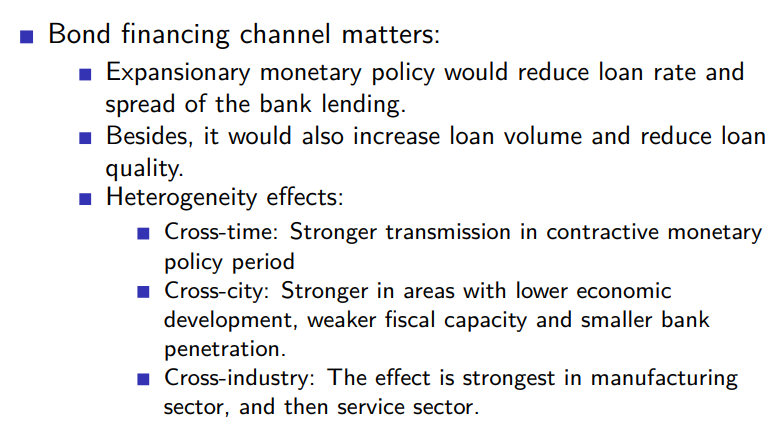

【收入分配问题】，中美的implication恰恰相反。中国QE会有助于穷人，美国有助于富人。在中国，越宽松则越平等。笼统来说，只要一放松，民企增长更快（包括中小微企业及其员工）。

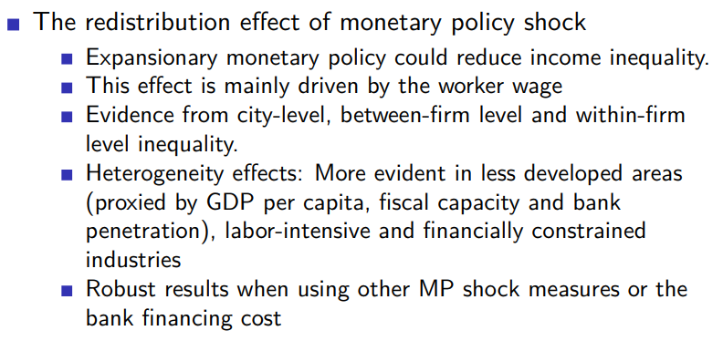

利差能够反映不同公司个性化的风险。不同公司之间，有抵押的公司反而贷款利率高，因为需要抵押的一般都是信用不太好的公司。

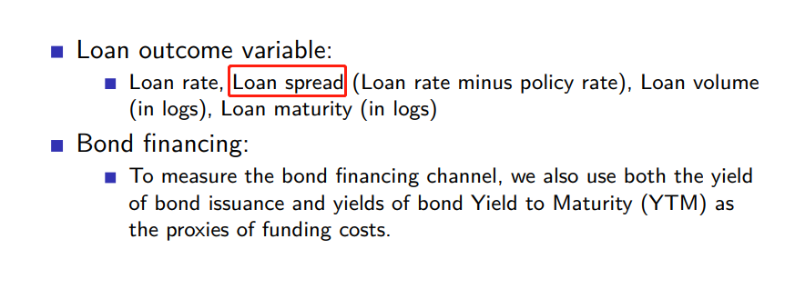

此外，对于每一个行业也影响不一样，基础建设影响最小，因为基本都是政府贷款，不敢动。制造业民企最多，受影响最大，服务业置于二者之间。

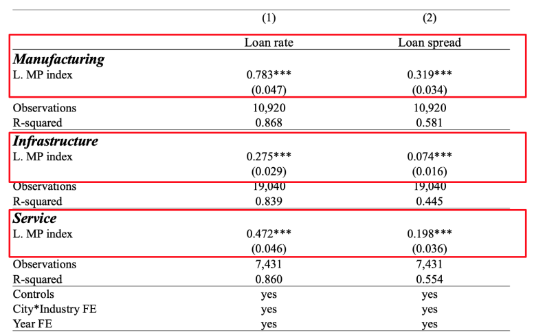

但本文重点还是在于收入部分，更有政策含义。

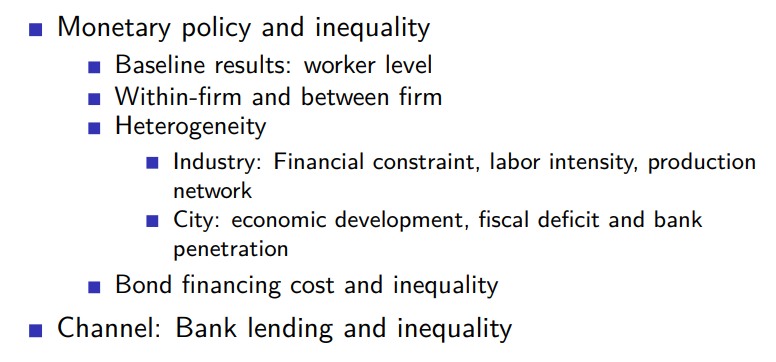

如果贷款量越多，对穷人越好，而贷款利率越高，收入不平等越严重。这种好坏的变化是基于自身的比例变化，而利率对收入的影响是一个加总的影响，途径为，利率影响经济，经济影响劳动者收入。

下图给出了非常直观的定性结论，左图：贷款量越多，收入不平等越少；右图：贷款利率越高，收入越不平等。

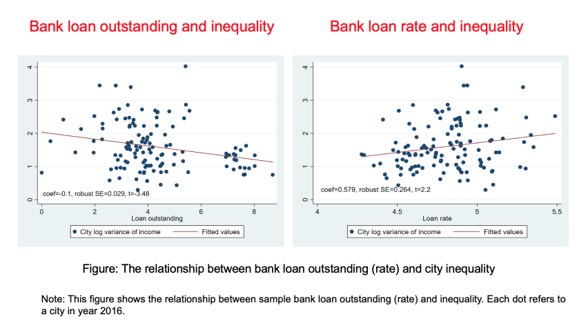

下面从城市数据和劳动者数据两个维度给出定量显著性检验：

**City Level**

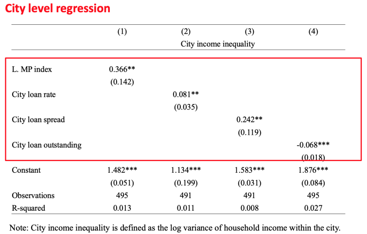

**Worker Level**

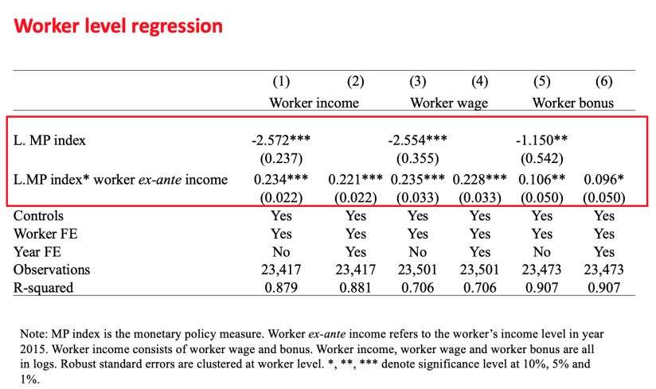

**Conclusion**

从政策银行出发，非常好的出发点

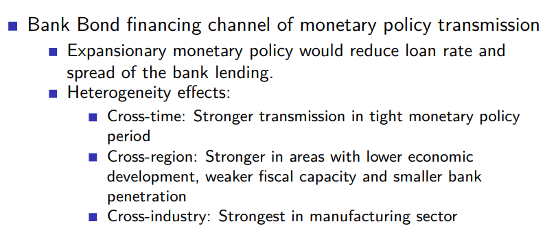

文章核心结论在于收入的再分配效应：

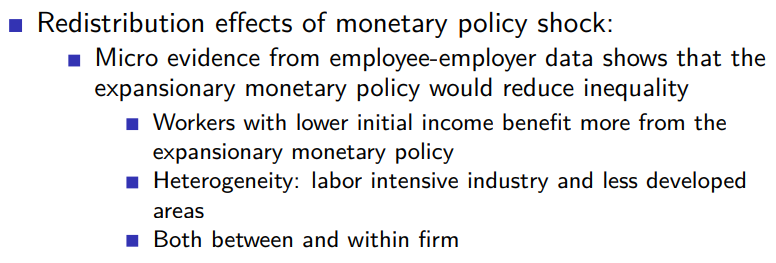

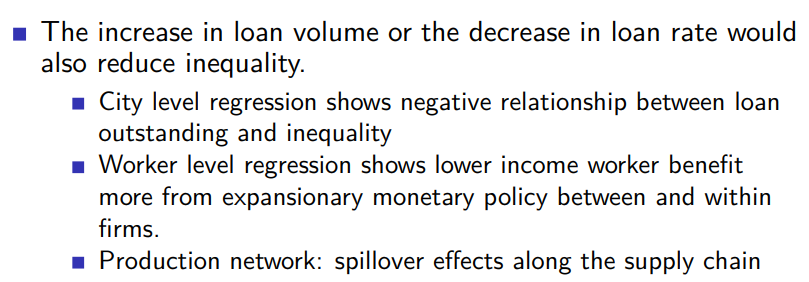

## The Collateral Channel of Monetary Policy: Evidence from China
Hanming Fang1, Yongqing Wang2, and Xian Wu3, Working Paper, 2021.
1. *Department of Economics, University of Pennsylvania*
2. *School of Economics, Fudan University*
3. *Department of Economics, University of Wisconsin*

## Monetary Policy Transmission with Heterogeneous Banks and Firms: The Case of China
Guofeng Sun1, Ji Zhang2, and Xiaodong Zhu3, Working Paper, 2021.
1. *PBoC*
2. *Tsinghua PBCSF*
3. *U Toronto*

货币政策对大公司和小公司有着不对称的（asymmetric）作用。对于大公司来说，当货币政策扩张时，其受益更多，却又在紧缩时受影响较小。对于小公司，则恰恰相反，扩张时得利不多，而收缩时又受到显著影响。
这是由于其**信贷资源**不同导致的。

中国银行体系可以两层：五大国有银行以及众多小型商业银行，小型银行中大多数为地方银行。国有大行全国范围内分支机构众多，因此存款来源基础广泛，而地方银行则大多依赖当地存款，并且还要与大行分支机构竞争。因此，信贷来源不足导致了小银行十分依赖**银行间市场**来补给其贷款。

受限于更高的监视成本（higher fixed costed of monitoring firms），大型银行偏好于贷款给大公司。而一方面银行间资金来源的成本要高于居民存款，使得小型银行无法与国有大行竞争，另一方面由于距离当地公司地理距离更近，监视成本也更低，这也导致了地方银行更倾向于贷款给当地企业。

