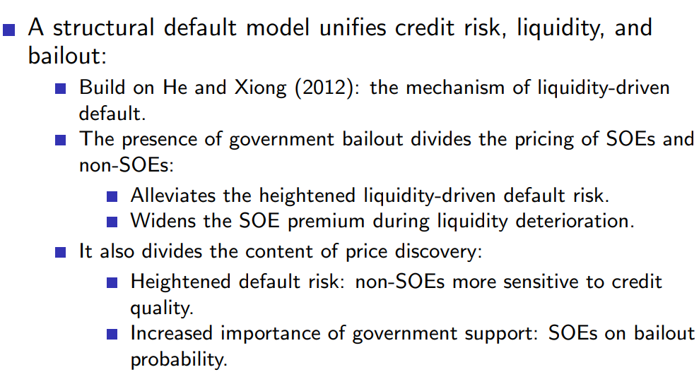
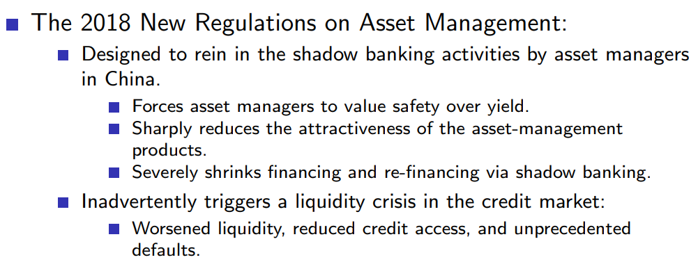

# Corporate Bond Market - Macro
## Reference

1. 【TOP】The SOE Premium and Government Support in China’s Credit Market, Zhe Geng and Jun Pan, ***R&R, Journal of Finance***, 2022.
2. The Real Effect of Implicit Government Guarantee: Evidence from Chinese SOE Defaults, Shuang Jin, Wei Wang, and Zilong Zhang, ***Management Science***, 2022
3. State Ownership and the Term Structure of Yield Spreads: Evidence from China, Yuanzhen Lyu and Fan Yu, ***Working Paper***, 2022

## 【TOP】The SOE Premium and Government Support in China’s Credit Market
Zhe Geng1 and Jun Pan2, ***R&R, Journal of Finance***, 2022.

1. *School of Management at Fudan University*
2. *Shanghai Advanced Institute of Finance at Shanghai Jiao Tong University and CAFR*

文章从三个维度研究SOEs和non-SOEs之间的信贷错配【credit misallocation】

1. **第一个全面论证SOEs和non-SOEs之间信贷错配影响的实证结果【first comprehensive evidence】**

在债券定价中，SOEs和non-SOEs之间的差别被称之为 SOE premium。**SOE premium能够衡量SOE在债券信贷分配中的优势**，此外，由于信贷分配的流动性（the fluidity of credit dispensation），SOE premium实际上也能够反映所有信贷渠道的分配。

11年之前没有违约事件，在2011-18年，二者的spread稳定在20 bps【AA+到AAA的差别是50 bps】，体现了一般情况下SOEs享受到的政府支持溢价。而在2018Q2后，一个季度的时间spread就已经达到了98 bps。2018年11月后，政府意识到了紧缩政策对于私企部门的负面作用，并出台了支持政策，但是SOE premium反而进一步增加到了154 bps。在那之后逐渐下跌到100 bps之下，在2020Q2为93 bps。

2. **将政府纾困政策【government bailout】纳入结构违约模型 (He and Xiong, 2012)**

模型包括政府纾困政策、信用风险以及非流动性成本【illiquidity cost】。模型能够很好地区分SOEs和non-SOEs，并且将SOE premium直接和政府支持联系起来。

***The 2018 New Regulations***本意在于限制快速增长的影子银行以及资产管理领域的系统性风险，但却同时收缩了公司的融资渠道以及降低了资产管理者对于公司债的需求，引发了流动性危机。在普遍缺乏流动性之时，纾困政策使得SOEs相比于non-SOEs更加有优势，同时，由于流动性不足，non-SOEs的资金环境明显恶化了。

2018年后，SOE premium增长极为显著。

3. **2018年新规导致的信贷错配对实体经济的影响**

一直以来，non-SOEs是中国经济增长的引擎，相比于SOEs更有效率，然而实证结果表明，这种趋势正在逐渐反转。特别地，对于那些受2018新规导致的信贷紧缩影响更大的non-SOEs来说，公司表现也下降更多。

对于这一现象，文章还给出了另外两种假设：
- 中美贸易战对non-SOEs影响更大
- 经过16-17的去库存和去杠杆，SOEs自身效率得到了提升

最终这两种假设都被证明不成立。

在中国，银行信贷是最主要的。相比于银行，债券规模小很多。
但是银行贷款数据不可得，难以分析，所以退而求其次使用债券来研究国企民企之间的信贷错配。该文章是**第一篇**用债券来研究SOE和nonSOE之间信贷错配的文章

债券定价包括，信用风险【公司最基本风险，7-80年代】，宏观流动性【贸易战以及18年治理影子银行】，政府救助【中国特有】

中国债券市场发展很慢，14年之前没有违约过，那么投资人对违约就没有感觉。一旦开始违约，价格才会开始反应违约风险。

18年之后，全社会的流动性冲击叠加司马南等人对于民营企业的攻击【鼓吹二次国有化】，利差迅速扩大，民企面临恶劣的流动性环境，大量违约。

如今疫情下，在Phase III阶段之后，民企可能也是同样的处境，

中国的puttable bond相比callable bond数量多很多，因为信息不对称，投资者不相信，所以要求施加额外保护。

在第三阶段，危机也使得交易量turnover显著下降。

尽管后续对于民营企业有一些支持，但是始终在100点左右，后续的新冠疫情只会进一步扩大这种差距。

导火索及背后可能的原因。新规旨在整治影子银行及资管业务，但是贷款、影子银行、债券市场，这三者是互相关联的，治理影子银行从35万亿到十几万亿，不会只影响影子银行本身。

其实还有一种可能，就是社会面对于民营经济的抨击。

持股比例和企业性质共同决定了救助可能性【左图】。持股比例变化不大说明：救助概率也是大概不变的【右图】

从纯粹的信用风险影响利率的角度来看，二者区别是不大的，尽**管民企效率更高，但是风险、波动性也更高**。主要还是从后两个变量来解释模型。 

通过指标能够更清楚地看到二者的差别

## The Real Effect of Implicit Government Guarantee: Evidence from Chinese SOE Defaults
Shuang Jin1, Wei Wang2, and Zilong Zhang3, ***Management Science***, 2022

1. *Finance, The Hong Kong University of Science and Technology*
2. *Finance, Smith School of Business, Queen’s University*
3. *School of Economics, Zhejiang University*

**Main findings**

在保定天威违约事件后，SOE债券价格相比non-SOE债券要多下跌1.48%，投资减少了账面价值的2.4%。特别地，投资减少主要集中于财政约束更加严重或是与国有银行联系不紧密的企业，对于有其他资金来源（国有银行信贷）的SOE则基本不受影响。

这背后的传导机制在于：**资金来源的收紧导致了投资的减少**。2015年后，SOE债券发行量显著降低，并且新发行债券的违约条款更加严格。

政府隐性担保的削弱一方面缓解了SOE中的代理人问题（管理者利用丰富的信贷资源以及纾困政策的存在而过度投资），另一方面也进一步恶化了融资环境，使得没有其他信贷资源的企业不得不放弃投资，而对于大型SOE来说，减少的债券资金仍然可以通过银行信贷来补充。**因此最终仍然不能对于弱化隐性担保这一政策的净影响做出确定性的论断。**

### Background <!-- {docsify-ignore} -->

中国市场债券种类

|**债券名称**|**交易市场**|**监管机构**|
|:--:|:--:|:--:|
|corporate bonds|证券交易所|证监会|
|enterprise bonds|交易所或银行间市场|发改委|
|midterm notes (MTNs)|银行间市场|银行间市场交易商协会|
|private placement notes (PPNs)|银行间市场|银行间市场交易商协会|
|commercial papers (CPs)|银行间市场|银行间市场交易商协会|

出于以下两个原因，一直以来，SOE被认为享受隐型政府担保，不会违约，即使违约也会被救助【云南高速】：
- 政治考虑（political considerations）。SOE也是政府目标的载体，例如创造就业、战略企业、或是政治支持。
- 责任划分。SOE的失败和错误的投资者决策，最终不是SOE买单，而是政府负责。

而实际上政府确实对将要违约或陷入财务困境的SOE有各种各样的救助政策，包括现金注入、补贴、债务展期等等。从08至14年，没有一家国企发生过债券违约事件。

保定天威，是央属中国兵器工业集团的全资子公司，从11-14年债务逐渐陷入困境，评级不断下降，最终在没有获得政府特别救助（bailout）后，于2015年4月21日宣布债券违约。五个月后，保定天威及其下属三个单位宣布破产。

自第一次债券违约事件后，随后出现了越来越多的SOE违约事件，显示了政府对于SOE忍耐程度的下降，以及减少干预、放权市场的态度。

尽管之前也发生过SOE贷款违约事件，但二者的违约机制和处理流程有很大不同。

- 贷款违约主要通过银行贷款人的补救措施来解决，而无需正式宣布违约。实际上，大多数SOE违约在**没有偿还本金**的情况下重新谈判和续贷
- 对SOE的贷款被认为由地方政府或中央政府担保，从而减小了贷款人的风险
- 相比于债券，贷款的持有人更加集中，大多数有双边协议的约束，因此在追回损失方面更加有利。而债券被分散持有，违约属于公共事件，影响全部的持有人。

## State Ownership and the Term Structure of Yield Spreads: Evidence from China
Yuanzhen Lyu and Fan Yu, ***Working Paper***, 2022
【第一篇研究期限结构的文章】
1. *UCLA Anderson School of Management*
2. *Claremont McKenna College*

截至2019年底，中国的公司债市场已经成为了全球第二大市场，流通额为4.3万亿美元，其中92%的非金融公司债【non-financial corporate bond】为SOEs发行。而在2020年末，已经达到了5.6万亿美元。

对于SOEs来说，在2019年只有36%的融资是通过股权进行。

即使是SOEs，其中也可被分为以下两类：
- Policy-SOEs：for government financing purposes【LGFV】
- Regular-SOEs：with regular business

之前的文献仅包括了Regular-SOEs，而本文还涉及了Policy-SOEs，并讨论了二者的差别。

文章就是为了解释一个现象：**短期来看，SOE债券相比non-SOE债券在借款时享有更低的利率，其中Policy-SOEs还要低于Regular-SOEs，但长期来看这种借款优势并不存在。**

针对这一现象，文章提出了三种假设：

- 因为Policy-SOEs与政府的关系最为紧密，对于政策不确定性反应比其他两类公司（Regular-SOEs，non-SOEs）更加敏感
- Policy-SOEs对于任职官员变动比其他两类公司更加敏感，因为一般意义上来讲，现任官员不想替前任官员还钱或延续前任的政策
- **Window Dress effect**。
  - Policy-SOEs存在的原因就是为了基础设施建设筹资，因此在发行债券融资之前，政府会通过可观的帮助来使得Policy-SOEs在面向投资者发行债券时报表显得更好看【dress them up】，而当Policy-SOEs通过发行债券筹资后，政府在未来就会减少支持。因此投资者不会选择长期持有Policy-SOEs债券，使得其长期融资成本提高。

通过实证检验，window dressing假设是成立的

**State ownership is a double-edged sword**

Policy-SOEs因为其国有背景，能够以较低的利率借债，但同时也因为背负了行政任务，所以不得不投资在利润较低的基础建设项目中，因而盈利能力也受到影响。因此，当政府支持消失后（长期来看），其国有制的副作用就开始显现。

