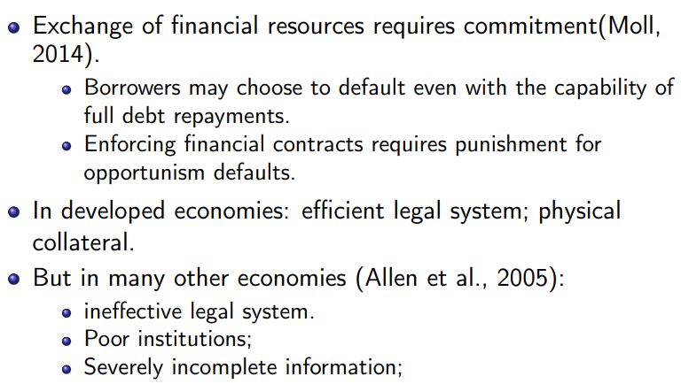
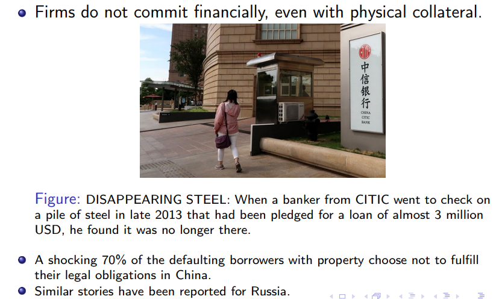
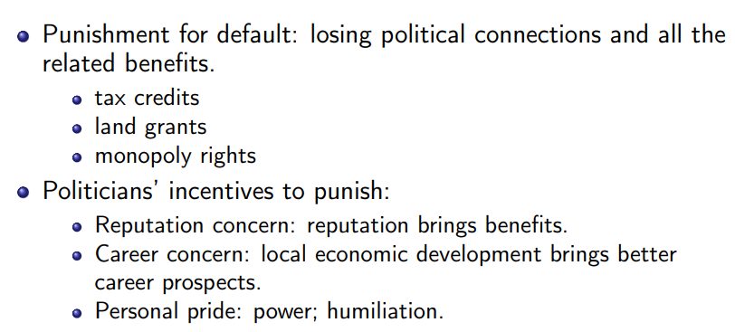
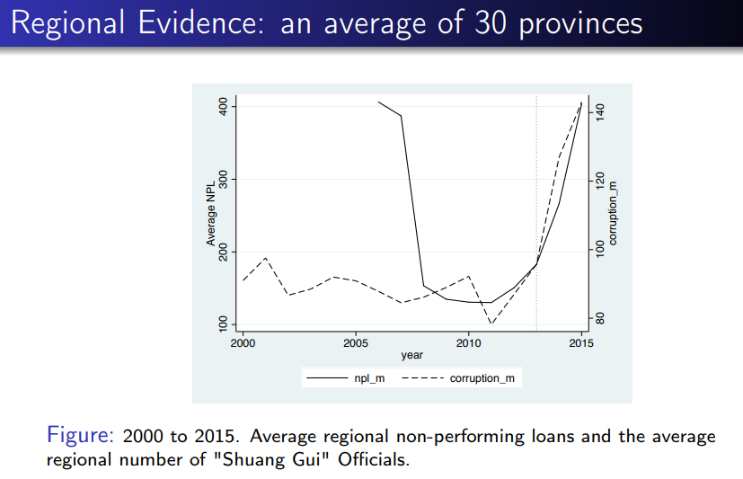
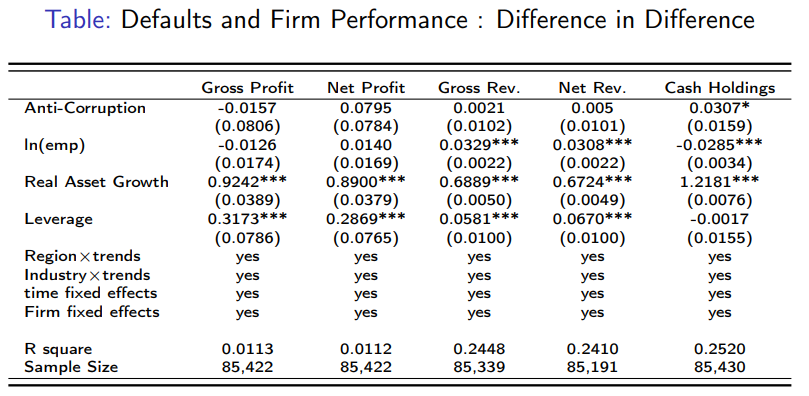
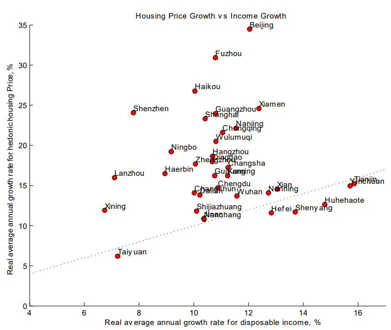

# Real Estate Market - Macro

## Refenrence

1. Property Taxes and Home Prices: A Tale of Two Cities, Chongen Bai, Qi Li, and Min Ouyang, ***Journal of Econometrics***, 2014 (lead article).

2. Corruption as Collateral (投名状), Fei Li and Min Ouyang, Working Paper, 2023.

3. The Great Housing Boom of China, Kaiji Chen and Yi Wen, ***American Economic Journal: Macroeconomics***, 2017.

4. Demystifying the Chinese Housing Boom, Hanming Fang, Quanlin Gu, Wei Xiong, and Li-An Zhou, ***NBER Macroeconomics Annual***, 2015.

5. Evaluating the Risk of Chinese Housing Markets: What We Know and What We Need to Know, Jing Wu, Joe Gyourko, and Yongheng Deng, ***China Economic Review***, 2016.

## Property taxes and home prices: A tale of two cities

Chongen Bai1, Qi Li2, and Min Ouyang1, ***Journal of Econometrics***, 2014 (lead article)

1. *School of Economics and Management, Tsinghua University*
2. *Department of Economics, Texas A&M University, ISEM, Capital University of Economics and Business*

房产税的实施，降低了上海的房价，但却提高了重庆的房价。  

房产税是一种持有成本。经过疫情，以及土地出让收入一再下降，要改善地方政府的财务困境，就**必须要推房产税**。

房产定价公式：

$$
P_t = \sum_{s=t}^n {(Y_s - \tau P_s) \over (1+i)^{s-t}}
$$

- $Y_s$: inflow of housing value in period
- $P_s$: home price in period
- $\tau$: the property-tax rate
- $i$: interest rate
- $n$: the life span of the property

$P_s, \ \tau , \ Y_s$ 的计量有很多讲究。例如在美国，$P_s$ 可以选取去年的房价，也可以选取购买时的房价【加州，但并不合理】。

目前中国的持有成本只有物业费，但是在西方，房产税对房价的影响很大。

房地产和房价之间的关系非常复杂，其中没有完全外生的变量。

- 房价也会反过来影响房产税，由于地方亏空，因此必须推出房产税。房价高，那么房产税可能低一些就够了，但是如果房价低，地方政府想要缓解财政压力就必须提高房产税。
- 房产税高了，地方政府财政收入提高，用于基础设施的花费也多，因此 $Y_t$ 提高，进而 $P_s$ 提高。取之于民，用之于民
- 其他因素例如大家对于房产税征收的预期也会影响房价。

在美国，任何人在任何时间可以查到任何房地产的信息，目前的房价以及以前的交易信息。随着反腐斗争，也许未来中国也可以。

### The Price Spillover <!-- {docsify-ignore} -->

#### NOT all houses are taxable <!-- {docsify-ignore} -->

在上海，除了本地居民的第一次买房之外，其余所有的新购买房屋都要收税。在重庆，仅对高档房屋【例如别墅，无论新购买与否】以及售价超过平均价格一倍的新购买房屋征税。

尽管二者都主要针对于新购买房屋征税，但是细节仍有不同：在重庆，过去购买的别墅也要征税。

#### NOT the entire values of the taxable houses are actually taxed <!-- {docsify-ignore} -->

- 在上海，每个家庭成员可以申请豁免一套60平房屋的税款
- 在重庆，别墅面积中的180平，或正常房屋的100平可以不收税

#### The property-tax rate is DIFFERENT <!-- {docsify-ignore} -->

- 上海：对于至少**两倍**于平均房价的房屋征收 **0.6%** ，对于其余房屋征收0.4%
- 重庆：对于至少**四倍**于平均房价的房屋征收 **1.2%** ，对于至少 **三倍** 于平均房价的房屋征收 **1%** ，对于其余房屋征收0.5%
- 对于上海来说，税基是房屋价格的 **70%** ，而对于重庆来说是 **100%**

因为高端房屋的税收往往更加严苛，所以其价格下跌是理所应当的；但同时，由于低端房屋的房产税十分温和，甚至不收税，因此潜在的购买者会由于害怕未来对于低端房屋收税而纷纷购买，由此推高低端房屋的价格。 在这种情况下，**只要低端房屋价格上涨的幅度高于高端房屋下跌的幅度，就会造成平均房价的上涨**。这就是由高端房屋到低端房屋的溢出效应。

由于上海与重庆房产税政策的差别，在上海就没有这一现象，因此上海平均房价下跌。

根据国家统计局数据，在2011年后，的确出现了小户型房价的上涨。

## Corruption as Collateral
Fei Li1, Min Ouyang2, ***Working Paper***, 2023

1. *U. of North Carolina Chapel Hill*
2. *Tsinghua SEM*

借贷关系对地方发展至关重要，如何让被人相信你借钱会还呢？此时commitment也许是一种选择

在发达国家，主要依靠法律体系与实物抵押，但是对于大多数国家有诸多问题 

根据公开数据，在中国，被法律判定的违约人即使具有资产，但欠债不还的比例有70%。在这种情况下， 为什么大家还愿意借贷呢？**当正式机制不work时，就会存在 informal 机制会work**

**Unconvential Collateral**

- Community norms (Greif 1993) 小圈子，黑名单，但这个当社区足够大时，这一点并不能实施的很好
- Mafia (Gambetta 1996) 黑社会
- Warlords (Gillian 2015) 军阀时期

根据实证，企业给腐败官员的贿赂，是远远小于其收益的，所以是绝对合得来的买卖。

### 投名状机制 <!-- {docsify-ignore} --> 

在这种非正式机制下，如果违约，就会失去政治靠山以及对应的好处。

而为什么官员有动力去惩罚呢？
- 维持自己的威望，例如老大哥、靠山的形象
- 维持这种形象可以通过非正式的渠道促进经济发展，进而为自己的职业发展铺路
- 出于个人想要展示权力的想法，例如，不把你办了我就不用混了 

### 双规数据的证据 <!-- {docsify-ignore} --> 

可以看出**反腐败与违约有很强烈的联系**，这一点在某种程度上可以印证上述机制，当官员落马，这种机制自然就不生效了。

### Proposition <!-- {docsify-ignore} --> 

Default背后可能有很多原因
1. commitment 机制，官员被抓了就没必要还钱
2. 一种是资源减少，导致没办法还钱

两种机制的区别就在于**公司资源和表现有没有下降**。

这些公司在官员被抓后利润没有下降，甚至现金还增加了，因此是策略性违约，证实是投名状机制。

> [!NOTE]
> Is the Chinese Anticorruption Campaign Authentic? Evidence from Corporate Investigations,” John M. Griffin, Clark Liu, and Tao Shu, ***Management Sciences***, 2022.
>
> 但是根据这篇文章，受贿官员关联国企在官员被抓后表现大幅下降

## The Great Housing Boom of China
Kaiji Chen1 and Yi Wen2, ***American Economic Journal: Macroeconomics***

1. *Economics Department, Emory University*
2. *School of Economics and Management, Tsinghua University, and Research Division, Federal Reserve
Bank of St. Louis*

### Background <!-- {docsify-ignore} -->

过去十几年【截至2015】，中国的房价以每年17%的速度急剧上升，远远超过同期10%的GDP增速。但同时与此相伴的是极高的房屋空置率【22.4% in 2013】，这一比率远远高过发达国家同期，即使在2006年左右美国房价泡沫时期也仅仅3%。

这些空房并不是由于超额供给产生的，因为其中的绝大多数都是已售房屋，这代表了背后极强的投资需求。

许多房产的买家是头部的中产阶级以及高收入群体，他们的目的并不是住房，而是投资。同期，1998-2012，中国的资本报酬率达到了前所未有的20%或更高。奇怪的是，在房地产投资的玩家中，不仅包括这些高净值群体，还包括了许多公司，其中不乏最具有生产效率和盈利能力的公司。

1. 极高的房价增长率
2. 异常的房屋空置率
3. 前所未有的资本报酬率

这三者构成了一个puzzle，不能由现有的经济学模型所解释。

#### Data <!-- {docsify-ignore} -->

**It is well known that** 由中国政府官方发布的房价指数非常不准并且 do not control for housing quality，因此大大低估了中国房价的增速【低于经济发展增长速度】。

为了准确的估计房价增速，Wu, Deng, and Liu (2014) 利用35个主要城市的新建住房销售数据构造了新的房价指数。

根据这一指数，全国的房价增速远远超过官方数据，从2006Q1-2010Q4，每年 17%，如果忽略2008的经济危机，那么平均增速将达到 20%。并且这种超过经济增长速度的房价增速在全国都是十分普遍的。

特别是上海和北京，房价增长速度是人均可支配收入增长速度的2-3倍。因此，目前主流的说法例如中国房价主要是由于城市化驱动的，以及由快速增长的人均购买力推动的，这些说法是站不住脚的。

按照这种发展趋势，一般家庭应该会越来越买不起房，特别是低收入群体。然而数据显示，即使是中国城市人口中的低收入群体也在参与房产投资。背后的原因很简单，因为如果大家都预期房价将继续上涨，那么当然会及时的加入，如果这辈子还想买得起房的话。

#### Vacancy rate <!-- {docsify-ignore} -->

而对于空房率数据。2013年，在中国的一二三线城市分为别：21.2%，21.8%，23.2%。

如果按照不同的家庭群体来看，35.1%的企业家家庭拥有空置住房，并且这些人中的 29.9%拥有多套房产。

### The theory <!-- {docsify-ignore} -->

作者将这个问题称之为growing bubble。

在经济转型的过程中，大量劳动力从农业部门转移到工业部门，此时劳动力供给超额，企业只需要提供略微高于农业部门的工资即可享受超额的劳动力红利，这也意味着享有异常的资本报酬率。

然而，根据刘易斯拐点，这种超额的资本报酬率是不可持续的，因此，为了寻求资产增值，就会将超额资本投资到类似于房地产之类的投资品中。在中国，在资本管制以及投资品类受限的情况下，房地产是最优的选择。

同时，该理论也指出，当经济转型至刘易斯拐点，即劳动力短缺时，快速增长的房价泡沫就会失去增长的动力。

按照这种理论，在经济转型和劳动力重新分配（labor reallocation）的过程中，容易出现此类的资产泡沫，这一现象也发生在亚洲的其他经济体，如韩国、台湾、越南。

而这种资产泡沫，会**延缓中国的经济转型以及减少社会福利**。因为这种资产泡沫对于正常生产经营活动具有挤出效应（crowding out effect），并且造成了资源的错配。

#### Marginal investors <!-- {docsify-ignore} -->

理论的核心在于边际投资者的概念：**企业家面临的资本回报率将决定房价泡沫的增长率**。这也意味着，对于非边际投资者【其他面临较低资本回报或利率的主体】，他们的参与只能影响房价水平，而不能影响房价的增长率。

> [!TIP|label:Lewis turning point]
> 经济学家威廉．阿瑟·刘易斯在《劳动无限供给条件下的经济发展》、《对无限劳动力的反思》两篇论文中，提出“二元经济”理论。
> 
> 他认为，在一国发展初期存在二元经济结构，一个是以传统生产方式生产的“维持生计”部门（以传统农业部门为代表）；一个是以现代生产方式生产的“资本主义”部门（以工业部门和城市为代表）。一个国家的发展过程分为三个阶段。
>
> 
> 第一阶段，**劳动力无限供给阶段**。此时农业部门人口多、增长快。由于边际生产率递减规律，其边际生产率非常低甚至为零，农业部门出现大量劳动力剩余，只要工业部门能够提供稍大于维持农村人口最低生活水平既定工资，农业部门就将涌出大量劳动力至工业部门，为工业部门扩张提供无限劳动力供给。
> 
> 由于在既定工资水平上，劳动力供给无限，工业部门在实际工资不变情况下将所获得利润转化为再投资，将规模不断扩大，直到将农村剩余劳动力全部吸收完。
> 
> 随后进入第二阶段，**劳动力短缺阶段**。工资取决于劳动边际生产力，劳动力工资水平开始不断提高。第一阶段到第二阶段交点，称为**刘易斯第一拐点**。随着农业劳动生产率不断提高，农业剩余进一步增加，农村剩余劳动力得到进一步释放，现代工业部门迅速发展足以超过人口增长，工资最终将会上升。
> 
> 等到传统农业部门与现代工业部门边际产品相等，两个部门工资水平大体相当时，就意味着进入第三阶段，城乡一体化劳动力市场已经形成，变成一元经济。第二阶段和第三阶段交点，称为**刘易斯第二拐点**。
>
> 
> 在第一阶段，也就是早期工业化阶段，资本稀缺但劳动力过剩，经济增速快；资本拥有绝对掌控力，工人议价能力低，人均收入不高。
> 
> 在第二阶段，劳动力稀缺，人均收入水平不断提高，经济进入到消费、储蓄和投资都上升阶段，彼此互相促进，形成良性循环。这是经济发展成熟、黄金时代，形成一个以中产阶级为主消费社会。
> 
> 在第三阶段，成为发达经济体，进入到被追赶阶段。此时经济增长主要依靠持续科技创新。海外投资变得更加富有吸引力，资本容易流入成本更低、回报率更高国家。对劳动力而言，技术含量高工作回报更好，其余工作收入可能下降，贫富差距可能扩大

### Empirical Evidence <!-- {docsify-ignore} -->

实证部分主要解释的是：拥有高额投资回报率的企业的投资需求与**超额**房价增长率之间【即超过可支配收入的部分】的关系。

#### Household Evidence <!-- {docsify-ignore} -->

根据实证，房主是否为私人企业家对于对所有中国城市的空置房率有很高的解释能力。也就是说，即使这些私人企业家有别的资产回报率渠道【也即投资在企业中】，他们还是选择了购买更多的房产。

#### Cross-City Evidence <!-- {docsify-ignore} -->

- 对于所有的中国主要城市而言，私企的资本回报率对于房价的超额增速有很强的预测能力
- 私企的资本回报率比国企的强

具体来说，私企的资本回报率每上升 **1%** ，就会带来 **0.7%** 的超额房价增速的提升。

#### Firm Evidence <!-- {docsify-ignore} -->

非房地产公司中，45% 有投资资产【为了获取租金和资本利得购买，而非其自身企业所必需的生产要素】。并且房产投资平均占了这些公司固定资产的 15%，并且数值随后保持稳定。

### Crowding-Out Effects <!-- {docsify-ignore} -->

房地产投资占GDP的比重从1999年的 4.2% 上涨到了 2011年的 13.2%，翻了三倍，而住宅投资又占了房地产投资的 70%。因此，住房投资占GDP的份额在这期间从2.4% 上涨到 9.5%，年平均增长率达到25.5%，远远超过同期的GDP增长率，13.9%。

然而，快速增长的房地产投资也对企业的生产起到了挤出作用，无论是国企还是民企。实证显示，**房价增长率越高，未来的非房地产投资增长就会越低**。

## Demystifying the Chinese Housing Boom
Hanming Fang1, Quanlin Gu2, Wei Xiong3, and Li-An Zhou2, ***NBER Macroeconomics Annual***, 2015.

1. *Department of Economics, University of Pennsylvania*
2. *Guanghua School of Management, Peking University*
3. *Princeton University, Department of Economics*

### Institutional Background <!-- {docsify-ignore} -->

从1949年到1978年，中国的土地是公有制，且不允许任何个人或组织交易、出租或转让，仅在单位职工内分配。

直到1980年代中期国企改革推出了另一套房地产系统，将房屋分配与就业脱钩，并且允许房产交易T。

> [!TIP]
> 按照现有法律，住宅用地产权为70年，到期后房屋使用权收回。但是普遍来讲，都认为该法律会被修改，因此到期后能够重新续约。

1994年综合房产改革（Comprehensive housing reform），国企员工允许以补贴价购买其现有住房的完整或部分产权，随后在1990年初，在一些大城市出现了商品房的概念：commodity houses。但是，直到1998年，中央政府废除了福利房政策，并且私有化有所的城市居民住房，在这之后，商品房这一概念才普遍流行开来。

文章研究问题：**中国的房地产会出现类似于美国和日本的房地产危机吗**？

首先，中国对房贷征收超过30%的首付，因此类似于美国的次贷危机不太可能发生。

其次，中国房价的高速增长伴随着同样快速增长的经济发展。按照文章数据，在2003-2013年，一线城市【北上广深】房价增长率为13.1%，二线城市10.5%，三线城市7.9%，而家庭可支配收入增长率为9.0%。

不同于日本，在房价高速增长的背后是略显疲软的经济。

第三，尽管房价始终在上涨，但是低收入群体的参与却从未缺席，且始终保持稳定。

风险因素主要包括以下几项：

### Key risk factors <!-- {docsify-ignore} -->

#### Income Growth Rate <!-- {docsify-ignore} -->

当高速增长的房价背后没有同样增长迅速的收入做支撑时，就会带来很大的问题。

当中国经济发展进入新阶段，不可避免地增速要回落到一个稳定区间。而正是因为对高收入增长的预期，购房者的房价收入比才会仍然维持高位。如果预期收入增速将要下降，那么房价增速也会相应下降。而一线城市的经济增长相比于二、三线城市而言会减速更多，因此对一线城市来说影响更大。

#### Housing supply <!-- {docsify-ignore} -->
房产供应具有很大的弹性，一旦政府找到了其他的财政收入来源，可能就会减少用于住宅建设的土地，进而对房价产生影响。

#### Demographic Trends <!-- {docsify-ignore} -->
人口老龄化带来的有效需求减少。

### Pending reform <!-- {docsify-ignore} -->

#### Porperty taxes and new fiscal reform <!-- {docsify-ignore} -->

房产税的实施不仅会降低未来的投机需求，还会使得过去带有投资目的而购买的住房被出售，因此造成房价下跌。

房产税以及其他的的财政政策改革会降低土地财政的地位，使得传统房地产“大而不能倒”的观念得到淡化，因此降低了房地产的投资属性，造成房价下跌。

房产税本身作为房子拥有者的一种额外支出，会使得购房者降低对房价愿意支出的金额。意为原来房子100元，后来要收5元的房产税，那么我可能只愿意掏90元了。

#### Health care segments <!-- {docsify-ignore} -->

如果医疗资源能够平均分配、医疗保险能够全国统筹，那么一线城市的退休人员就可以回到三线城市退休，进而释放一定的房产资源，缓解房价压力。

## Evaluating the Risk of Chinese Housing Markets: What We Know and What We Need to Know
Jing Wu1, Joe Gyourko2, and Yongheng Deng3, ***China Economic Review***, 2016.

1. *Institute of Real Estate Studies and Hang Lung Center for Real Estate, Tsinghua University, China*
2. *The Wharton School, University of Pennsylvania and NBER, United States*
3. *NUS Business School, SDE and IRES, National University of Singapore, Singapore*

### Key Results <!-- {docsify-ignore} -->

（1） 自从2006年后，房价增长速率每年超过10%，但其中却有很强的异质性，从最低的济南（2.8%）到最高的北京（19.8%）。房价增长主要是由于**土地价值的增长**导致的，而非建筑成本的增加。

土地价值每年增长率为14.4%，对于北京达到了27.5%。各项配套设置，如地铁，医疗以及教育等都会推高土地价值。

（2）土地价值和房价之间有很高的关联性，土地价值在08年金融危机中跌幅接近三分之一，随后在09-10的刺激政策中超额恢复。自2013年后，由政府供应给开发商的土地数量锐减。最新数据显示，交易量接近减半，这也许会导致进一步的土地供应减少。

（3）不同区域的市场的需求供给关系有很强的异质性。对于东部区域如北京杭州上海深圳等，需求数量高于供给数量；而对于其余的房地产市场，基本上都是相反的，即供给数量高于需求数量【成都、重庆、贵阳、哈尔滨、呼和浩特、兰州、青岛、沈阳、太原、银川、郑州】。

（4）目前没有官方的数据来测算空置房率，但是有学者给出了极高的比率：17%。本文给出的数据相比于这个要低得多，从2009年的5.2%上涨至2014年的7.8%。

（5）即使在北京这样房地产不存在超额供应的城市来说，也存在房价风险。可以用房价租金比（price-to-rent ratios）来作为proxy，这一指标对于首都来说一般为50。但是，只有当所有者对未来的资本收益有足够高的期望时，这一水平才是合理的（Poterba's, 1984）。即使对于未来升值预期降低一个百分点，也会降低房价的三分之一，在不考虑租金上涨的情况下。

