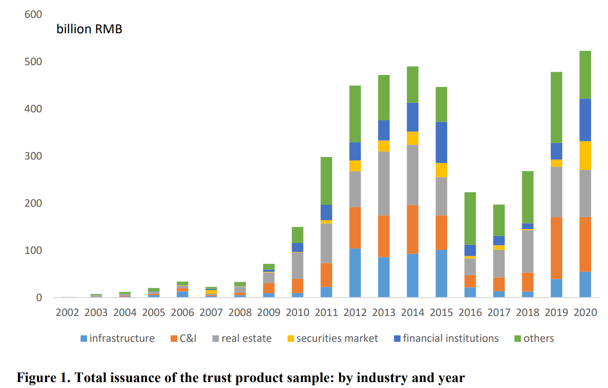
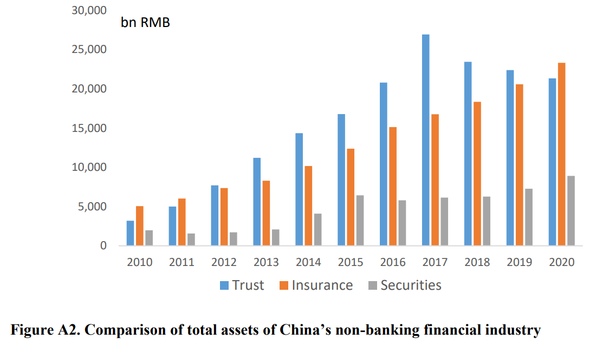
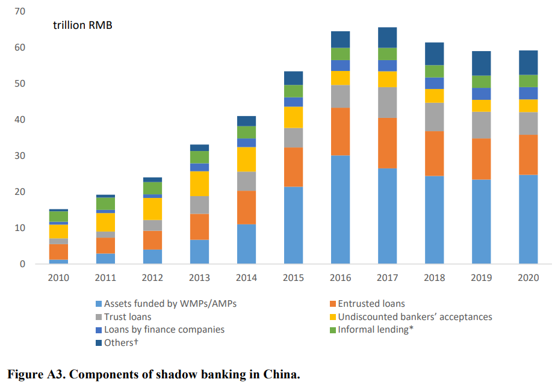

# Shadow Banking Micro

## Reference

1. Liquidity Rules and Credit Boom, Kinda Hachem and Zheng Song, ***Journal of Political Economy (lead article)***, 2021.
2. Entrusted Loans: A Close Look at China’s Shadow Banking System, Franklin Allen, Yiming Qian, Guoqian Tu, and Frank Yu, ***Journal of Financial Economics***, 2019.
3. Implicit Guarantee and Shadow Banking: The Case of Trust Products, Franklin Allen, Xian Gu, C. Wei Li, Jun Qian, and Yiming Qian, ***Working Paper***, 2021.

10年前，所有借贷利率都被管制，中小银行没办法和大银行竞争，而理财产品出来后【四大行发行的第一个产品】，特别受中小银行的欢迎。随着WMPs的兴起，其中的65%流向了资产负债表外，还实现了信托和银行的联通。在理财产品出现后，中小银行的理财收益率更高。

国有企业没搞好，但是国有银行搞的还行。不同于其他行业，银行业中四大行并没有体现出垄断的地位，也就是说银行业和其他行业的国有垄断是有很大差别的。

05-11年，四大行和其他银行的贷存比相差极大，四大 60% 左右，其他银行大概85%。因为有官方贷存比的75% 限制，所以其他银行平常放贷很多，而在年末审查时，还要收回来，把报表做好看。

随着监管越来越多，一开始每年查一次，变成每半年、每季度、每月，二者越来越趋同。为什么四大行放贷这么少呢？

二者的地位差异体现在银行间市场。在中国市场四大行是流动性提供者，贷款放得少，余下的钱都放到银行间市场。美国是小银行是流动性提供者。

政策性银行更加重要。在没有SLF, MLF之前，国开行会向困难银行注入流动性。城商行是没有办法和国开行交易的，二者通过四大行接触。

2013年钱荒，隔夜拆借利率 repo rate从2%上升到7%，最高的一笔达到了 30%，至少持续了2天。国家反应很快，通过国开行注入资金。四大行以低价从国开行拿钱，但却按市场利率在银行间市场放出去。并且拿到的流动性也没有完全放出去。

第二篇文章：

4万亿政策使得中国从 productivity driven growth 到 debt driven model，也就是 financial/fiscal deregulation。

当时目的是拉动经济，但是把好不容易收回来的东西又放回去了，对地方的财政权。

目前债务占GDP大概 300%，仅次于日本，超过基本所有发展中国家。

其中 Government debt大幅上升。过去几年国进民退，核心本应该是央企扩张很快，但是实际上过去几年**地方国有企业**扩展非常快。并不单纯是由于4万亿引起的，但是实际是开闸了，就不好收了，13-14想收，但是没成功。

过去几年，地方大多数债务都投资到了基建身上。基建也属于是中国经济学家的迷思，总是因为基建觉得国家很牛。

但实际上，基建的回报率对于social大概6-7%，但是非基建的回报率有15%，但是对于美国来说，非基建和基建回报率差不多。欧洲常年不搞基建，所以基建回报率比非基建还要高

基建的回报是个世界难题，财务回报不等于经济回报。中国修路的回报大概3%，一条路修好之后，3个月之内速度会提升，3个月之后速度就降下来了。除了一些中部地区的回报修路还可以，因为这一地区地价不算高，并且属于大动脉，大部分修路的回报都是负数，因为这些地方根本不拥堵。例如，北京上海的路回报不高，就是因为地价太贵了。

有一种说法是现在空，未来就拥堵了。但是这种情况只会在高速发展的情况下出现，而高速发展的机会很难在有了。

高铁例子，欠债10万亿，2亿家庭平均每户负债5万，如果问每一户家庭是否愿意投入5万换取高铁体验，实际上不愿意，因为仅有少部分人非常依赖高铁出行，对于大部分人效用不高。

另外一个极为重要的原因，为什么美国不大规模建设高铁，因为害怕挤出私人投资，crowding out effect。

中国长期储蓄大于投资，贸易顺差占GDP 10%，拿去买美国国债，但是美国国债收益率相当长一段时间是0，因此还不做基建，但是4万亿后，现在顺差只有 1-2%

当没办法再去买美国国债，就只能投资国内，从而挤出私人投资。

Implication：

covid之后private sector很乏力，想要刺激经济还是要通过地方政府，这样就不能走出debt driven的怪圈。

建议现在不要再抓GDP的指标，修生养息，让国企少做一点，民营多做一点。但是这个过程不是立竿见影的，只是policy maker 没办法承受这种压力。

## Liquidity Rules and Credit Boom
Kinda Hachem1 and Zheng Song2, ***Journal of Political Economy (lead article)***, 2021.

1. *Darden School of Business, University of Virginia and NBER*
2. *Department of Economics,  Chinese University of Hong Kong*

IO 文章，银行必读

自2008金融危机以来，从关注资本到关注流动性。而一旦涉及到银行的流动性监管（liquidity regulation），就必须关注**银行间市场**，短期借贷的主要来源。

本文的研究重点就是**银行间市场对流动性监管的影响**。

> *with liquidity regulation, we do not even know what to argue about.*
> 
> Allen and Gale (2017)
> 
> *tightening in regulation of the banking sector may push activity to other areas—and things happen.*
>
> Stanley Fischer, former Vice Chairman of the US Federal Reserve

所有银行都会面临久期错配（maturity transformation）的问题，也即短借长贷：存款大多数为短期，而贷款往往为长期。在这种情况下，久期错配越严重，银行抵抗风险的能力也就越差，而银行间市场能够使得缺乏流动性的银行以一个**完全内生的确定价格**（endogenously determined price）从流动性充裕的银行手里借钱，以满足短期流动性需求。

在这个背景下，本文另外分析了两个角度：

#### （1）银行间市场定价权 <!-- {docsify-ignore} -->

根据定价权的不同，可以将银行划分为**定价银行**和**交易银行**【无定价权】。**定价银行对流动性的需求可以影响交易价格**，因此定价银行的流动性一定更充裕。交易银行往往是小银行，相比之下流动性会更吃紧。

#### （2）久期错配范围 <!-- {docsify-ignore} -->

银行可以自己选择在监管范围内进行久期错配（regulated sector）还是在监管之外进行久期错配。

为了应对流动性监管，交易银行往往会选择 **offer a new savings instrument**，也即影子银行业务。这些影子银行业务不记录在资产负债表内，并且仍然存在久期错配问题。

为了吸引资金，这些表外业务往往会提供高于市场利率的收益，而高出的这部分溢价也恰好等于交易银行因为流动性下限（liquidity floor）而承担的隐含税率。**相对较高的收益率会使得资金从定价银行流向交易银行，而对于定价银行来说，提供同样的收益率来吸引存款并不是最优选择**。最终，**流向实体经济的信贷量提升了**，因为相比于定价银行，交易银行更愿意提供长期贷款。

这种信贷资源的再分配引起了**预期之外的信贷剧增**。

### Contribution <!-- {docsify-ignore} -->

文章的贡献，就是说明了是银行间市场和影子银行二者共同造成了信贷剧增，也即：
- **不限制表外业务的会计准则**
- **非竞争性的银行间市场**

从 2007 - 2014，中国的债务GDP比率从 110% 上升到了200%，私人信贷占私人储蓄的比率上升了10%【substantial】。根据数据显示，中国总体的信贷-储蓄比上升幅度的 **50%** 可以由中国在 2008 实施的贷款-存款比例【loan-to-deposit】所解释。

在中国债务占比不断上升的过程中，体现出了两个值得注意的特点，如果没有银行间市场的“垄断”，这两个特点是不会发生的：

#### （1）银行间市场利率的提升 <!-- {docsify-ignore} -->

银行间市场利率的提升是定价银行对于信贷重分配的应对策略，提升利率后，因为拆借成本的提升，交易银行不得不维持更多的流动性，因此在一定程度上收缩了表外业务，进而吸引资金的数量变少。

尽管借贷成本的提升也影响了定价银行自身，但是为了保留更多的信贷资源，不得不“出此下策”。

#### （2）不同银行间的表内流动性比率趋同 <!-- {docsify-ignore} -->

对于交易银行，拆借利率上升，但监管需求仍然存在，所以不得不提高自有流动性资产，**流动性比率提高**。

对于定价银行，第一交易银行吸收的资金变少，第二市场流动性需求减少，因此获得了额外流动性，进而可以降低其流动性比率，转而支持长期资产，**流动性比率下降**。

定价银行的影响力由于中央银行的干预而被削弱了。正常情况下，一个能够对银行间市场利率波动充分反应的银行能够降低由于流动性监管而引起的信贷繁荣。然而，当中央银行面临外汇利率管制（managed interest rate）时，调节市场利率的能力受限。

## Entrusted Loans: A Close Look at China’s Shadow Banking System
Franklin Allen1, Yiming Qian2, Guoqian Tu3, and Frank Yu4, ***Journal of Financial Economics***, 2019.

1. *Imperial College London*
2. *The University of Iowa, Tippie College of Business*
3. *Southwestern University of Finance and Economics, School of Accounting*
4. *China Europe International Business School*

在影子银行业务中，委托贷款（entrusted loan）是非常重要的一部分。委托贷款指的是由银行作为中介，发生在两个非银行企业之间的贷款。银行赚取佣金但不承担贷款风险。影子银行的规模自 2011 以来已经翻倍，并且在 2016 的上半年，达到 1.8 万亿美元，等同于**GDP的 82%** 。

围绕影子银行产生了诸多讨论，但受限于数据可得性，并没有产生明确的结论：

> *Loans between companies is the fastest-growing category of shadow banking in China, but with next to no data on where such loans are going, their effect on the economy is a black box.*
>
> Wall Street Journal (2014)

而本文从委托贷款交易层面的数据 (transaction-level data) 出发，能够对影子银行业务进行更加细致地剖析 (closer look) ：

1. 影子银行快速发展的起因
2. 其蕴含的风险
3. 影子银行业务中的定价有效性 (price efficiency)
4. 应该如何监管

#### （1）the reasons behind its rise <!-- {docsify-ignore} -->

对于起因，一般认为是**金融系统的缺位**导致的。

金融系统包括：银行、股票市场、债券市场。尽管中国的金融系统已经经历了漫长的改革 (long and gradual reforms)，但对于绝大多数民营企业来说，仍然很难通过正常的渠道获取应得的信贷资源，特别是中小微企业。

#### （2）the risk of the sector <!-- {docsify-ignore} -->

影子银行的风险和两个因素有关。

- **获取资金方的项目风险程度如何**
- **提供资金方的资金来源**

关于这两个因素，目前的讨论还都是基于理论层面或是并不严谨的观察数据 (anecdotal observations)。本文借助数据，能够分析委托贷款的资产端构成和全部资金提供方的资金结构，进而从微观层面分析影子银行的风险。

1. ***什么样公司会倾向于参与委托贷款？为什么他们不投资到自己的主营业务中，反而将资金用于发放贷款？***
2. ***谁在借款？委托贷款是否集中性地流向某一类行业或某一区域？***

委托贷款大多数发生在拥有丰富信贷资源特权的大公司【例如 SOE】和缺乏信贷资源的小公司之间【中小微企业】。这些大公司的信贷成本往往**低于或近似等于**官方的银行贷款利率，所以他们会以成本相近的利率或更高的利率借出。对于世界上的其他国家的大公司来说，他们往往没有必要这样做【compete with bank】。但是在中国严格监管的银行体系下，大公司就有了这样做的动力。委托贷款的流向大多为*由富裕地区流向贫困地区*，以及*由沿海地区流向内陆地区*。

委托贷款内也明确划分为两类：**关联贷款**和**非关联贷款** (affiliated and nonaffiliated loans)。关联贷款多发生在母公司和子公司或上下游之间，非关联则意味着双方没什么关系。

不同的贷款方也反映了不同的动机。对于关联贷款，资金提供方往往为有着很高盈利能力的 SOE，贷款用于**支持**相关方。而后者的资金提供方拥有超额现金，但是公司增长率很低，因此将委托贷款作为**投资渠道**。

关联贷款多发生在同一行业内，而非关联贷款则大多流向**房地产、建筑行业**，这些行业也是监管试图限制的行业，因此风险较高。

#### （3）the pricing efficiency of transactions <!-- {docsify-ignore} -->

委托贷款的利率是否合理反映了其对应的风险呢？

3. ***委托贷款利率相比于官方利率，孰高孰低？【二者之间的区别能够反映出金融系统的扭曲程度】***

正因为二者完全不同的动机，**关联贷款并不能反映市场利率，而非关联贷款则可以体现真实的市场利率水平**。

关联贷款利率水平与官方利率相接近，大概 6%，而非关联贷款的利率高达 13.9%，两倍之多。二者之间的显著差别也反映了**官方的贷款利率根本无法反映真实的资金供给和需求**【distorted】。

4. ***委托贷款利率是否和其风险水平相匹配？进一步来讲，是否代表：利率越高，未来违约的风险就越大？***

对于非关联贷款，其利率水平能够反映风险水平【包括基本面风险和信息风险】。当借款方来自于高风险行业， 那么利率会提高，反之，如果来自国企，则利率会下降。如果借款方和资金提供方在一个地区，那么利率也会降低【信息不对称降低】。

对于关联贷款该效应不显著。

5. ***对于资金提供方来说，委托贷款是否会影响公司价值，如果会，会提升还是降低？***

尽管非关联贷款已经属于根据风险合理定价的贷款，但是当资金提供方的贷款信息公布时，投资者们仍然会给予负面的反应，因为说明了公司在主营业务中缺少合适的投资机会。

对于关联贷款来说，结果显示公司价值并没有降低。说明尽管获得的利率并不高，但是市场仍然认为属于正常定价。

#### （4）how shadow banking should be regulated <!-- {docsify-ignore} -->

一般认为，为了保持金融稳定性，影子银行业务必须被严格限制甚至清除，因为其规避了监管。

然而，这种观点太过简单。对于委托贷款来说，因为其流向大多为风险行业，如果银行给这些行业提供了贷款，那么系统性风险就会上升。但是这些非关联贷款的资金提供方大多拥有超额现金以及很高的权益比率，故承受风险能力更强。正是**因为这些资金提供者替银行承担了系统性风险，因此反而可以提高金融稳定性**。

在 2014 年之前，委托贷款是影子银行中占比最大的组成部分，在这之后被财富管理产品（wealth management products, WMPs）超过。

二者之间是**此消彼长**的关系。2015 年政府出台了遏制委托贷款的新规，随后委托贷款的发行数量应声下跌，在 2015 当年下跌 37%，委托贷款占社会融资比重为 10%。同期财富管理产品数量猛增。在 2016 年，政府开始限制 WMP 的发展，委托贷款的数量出现反弹，当年上升 37%，占社会融资比重为 12%。

只要：
- **民营企业仍然不能得到 SOE 同等的信贷地位**【**需求端**】
- **严格监管之下，银行有动力规避监管开展影子银行业务**【**供给端**】

那么影子银行业务就会继续发展，**仅对形式的监管并不能改变问题的本质**。

并且，影子银行中不同的分类有着完全不同的特点和性质，因此，将影子银行作为一个整体来评价仍有待商榷。

## Implicit Guarantee and Shadow Banking: The Case of Trust Products
Franklin Allen1, Xian Gu2, C. Wei Li3, Jun Qian4, and Yiming Qian5, ***Working Paper***, 2021.

1. *Imperial College London*
2. *Durham University*
3. *The University of Iowa, Tippie College of Business*
4. *Fanhai International School of Finance, Fudan University*
5. *The University of Connecticut*

上一篇是讲委托贷款的，这一篇则关注影子银行另一个非常重要的组成部分，财富管理产品（WMPs）。WMP 主要由银行、信托公司以及证券公司等金融中介发行。这些产品会面向个人以及机构投资者发行，其收益率由所投资行业决定。截至2020，WMP 在全部影子银行业务中占比达到 52.3%。

WMP 的一个特点就是**隐性担保**（implicit guarantees）。尽管这些产品在发行之初就已经说明了收益完全由投资标的所决定，并且不做担保，但是投资者们仍然相信产品介绍的可能收益率是承诺收益率，并且产品发生亏损时【即借款方无法偿还本息】，发行方会出面**兜底**。在现实情况中，这种隐形担保往往会被**兑现**。

这种隐性担保的存在会引致道德风险：投资者会缺乏收集信息的动力进而无法给产品有效定价。而给金融机构提供隐性担保【政府、银行等】也会使得金融机构倾向于承担更多的风险，从而提高了整体风险，加剧了金融机构的脆弱性。

然而，由于传统的银行信贷渠道和资本市场融资渠道都偏向于国企，带有担保的影子银行业务使得非国有企业也拿到了信贷资源，特别是作为经济增长引擎的中小微企业。

然而，根据文章的理论模型，对于金融中介来说，隐性担保是一种 **次佳方案 (second-best solution)** 。

- 一方面，如果能让金融机构自己提供隐性担保，那么该机构就会更加上心地审查投资项目
- 第二，隐性担保也能够使得在经济状况极差，赔付成本极高的情况下能够选择不佩服

综合两种情况来看，这种隐性担保要优于明确担保或无担保。

在模型的框架下，文章对比了带有明确担保的传统银行系统和包含隐性担保的扩展银行系统 (extended banking system)。结果显示，尽管在两种金融系统下都存在由国企偏好导致的信贷错配，但是在存在影子银行的系统中，非国企得到了更多的资金，总产出也更高。【可以理解为在明确担保下银行更不愿意投资风险大的非国企】

根据模型得到的均衡，也可以做出一些实证性的预测结果：

- 当投资者标的风险上升，产品收益率上升
- 当担保力度提高，产品收益率下降

并且，**担保力度提升会抵消由风险上升-收益率提升的敏感度**，以及**对担保的要求越高，则影子银行业务和对非国企的信贷下降越多**。

**Test 1**

实证结果显示与预测一致。具体来说，当借款方是小公司，或者属于风险行业如房地产，或来自于GDP较低的省份，收益率都会提高。对于发行方来说，当信托公司是大公司，或由国企控制，或者产品只对5个最大的银行销售时，收益率下降。

> [!NOTE|label:A potential endogeneity issue]
> 这其中存在内生性问题，就是由不同公司发行的产品本就有着不同的风险等级。作者通过quasi-experiment和propensity-score matching两种方法解决了这一问题。

**Test 2**

与模型预测一致，担保力度越强，风险收益的敏感度越低。

**Test 3**

2018年3月，政府出台资管新规打击影子银行，并禁止对新发行产品提供隐性担保。这一政策的出台提高了信托公司提供隐性担保的成本，因此，担保强度和收益率之间的关系显著弱化了。

整体来看，新规颁布后，影子银行业务（包括信托）规模下降了，因此流向民营企业的资金也减少了。

### Institutional background <!-- {docsify-ignore} -->

中国的金融系统由银行主导（bank-dominated），只有在近几年非银金融机构才开始经历快速发展。

中国的第一家信托公司，中国国际信托投资有限责任公司（China International Trust and Investment Corporation, CITIC）于1979年成立。在这之后，信托行业经历了数次发展、整顿以及合并。

2001 年，信托法出台。2010年，信托行业开始快速发展。

2012 年超过保险业成为规模最大的非银机构类别。

到2020年，信托行业资产总规模为 3.04万亿美元，占GDP的 20.2%。目前有 68 家信托公司，其中的 22 家由央企控股，31 家由当地国企控股，剩下的 15 家为非国企。

之所以2010年信托行业开始快速发展，是因为同期影子银行业务的大幅提升。影子银行在2010年规模为2.22万亿美元，2017年达到顶峰，为9.76万亿美元。

相比于银行业，**信托行业收到的监管很少**。
- 银行需要 12.5%-14.5% 的存款准备金；而信托只需要保有其税后利润 5% 的损失储备
- 银行借款被监管严密监视 (monitor)，并且有明确的限制条款以及非正式约谈。并且银行的贷款存款比率不能超过75%【until 2015】；而信托则不受这两种限制
- 银行自从2010 年以来，给特定行业如房地产的贷款受到限制。而这些行业贡献了14% 的GDP，以及接受了 26% 的总投资；而信托公司是**唯一一个能够投资任何行业的金融公司**

信托在推动影子银行发展的过程中扮演者很特别的角色。有一种说法叫做银信合作 (bank-trust cooperation)，即银行通过表内资产或表外资产 (WMP) 投资信托产品来绕过监管，如果使用的是WMP，还可以规避存款准备金要求和流动性要求。

> [!NOTE|label: Pipeline investments]
> 有时银行也会投资其他金融公司如证券公司，基金公司等，这些公司拿着钱也会再次投资到信托产品当中。

