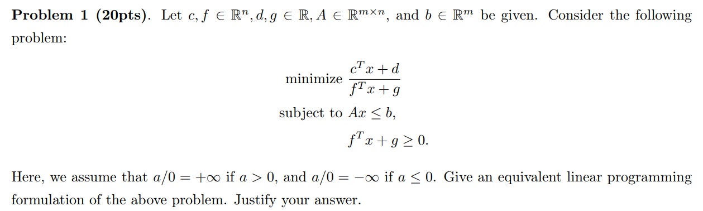
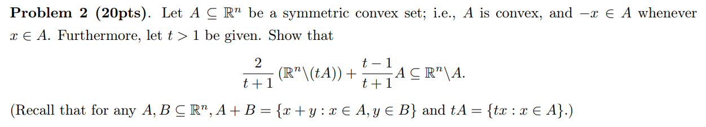
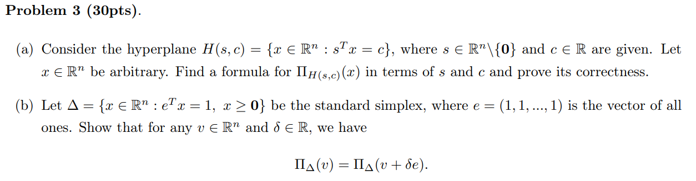
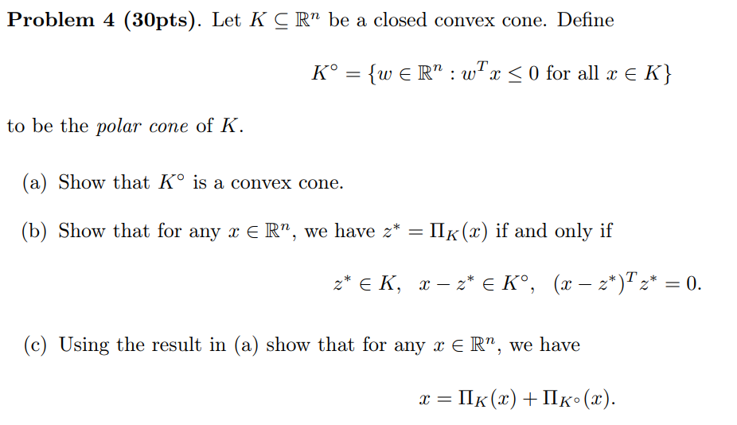

HW1 for MAT8060

**Problem 1**

Let $m = \frac{1}{f^Tx+g}, y=mx$, then we can rewrite the problem as a linear programming formulation:

$$
\begin{aligned}
\text{minimize }& \ c^T y+dm \\
\text{s.t. }& \ 
\left\{
\begin{matrix}
    Ay-bm &\leq 0 \\
    m& \geq0 \\
    c^T y+dm &= 1
\end{matrix}
\right.
\end{aligned}
$$

**Problem 2**

$$\begin{aligned}
\forall x_1\in\mathbb{R}^n\backslash tA,\forall x_2\in \text{A}，& \text{we need to prove }  \frac{2}{t+1}x_{1}+\frac{t-1}{t+1}x_{2}\notin A \\
\text{let } & m = \frac{2}{t+1}x_{1}+\frac{t-1}{t+1}x_{2} = \frac{2t}{t+1} \frac{x_{1}}{t}+\frac{t-1}{t+1}x_{2} \\
\text{Assume }& m \in \text{A}, \frac{x_{1}}{t}=\frac{t+1}{2t}m-\frac{t+1}{2t}x_{2}=\frac{t+1}{2t}m+(1-\frac{t+1}{2t})(-x_{2}) \\
&\text{Since A is a symmetric convex set, } -x_2 \in \text{A}\\
\text{Because }& m \in \text{A} \text{ and } -x_2 \in \text{A}, \frac{t+1}{2t}+(1-\frac{t+1}{2t})=1,\frac{t+1}{2t}>0,1-\frac{t+1}{2t}>0\\
\text{Thus }&  \frac{x_{1}}{t} \in \text{A, which is contradict with } \frac{x_1}{t} \in R^n \backslash A\\
\text{Thus }& m = \frac{2}{t+1}x_{1}+\frac{t-1}{t+1}x_{2} \notin \text{A, which is } \frac2{t+1}\left(R^n\setminus(tA)\right)+\frac{t-1}{t+1} A\subseteq R^n\setminus A
\end{aligned}
$$

**Problem 3**

(a)

$\Pi_{H(s,c)}(x)$ satisfies $\left[||s||\frac{x-\Pi_{H(s,c)}(x)}{||x-\Pi_{H(s,c)}(x)|}\right]^{T}m=c \quad (m\in H(s,c))$, $s$ is the normal vector of hyperplane

Let $w=\frac{\|s\|}{\|x-\Pi_{H(s,c)}(x)\|}, \quad z^{*} \triangleq \Pi_{H(s,c)}(x)$, then the above equation can be rewrited as $(x-z^{\star})^T m=\frac cw$.

Since $H(s,c)$ is a hyperplane, $\forall m \in H(s,c), \text{ we have } \theta z+(1-\theta)z^*\in  H(s,c) \quad(\theta \in [0,1]) $,

$$
\begin{aligned}
&(x-z^\star)^T(\theta z+(1-\theta)z^\star)=\frac cw \\
\Longrightarrow \ & \theta(x-z^{\star})^T(z-z^{\star})+(x-z^{\star})^Tz^{\star}=\frac cw \\
\Longrightarrow \ & \theta\left(x-z^{\star}\right)^T(z-z^{\star})=0 \\
\Longrightarrow \  & (x-z^{\star})^T(z-z^{\star})=0\leq0
\end{aligned}
$$

Since $H(s,c)$ is a nonempty, closed and convex, therefore $z^* \text{ is the } \Pi_{H(s,c)}(x)$

(b) 

Let $z^* = \Pi_{\Delta}(v) $

$$\begin{aligned}
(z-z^*)^T(v+\delta e-z^*) &=  (z-z^*)^T(v-z^*) + (e^Tz-e^Tz^*)^T\delta \\
&= (z-z^*)^T(v-z^*)
\end{aligned}
$$

Thus $\Pi_\Delta(v)=\Pi_\Delta(v+\delta e).$

**Problem 4**

(a)

*convexity*: $\forall w_1,w_2 \in K^{\circ} , \theta \in [0,1]$, $\theta(\theta w_1 x+(1-\theta)w_2 x) \leq 0 \in K^{\circ} $

*Conicity*: $\forall w_0 \in K^{\circ}, \text{non-negative} c, c \cdot w_0x \leq 0 \in K^{\circ} $

Thus, $K^{\circ}$ is a convex cone

(b)

**$\Longleftarrow$**, since $z^*\in K,\quad x-z^*\in K^\circ$, we have $ (x-z^*)^Tz^* \leq 0$.

therefore, $\forall z\in K, (z-z^*)^T(x-z^*) = z^T(x-z^*)-z^{*T}(x-z^*)= z^T(x-z^*) \leq 0 $,

thus, $z^*=\Pi_K(x)$

**$\Longrightarrow$**, $\forall z \in K, \text{ we have } (z-z^*)^T(x-z^*) \leq 0 $

Since $K$ is a convex cone, let $z = \theta_1 z^*, \theta_1 > 1$, then we have 

$$
(\theta_1 -1)z^{*T}(x-Z^*) \leq 0 \Longrightarrow z^{*T}(x-Z^*) \leq 0
$$

Then let $z=\theta_2 z^*, \theta_2 \in [0,1]$, we hav e

$$
(\theta_2 -1)z^{*T}(x-Z^*) \leq 0 \Longrightarrow z^{*T}(x-Z^*) \geq 0
$$

Thus, $z^{*T}(x-Z^*) = 0$, therefore, $(z-z^*)^T(x-z^*) = z^T(x-z^*)-z^{*T}(x-z^*)= z^T(x-z^*) \leq 0 \text{ for all } z$,

thus, $x-z^*\in K^{\circ}$

(c)

from (b). Let $z^* = \Pi_K(x)$, then $z_*^{\circ} = x - \Pi_K(x) = x - z^* \in k^{\circ}$, 

for $\forall z_0 \in K^{\circ}$, we have

$$\begin{aligned}
(z_0-z_0^*)^T (x-z_0^*) &= (z_0+z^*-x)^T(x-x+z^*) \\
&= z_{0T}z^*+ (z^*-x)^T z^*\\
&= z_{0T}z^* \quad \text{from (b)}
\end{aligned}
$$

from (a) we have, $z_0^T z^* \leq 0$

thus, $(z_0-z_0^*)^T (x-z_0^*) \leq 0 \Longrightarrow z_0^* = \Pi_{K^{\circ}} = x-\Pi_K(x)  \Longrightarrow x = \Pi_{K^{\circ}} + \Pi_K(x) $

