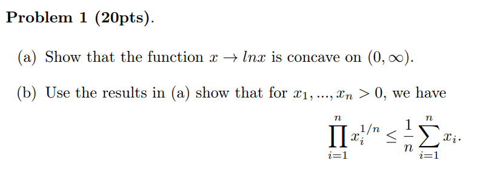
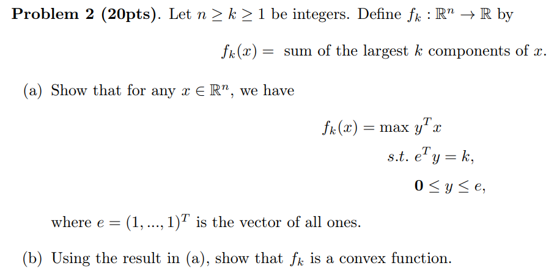
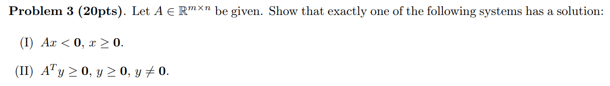
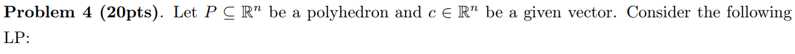
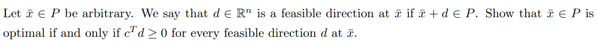
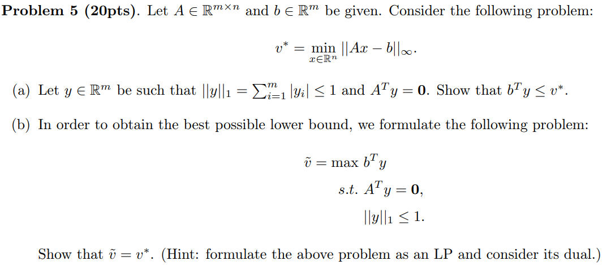

HW2 for MAT8060

**(a)**

$$
\begin{aligned}
    \text{Let } & f(x) = lnx, \text{when } x \in (0,\infty) \\
    & f'(x) = \frac{1}{x}, f''(x) = - \frac{1}{x^2} < 0\\
    & \text{Thus, function } x \rightarrow lnx \text{ is concave } 
\end{aligned}
$$

**(b)**

Since in (a), $f(x) $ is concave, thus:

$$
\begin{aligned}
& f( \frac{1}{n} \sum_{i=0}^N x_i) \geq \frac{1}{n} \sum_{i=0}^N f(x_i) \\
\Longrightarrow \ & ln( \frac{1}{n} \sum_{i=0}^N x_i) \geq ln(\prod_{i=0}^N x_i^{\frac{1}{n}}) \\
\text{Since } f(x) \text{ is monotonic in }& (0,\infty),  \text{ Thus } \frac{1}{n} \sum_{i=0}^N x_i \geq \prod_{i=0}^N x_i^{\frac{1}{n}}
\end{aligned}
$$

**(a)**

For any given $x \in \mathbb{R}^n$, denote the largest $k$ elements as:

$$
x_1 \geq x_2 \geq x_3 \geq x_4 \cdots \geq x_k 
$$

Since $e^T y = k, 0\leq y \leq e$, thus:

$$
y^T x \leq \sum_{i=1}^K x_i = \text{max } y^T x
$$

which is exactly $f_k(x)$

**(b)**

From (a), we have $f_k(x) = \text{max } y^Tx$, then for any $x_1,x_2 \in \mathbb{R}^n$, we have:

$$
\begin{aligned}
    &f_k \left(\lambda x_1 + (1-\lambda x_2)\right) = y_0^T ( \lambda x_1 + (1-\lambda) x_2 ), \ \lambda \in (0,1) \\ 
    =& \ \lambda y_0^T x_1 + (1-\lambda) y_0^T x_2 \leq \lambda \text{ max } y_0^Tx_1 + (1-\lambda) \text{ max } y_0^Tx_2 \\
    & \text{ which is } \lambda f_k(x_1) + (1-\lambda) f_k(x_2)
\end{aligned}
$$

thus, $f_k(x)$ is convex.

First, prove the following systems can not both hold.

For (I), mutiply $y, y > 0$ then get $y^T Ax < 0$.

For (II), multiply $x,x\geq0$ then get $y^TAx \geq 0$.

Considering both then get $y^TAx = 0$, however, $y \neq 0 \text{ and } Ax < 0$, which means they can not both hold.

Second, prove when (I) does not hold, then (II) holds.

Reformualte (I) as $(A,I) \left.\left( \begin{matrix} s \\ x \end{matrix}\right.\right)=0, x\geq0,s\geq0$.

Denote $V =\left\{ x,s: (A,I) \left.\left( \begin{matrix} s \\ x \end{matrix}\right.\right), x\geq 0,s\geq0 \right\} $. Since (I) does not hold, then $0\notin V$

It is easy to show $V$ is convex set, then prove $V$ is closed.

Let $\{y^K\} \in V, \text{ s.t. } y^k \rightarrow y $.

Consider the optimazition problem:

$$
\text{min} ||y - (A,I) \left.\left( \begin{matrix} s \\ x \end{matrix}\right.\right)||_{\infty}, \quad \text{s.t. }  x\geq0, s\geq0
$$

the problem can be formulated as:

$$
\begin{aligned}
&\text{min }t\\
&t\geq y_i-(Ax+s);\quad&i=1,\ldots,m\\&t\geq-y_i+(Ax+s);\quad&i=1,\ldots,m\\&x\geq0,s\geq0, t\geq0.\end{aligned}
$$

the feasible set for this problem is polyhedron which not contains line, therefore, the problem has optimal solution, denoted as $(\left.\left(\begin{matrix}x^{*}\\s^{*}\end{matrix}\right.\right),t^*)$

if $t^* > 0$, since $y^k \rightarrow y$, there $\exist \ y'_k \text{ s.t. } ||y - y'_k||_{\infty} = t' < t^* $, which means t^* is not optimal.

Therefore $t^* > 0 \Longrightarrow y = (A,I)\left.\left(\begin{matrix}x^{*}\\s^{*}\end{matrix}\right.\right) \in V $.

According to point-set seperation theorem, $\exist y \in R^m, \text{ s.t. } y^T(A,I)\left.\left(\begin{matrix}x\\s \end{matrix}\right.\right) > y^T 0 = 0, \text{ where } x\geq 0, s>0 $, then $(y^TAx,y^Ts)>0 \Rightarrow y^TA\geq0,y>0$

if $\bar{x}$ is optimal, $c^T\bar{x} = \underset{x \in P}{\text{min} }\ c^T x $, then $\forall \ \bar{x} + d \in P, d\in \mathbb{R}^n $

$$
c^T (\bar{x}+d) \geq c^T \bar{x} \Longrightarrow \ c^Td \geq 0 
$$

if $\exist c^T d^*  < 0$, then denote $x^* = \bar{x} + d$, then we have:

$$
c^T x^* = c^T (\bar{x}+d^*) < c^T \bar{x}
$$

which means $\bar{x}$ is not optimal.

**(a)**

Let $x^*$ be the optimal solution, $ V^* = || A x^* - b ||_{\infty}, Z^* = A x^* - b , \ |z_j| \geq |z_i| \ (i=1,\cdots,m) $, then $ V^* = |z_j|$.

$$
\begin{aligned}
    & y^T Z^* = y^T A x^* - y^T b = - y^T b \\
    \Longrightarrow \ & y^T b = - y^T Z^* = - \sum_{i=1}^m y_i z_i \leq - \sum_{i=1}^m |y_i | | z_i|  \leq |z_j|  \sum_{i=1}^m |y_i | \leq |z_j| = V^*
\end{aligned}
$$

**(b)**

The formulation of this problem is :

$$
\tilde{V}=-\min{(-b^T,b^T,0)} \left.\left(\begin{matrix}y^{+}\\ y^{-} \\m\end{matrix}\right.\right) \\
s.t.\quad(A^T+z_ne^{\prime},-A^T-z_ne^{\prime},z_n)^{\prime}\left.\left(\begin{matrix}y^{+}\\ y^{-} \\m\end{matrix}\right.\right)=z_n\quad,y^+,y^-,m \geq 0
$$

where  $z_n \in \mathbb{R}^{n\times1} $ which last element is 1 and other elements are 0.

Its dual problem is:

$$
\begin{aligned}-\max& \ y^TI_n\\ s.t. \ &y^T(A^T+z_ne^{\prime},-A^T-z_ne^{\prime},z_n)\leq(-b^T,b^T,0)\end{aligned}
$$

then, 

$$
\begin{cases}y^TA^T+y^Tz_ne^{\prime}&\leq-b^T\\-y^TA^T-y^Tz_ne^{\prime}&\leq b^T\\y^Tz_n&\leq0\end{cases}\Rightarrow\begin{cases}-y^TA^T&\geq b^T+y_ne\\-y^TA^T&\leq b^T+y_ne\\y_n&\leq0&\end{cases} \Rightarrow \begin{cases}y^{T}A^{T}-b^{T}&=y_{n}e\\y_{n}&\leq0\end{cases}
$$

Let $m = -y$, then the dual problem can be formualted as:

$$
\begin{aligned}\tilde{V}=\min m^{T}I_{n}=z_{n}\\s\cdot i\cdot \begin{cases} Az-b=z_{n}e\\z_{n}\geq0 \end{cases} \end{aligned}
$$

The dual problem has conditions: $ Am-b=z_n e, z_n \geq 0$. The original problem min $||Am - b||_{\infty} =\text{min} \ z_n $, thus, $\forall m \in \mathbb{R}^n$, we have $\tilde{V} \geq V^*$, $\tilde{V} \leq V^*$, which means $\tilde{V} = V^*$

