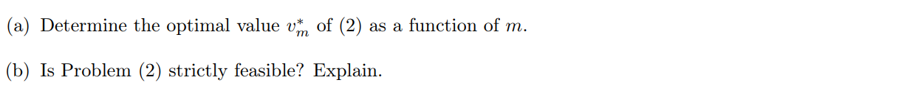

HW3 for MAT8060

**(a)**

$$
\begin{align*}
    Q = L^TL, x^TQx\leq t &\ \Rightarrow \ (LX)^T (LX) \leq t \ \Rightarrow \ ||LX||_2^2 \leq t \\
    &\ \Rightarrow \left(\begin{matrix}{1}&{0_{1\times n}}\\{0_{n\times 1}}&{L}\\\end{matrix}\right)\left(\begin{matrix}{t}\\{x}\\\end{matrix}\right) \in Q^{n+1}
\end{align*}
$$

satisfy SOC-representable

**(b)**

$$
\begin{align*}
    &t\leq\sqrt{x_{1}x_{2}}\Rightarrow t^{2}\leq x_{1}x_{2}\Rightarrow4t^{2}\leq4x_{1}x_{2} \\
    & \Rightarrow(x_{1}-x_{2})^2+(2t)^{2}\leq x_{1}^{2}+x_{2}^{2}+2xx_{2}\\
    & \Rightarrow\|(x_{1}-x_{2},2t)\|_{2}\leq x_{1}+x_{2} \\
    & \Rightarrow \left(\begin{matrix}0 & 1 &1\\{0}&{1}&-1\\{2}&{0}&{0}\\\end{matrix}\right) \left(\begin{matrix}{t}\\{x}_{1}\\{x}_{2}\\\end{matrix}\right)\in\mathbb{Q}^{3}
\end{align*}
$$

satisfy SOC-representable

denote $a^{*}=(a^1,\cdots,a^{T}),b^{*}=(b_{1},\cdots,b_{j})^{\prime}$

then 

$$
\begin{aligned}
    a^Tx\leq b &\Rightarrow a^Tx-b\leq0\Rightarrow(a^0+\sum_{j=1}^T\xi_ja^j)x-(b_0+\sum_{j=1}^T\xi_jb_j)\leq0 \\
    & \Rightarrow (a^{0}x-b_{0})+\xi^{\prime}(a^{\ast}x-b^{\ast})\leq0 \\
\end{aligned}
$$

thus 
$$
\begin{cases}y_{0}+\xi^{\prime}y^*\leq0 \quad \forall \xi \in B=\{\xi\in R^{l}:Q\xi\leq \xi\}\\y_{0}=a^{0}x-b_{0}\\y_{0}^{*}=a^{*}x-b^{*}\end{cases}
$$

**(a)**

$$
\begin{align*}
    \left|\begin{array}{cc}1&y_{k-1}\\y_{k-1}&y_{k}\end{array}\right|\geq0&\Rightarrow y_{k}\geq y_{k-1}^{2} \\
    \left[\begin{array}{cc}1&2\\2&y_1\end{array}\right]\geq0&\Rightarrow y_1\geq0 \text{ and } y_1\geqslant4\Rightarrow y_1\geqslant4
\end{align*}
$$

thus, $V_m^* = 2^{(2^m)}$

**(b)**

it is strictly feasible

because $\begin{bmatrix}1&2\\2&y_1\end{bmatrix}\succeq\mathbf{0},\begin{bmatrix}1&y_{k-1}\\y_{k-1}&y_k\end{bmatrix}\succeq\mathbf{0}$, then $y_i > 0 \ (i=1,\cdots m)$,thus $\vec{y}\in\mathrm{int}{(R^{m})}$

**(a)**

rewirte the SDP as:

$$
\begin{aligned}
    V_{m}^{*}=&\text{inf }  c \circ x \\
    \text{s.t. } & E \circ x = 1\\
    & I_{ij}^{-} x \leq 0 \quad (i=1,\cdots,n, j=1,\cdots,n)\\
    & x \in S_t^n
\end{aligned}
$$

$E$ is the $n\times n$ identity matrix, $I_{ij}^{-}$ is the matrix that the i-th row, j-th column is $-1$ and the other element is $0$

According to the Lagrange function,

$$
g(\lambda,V,X)=c\circ x+\sum_{i=1}^{n}\sum_{j=1}^{n}\lambda_{ij}\cdot(I_{ij}^{-}\circ x)+V(E \circ x-1)+S-X(\begin{matrix}\lambda_{ij}\geq0\\S \succeq0\end{matrix})
$$

denote the feasible region of primal problem is $y, \Lambda = {\lambda_{ij}}$

$$
\begin{aligned}
    \sup_{\lambda,\nu,x \in y} [\text{inf} \ g(\lambda,\nu,x)]&=\sup_{\lambda,\nu,x \in y} \text{inf } \{[c-\Lambda-VE-S] \circ x + V \} \\
    &= \sup_{\lambda,v,s}\begin{cases}v&c-\Lambda-vE-s\geq0\\-\infty&\text{else}\end{cases}
\end{aligned}
$$

thus, the dual problem is 

$$
\begin{aligned}
    \text{max }& V \\
    & \text{ s.t. } S+\Lambda +VE \leq c \\
    & \lambda_{i,j} \geq 0 \\
    &S \succeq 0
\end{aligned}
$$

**(b)**

because 

$$
S+\Lambda+VE\leq C\Rightarrow S \circ x+\Lambda \circ x+VE \circ x\leq c \circ x\Rightarrow c \circ x-V\geq \Lambda \circ x+S \circ x.
$$

the duality gap is $\Lambda \circ x+S \circ x=tr( \Lambda x)+tr(S x)$

and $x\in y$, thus $tr(x)=1$, denote $I = \{i|x_ii \neq 0\}$, then $I \neq \emptyset$,

if we want $\begin{cases}\Lambda \circ x=0\\ S \circ x = 0\end{cases}$, then $\begin{cases}\lambda_{jj}=0,\\s_{jj}=0,\end{cases}j\in I$.