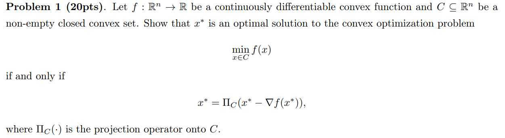
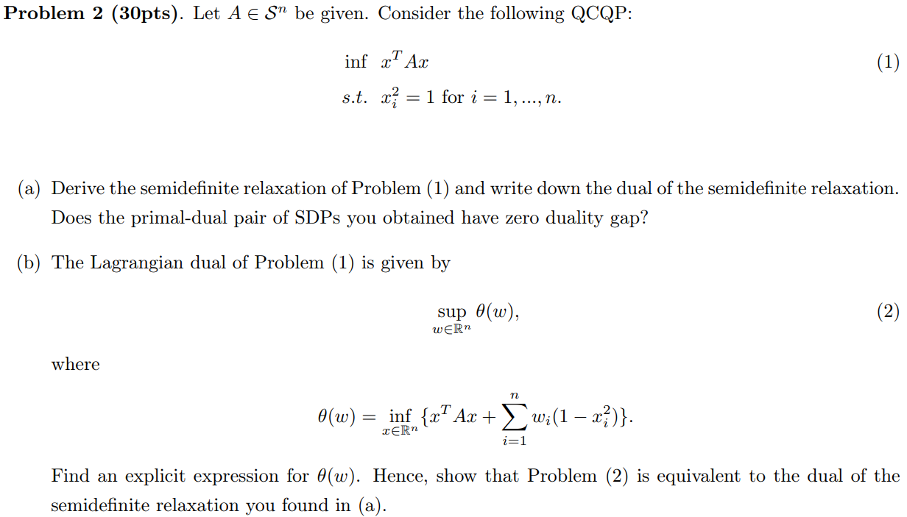
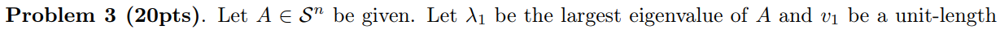
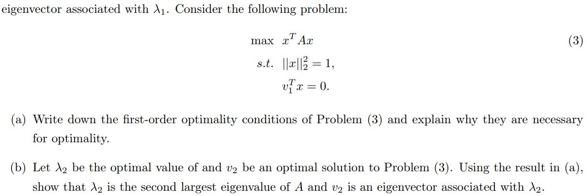
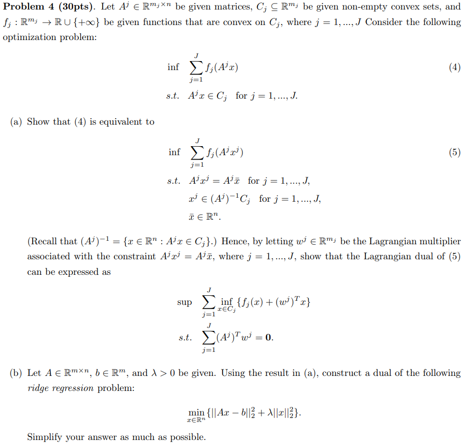

HW4 for MAT8060

**Necessity**

Assume $x^*$ is an optimal solution, thus for all $x\in C$, we have $f(x)\geq f(x^*), \nabla f(x^*)=0$. By the convexity of $f$, we have:

$$\begin{aligned}
    & f(x) \geq f(x^*)+\nabla f(x^*) (x-x^*) \\
    \Longrightarrow  & f(x) - f(x^*)\geq \nabla f(x^*) (x-x^*) = 0
\end{aligned}
$$

Thus,

$$
\begin{aligned}
    -\nabla f(x^*) (x-x^*) &= 0 \\
    [x^* -\nabla f(x^*) -x^*] (x-x^*)& = 0\\
    \Rightarrow [x^* -\nabla f(x^*) -x^*] (x-x^*)& \leq 0
\end{aligned}
$$

Due to the projection theorem, $x^*=\Pi_C(x^*-\nabla f(x^*))$

**Sufficiency**

If $x^*=\Pi_C(x^*-\nabla f(x^*))$, due to the projection theorem:

$$
\begin{aligned}
    [x^* -\nabla f(x^*) -x^*] (x-x^*)& \leq 0 \\
    \nabla f(x^*) (x-x^*) &\geq 0
\end{aligned}
$$

Due to the convexity of $f$:

$$
f(x) - f(x^*)\geq \nabla f(x^*) (x-x^*)
$$

Then $f(x) \geq f(x^*) \Longrightarrow \underset{x \in C}{\min} = f(x^*)$

>　什么意思，这个 rank 就直接给去掉了？

**(a)**

We introduce a new matrix variable $X = x^T x$, then the original question can be rewritten as:

$$
\begin{aligned}
    \inf & \ \text{Tr} (AX) = AX \\
    \text{s.t. }& X_{ii} = 1, \text{ for } i = 1,\cdots n\\
    &\text{rank}(X) = 1  \\
    & X \succeq 0
\end{aligned}
$$

So its semidefinite relaxation is:

$$
\begin{aligned}
    \inf \  & AX \\
    \text{s.t. }& X_{ii} = 1\\    
     & X \succeq 0
\end{aligned}
$$

The dual problem of the SDP becomes:

$$
\begin{aligned}
    \sup \ & e^T y \\   
    \text{s.t. }& \sum_{i=1}^n y_{ii} + S = A \\
    & S \in S^n_+, y \in R
\end{aligned}
$$

**(b)**

$$
\begin{aligned}
    \theta(w)&=\inf_{\times tR^n}\{x^T Ax+\sum_{i=1}^nw_i(1-x_i^2)\}\\
    &=\inf_{\times tR^n}\{AX+\sum_{i=1}^nw_i(1-X_{ii}^2)\} \\
    &=\inf_{x\in R^n}\{(A-\sum_{i=1}^n \text{diag}(w_i))\cdot X+e^Tw\}
\end{aligned}
$$

dual:

$$\begin{aligned}
    \sup \ & e^T w \\
    \text{s.t. }& \sum_{i=1}^n \text{diag}(w_i) + S = A, S \in S^n_+
\end{aligned}
$$

which is the same in (a).

**(a)**

The objective function is continuous and differentiable, the range of $x$ is bounded and close, so this problem has optimal solution.

The primal problem can be rewritten as:

$$
\begin{aligned}
    -\min & - x^T Ax \\
    \text{s.t. } & ||x||_2^2 = 1 \\
    & v_1^T x = 0
\end{aligned}
$$

Its Lagrange is:

$$
\begin{aligned}
    L(x,w_1,w_2) &= - x^T Ax + w_1(||x||_2^2-1)+ w_2 v_1^T x \\
    \Longrightarrow & \frac{\partial L}{\partial x}=-2Ax+2w_1x+w_2v_1=0
\end{aligned}
$$

Its KKT conditions are:

$$
\begin{cases}-2Ax+2w_{1}x+w_{2}v_{1}=0\\\|x\|_{2}^{2}=1\\v_{1}^{T}x=0\end{cases}
$$

These conditions ae neeessarry to make sure the its optimality.

**(b)**

Substitute the FOC into objective funciton and then we have :

$$
x^TAx=x^T(w_1x+ \frac{1}{2} w_2v_1)=w_1x^Tx+ \frac{1}{2} w_2 x^T v_1 = w_1
$$

which means:

$$
\begin{aligned}
    x^T Ax=w_1 \Rightarrow Ax = w_1 x
\end{aligned}
$$

w_1 is the eigenvalue of A. So the primal problem is to find the largest eigenvalue under certain constraints. Thus, if $\lambda_2$ be the optimal value and $v_2$ be an optimal solution, they are both the second largest.

**(a)**

For equation 5, we have:

$$
\begin{aligned}\theta(w)&=\inf_{\begin{array}{c}x^j\in(A^j)^{-1} c_j\\\bar{x}\in R^n\end{array}}\left\{\sum_{j=1}^{J}f_j(A^jx^j)+\sum_{j=1}^{J}(w^j)(A^jx^j-A^j \bar{x} )\right\}\\
&= \inf_{\begin{array}{c}x^j\in(A^j)^{-1} c_j\\\bar{x}\in R^n\end{array}} \sum_{j=1}^{J}[f_{j}(x_j)+(w^{j})^{T}x_{j}]-\sum_{j=1}^{J}(w^{j})^{T} A^j \bar{x} \\
&= \begin{cases}\sum_{j=1}^{T} \underset{x \in c_j}{\inf} [f_{j}(x)+(w^{j})^{T}x], \quad \sum_{j=1}^T (A_j)^T w^j = 0 \\\\-\infty \quad \mathrm{otherwise}\end{cases}
\end{aligned}
$$

Thus, equation 5 has its dual:

$$
\begin{aligned}
    \sup & \sum_{j=1}^J \underset{x \in c_j}{\inf} {f_j(x) + (w^j)^T x} \\
    \text{s.t. }& \sum_{j=1}^J (A^j)^T w^j = 0
\end{aligned}
$$

**Necessity**

if $x$ is a feasible solution of (4), i.e. $A^j x \in c_j, j=1,\cdots T$. Then $\forall j$, we have $x^j = x, \bar{x}=x$, then $A^jx^j=A^j\overline{x}=A^jx$. Since $A^jx^j=A^j x \in c_j$, we have $x^j \in (A^j)^{-1}c_j, \forall j$, thus $x^j, \bar{x}$ are feasible solution of (5)

**Sufficiency**

if (5) has feasible solution $x_j,\bar{x}$, i.e. $A^j x = A \bar{x} $, and $x^j \in (A^j)^{-1},\forall j$. Let $x = \bar{x}$, then $A^j x = A^j \bar{x} = A^j x_j \in c_j$, which is a feasible solution of (4)

**(b)**

$$
\min_{x \in R^n}\{||Ax-b||_2^2+\lambda||x||_2^2\} = \begin{aligned} \underset{x\in R^n}{\inf} & \{\lambda||x||_{2}^2\}\\ \text{s.t. }& Ax=b\end{aligned}
$$

from the conclusion in (a), the dual problem can be written as:

$$
\begin{aligned}
    \sup & \underset{x \in R^n}{\inf} {\lambda ||x||^2_2} + w^T x \\
    & \text{s.t. } A^T w= 0
\end{aligned}
$$

