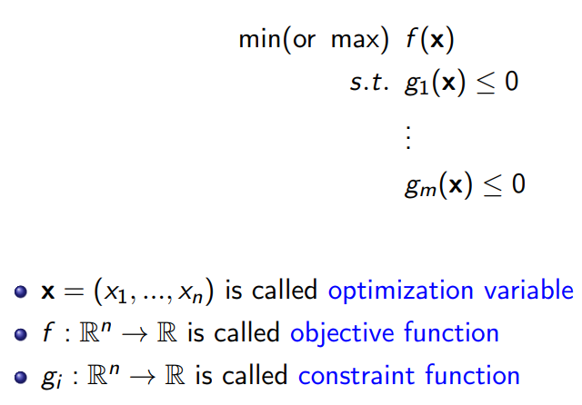
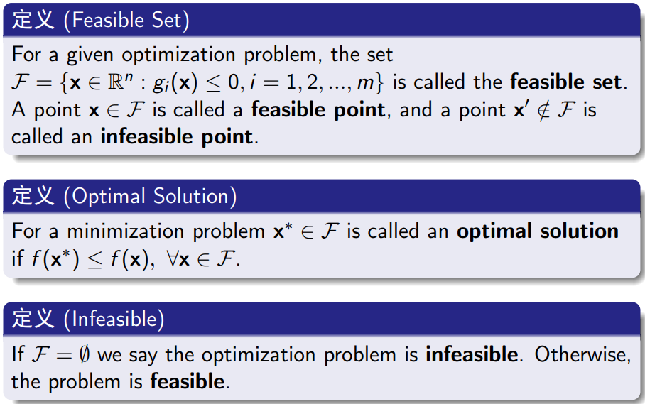
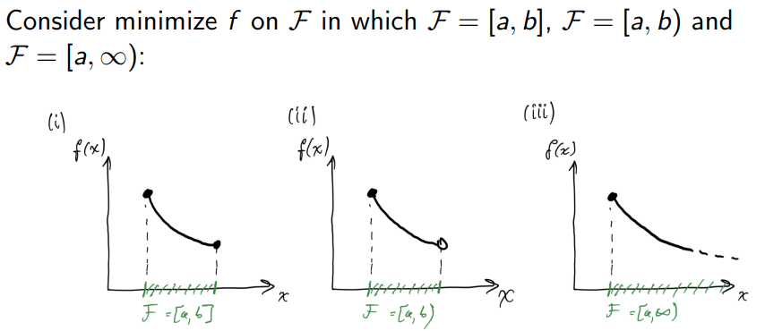
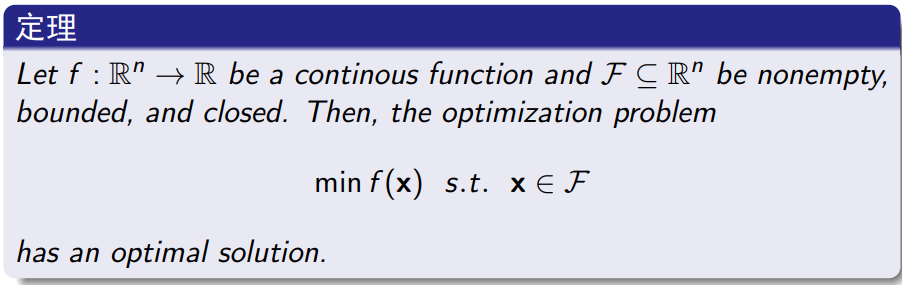
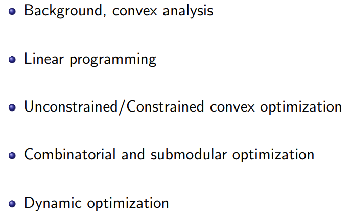

# Foundations of Optimization

A convex optimization problem is one in which the objective and constraint functions are convex, which means they satisfy the inequality

$$
f_i(\alpha x+\beta y)\leq\alpha f_i(x)+\beta f_i(y)
$$

for all $x,y\in\mathbf{R}^{n}$ and all $\alpha,\beta\in\mathbf{R}^{n}$, $\alpha+\beta=1,\alpha\geq0,\beta\geq0.$

and a linear program satisfy 

$$
f_i(\alpha x+\beta y)=\alpha f_i(x)+\beta f_i(y)
$$

for all $x,y\in\mathbf{R}^{n}$ and all $\alpha,\beta\in\mathbf{R}^{n}$.

Thus, **convex optimization can be considered as a generalization of linear programming**.

优化可分为四种：

- **Linear Optimization** 局部最优即是全局最优
- **Non-Linear Optimization** 局部最优不一定是全局最优
- **Integer/Discrete Optimization** 定义域非实数，而是整数或离散
- **Stochastic/Dynamic Optimization** 涉及随机变量或多阶段优化

#### 优化问题 <!-- {docsify-ignore} -->

> [!NOTE]
> 注意到在集合 X 上，函数 f 的最小（最大）值不一定存在，但是其下（上）确界“inf $f$(sup $f$)”总是存在的．因此，当目标函数的最小（最大）值不存在时，我们便关心其下（上）确界，即将问题中的 “min(max)” 改为 “inf(sup)”。

#### 部分定义 <!-- {docsify-ignore} -->

*An feasible problem always have an optimal solution?*

Nope

### Some concepts

- A set $\mathcal{F}$ is **closed** if it contains all its limit points.

- A set $\mathcal{F}$ is **bounded** if $\exists \ k>0$ (ball in $\mathbb{R}^n$ with radius $k$). If there is no such $k$ then $\mathcal{F}$ is unbounded.

#### Bolzano-Weierstrass theorem

*Every bounded sequence in $\mathbb{R}^n$ has a convergent sub-sequence.* 

该定理讨论有限维欧氏空间中的收敛问题。

> [!TIP|label:Proof]
> For bounded infinite sequence ${X_n} \in [a,b]$, we split it in the middle. Because sequence ${X_n}$ has infinitely many members, there must be (at least) one of these subintervals that contains infinitely many members, for the infinite subinterval $[a_1,b_1]$, we split it and get a infinite subinterval again and again. Thus we get a sequence of nested intervals $[a_n,b_n]$.
>
> Because $a_n$ and $b_n$ are monotonically increasing or decreasing and both bounded, so there must be a convergence $x^*$ for the bounded infinite sequence subinterval $[a_n,b_n]$.

#### Boundedness Theorem

*Let $f:\mathbb{R}^n\to\mathbb{R}$ be a continuous function and $\mathcal{F}\subseteq\mathbb{R}^n$ be nonempty, bounded, and closed. Then $f$ is bounded on $\mathcal{F}$.*

#### Sufficient Condition for Optimality

*When do we have optimal solution?*

### Roadmap

