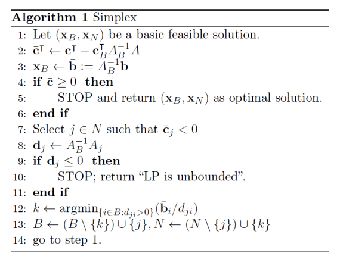

# Foundations of Optimization 10

## How to solve LP?

LP has an optimal solution which is an **extreme point** of the feasible region

### Basic Feasible Solutions

$$
\begin{aligned}\min \ &\mathrm{c^Tx}\\ \text{s.t. }&\mathrm{Ax=b}\\&\mathrm{x\geq0}\end{aligned}
$$

- Assume that $A$ is a $m \times n$ matrix, $m \leq n, rank(A) = m$
- Pick a set of indices $B\subseteq[n]$ that correspond to $m$ linearly independent columns of the matrix $A$
- We can split the matrix $A$, objective coefficients and the decision vector:

$$
A=(A_B|A_N),\quad\mathrm{x=\begin{pmatrix}x_B\\x_N\end{pmatrix},}\quad\mathrm{c=\begin{pmatrix}c_B\\c_N\end{pmatrix}}
$$

Then we can write the constraints as

$$
(A_B|A_N)\cdot\begin{pmatrix}\mathrm{x}_B\\\mathrm{x}_N\end{pmatrix}=\mathrm{b}
$$

If $\mathbf{x}_B=A_B^{-1}\mathbf{b}\geq0$, then $(\mathrm{x}_B,\mathrm{x}_N)=(A_B^{-1}\mathrm{b},0)$ is a **basic feasible solution**

- To find an optimal solution, it is sufficient to search over the basic feasible solutions to find the optimal one
- The method for iterating through basic feasible solutions is called a **pivot rule**.

### Simplex Algorithm

The simplex method returns the optimal solution, if that exists. That is, if $c^T-c_B^TA_B^{-1}A\geq0$ then the solution is optimal

> [!TIP|label:Proof]
> For a BFS $(A_B^{-1}b,0)^T$, the objective function is $c_B^TA_B^{-1}b$. $y^Tb = c^Tx = c_B^TA_B^{-1}b$ 
>
> Note that the dual form: $\text{max } y^Tb, \text{s.t. } y^TA \leq c^T$
>
> If $y^T = c_B^TA_B^{-1}$ is feasible for the dual, the $(A_B^{-1}b,0)$ is optimal. That is if $c_B^TA_B^{-1} A \leq c^T \Leftrightarrow \bar{c}^T = c^T - c_B^TA_B^{-1} A \geq 0$, then we find optimal sales.
>
> Otherwise, we can select $j \in N, \text{ s.t. } \bar{c}_j < 0$.
>
> We want to move from current BFS $x(B)$ to another BFS $x(\hat{B})$ with smaller objective. i.e. $x(\hat{B}) = x(B) + t\Delta$, where $t\geq 0, \Delta \in \mathbb{R}^n$ is a direction.
>
> Note that we have to make sure $Ax(\hat{B}) = b, \text{ i.e. } tA \Delta = 0$ and $c^T x(\hat{B}) < c^T x(B) \text{ i.e. } tc^T  \Delta <0 \Longrightarrow (c_{B}^{T},c_{N}^{T})\cdot\Delta<0$
>
> Note that we already have $c^T_j - c_B^TA_B^{-1} A_j < 0$
>
> Then we define $\Delta = (-A_B^{-1} A_j,0,\cdots \underset{j-th \ row}{1}\cdots 0)^T \ \Longrightarrow \text{ satisfy } c^T \Delta <0$
>
> $A \Delta = (A_B,A_N)(-A_B^{-1} A_j,0,\cdots 1,\cdots 0)^T = -A_j+A_j = 0 \Longrightarrow \text{ satisfy } A\Delta = 0$
>
> Next, we only need to control the value of $t$ to make sure $X(\hat{B}) \geq 0$
>
> Let $d_j = A_B^{-1} A_j \in \mathbb{R}^m$
>
> If $d_j \leq 0$, then we can move alont $\Delta$ with infinitely large $t \Rightarrow$ the problem is unbounded
>
> Otherwise, we can choose $k=\mathrm{argmin}\left\{\frac{x_{i}}{d_{ji}}:\quad d_{ji}>0,\quad i \in B\right\}$ 【也就是说选那些最终乘积大于零的列作为basis】 and let $t = \frac{x_k}{d_{ji}}$
>
> Then we can make sure $x(\hat{B}) = x(B)+t \Delta \geq 0$
> 
> where the new basis $\hat{B} = B\cup\{j\}\setminus\{k\} $

### Simplex Tableau

when we have initial BFS:

$$
\begin{aligned}
\min \ &-x_1-3x_2 \\
\text{s.t. }&2x_1+3x_2\leq6  \\
&-x_1+x_2\leq1 \\
&x_1\geq0,x_2\geq0.
\end{aligned}
$$

when we do not have initial BFS:

$$
\begin{aligned}
\text{min } & -6x_1-6x_2-4x_3  \\
\text{s.t. } &4x_1+6x_2+2x_3+x_4=24  \\
&4x_1+4x_2+3x_3=20 \\
&2x_1+3x_2+x_3=8 \\
&x_1\geq0,x_2\geq0,x_3\geq0,x_4\geq0.
\end{aligned}
$$

## Zero-Sum Game

- Two Players
- Player 1 has $m$ possible choices
- Player 2 has $n$ possible choices
- When player 1 choose $i$-th move and player 2 choose $j$-th move, then player 1 has to pays $A_{i,j}$ to player 2

**Pure strategy** equilibrium may not exists: 

$$
\min_i\max_jA_{ij}\neq\max_j\min_iA_{ij}
$$

**Mixed strategy**: a distribution of moves

- Player 1’s distribution is $x\in \mathbb{R}^m$ with $x \geq 0 \text{ and } \sum_ix_i=1$
- Player 2’s distribution is $y\in \mathbb{R}^n$ with $y \geq 0 \text{ and } \sum_j y_j=1$
- The expected payoff from player 1 to player 2 is $\sum_{ij}x_iA_{ij}y_j=\mathrm{x}^\mathsf{T}A\mathrm{y}$

> [!THEOREM|label:Mixed Strategy Equilibrium]
> $ (\mathrm{x}^*,\mathrm{y}^*) $ is a mixed equilibrium iff
>
> 1. $\mathrm{x^*}^\mathsf{T}A\mathrm{y^*}\leq\mathrm{x^T}A\mathrm{y^*}$ for all player 1's distribution $x$
>
> 2. $\mathrm{x^{*T}}A\mathrm{y^*}\geq\mathrm{x^{*T}}A\mathrm{y}$ for all player 2's distribution $y$

We have:

$$
\min_{\mathrm{x}}\max_{\mathrm{y}}\mathrm{x}^{\mathrm{T}}A\mathrm{y}=\max_{\mathrm{y}}\min_{\mathrm{x}}\mathrm{x}^{\mathrm{T}}A\mathrm{y}
$$

> [!THEOREM|label: Min-Max, Von Neuman, 1930s]
>
> There always exists an mixed strategy equilibrium in two players zero-sum game.

What if the game is not zero-sum? John Nash defined a solution called **Nash equilibrium** in 1950s

