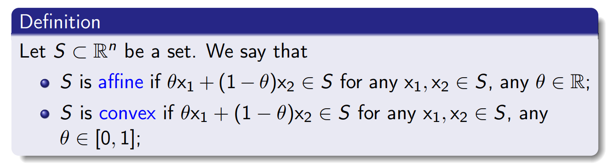
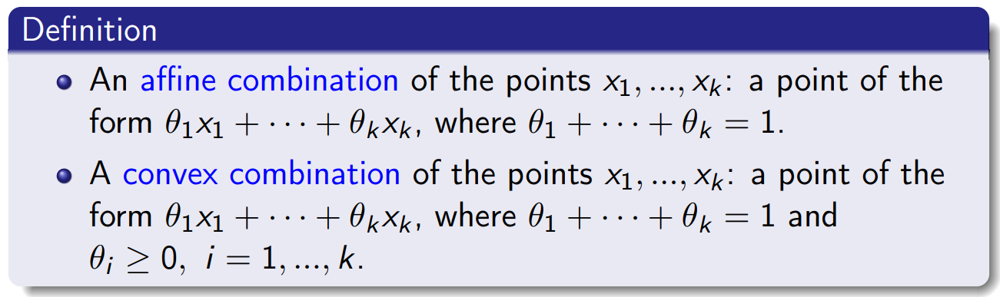
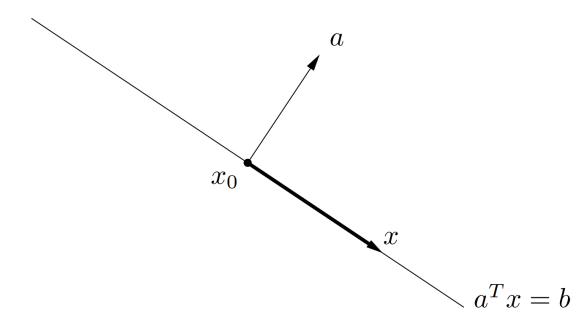
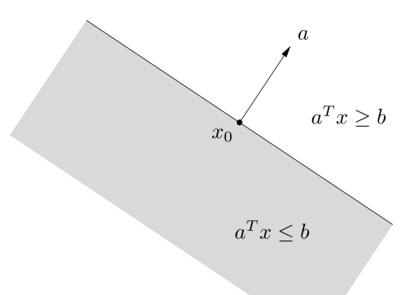
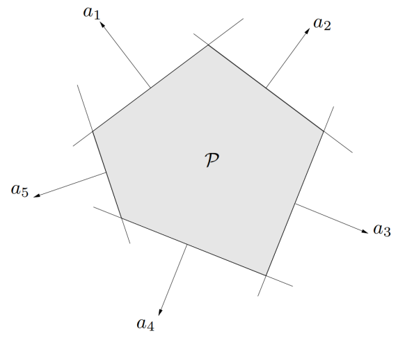

# Foundations of Optimization 2

## Affine and Convex Set

### Definition

By convention, the empty set $\emptyset$ is affine and also convex.

This idea can be generalized to more than two points.

#### Affine set 

**Proposition**

Let $S \subset \mathbb{R}^n $ be non-empty. The following are equivalent:

a. $S$ is affine

b. Any affine combination of points in $S$ belongs to $S$

c. $S$ is the translation of some linear subspace $V\subset\mathbb{R}^n$; i.e. $S$ is of the form $\{x\}+V=\{x+v\in\mathbb{R}^n:v\in V\}$ for some $x \in \mathbb{R}^n$

> Linear subspace: $\forall v_1, v_2 \in V, \forall \alpha, \beta \in R, \alpha v_1 + \beta v_2 \in V$

> [!TIP|label:Proof for proposition]
> **a => b** 
> 对于 $x=\sum_{i=1}^{m}\lambda_{i}\omega_{i}, w \in V $ 当 $m=1,2$ 时根据定义成立，接下来用数学归纳法证明，假设 $k=m$ 时成立，得证 $k=m+1$ 即可。
$$
y:=\sum_{i=1}^{m+1}\lambda_i\omega_i,\ \sum_{i=1}^{m+1}\lambda_i=1,\lambda_i\geq0
$$
> 如果 $\lambda_{m+1}=1$，则其余各项 $\lambda$ 为零，自然得证。当 $\lambda_{m+1}<1$ 时，有以下变换：
$$
\sum_{i=1}^m\lambda_i=1-\lambda_{m+1}\quad\mathrm{and}\quad\sum_{i=1}^m\frac{\lambda_i}{1-\lambda_{m+1}}=1,
$$
> 因此有：
$$
\begin{aligned}y=(1-\lambda_{m+1})\sum_{i=1}^m\frac{\lambda_i}{1-\lambda_{m+1}}\omega_i+\lambda_{m+1}\omega_{m+1}=(1-\lambda_{m+1})z+\lambda_{m+1}\omega_{m+1}\in V \end{aligned}
$$
> 因为当 $k=m$ 时成立，因此得证。
> 
> **b => c** 
> 
> Let $x \in S, \text{set} \ V = S - {x}$, we want to show $V$ is a linear subspace.
> 
> Let $v_1,v_2 \in S, \alpha, \beta \in R$, by definition, exist $z_1,z_2 \in S, \text{ s.t. } v_1 = z_1 - x, v_2 = z_2 - x_2$
> 
> use the fact that $z(t) = t z_1 + (1-t)z_2 \in S \text{ for any } t \in R $
> 
> we have 
$$\begin{aligned}
\alpha v_{1}+\beta v_{2}&=\alpha\left(z_{1}-x\right)+\beta\left(z_{2}-x\right)=\alpha z_{1}+\beta z_{2}+\left(1-\alpha-\beta\right)x-x\\
&=\alpha\left[(1-\beta)z_1+\beta z_2\right]+\beta\left[(1-\alpha)z_2+\alpha z_1\right]+\left(1-\alpha-\beta\right)x-x_{1} \\
&= \alpha \hat{z}_1 +\beta \hat{z}_2 + \left(1-\alpha-\beta\right)x-x_{1} \\
&= \overline{z}-x \quad \text{ where } \ \overline{z} \in S
\end{aligned}$$
> 
> **c => a**
>
> Suppose that $S = {x}+V$ for some $x\in R^n$ and linear subspace $V \in R^n$.
>
> Then for any $z_1,z_2 \in S$, there exist $v_1,v_2 \in V, \text{ s.t. } z_1 = x+v_1, z_2 = x+v_2$.
>
> Since $V$ is linear, for any $\alpha\in R$, we have $\alpha z_{1}+(1-\alpha)z_{2}=x+\alpha v_{1}+(1-\alpha)v_{2}\in S$
>
> By c, We refer to *an affine set as an affine subspace*.

**Example**

The solution set of a system of linear equations $C = {x|Ax = b} $, where $A \in \mathbb{R}^{m\times n} \text{ and } b \in \mathbb{R}^m $ is a affine set.

$$
\begin{aligned}
A(\theta x_1+(1-\theta)x_2)& =\quad \theta Ax_1+(1-\theta)Ax_2  \\
&=\quad \theta b+(1-\theta)b \\
&=\quad b
\end{aligned}
$$

We also have a converse: every affine set can be expressed as the solution set of a
system of linear equations

> [!NOTE|label:仿射集都是凸集？]
> Every affine set is also convex, since it contains the entire line between any two distinct points in it, and therefore also the line segment between the points
>
> 的确，相比凸集【$0< \lambda <1$】，仿射集要求更高【$\lambda \in \mathbb{R} $】，类似于，全科100的同学单科肯定也是100。

#### Convex set 

**Proposition**

Let $S \subset \mathbb{R}^n $ be arbitrary. The followings are equivalent:

a. $S$ is convex

b. Any convex combination of points in $S$ belongs to $S$.

> [!NOTE]
>  因此，可以理解为linear subspace > affine set > convex set

#### Affine hull and convex hull 

characterize from **inside**: Convex hull of a set $C$, denoted $\mathbb{conv} C$, is the set of all convex combinations of points in $C$:

$\mathbf{conv} C=\{\theta_1x_1+\cdots+\theta_kx_k\mid x_i\in C,\theta_i\geq0,i=1,\ldots,k,\theta_1+\cdots+\theta_k=1\}$

Actually, *convex hull is the smallest convex set that contains $C$*. Affine hull 同理，只是去除了权重非负的限制

characterize from **outside**, 也可以理解为：

包含了 $S$ 的最小凸集或仿射集

1. The **affine hull** of $S$, denoted by $aff(S)$, is the **intersection of all affine sub-spaces** containing $S$.

2. The **convex hull** of $S$, denoted by $conv(S)$, is the **intersection of all convex sets** containing $S$.

> the **intersection** of convex sets is still convex set 【not for union】

### Some important examples

#### Hyperplanes and Halfspaces <!-- {docsify-ignore} -->

**Hyperplanes**: convex and affine 

$H(a,b)=\{x\in\mathbb{R}^n|a^Tx=b\}\mathrm{~}a\neq0$

**Halfspaces**: convex but not affine

$H^-(a,b)=\{x\in\mathbb{R}^n|a^Tx\leq b\}$

#### Euclidean ball and Norm balls <!-- {docsify-ignore} -->

Euclidean ball with center $x_c$ and radius $r$:

$$
B(x_c,r)=\{x:\|x-x_c\|_2\leq r\}=\{x_c+ru:\|u\|_2\leq1\}
$$

> [!NOTE|label:Norm]
> a function norm $\left\|\cdot\right\|$ satisfies:
> - 正定： $\|x\|\geq0;\|x\|=0\mathrm{~iff~x=0}$
>
> - 齐次性： $\|tx\|=|t|\|x\|\mathrm{~for~}t\in\mathbb{R}$
>
> - 三角不等式： $\|x+y\|\leq\|x\|+\|y\|$

General norm ball with center $x_c$ and radius $r$:

$$
B(x_c,r)=\{x:\|x-x_c\|\leq r\}
$$

> [!TIP|label:Proof for convexity of norm ball]
> $x_1,x_2 \in B(x_c,r)$
$$
\begin{aligned}{||\theta x_{1}+(1-\theta)x_{2}-x_{c})||}&{{}\leq|| \theta x_{1}-\theta x_{c}||+||(1-\theta)x_{2}-(1-\theta) x_{c}||}\\&=\theta||x_1-x_c||+(1-\theta) || x_{2}-x_{c}|| \leq r
\end{aligned}
$$
> 

**Ellipsoid**: $E(x_c,Q)=\{x\in\mathbb{R}^n:(x-x_c)^TQ(x-x_c)\leq1\}$, where $Q$ is $n \times n$ symmetric, positive definite matrix ($x^TQx>0\mathrm{~for~all~}x\in\mathbb{R}^n\backslash\{0\}$), $Q = U\Lambda U^T$，特征值分解，其中 $U$ 为正交阵，$\Lambda$ 为对角矩阵

> [!TIP|label:Proof for normality of Ellipsoid]
> Define: $||x||_Q  = \sqrt{x^TQx} $, which is Mahalanobis norm 马氏范数
>
> $||x||_Q \geq 0 \text{ and } ||x||_Q =0 iff x=0; ||\alpha x||_Q =\sqrt{(\alpha x)^T Q (\alpha x)} = |\alpha| ||x||_Q $
>
> Triangle inequality: 
$$\begin{aligned}
& ||x+y||_{Q}^{2}=(x+y)^{T}Q(x+y)=x^{T}Qx+y^{T}Qy+2x^{T}Qy \\
=& ||x||_{Q}^{2}+||y||_{Q}^{2}+2x^{T}Q^{\frac{1}{2}}Q^{\frac{1}{2}}y \quad (Q^{\frac{1}{2}}=U\Lambda^{\frac{1}{2}}U^{T})  \\ 
=& ||x||_{Q}^{2}+||y||_{Q}^{2}+2||Q^{\frac{1}{2}}x||_{2}\cdot||Q^{\frac{1}{2}}y||_{2} \quad \text{ Cauchy-Schwarz inequality} \\
=& \|x\|_{Q}^{2}+\|y\|_{Q}^{2}+2\|x\|_{Q}\cdot\|y\|_{Q}=(\|x\|_{Q}+\|y\|_{Q})^{2}
\end{aligned}$$
>
> Thus, Ellipsoid is norm ball, then it is convex.

#### Polyhedron <!-- {docsify-ignore} -->

Polyhedron is intersection of *finite* number of halfspaces and hyperplanes

$$
Ax\leq b,\quad Cx=d
$$

where, $A\in\mathbb{R}^{m\times n},C\in\mathbb{R}^{p\times n}$

### Operations that Preserve Convexity

证明一个集合为凸集，有两种方式：

（1）利用定义
（2）简单的凸集【**hyperplanes, halfspaces, norm balls**】经过保凸运算【**intersection, affine function, perspective function**】后仍是凸集

