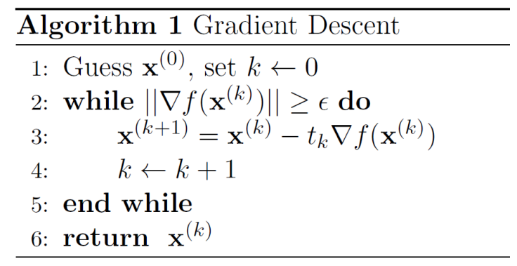

# Foundations of optimization 20

## Gradient Descent

Let $f: \mathbb{R}^n \rightarrow \mathbb{R}$ be a continuously differentiable convex function. For the unconstrained optimization problem:

$$
\min_{x\in\mathbb{R}^n}f(x)
$$

the optimization process could be:

- Start at an arbitrary point $x^0$
- Move along an descent **direction** $d^k$ at that point towards the next point by **step size** $t_k$
- repeat until (hopefully) converging to a stationary point

The process is:

$$
\mathrm{x}^{k+1}=\mathrm{x}^k+t_k\mathrm{d}^k
$$

Because of the convex definition,

$$
f(\mathrm{x}^{k+1})\geq f(\mathrm{x}^k)+\nabla f(\mathrm{x}^k)^Tt_kd^k
$$

the search direction must satisfy $\nabla f(x^k) d^k <0$. Then 

$$
\mathrm{x}^{k+1}=\mathrm{x}^k-t_k\nabla f(\mathrm{x}^k)
$$

**Setp size** is chosen according to exact line search

$$
t_k^*=\arg\min_{t\geq0}f(\mathrm{x}^k-t\nabla f(\mathrm{x}^k))
$$

**Stopping criterion**: $\|\nabla f(\mathrm{x})\|<\epsilon $

