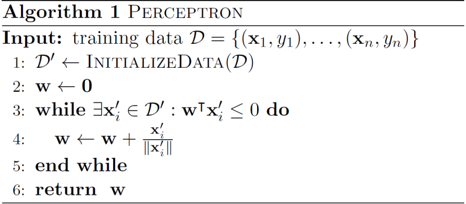

# Foundations of Optimization 5

> From separation theorm to Perceptrons Algorithm

## Separation theorem

Use projection theorems, we can derive separation theorems of convex sets.

### point-set separation

> [!Theorem|label:point-set separation]
> Let $S\subset\mathbb{R}^n$ be non-empty, closed and convex, $z\in S$. Furthermore, let $x\in\mathbb{R}^n\backslash S$ be arbitrary. Then, there exists a non-zero vector $y\in\mathbb{R}^n$ such that
$$
\max_{z\in S}y^Tz<y^Tx.
$$
> 

> [!TIP|label:proof]
> Since $S$ is non-empty, closed and convex. $\exists z^{*} \in S \text{ s.t. } z^{*}=\Pi_{s}(x)$
$$\begin{aligned}
& \text{Let } \ y = x - z^*, \text{then for } \ \forall z\in S, \text{we have } \ (z-z^*)^T (x - z^*) \leq 0 \\
& \text{that is } \ y^{T}z\leq y^T z^{*}=y^{T}x+y^{T}(z^{*}-x)=y^{T}x-\|y\|^{2}
\end{aligned}
$$
>
> Note that $x \notin S$, then $y \neq 0 $, then, $\max_{z\in S}y^{T}z=y^{T}z^{*}=y^{T}x-\|y\|^{2}<y^{T}x$

We will use it to establish several useful results.

> [!Theorem]
> A closed convex set $S\subset\mathbb{R}^n$ is the intersection of all the halfspaces containing $S$.

This suggests that at any boundary point $x$ of a closed convex set $S$, there should be a hyperplane supporting $S$ at $x$.

> the intersection of all surpporting points

> [!Theorem]
> Let $S\subset\mathbb{R}^n$ be non-empty, closed and convex. The for any $x \in relbd(S)$, there exists a hyper plane supporting $S$ non-trivially at $x$.

**Definition**

Let $S \subset \mathbb{R}^n$ be nonempty. We say that the hyperplane $H(s,c)=\{x\in\mathbb{R}^n|s^Tx=c\}$

- **supports** $S$ if $S$ is contained in one of the halfspaces defined by $H(s,c)$
- **supports** $S$ at $x\in S$ if $H(s,c)$ supports $S$ and $x \in H(s,c)$
- **supports** $S$ **non-trivially** if $H(s,c)$ supports $S$ and $S \notin H(s,c)$ 

> [!Theorem|label:set-set separation]
> Let $S_1,S_2 \in \mathbb{R}^n $ be nonempty, closed, and convex with $S_1\cap S_2=\emptyset$. Furthermore, suppose that $S_2$ is bounded. Then, there exists a non-zero vector $y\in \mathbb{R}^n$ such that: 
$$
\max_{z\in S_1}y^Tz<\max_{u\in S_2}y^Tu.
$$
> 

> The expansion of point-set seperation

## Perceptron algorithm

Overview: 

- Input: $\mathcal{D}=\{(x_1,y_1),...,(x_n,y_n)\}$ where $\mathrm{x_i}\in\mathbb{R}^d$ and $y_i\in\{0,1\}$

- Output: A weight vector $w$ and parameter $\alpha$, s.t. $w^T\mathrm{x_i}\geq\alpha$ for all $\{i:y_i=1\}$ and $w^T\mathrm{x}_j\leq\alpha$ for all $\{j:y_j=0\}$

> [!TIP]
> 应用 Perceptron algorithm 的前提是，该数据集是**线性可分**的

### Data initialization

> This step makes the process more elegant

1. rewrite the inequalities

令 $w$ 最后一列为参数 $\alpha$，$x$ 最后一列为 -1

$$
\left\{
\begin{matrix}
w \cdot x_i \geq \alpha \\
w \cdot x_j \leq \alpha \\
\end{matrix}
\right.

\quad

\Longrightarrow

\quad

\left\{
\begin{matrix}
w \cdot x_i - \alpha \geq 0 \\
w \cdot x_j - \alpha \leq 0 \\
\end{matrix}
\right.

\quad

\Longrightarrow

\quad

\left\{
\begin{matrix}
w' \cdot x_i' \geq 0 \\
w' \cdot x_j' \leq 0 \\
\end{matrix}
\right.

$$

2. multiply by *-1* for the data points $x_j$ with label $y_j = 0$ and consolidate the inequalities

Let $x_j' = -x_j'$, then:

$$

\left\{
\begin{matrix}
w' \cdot x_i' \geq 0 \\
w' \cdot x_j' \leq 0 \\
\end{matrix}
\right.

\quad

\Longrightarrow

\quad

w^T x_i^{\prime} \geq 0 \ \text{for all} \ i

$$

### Algorithm

对于错误分类的数据 $x_i'$，不断更新参数 $w$

> [!TIP|label:necessary condition]
> A necessary condition for convergence: There exists a separating hyperplane, i.e.
$$
\exists\mathbf{w},\quad\mathrm{s.t.~w}^T\mathbf{x_i^{\prime}}\geq0,\quad\forall i
$$
> 

### Convergence

> [!Note]
> The perceptron algorithm terminates and finds a separating hyperplane.

**Define**

$$
w^{*}=\operatorname*{argmax}_{w} \ \min_{i\in[n]}\frac{w^{T}x_{i}^{\prime}}{||x_{i}^{\prime}||\cdot||w||}\quad  \text{and} \quad ||w^*|| = 1 \quad  \text{and} \quad v=\min_{i\epsilon[n]}\frac{w^{*T}x_{i}^{\prime}}{||x_{i}^{\prime}||\cdot||w^{*}||}
$$

Note that by the stated necessary condition, we have $v>0$. For each iteration $j$ of the while loop, let $w_{(j)}$ 

$$
w_{(j)}^{T}w^{*} \leq ||w_{(j)}|| \cdot ||w^{*}||= || w_{(j)}||
$$

At each step, $w(j)^{T}w^{*}$ increases by at least $v$ since 

$$
\left(w_{(j-1)}+\frac{x_{i}^{\prime}}{||x_{i}^{\prime}||}\right)^{T}\cdot w^{*}=w_{(j-1)}^{T}w^{*}+\frac{x_{i}^{\prime}\cdot w^{*}}{|| x_{i}^{\prime}||} \geq  w_{(j-1)}^{T} w^* + v
$$

Also note that $||w_{(j+1)}||^2$ never inceases more than 1 since:

$$
\parallel w_{(j+1)}\parallel^{2}=\parallel w_{(j)}+\frac{x_{i}^{\prime}}{\parallel x_{i}^{\prime}\parallel}\parallel^{2} = \|w_{(j)}\|^{2}+\|\frac{x_{i}^{\prime}}{\|x_{i}^{\prime}\|}\|^{2}+2 \frac{w_{(j)}^Tx_i^{\prime}}{\parallel x_i^{\prime}\parallel}\leq || w_{(j)}||^2+1
$$

Thus after t steps we have 

$$
w_{(t)}^{T}w^{*}\geq v t\quad\mathrm{and} \quad ||w_{(t)}||\leq\sqrt{t}
$$

then 

$$
vt \leq \sqrt{t} \Longrightarrow t \leq \frac{1}{v^2}
$$

> [!WARNING]
> The perceptron algorithm has some **drawbacks**
>
> 1. The data set has to be separable
> 2. The worst case running time could be exponential

An artificial neural network is simply a network of perceptrons, each perceptron mimics a neuron. / 前馈神经网络也被称之为多层感知机

