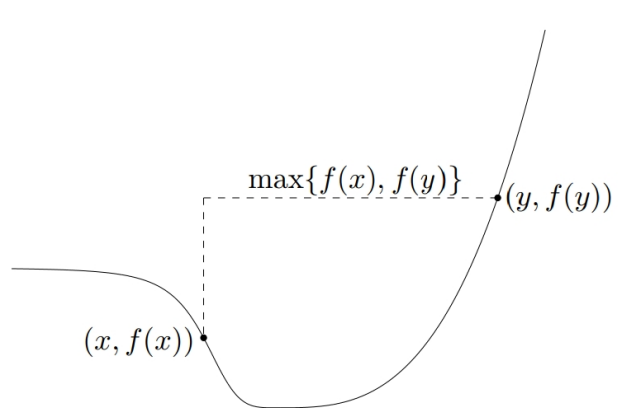

# Foundations of Optimization 6

From convex set to convex function and quasiconvex function

## convex function

**Convex fucntion**: For a convex set $ S\subseteq\mathbb{R}^n$, we say a fucntion $f:S\to\mathbb{R}$ is **convex on $S$** if for any two points $x_1,x_2 \in S$ and any $\lambda \in [0,1]$, we have:

$$
f(\lambda\mathrm{x}_1+(1-\lambda)\mathrm{x}_2)\leq\lambda f(\mathrm{x}_1)+(1-\lambda)f(\mathrm{x}_2).
$$

For a convex set $ S\subseteq\mathbb{R}^n$, we say a fucntion $f:S\to\mathbb{R}$ is **strictly** convex on $S$ if for any two points $x_1,x_2 \in S$ and any $\lambda \in (0,1)$, we have:

$$
f(\lambda\mathrm{x}_1+(1-\lambda)\mathrm{x}_2)<\lambda f(\mathrm{x}_1)+(1-\lambda)f(\mathrm{x}_2).
$$

> Let $S$ be a convex set, and $f:S\to\mathbb{R}$ be a convex function. If $\bar{x}$ is a local minimum of min $\{f(\mathrm{x}):\mathrm{x}\in S\}$, then $\bar{x}$ is global optimum. Futhermore, if the fucntion is strictly convex, then $\bar{x}$ is **unique**. 

同样的，也可以定义出 concave function：

$$
f(\lambda\mathrm{x}_1+(1-\lambda)\mathrm{x}_2)\geq\lambda f(\mathrm{x}_1)+(1-\lambda)f(\mathrm{x}_2)
$$

**epigraph**: The epigraph of $f$ is the set

$$
epi(f)=\{(x,t)\in\mathbb{R}^n\times\mathbb{R}:f(x)\leq t\}.
$$

Let $f:\mathbb{R}^n\to\mathbb{R}\cup\{+\infty\}.$ Then $f$ is convex (**as a function**) $iff \ epi(f)$ is convex (**as a set**) 

**t-level set**: $L_t(f)=\{x\in\mathbb{R}^n:f(x)\leq t\}$

A function $f:\mathbb{R}^n\to\mathbb{R}$ is called quasiconvex if $L_t(f)$ is convex for all $t\in \mathbb{R}$

A function f is quasiconvex iff for any $x,y \in \mathbb{R}^n$ and $\lambda \in [0,1]$

$$
f(\lambda x+(1-\lambda)y)\leq\max\{f(x),f(y)\}.
$$

A continuous function $f: \mathbb{R} \to \mathbb{R}$ is quasiconvex iff at least one of the following conditions holds:

- $f$ is non-decreasing
- $f$ is non-increasing
- there is a point $c\in dom(f)$ such that for $t \leq c$, $f$ is nonincreasing, and for $t \geq c$, $f$ is nondecreasing

