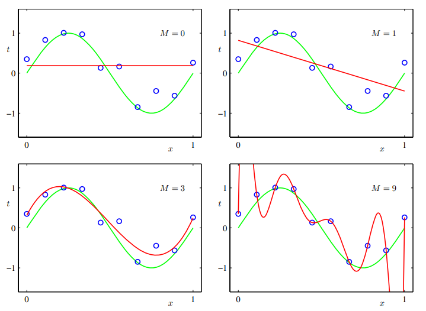
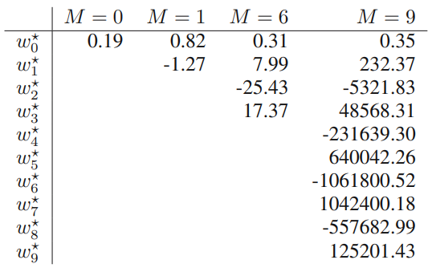
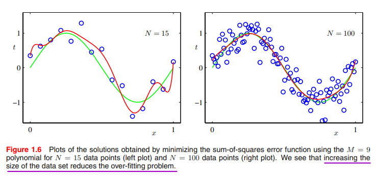
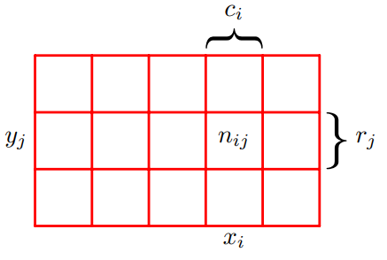
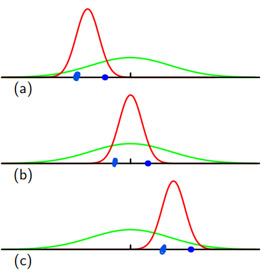
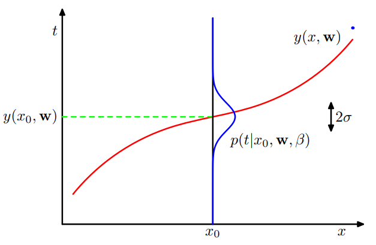
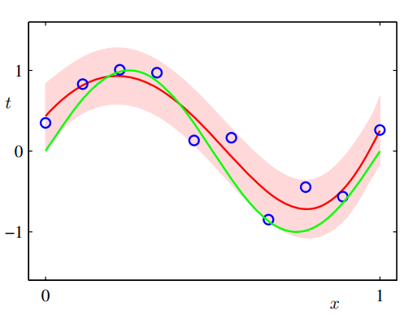

# Lecture 1 PRML
本节主要内容来自于PRML Chapter 1.

## Polynomial curve fitting

在使用多项式模型拟合数据时，有时会出现过拟合的问题。
$$
y(x,\pmb{w}) = \omega_0+\omega_1x+\omega_2x^2+....++\omega_{M}x^M
$$

当实现图4中样本内完美拟合的效果时，参数取值会是巨大的，这时实际上是一种过拟合：

实际上，对于模型而言，**数据量越大，则越不容易过拟合**。反之则为，面对大量数据，仅使用简单模型并不是一个好的选择。

有一种经常被提起的说法是：数据量应至少是参数量的5—10倍。这也意味着，当数据量较少时，我们应该**限制**参数的数量。先不谈及参数量是否是模型复杂度的合理表达，更重要的是，参数数量应该主要由问题本身的复杂程度决定。

用于求解模型参数的最小二乘法其实是极大似然法的一种特殊情况，而过拟合问题实际上可被理解为是极大似然法的普遍性质（general property）。然而，通过贝叶斯方法，过拟合问题得以规避。因为贝叶斯能够自动选取最合适且有效的参数数量。

在面对数据时，加入先验（Prior）可以做到**完美的人机结合**【特别在资产定价领域】，能够一定程度上避免过拟合，在数据量少时尤其有用。

如在三维空间中调参（三个超参数），遍历的算法将会大量消耗算力，这是辅以一定的先验知识能够使问题大大简化。

提到先验，最经典的方法就是Bayes，而PRML这本书也贯穿着Bayes的思想。

### Regularization

现阶段而言，可以通过正则化来防止过拟合，对取值过高的参数予以惩罚。例如最常用的 $L^2$ norm。
$$
\tilde{E}(w) = {1\over2} \sum_{\pmb{n=1}}^N \{ y(x_n,w)-t_n \} + {\lambda \over2}||w||^2
$$

$n=1$ 代表着 $w_0$ 被忽略了，因为其属于常数项系数，也就是bias term，***its inclusion causes the results to depend on the choice of origin for the target variable*** (Hastie et al., 2001)，它有对应的优化方法。

这种方法也叫做收缩（shrinkage）因为它会减小系数取值。

在正则化中，选择L1 norm或L2 norm本身就是一种先验，实际上是在根据参数的分布选择合适的正则项。

在这种情况下，往往还要划分验证集来选取超参数，这往往会浪费珍贵的训练数据。

## Probability theory

上一节的讨论很依赖于直觉（intuition），这一节会更加原则性（more principled）。

***the quantification and manipulation of uncertainty***

便于理解的小插图

**sum rule** 
$$
p(X) = \sum_{Y} p(X,Y) \tag{1.10}
$$

**product rule**
$$
p(X,Y) = p(Y|X)p(X) \tag{1.11}
$$

根据 $p(X,Y) = p(Y,X)$，自然得到 ***Bayes’ theorem***，which plays a central role in pattern recognition and machine learning
$$
P(Y|X) = {P(X|Y)p(Y) \over P(X)} \tag{1.12}
$$

结合公式1.10和1.11，可将 $p(X)$ 表示为：
$$
p(X) = \sum_{Y} p(Y|X)p(X) \tag{1.13}
$$

因此，Bayes’ theorem的分母可以看作是一种标准化，确保式1.12左边对于Y的条件概率累加起来为1。

### Bayesian probabilities
目前涉及到的概率都是有关随机、重复事件的频率，这也被称之为概率的古典（classical）或频率（frequentist）表达。

然而，对于有些事件，我们并不能重复的观测，例如北极冰山这个世纪内会不会融化。尽管没有确切的频率，不过我们仍然能够有自己的估计，例如通过雪融化的速度。如果我们得到了新的信息，例如二氧化碳的浓度变化，那么我们就会根据新的信息来修正自己对于未来不确定性的估计，这种做法就是概率的贝叶斯解释。

在观测到数据之前，我们对参数 w 的概率分布有一个假设，称之为先验概率 $p(w)$，观测数据 D 的通过条件概率 $p(D|w)$ 的形式影响最终概率，这一概率也称之为似然函数（likelihood function）。根据Bayes’ theorem：

$$
P(w|D) = {P(D|w)p(w) \over P(D)} \tag{1.43}
$$

因为D被视为给定数据，所以上式可表达为
$$
\text{posterior}  \propto \text{likelihood} \times \text{prior} \tag{1.44}
$$
将likelihood和prior遍历参数空间即可以得到denominator：
$$
p(D) = \int P(D|w)p(w) d \pmb{w} \tag{1.45}
$$

> [!NOTE]
> 似然概率并不是 w 的概率分布，所以累计起来也不等于1

贝叶斯方法较依赖先验表达的选取。当先验比较合理时，最后的结果也会不错，然而当先验有较大偏误时，我们也会很相信最终给出的很差的结果。实际上，很多时候先验的选取是出于数学的方便而不是对于实际情况的考量。

> [!TIP|频率学派与贝叶斯学派]
> 频率学派相信**概率就是一个固定的值**，通过样本去估计，数据是通过概率产生的，因此数据具有随机性。然而，当重复试验次数趋近于无穷大时，事情发生的频率才会收敛到真实的概率之上，也就是说，**概率表示的是事件发生频率的极限值**。
> 
> 然而，由于样本量并不总是趋近于无穷，从有限样本得出的估计与真实值常常会有偏差，因此，频率学派用**置信区间**来衡量估计值与真实值之间的差别。
>
> Example：
>
> 对于一个函数 $P(x|\theta)$，$x$ 表示数据，$\theta$ 表示模型参数。
>
> - 如果 $\theta$ 确定的，求 $x$，那么这个函数叫做概率函数。
> - 如果 $x$ 确定的，求 $\theta$，那么这个函数叫做似然函数。
>
> 在这个过程中，频率学派的思想并没有改变，始终认为是参数是固定的，只是改变了一下参数的位置。
> 
> 而贝叶斯学派认为待估参数的概率分布才是不确定性的来源，而数据仅仅是一个被观测到的常数。
>
> ***另一种讨论***：
> 
> 两种学派的最大差别在于对参数空间的认知上，参数空间指的就是参数的取值范围。
> 
> 频率学派认为数据都是在某个参数值下产生的，所以其方法论一开始就是在讨论那个值最有可能是真实值。
>
> 而对于贝叶斯学派，其关心概率空间里的每一个值，他们认为所有取值都有可能是真实值，区别只是概率不同。
>
> Example：
>
> 如果概率分布是双峰，那么频率学派会选择最高的峰对应值，而贝叶斯学派则会同时报告这两个值并给出概率。

### The Gaussian Distribution
这一部分作为基础的极大似然推导知识，高斯分布后续会经常用到。

$$
\mathcal{N}(x|\mu,\sigma^2) = {1\over (2 \pi \sigma^2)^{1\over2}} exp \{-{1\over 2\sigma^2}(x-\mu)^2 \} \tag{1.46} 
$$

这里引入一个概念，精度（**precision**），用方差的倒数表示 $\beta = 1/\sigma^2$。**对$\beta^{-1}$算prior简单很多**。

那么对于N个观测点 $\pmb{x} = (x_1,x_2,...x_N)^T$ 来说，当我们假设这些观测点独立且都属于高斯分布，那么其联合概率为
$$
p(\pmb{x}|\mu,\sigma^2) = \prod_{n=1}^N \mathcal{N}(x|\mu,\sigma^2) \tag{1.53}
$$

为简化计算，取log处理，得到：
$$
ln p(\pmb{x}|\mu,\sigma^2) = -{1\over 2\sigma^2} \sum_{n=1}^N (x-\mu)^2 - {N\over2} ln\sigma^2 - {N\over2}ln(2\pi) \tag{1.54}
$$
最大式1.54中的 $\mu$，那么 $\mu$ 就应该等于样本均值：
$$
\mu_ML = {1\over N} \sum_{n=1}^N x_n \tag{1.55}
$$

同样地，最大化 $\sigma$，也应该等于样本方差：
$$
\sigma_ML^2 = {1\over N} \sum_{n=1}^N (x_n-\mu_ML)^2 \tag{1.56}
$$

> [!NOTE]
> 在极大似然法中，我们应该估计参数 $\mu$ 和 $\sigma$。
>
> 但是在**高斯分布**的情况下，均值并不依赖于方差，因此，可以先估计 $\mu$，再利用第一步结果估计 $\sigma$ 

以上是极大似然法的思想，然而，这种方法***有重要的缺陷***：***最大似然法在估计方差时存在bias，会系统性地低估方差，而这种bias会导致过拟合问题***。因此，可以说过拟合是最大似然法的特性。
$$
E[\mu_ML] = \mu \tag{1.57}
$$

$$
E[\sigma^2_ML] = ({N-1\over N})\sigma^2 \tag{1.58}
$$

从公式可以看出，这一现象会在 $N\rightarrow \infty$ 时得到缓解。

以下是 **intuitive interpretation**：

在这种情况下，每组得到的均值再平均会等于真实均值，**每组的样本方差是根据样本均值计算的，而不是真实均值**，所以会导致方差估计系统性偏小。

例如，a组中点为(-3,-1)，真实样本方差应该根据真实均值0计算，而其实际上根据样本均值-1计算得出。

### Curve fitting re-visited

接下来我们从概率的角度看来带曲线拟合问题，这会使得我们对误差函数和正则化加深一些了解，以一种更加贝叶斯的方式。

拟合的最终目的是做出预测，我们可以通过概率分布来表示预测中的不确定性。在这种视角下，t（target value）中可预测的部分是均值，此时通过精度 $\beta$ 来衡量其偏离程度：
$$
p(t|x,\pmb{w},\beta) = \mathcal{N}(t|y(x,\pmb{w}),\beta^{-1}) \tag{1.60}
$$

在这种情况下，每一个预测值都有了概率的表达，intuitive interpretation如下：

按照式1.54，同理可得：
$$
ln p(\pmb{t}|\pmb{x},\pmb{w},\beta) = -{\beta \over2} \sum_{n=1}^N \{y(x_n,\pmb{w})-t_n\}^2+{N\over2}ln\beta-{N\over2} ln(2\pi) \tag{1.62}
$$

对于式1.62来说，根据w来进行优化，最后两项与w无关，所以可以扔掉，常数项不影响w最终的location，所以将 $\beta/2$ 替换为 $1/2$ ，进一步，最大化式1.62也相当于最小化负的式1.62。

经过种种变换，现在的目标函数变为最小化误差平方和，也即精度 $\beta$：
$$
{1\over\beta_{ML}} = {1\over N} \sum_{n=1}^N \{y(x_n,w_{ML})-t_n\} \tag{1.63}
$$

当最终获得w和 $\beta$ 后，对于任意预测值，我们都能给出其**对应的分布**，而非只是一个**点估计**：
$$
p(t|x,\pmb{w}_ML,\beta_{ML}) = \mathcal{N}(t|y(x,\pmb{w}_{ML}),\beta_{ML}^{-1}) \tag{1.64}
$$

接下来，我们还可以给出w的先验分布，同样地，我们考虑最简单的高斯分布：
$$
p(\pmb{w}|\alpha) = \mathcal{N}(\pmb{w}|0,\alpha^{-1}\pmb{I}) = \Big({\alpha\over2\pi}\Big)^{(M+1)/2} exp \{ -{\alpha\over2}\pmb{w}^T\pmb{w} \} \tag{1.65}
$$
其中，$\alpha$ 是w分布的精度，$M+1$ 是w里element的数量【存在常数项】。

此时，通过Bayes's theorem：
$$
p(\pmb{w}|\pmb{x},\pmb{t},\alpha,\beta) \propto p(\pmb{t}|\pmb{x},\alpha,\beta) p(\pmb{w}|\alpha) \tag{1.66}
$$

现在我们不是通过最大化似然函数【极大似然法】得到得到w最优解了，而是通过最大化等式左边——**后验概率**。

同样地，将式1.65取对数并结合1.62，**再扔掉无关项**，可解得：
$$
{\beta \over2} \sum_{n=1}^N \{y(x_n,\pmb{w})-t_n \}^2 + {\alpha \over 2}\pmb{w}^T\pmb{w} \tag{1.67}
$$

$\alpha$ $\beta$ 谁更大【谁的分布更精确】谁说了算【权重更大】

当惩罚项超参数 $\lambda = \alpha / \beta$ 时，二者等价。 进一步可以看出，当 $\alpha$ 很小，也即关于w的先验分布很不确定、方差很大，那么这时收缩并不能起到很好的效果

> [!NOTE]
> 从最初对正则化和贝叶斯的粗浅认识，到在 ***Machine Learning in Asset Pricing (Nagel, 2020)*** 里从正则化得到的贝叶斯解释，再到现在的PRML里，从贝叶斯视角得到了正则化的理解。如此奇妙。

### Bayesian curve fitting
尽管加入了有关w的先验，但最终结果仍然只是给出了w的点估计，因此并不等于完整的贝叶斯处理。

在完整的贝叶斯过程中，我们应该对所有的w进行积分，这种边际处理（marginalization）是贝叶斯方法的核心

点估计就意味着没有不确定性，现在我们要加入不确定性，$\pmb{x},\ \pmb{t}$ 是训练数据，$x,\ t$ 是新数据以及预测值，其概率分布为：
$$
p(t|x,\pmb{x},\pmb{t}) = \int p(t|x,\pmb{w})p(w|\pmb{x},\pmb{t})d\pmb{w} \tag{1.68}
$$
右式第一项可以通过式1.60得到，第二项就是后验概率，从式1.66得出。

> [!TIP|label:推导]
> 运用全概率公式：
$$\begin{aligned}
p(t|x,\pmb{x},\pmb{t}) &= \int p(t|x,\pmb{x},\pmb{t}|\pmb{w})p(w)d\pmb{w} \\
&= \int p(t|x,\pmb{x},\pmb{t},\pmb{w})p(w)d\pmb{w} \\
&= \int p(t|x,\pmb{w})p(w|\pmb{x},\pmb{t})d\pmb{w}
\end{aligned}$$
>
> 第一行到第二行运用了 $P(A|B|C) = P(A|BC)$ 
>
> 第二行到第三行是关于w的先验表达转化为了后验表达。
>
> 在第二行中，我们只知道w的先验分布 $P(w)$，但是在已知 $\pmb{x},\pmb{t}$ 的情况下，w可以被表示为后验分布。既然已知了w的后验分布，那么公式第一项中的 $\pmb{x},\pmb{t}$ 对预测 $t$ 没有帮助，也可以扔掉。

进一步可以将其表达为：
$$
p(t|x,\pmb{x},\pmb{t}) = \mathcal{N}(t|m(x),s^2 (x))\tag{1.69}
$$
因此，可得到均值和方差分别为：
$$
m(x) = \beta \phi(x)^T\pmb{S} \sum_{n=1}^N\phi(x_n)t_n \tag{1.70}
$$
$$
s^2 (x) = \beta^{-1}+\phi(x)^T\pmb{S}\phi(x) \tag{1.71}
$$
矩阵 $\pmb{S}$ 为：
$$
S^{-1} = \alpha \pmb{I}+\beta \sum_{n=1}^N\phi(x_n) \phi(x)^T \tag{1.72}
$$

$\phi_i(x) = x^i \ \text{for} \ i = 0,....M$ 是多项式核函数（kernel function）。

原来的方差 $\beta^{-1}$ 只与模型有关。而这样得出的估计相比原来，含有更大的不确定性，这种不确定性的来源就是矩阵 $\pmb{S}$。

矩阵 $\pmb{S}$ 中第一项是先验【对参数的不确定性】，第二项是数据产生的不确定性。

最终不仅是给出模型结果，而是给出其**置信区间**。

## Model Selection <!-- {docsify-ignore} -->

当确定超参数时，如果数据量够多，那么可以单独设置**验证集**。但是当在验证集上也迭代了足够多次数时，还需要设立测试集来规避可能在验证集上出现的过拟合。

但大多数情况下数据量并不算多，这时候我们应该尝试更好、更充分地利用现有数据，那么就可以使用**Cross Validation**。

Cross Validation有两个主要缺点：
- 当对训练集划分过多时，很消耗算力，因为有些模型本身训练起来就很复杂
- CV使用单独的（separate）数据集做验证，但当有许多超参数要训练时，所需算力呈指数增长

因此，我们需要一个能够在训练集上给出模型评价并且防止过拟合的指标，那就是AIC和BIC，能够评价模型表现的同时对参数数量做出惩罚。

但是这些指标也有问题，他们倾向于给出最简单的模型，对于这些问题我们后续还会谈到。

除此之外，还可以通过给出超参数先验的方式减少训练频率。这种方式在数据量小时尤其有用。

## Decision theory

## Information theory

之所以称之为正则项而非惩罚项，因为荆老师提到：***它也没做错什么事，不用惩罚它***。

$$
\hat{\beta} = (X^T X+\lambda I)^{-1}X^{T}y
$$

在$X$中许多特征值（eigenvalue）为0，则不可逆，那么添加一定扰动项后则可逆了。后续发现也实现了收缩的效果。【？】

## Uncertainty

额外的不确定性来自于先验以及数据，这种不确定性增大了方差，也能给出拟合曲线的分布

## Information Theory

