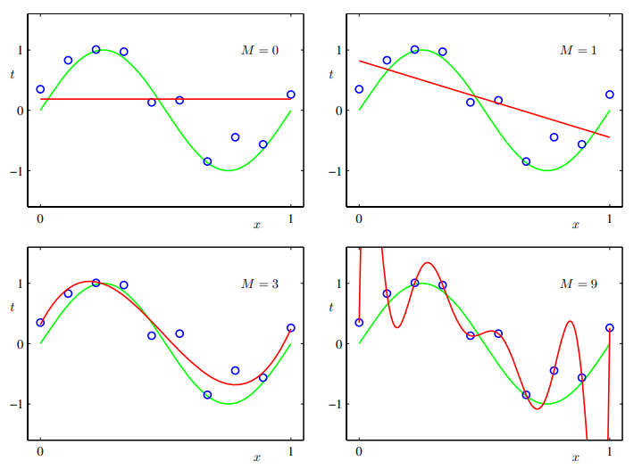
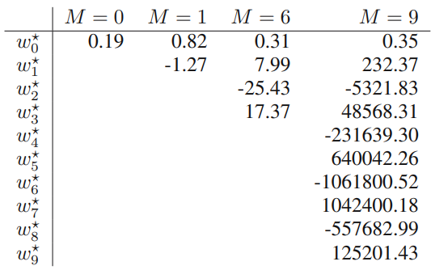

# Lecture 1 PRML
本节主要内容来自于PRML Chapter 1.

## Polynomial curve fitting

在使用多项式模型拟合数据时，有时会出现过拟合的问题。
$$
y(x,\pmb{w}) = \omega_0+\omega_1x+\omega_2x^2+....++\omega_{M}x^M
$$

当实现图4中样本内完美拟合的效果时，参数取值会是巨大的，这时实际上是一种过拟合：

实际上，对于模型而言，**数据量越大，则越不容易过拟合**。反之则为，面对大量数据，仅使用简单模型并不是一个好的选择。

有一种经常被提起的说法是：数据量应至少是参数量的5—10倍。这也意味着，当数据量较少时，我们应该**限制**参数的数量。先不谈及参数量是否是模型复杂度的合理表达，更重要的是，参数数量应该主要由问题本身的复杂程度决定。

用于求解模型参数的最小二乘法其实是极大似然法的一种特殊情况，而过拟合问题实际上可被理解为是极大似然法的普遍性质（general property）。然而，通过贝叶斯方法，过拟合问题得以规避。因为贝叶斯能够自动选取最合适且有效的参数数量。

在面对数据时，加入先验（Prior）可以做到**完美的人机结合**【特别在资产定价领域】，能够一定程度上避免过拟合，在数据量少时尤其有用。

如在三维空间中调参（三个超参数），遍历的算法将会大量消耗算力，这是辅以一定的先验知识能够使问题大大简化。

提到先验，最经典的方法就是Bayes，而PRML这本书也贯穿着Bayes的思想。

### Regularization

现阶段而言，可以通过正则化来防止过拟合，对取值过高的参数予以惩罚。例如最常用的 $L^2$ norm。
$$
\tilde{E}(w) = {1\over2} \sum_{\pmb{n=1}}^N \{ y(x_n,w)-t_n \} + {\lambda \over2}||w||^2
$$

$n=1$ 代表着 $w_0$ 被忽略了，因为其属于常数项系数，也就是bias term，***its inclusion causes the results to depend on the choice of origin for the target variable*** (Hastie et al., 2001)，它有对应的优化方法。

这种方法也叫做收缩（shrinkage）因为它会减小系数取值。

在正则化中，选择L1 norm或L2 norm本身就是一种先验，实际上是在根据参数的分布选择合适的正则项。

在这种情况下，往往还要划分验证集来选取超参数，这往往会浪费珍贵的训练数据。

### 1.2.5
最小二乘法是最大似然法的一种特例。过拟合是最大似然法的一种特性

## Probability theory

上一节的讨论很依赖于直觉（intuition），这一节会更加原则性（more principled）。

sum rule

product rule

Bayes' theorm plays a central role in pattern recognition and machine learning

## Decision theory

## Information theory

之所以称之为正则项而非惩罚项，因为荆老师提到：***它也没做错什么事，不用惩罚它***。

$$
\hat{\beta} = (X^T X+\lambda I)^{-1}X^{T}y
$$

在$X$中许多特征值（eigenvalue）为0，则不可逆，那么添加一定扰动项后则可逆了。后续发现也实现了收缩的效果。【？】

$$
P(w/D) = {{P(D/w)P(w)}\over{P(D)}}
$$

## Curve fitting

$$
t/x,\omega,\beta \sim(t/y(x,\omega),\underbrace{\sigma^2}_{\beta^{-1}})
$$

对$\beta^{-1}$算prior简单很多

1.67 $\alpha$ $\beta$谁更大（谁更精确）谁说了算

## Uncertainty

额外的不确定性来自于先验以及数据，这种不确定性增大了方差，也能给出拟合曲线的分布

## Model Selection
线性模型可以通过AIC BIC进行选择，非线性可以通过Cross Validation

## Information Theory

