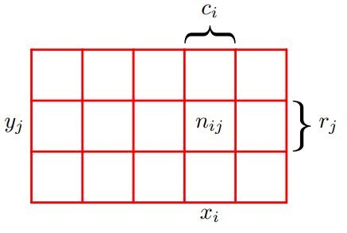

# Lecture 1 PRML
本节主要内容来自于PRML Chapter 1.

## Polynomial curve fitting

在使用多项式模型拟合数据时，有时会出现过拟合的问题。
$$
y(x,\pmb{w}) = \omega_0+\omega_1x+\omega_2x^2+....++\omega_{M}x^M
$$

当实现图4中样本内完美拟合的效果时，参数取值会是巨大的，这时实际上是一种过拟合：

实际上，对于模型而言，**数据量越大，则越不容易过拟合**。反之则为，面对大量数据，仅使用简单模型并不是一个好的选择。

有一种经常被提起的说法是：数据量应至少是参数量的5—10倍。这也意味着，当数据量较少时，我们应该**限制**参数的数量。先不谈及参数量是否是模型复杂度的合理表达，更重要的是，参数数量应该主要由问题本身的复杂程度决定。

用于求解模型参数的最小二乘法其实是极大似然法的一种特殊情况，而过拟合问题实际上可被理解为是极大似然法的普遍性质（general property）。然而，通过贝叶斯方法，过拟合问题得以规避。因为贝叶斯能够自动选取最合适且有效的参数数量。

在面对数据时，加入先验（Prior）可以做到**完美的人机结合**【特别在资产定价领域】，能够一定程度上避免过拟合，在数据量少时尤其有用。

如在三维空间中调参（三个超参数），遍历的算法将会大量消耗算力，这是辅以一定的先验知识能够使问题大大简化。

提到先验，最经典的方法就是Bayes，而PRML这本书也贯穿着Bayes的思想。

### Regularization

现阶段而言，可以通过正则化来防止过拟合，对取值过高的参数予以惩罚。例如最常用的 $L^2$ norm。
$$
\tilde{E}(w) = {1\over2} \sum_{\pmb{n=1}}^N \{ y(x_n,w)-t_n \} + {\lambda \over2}||w||^2
$$

$n=1$ 代表着 $w_0$ 被忽略了，因为其属于常数项系数，也就是bias term，***its inclusion causes the results to depend on the choice of origin for the target variable*** (Hastie et al., 2001)，它有对应的优化方法。

这种方法也叫做收缩（shrinkage）因为它会减小系数取值。

在正则化中，选择L1 norm或L2 norm本身就是一种先验，实际上是在根据参数的分布选择合适的正则项。

在这种情况下，往往还要划分验证集来选取超参数，这往往会浪费珍贵的训练数据。

## Probability theory

上一节的讨论很依赖于直觉（intuition），这一节会更加原则性（more principled）。

***the quantification and manipulation of uncertainty***

便于理解的小插图

**sum rule** 
$$
p(X) = \sum_{Y} p(X,Y) \tag{1.10}
$$

**product rule**
$$
p(X,Y) = p(Y|X)p(X) \tag{1.11}
$$

根据 $p(X,Y) = p(Y,X)$，自然得到 ***Bayes’ theorem***，which plays a central role in pattern recognition and machine learning
$$
P(Y|X) = {P(X|Y)p(Y) \over P(X)} \tag{1.12}
$$

结合公式1.10和1.11，可将 $p(X)$ 表示为：
$$
p(X) = \sum_{Y} p(Y|X)p(X) \tag{1.13}
$$

因此，Bayes’ theorem的分母可以看作是一种标准化，确保式1.12左边对于Y的条件概率累加起来为1。

### Bayesian probabilities
目前涉及到的概率都是有关随机、重复事件的频率，这也被称之为概率的古典（classical）或频率（frequentist）表达。

然而，对于有些事件，我们并不能重复的观测，例如北极冰山这个世纪内会不会融化。尽管没有确切的频率，不过我们仍然能够有自己的估计，例如通过雪融化的速度。如果我们得到了新的信息，例如二氧化碳的浓度变化，那么我们就会根据新的信息来修正自己对于未来不确定性的估计，这种做法就是概率的贝叶斯解释。

在观测到数据之前，我们对参数 w 的概率分布有一个假设，称之为先验概率 $p(w)$，观测数据 D 的通过条件概率 $p(D|w)$ 的形式影响最终概率，这一概率也称之为似然函数（likelihood function）。根据Bayes’ theorem：

$$
P(w|D) = {P(D|w)p(w) \over P(D)} \tag{1.43}
$$

因为D被视为给定数据，所以上式可表达为
$$
\text{posterior}  \propto \text{likelihood} \times \text{prior} \tag{1.44}
$$
将likelihood和prior遍历参数空间即可以得到denominator：
$$
p(D) = \int P(D|w)p(w) d \pmb{w} \tag{1.45}
$$

> [!NOTE]
> 似然概率并不是 w 的概率分布，所以累计起来也不等于1

贝叶斯方法较依赖先验表达的选取。当先验比较合理时，最后的结果也会不错，然而当先验有较大偏误时，我们也会很相信最终给出的很差的结果。实际上，很多时候先验的选取是出于数学的方便而不是对于实际情况的考量。

> [!TIP|频率学派与贝叶斯学派]
> 频率学派相信**概率就是一个固定的值**，通过样本去估计，数据是通过概率产生的，因此数据具有随机性。然而，当重复试验次数趋近于无穷大时，事情发生的频率才会收敛到真实的概率之上，也就是说，**概率表示的是事件发生频率的极限值**。
> 
> 然而，由于样本量并不总是趋近于无穷，从有限样本得出的估计与真实值常常会有偏差，因此，频率学派用**置信区间**来衡量估计值与真实值之间的差别。
>
> Example：
>
> 对于一个函数 $P(x|\theta)$，$x$ 表示数据，$\theta$ 表示模型参数。
>
> - 如果 $\theta$ 确定的，求 $x$，那么这个函数叫做概率函数。
> - 如果 $x$ 确定的，求 $\theta$，那么这个函数叫做似然函数。
>
> 在这个过程中，频率学派的思想并没有改变，始终认为是参数是固定的，只是改变了一下参数的位置。
> 
> 而贝叶斯学派认为待估参数的概率分布才是不确定性的来源，而数据仅仅是一个被观测到的常数。
>
> ***另一种讨论***：
> 
> 两种学派的最大差别在于对参数空间的认知上，参数空间指的就是参数的取值范围。
> 
> 频率学派认为数据都是在某个参数值下产生的，所以其方法论一开始就是在讨论那个值最有可能是真实值。
>
> 而对于贝叶斯学派，其关心概率空间里的每一个值，他们认为所有取值都有可能是真实值，区别只是概率不同。
>
> Example：
>
> 如果概率分布是双峰，那么频率学派会选择最高的峰对应值，而贝叶斯学派则会同时报告这两个值并给出概率。

### Curve fitting re-visited
过拟合是最大似然法的一种特性：最大似然法在估计方差时存在bias，而这种bias会导致过拟合问题。

最小二乘法是最大似然法的一种特例。

## Decision theory

## Information theory

之所以称之为正则项而非惩罚项，因为荆老师提到：***它也没做错什么事，不用惩罚它***。

$$
\hat{\beta} = (X^T X+\lambda I)^{-1}X^{T}y
$$

在$X$中许多特征值（eigenvalue）为0，则不可逆，那么添加一定扰动项后则可逆了。后续发现也实现了收缩的效果。【？】

$$
P(w/D) = {{P(D/w)P(w)}\over{P(D)}}
$$

## Curve fitting

$$
t/x,\omega,\beta \sim(t/y(x,\omega),\underbrace{\sigma^2}_{\beta^{-1}})
$$

对$\beta^{-1}$算prior简单很多

1.67 $\alpha$ $\beta$谁更大（谁更精确）谁说了算

## Uncertainty

额外的不确定性来自于先验以及数据，这种不确定性增大了方差，也能给出拟合曲线的分布

## Model Selection
线性模型可以通过AIC BIC进行选择，非线性可以通过Cross Validation

## Information Theory

