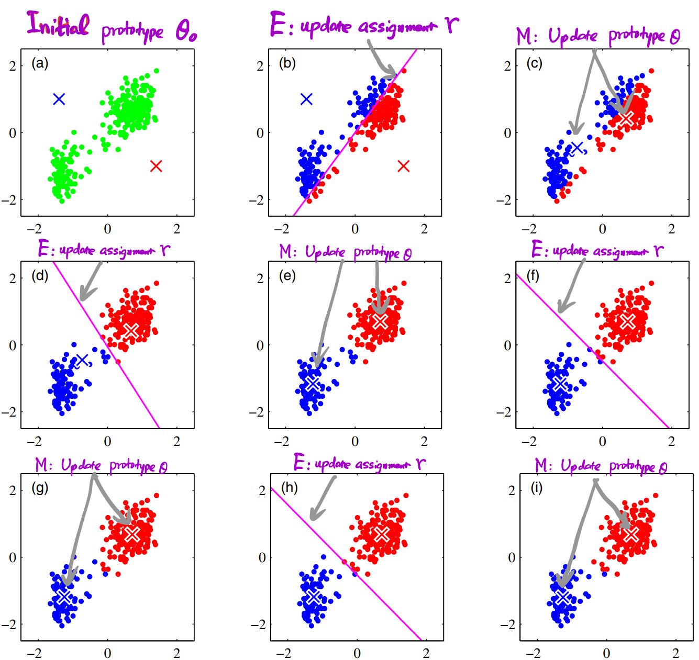

# Mixture Models and Em

If we define a joint distribution over observed and latent variables, the corresponding distribution of the observed variables alone is obtained by marginalization. This
allows relatively complex marginal distributions over observed variables to be expressed in terms of more tractable joint distributions over the expanded space of
observed and latent variables. <u>**The introduction of latent variables thereby allows complicated distributions to be formed from simpler components.**</u>

## K-means Clustering
K-means给数据点分配不同的中心点，所以本质上也算是一种 Mixture Model。

###  Process <!-- {docsify-ignore} -->

***Objective Function or distortion measure***

$$
J = \sum_{n=1}^N \sum_{k=1}^K r_{nk} || \pmb{x}_n - \pmb{\mu}_k ||^2 \tag{9.1}
$$

$r_{nk} \in {0,1}$，$n$ data points，$k$ cluster。当 $\pmb{x}_n $属于 cluster $k$ 时，$r_{nk} =1$，反之为0。

我们的目标就是找到 $r_{nk}$ 和 $\pmb{\mu}_k$ 使得 $J$ 最小。

关键在于优化方法。K-mean采用**迭代优化**，分为两步：

- minimize $J$ with respect to $r_{nk}$, keeping $\pmb{\mu}_k$ fixed
- minimize $J$ with respect to $\pmb{\mu}_k$, keeping $r_{nk}$ fixed
- repeat until convergence

> [!NOTE]
> 因为每一次迭代都会降低 $J$，最终一定会收敛。但是单独看每一阶段的优化都是 convex problem，但是两个convex proble联合在一起就未必仍然是一个convex problem，因此，最终结果很可能是**一个local minimum而非global minimum**。
>
> 通过随机化初始点可以一定程度上缓解该问题。

### Why 'Means' ? <!-- {docsify-ignore} -->

因为式9.1中 $J$ 是一个关于linear function，因此该最优化问题有解析解。

当fix $r_{nk}$ 优化 $\pmb{\mu}_k$ 时，可得其导数为:
$$
2\sum_{n=1}^K r_{nk}(\pmb{x}_n - \pmb{\mu}_k ) = 0 \tag{9.3}
$$

易得：
$$
\pmb{\mu}_k = {\sum_n r_{nk} \pmb{x}_n \over \sum_n r_nk}
$$

### Discuss <!-- {docsify-ignore} -->
上例中，故意选择了poor initialization，实际上，**更好的initialization是选择数据集当中的某一个点**。

> [!NOTE]
> 在应用EM算法时，K-means算法常常被用来初始化 Gaussian Mixture model中的参数。

K-means 方法需要计算每一个点到中心点的欧氏距离，计算速度可能会受影响，因此也有很多文献提出了种种方法来加速这一过程，包括利用树方法来提前分析数据结构，或是通过距离的三角不等式关系（triangle inequality）来避免不必要的距离计算。

当然，也可以使用 Robbins-Monro 的SGD算法来更新 $\pmb{\mu}_k$
$$
\pmb{\mu}_k^{new} = \pmb{\mu}_k^{old} + \eta_n (\pmb{x}_n - \pmb{\mu}_k^{old})
$$

***Outliers***

由于欧氏距离的计算会受到异常值的影响，因此，可以用 dissimilarity 来代替Eucilidean，也种方法也被称之为 K-medoids 算法。
$$
\tilde{J} = \sum_{n=1}^N \sum_{k=1}^K r_{nk} \mathcal{V}(\pmb{x}_n,\pmb{\mu}_k)
$$

K-means 方法的其中一个特点就是每个点仅属于一种分类，因此这种方法也被称为hard assignment。当存在某些点距离两类中心差不多时，很难说它该被分到哪一类，下文会提出对应的soft assignment，反应了分类中的不确定性。

## Mixture of Gaussian

