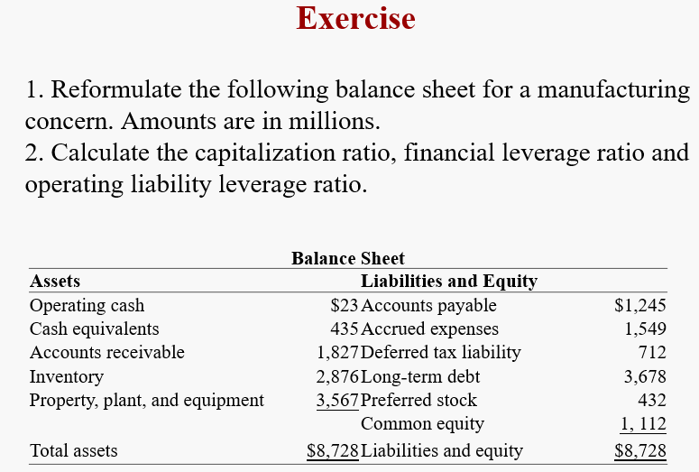
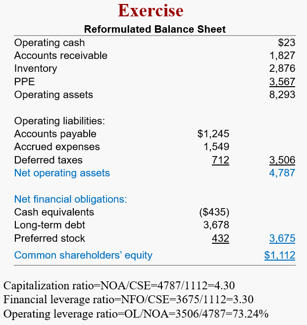
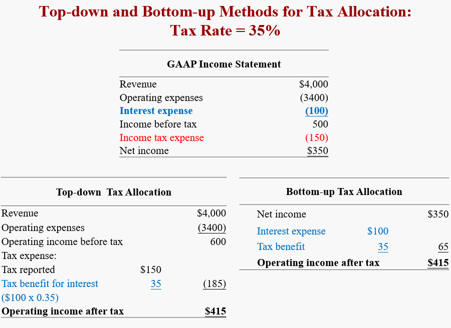
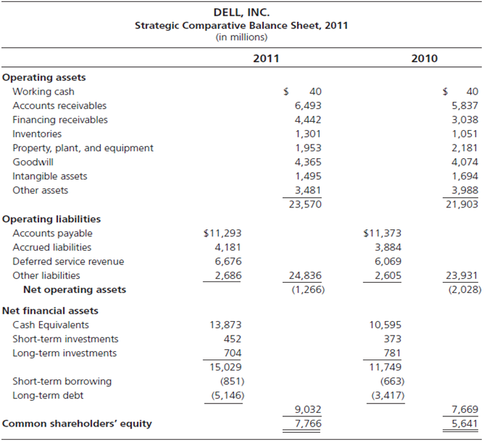
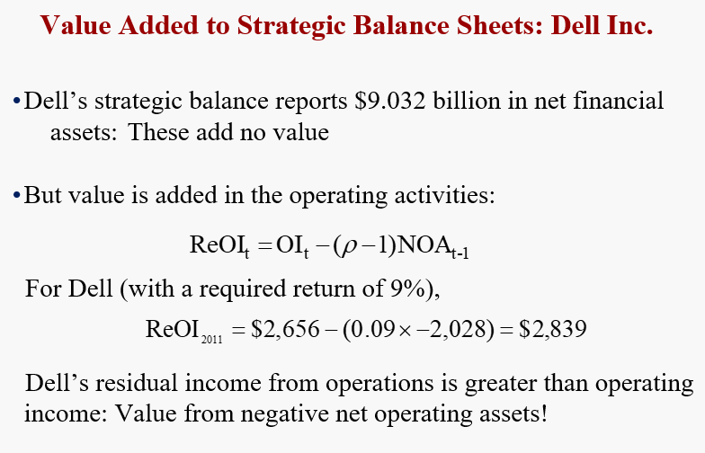

# The Analysis of the Balance Sheet and Income Statement

Chapter 9 通过对shareholders' equity进行重构，更好地体现了common shareholders' equity的comprehensive income的变化。而本章对于Balance Sheet 和 Income Statement的reformulation则能够揭示这种盈利【ROCE】和增长的来源。

## Reformulation of the Balance Sheet

传统的资产负债表是根据期限将资产和负债按照**短期长期**【current or long-term】来划分，这种划分是为了清晰地列示出公司对应期限的偿债能力，因此，这种划分并不能完全体现出公司实际的运营和盈利能力。

本节将对于资产负债表重构，将资产和负债分为operating和financing。因为只有operating activities才会增加价值，financing本身并不贡献价值。

> *Operating assets and liabilities generate operating income and financial assets and liabilities are those that produce financial income or incur financial expenses.* 

Operating obligation 一般被认为属于financial debt，但实际上这种"debt"与operating紧密相连，特别是对于大公司而言：例如戴尔，利用自己的地位，有大量对于供应商的account payable，因此这部分省下来的钱就可以被用于公司的其他operating。

### Issues in Reformulating Balance Sheets

在重构Balance Sheet的过程中，为了更好的区分operating和financing asset and liability，我们需要对于一些条目有更深的理解。

#### Cash <!-- {docsify-ignore} -->
当现金是用来偿还到期债务或票据时，称之为 **Working cash** or **operating cash**，这类现金一般以库存现金或支票账户的形式存在。

然而，当现金被投资于短期证券或现金等价物【cash equivalent，三个月之内的投资】，这一部分现金就属于超出流动性之外的**超额现金**，就应该被记入financing asset。

但实际情况中，报表往往对这两项不做区分，因此很难划分开。

#### Short-term notes receivable or payable <!-- {docsify-ignore} -->

如果是由超额现金投资的短期票据，记为financing assets。

如果是由交易产生的trade notes，分为两种情况。当短期票据是通过赊销赊购等来**吸引顾客**，此时票面利率很低甚至没有利率，此时的短期票据属于营运资产（operating asset），相应地，其产生的利息收入也属于营运收入（operating income）。而当其是用来获得利息收入时，票面利率一般等于市场利率甚至更高，此时属于金融资产（financial assets）。

> [!NOTE]
> 这里其实本质的区别在于票据能不能产生 Residual Earning，这也是整本书的核心。根据这一点来划分就比较清晰了。

#### Debt investments <!-- {docsify-ignore} -->

对于非金融公司，投资债券或其他有息证券属于金融资产。

但是对于**银行**这种依靠债务和资产之间的利差赚钱的公司来说，debt investments and debt liabilities are operating items. 

#### Long-term equity investments <!-- {docsify-ignore} -->
长期股权投资涉及投资其他公司的具体业务，一般视为operating assets。但是在记录时有三种情况。

- 如果持股低于（该公司总股本的）20%，则记录在资产负债表上
  1. 如果可出售【available for sale】，则按市值【market value】记录
  2. 如果打算持有到期【held to maturity】，则按成本【at cost】记录
- 如果持股介于20-50%之间，则应用股权模型【equity model】记为股权投资
- 如果持股超过50%，则属于子公司，需要合并报表。

理论上来说，对于子公司的处理应该同母公司一样，分清operating和financing，进一步划分对应股权投资中operating和financing的比例，但是如果该子公司不上市，现实中这种方法就非常难操作，所以作为一种便利处理，整个投资都作为operating来看待。

#### Lease <!-- {docsify-ignore} -->

租赁中，租金为 financial obligation，而租赁资产为 operating assets。

#### Minority interest <!-- {docsify-ignore} -->
Minority interest 也多被称之为 noncontrolling interest，并不能被视为一种obligation【类似debt】。而应该被视为类似于 common shareholders 一样的，能够共享股权【equity sharing】。可由如下公式表示：

$$
\text{NOA}-\text{NFO}=\text{CSE + Minortity interset}
$$

### The ratios

#### Financial Leverage Ratios  <!-- {docsify-ignore} -->
$$
\begin{aligned}
 \text{Capitalization Ratio} &= \frac{\text{NOA}}{\text{CSE}}\\
 {}\\
 \text{Financial Leverage Ratio (FLEV)} &= \frac{\text{NFO}}{\text{CSE}}\\
\end{aligned}
$$

Since $\text{NOA}-\text{NFO}=\text{CSE}$, we have 
$$
\text{Capitalization Ratio} - \text{FLEV} = 1
$$

#### Operating Liability Leverage Ratio <!-- {docsify-ignore} -->
$$
\text{Operating Liability Leverage Ratio (OLLEV)} = \frac{\text{OL}}{\text{NOA}}
$$

**Example**

注意**defered tax被记为 operation obligations**。

## Reformulation of Income Statement

在上一小节中我们得到了operating income，而在收入项中，为了更好的理解收入的来源，我们需要将**与销售有关的项**和与**销售无关的项分割开**。例如，由并购或资产出售获得的收益。

在本节中，我们通过分配税（tax），来拆解对应各部分的收入。

### Tax Allocation

不只是income statement里的收入需要交税，有些在equity statement中的线下项目**T**收入也要交税。

> [!TIP|label:Items Below the Line]
> 以损益表中营业利润为界限，将营业利润之上的项目称为线上项目，大多被认为是经常性的；营业利润以下的项目为线下项目，即非核心收益，大多被认为是偶然性的。

对于dirty-surplus items，已经作为税后项目被列示出来，因此不用给这些项目分配税。

重要的仍然是将Financing tax 和 operating tax分割开。对于Financing tax ，其实就是税盾（tax shield）。

$$\begin{aligned}
\text{Effective tax rate for operations} &= {\text{Tax on operating income}\over \text{Sum operating income} } \\
\text{Sum operating income} =& \text{ Operating income before tax, equity income} \\
&+ \text{extraordinary + dirty-surplus items} 
\end{aligned}$$

Tax allocatoin 分为 Top-down 和 Bottom-up 两种方法。

> [!NOTE]
> Bottom-up是之间讲过的方法，interest虽然降低了现金流，但同时少交了税，因此净影响是0.7【1-税率0，3】
>
> 而Top-down是不考虑利息，直接减去**考虑了利息之后的税收**，因此实际上享受了税盾优惠，所以需要减去。
>
> 因此二者有种**双向奔赴**之感。

### Issues in Reformulating Income Statements

如同balance sheet一样，在重构Income Statements时也会有许多问题，需要对公司进行具体分析。例如，利息收入通常是从金融资产中获得，而这些收入属于financial income，但是如果有客户买了我们的金融票据，由此产生的利息收入属于operating income。

#### Lack of disclosure <!-- {docsify-ignore} -->

进行重构所需要的信息不公开

#### The shortcomings of existing rules <!-- {docsify-ignore} -->

在GAAP规则下，为建造而筹集的资金利息收入和工人、物料一样属于建造成本。但是这种规则混淆了operating和financing activities：人工和物料属于投资，而利息收入属于financial cost。但是在现行规则下，很难将这种资本化利息剥离出来。

确实，书里说的是有道理的，但是在实现上可能有很多问题。

#### Segments of the firm <!-- {docsify-ignore} -->

可以尝试为公司的各个部门制作报表，从而能够反映更多的信息。

### Strategic Plan

此时，Dell 的 NOA 是负数。它的 Residual Operating Income 有两个来源：OI 和 NOA：

## Conceptual questions

***Why are refonnulated statements necessary to discover operating profitability?***

Without the reformulation, operating profitability is confused with financing profitability, and the return on financial assets (and borrowing cost for financial obligations) is typically different from operating profitability. Operations add value whereas financing typically does not, so financing activities need to be separated out to uncover the operating profitability.

***Classify each of the following as a financial asset or an operating asset***

| |category|
|:--:|:--:|
|Cash in a checking account used to pay bills | Operating |
|Accounts receivable|Operating|
|Finance receivables for an automobile firm| Operating |
|Cash in 90-day interest-bearing deposits|Financing|
|Debt investments held to maturity|Financing|
|Short-term equity investment|Financing|
|Long-term equity investments held to maturity|Operating|
|Goodwill|Operating|
|Lease assets|Operating|
|Deferred compensation|Operating|

***Classify each of the following as a financial liability, an operating liability, or neither***

| |category|
|:--:|:--:|
|Accrued compensation|Operating liability|
|Deferred revenues|**Operating liability**|
|Preferred stock|Financial liability|
|Deferred tax liability|Operating liability|
|Lease obligations|Financial liability|
|Interest-bearing note payable|Financial liability(market rate)|

***From the point of view of the common shareholders, minority interest is a financial obligation.***

It is not, like debt, an obligation that is satisfied by free cash flow from operations it is equity that shares in a portion of profits after net financing costs

***What does an operating profit margin reveal?***

The operating profit margin is the profitability of sales, the percentage of a dollar of sales that ends up in operating income after operating expenses.

***What does it mean to say that a firm is negatively levered?***

A negatively levered firm has more financial assets than financial obligations, that is, it has negative net debt.

