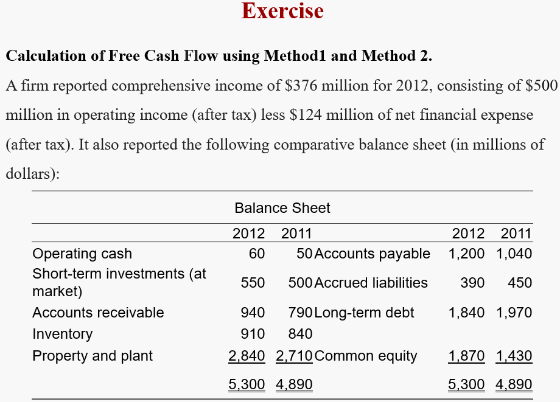
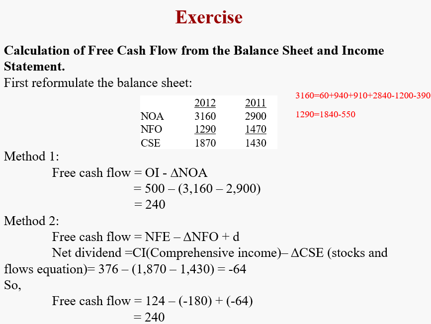
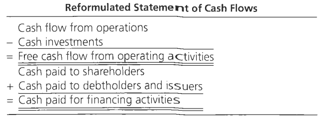
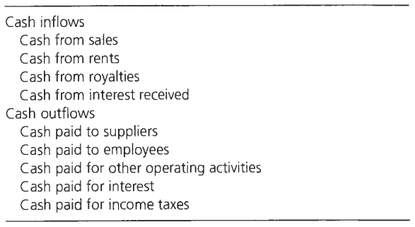
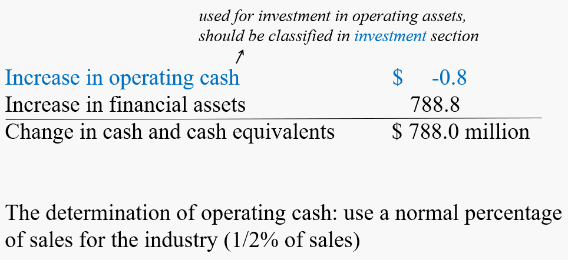
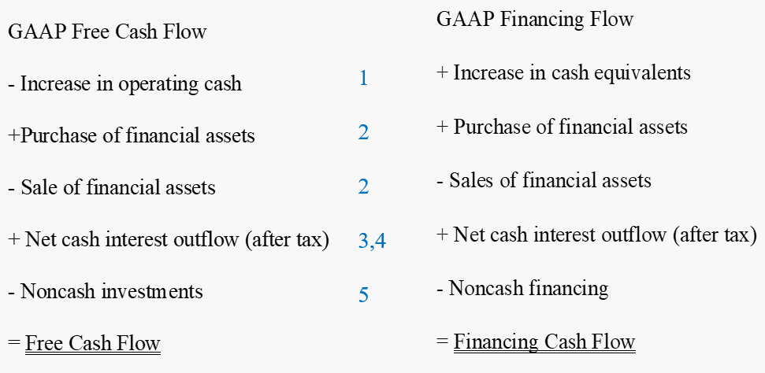

# The Analysis of the Cash Flow Statement

Cash Flow Statement 能够有效防止操纵，因为高质量的盈利背后应该有对应的现金流。

- 同样地，对于cash flow statement，也要分为operating flow和financing flow。

更进一步来说，就是区分公式 $\text{C}-\text{I} = \text{d + F} $ 的左右两侧，左侧属于 the generation of cash flow【operating activities】，右侧属于 the disposition of cash flow【financing activities】。

- 如何从reformulated statements中算出 free cash flow
- 对于 GAAP 现金流要做出一些调整

## The Calculation of Free Cash Flow

#### Use the sources of cash flow equation  <!-- {docsify-ignore} -->

Free cash flow is operating income adjusted for the change in net operating assets

$$
\text{C}-\text{I} = \text{OI}-\Delta \text{NOA}
$$

#### Use the disposition of cash flows equation <!-- {docsify-ignore} -->

Free cash flow is net financial expenses, adjusted for the change in net financial obligations,plus dividends to common shareholders

$$
\text{C}-\text{I} = \text{NFE} - \Delta \text{NFO + d} = \Delta \text{NFA}-\text{NFI + d}
$$

#### The reformulated Statement of Cash Flows <!-- {docsify-ignore} -->

**Example**

## GAAP statement and Reformulation

GAAP对于 cash 的区分非常粗糙：

$$\begin{aligned}
&\text{Cash Flow from Operations} \\
-&\text{Cash Used in Investing Activities} \\
+&\text{Cash from Financing Activities}\\
=&\Delta \text{Cash and Cash Equivalents}
\end{aligned}
$$

reformulation后：

### Two Methods for Cash flow from operations

#### Direct method <!-- {docsify-ignore} -->

直接找出 $\text{Cash Inflow}$ 和 $\text{Cash Outflow}$，并计算二者之差：

>  Direct method lists the individual cash flows that generate the net cash, so is more **informative** about the sources of cash flows.

#### Indirect method <!-- {docsify-ignore} -->

基本所有公司都使用 Indirect method

$$
\text{Cash from operatinos = Net income}-\text{Accruals}
$$

#### Problems <!-- {docsify-ignore} -->

1. **Change in operating cash** should be included in the investment section, and **the change in cash equivalents** in the financing section

2. **Transactions in financial assets** are included in the investments section rather than in the financing section【投资金融资产，从investment cash flow中减去】

3. **Interest payments and receipts** are included in the operating rather than in the financing section 【利息】

4. **Tax cash flows** are all included  in the operating section, and not allocated to operating and financing【税盾，从reported cash flow from operation中recover】

5. The statement does not incorporate **non-cash transactions**【用债务购买资产】

### Reformulated cash flow statements

根据GAAP现金流做出调整后，就可以得到我们所需的现金流。

以左侧第一项为例， $\text{GAAP Free Cash Flow = C}-\text{I}$，

$$\begin{aligned}
\text{C}-\text{I}-\text{Increase in operating cash} \\
\text{C}-\text{I + Increase in operating cash}
\end{aligned}$$

因为在GAAP中，operating cash并没有被划分到 investment in operation里，在更新后的版本则应该加入。

## Conceptual questions

***Is cash flow analysis important for valuing firms?***

If the analyst uses discounted cash flow analysis, he must analyze the source of the cash flows, in order to forecast the cash flows. If accrual accounting methods are used, cash flow analysis is of less interest. 

However, the analyst might forecast cash flows for two reasons:

1. 【**Liquidity analysis**】To carry out a credit analysis to see **if the firm can pay its debts**. If not, the firm could be transferred to the debtholders, with the shareholders losing value.
2. 【**Financial planning**】Sometimes an equity investor must ensure that cash is available in the future to settle claims. In a leveraged buyout, where investors take on a lot of debt, they wish to understand if the firm can generate the cash to pay own that debt. In private equity investing, the private equity firm may look for cash to pay off investors who wish to redeem at a certain date. 

***By investing in short-term securities to absorb excess cash, a firm reduces its cash flow after investing activities in its published cash flow statement. What is wrong with this picture?***

Excess cash can result from operations generating cash. Yet the GAAP statement
presentation reduces net cash from operations (free cash flow) by the amount of the excess cash
that operations generate. The generation and disposition of free cash flow are confused;
investment in short-term securities is a disposition of free cash flow, not part of its generation.

***Do you consider the direct method to be more informative than the indirect method of presenting cash flow from operations?***

The direct method gives considerably more detail on the sources of cash from operations. But the indirect method gives the accruals for the period.

***GAAP cash flow statements treat interet capitalized during constrnction as investment in plant. Do you agree with this practice?***

No. This interest is a cost of financing construction, not investment in the construction. It should be in the financing section of the statement, not the investing section

***Why might an analyst not put much weight on a firm 's current free cash flow as an indication of future free cash flow?***

Current free cash flow is reduced by investment that generates future cash flow. So the lower the current free cash flow (because of investment), the higher future free cash flow is likely to be. 

***Why is free cash flow sometimes referred to as a liquidation concept?***

Because a firm increases its free cash flow by selling off (liquidating) assets (and reduces free cash flow by acquiring assets).

***Classification of Cash Flows***

||cash flow from operations|FCF|financing flow|
|:--:|:--:|:--:|:--:|
|Payment of a receivable by a customer|Yes|Yes|No|
|Sale to a customer on credit|**No**|**No**|No|
|Expenditure on plant|No|Yes|No|
|Expenditure on research and development|Yes|Yes|No|
|Payment of interest|No|No|Yes|
|Purchase of a short-term investment with excess cash|No|No|Yes|
|Sale of accounts receivable|Yes|Yes|No|

