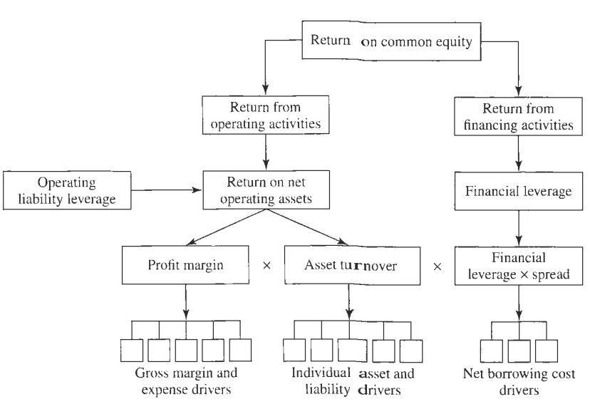
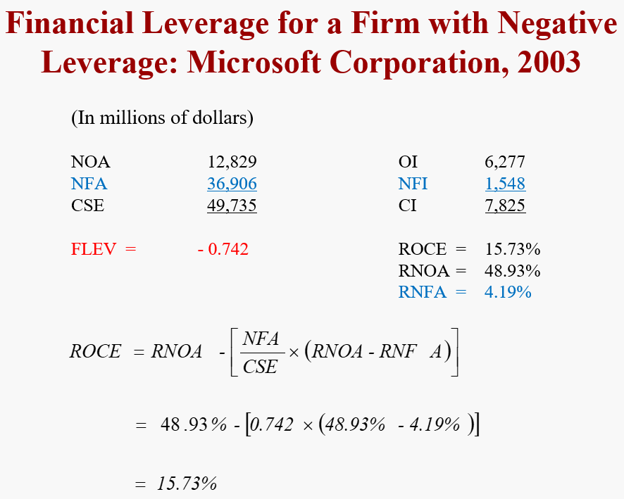
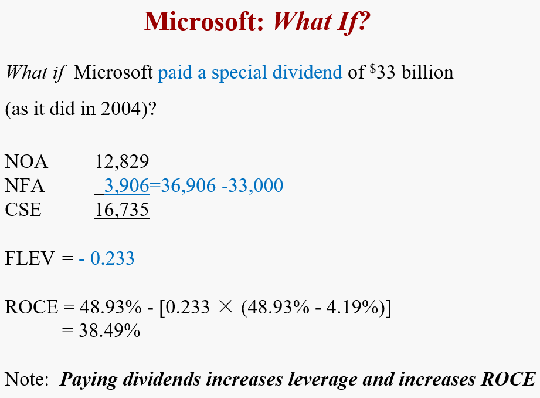
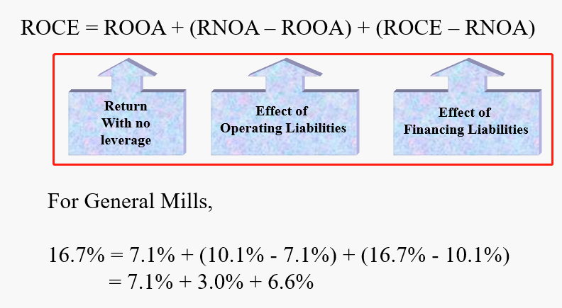
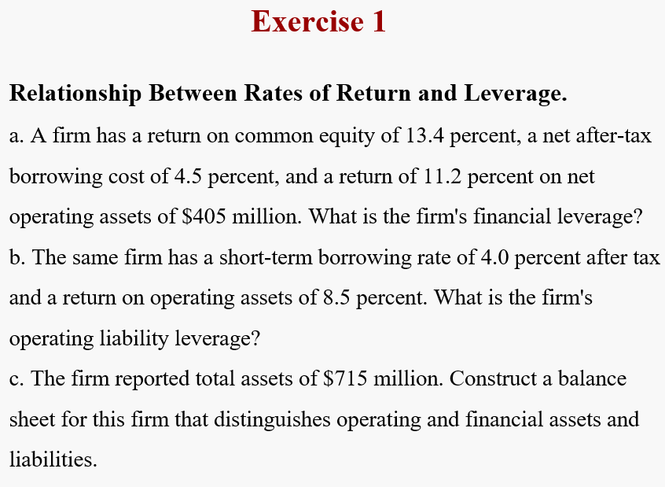
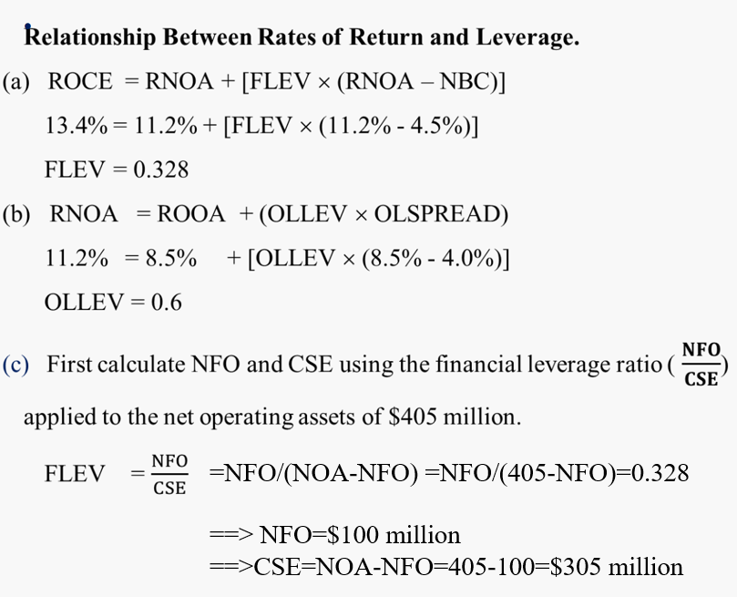
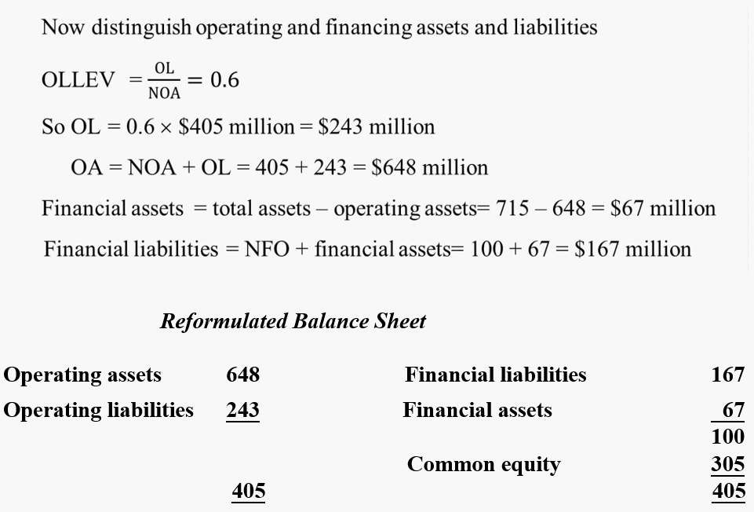
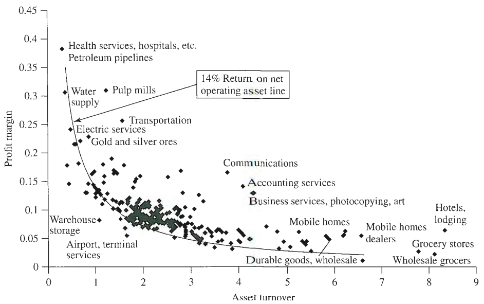
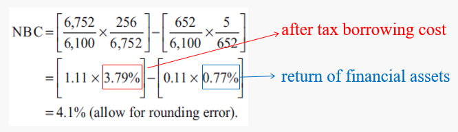

# The Analysis of Profitability

> *What drives profitability?*

这就是本节关注的问题，在本书的框架下，ROCE is the driver of profitbility, 那么the driver of ROCE又是什么呢？

#### The big picture for Chapter 12 and 13 <!-- {docsify-ignore} -->

> *What drives residual earnings?*

ROCE and CSE.

$$
V_0^E = CSE_0 +{RE_1\over \rho_E}+{RE_2\over \rho_E^2}+ \cdots \\
where \quad RE_1 = [ \underset{profit\ dirver}{ROCE_1} - (\rho_E-1) ] \underset{growth \ driver}{CSE_0}
$$

- Analysis establishes *where the firm is now*
- Forecasting asks *how it will be different in the future*

the analysis of the driver of ROCE属于 profitability Analysis，而the analysis of growth则属于 growth analysis，会在下章涉及。

## Three layers decomposition

$$
\text{Return on common equity (ROCE)} = {\text{Comprehensive income}\over \text{Average CSE}}
$$

从最基础的公式出发，接下来通过三层结构会把 ROCE 一步一步拆分。

## First Level: Leverage

### Financing Leverage

金融杠杆对ROCE的影响如下：

$$\begin{aligned}
\text{Return on common equity}=& \text{Return on operating assets}\\
&+ (\text{Financial leverage} \times \text{Operating spread}) \\
\text{ROCE} = & \text{RNOA} + [\text{FLEV}\times (\text{RNOA}-\text{NBC})]
\end{aligned}
$$

因此，ROCE的driver可以被分为**三部分**：

1. Return on net operating assets ($ \text{RNOA}={\text{OI}\over\text{NOA}} $)
   
2. Financial leverage ( $ \text{FLEV} = {\text{NFO} \over \text{CSE}} $ )
   
3.  Operating spread between the return **the return on net operating assets** and **net borrowing cost** ( $ \text{SPREAD} = \text{RNOA}-\text{NBC} $ )

此时不难发现，**当 Spread 大于0时**，金融杠杆才是有益的，否则金融杠杆越大，ROCE 降低的也越多。

对于像 NIKE 这样的公司来说，Financial assets 多于 Financial obligation，因此不存在 NFO，只有NFA，**此时则不存在金融杠杆**，公式如下：

$$
\text{ROCE} =  \text{RNOA} - [ {\text{NFA} \over \text{CSE}} \times (\text{RNOA}-\text{RNFA})]
$$

其中，$\text{RNFA} = {\text{Net financial income}}/\text{NFA} $。

这代表 **positive spread 反而会降低 ROCE**，这是因为**股东的部分权益被投资到了金融资产中**，只有这些金融资产的回报率超过营运资产收益率RNOA时，才会对ROCE带来提升。

***Example***

当公司拥有 NFA 时，发放红利反而会提升 ROCE：

> [!TIP|label:推导]
$$\begin{aligned}
\text{ROCE} &= {\text{CI} \over \text{CSE}} = {\text{OI}-\text{NFE} \over \text{CSE}} \\
&= {\text{OI} \over \text{CSE}}-{\text{NFE} \over \text{CSE}} \\
&= {\text{RNOA} \times {\text{NOA} \over \text{CSE}}}-{\text{NBC} \times {\text{NFO} \over \text{CSE}}} \\
where \quad & \text{RNOA} = {\text{OI}\over\text{NOA}}, \ \ \text{NBC} = {\text{NFE}\over \text{NFO}}
\end{aligned}$$
> 此时，可以理解为 ROCE 是 operation return 和 (negative) return from financing activities 的**加权平均**。
>
> 进一步分解
$$\begin{aligned}
\text{ROCE} &= \text{RNOA} \times { (\text{NFO + CSE}) \over \text{CSE} } - \text{NBC} \times {\text{NFO} \over \text{CSE}} \\
&= \text{RNOA} + \left[{\text{NFO} \over \text{CSE}} \times (\text{RNOA}-\text{NBC})\right] \\
&= \text{RNOA} + (\text{FLEV}\times \text{SPREAD})
\end{aligned}$$
>

#### FLEV VS Debt-to-Equity Ratios  <!-- {docsify-ignore} -->

$$\begin{aligned}
\text{Debt-to-Equity} &= {\text{Total Debt} \over \text{Equity}} = {\text{OL + FO}\over \text{CSE}} \\
\text{FLEV} &= {\text{NFO} \over \text{CSE}} = {\text{FO}-\text{FA}\over \text{CSE}}
\end{aligned}
$$

**Problems with Debt-to-Equity Ratios**

- Excludes financial assets (which effectively *defease* debt)
- Includes operating liabilities

### Operating Liability Leverage

正如金融负债可以 lever up ROCE，营运负债（operating liability）通过减少了营运资产，也可以lever up RNOA。

$$
\text{RNOA} = {\text{OI}\over \text{OA}-\text{OL} }
$$

营运杠杆为：
$$
\text{OLLEV} = {\text{OL} \over \text{NOA}}
$$

通常来说营运杠杆为0.4左右。

> [!ATTENTION|label:Operating liability]
> 拥有大量的营运负债并不总是好事，例如，正常找供货商采购的价格是100，但是如果公司赊购，产生了营运负债，那么供货商给的价格可能就会变成105。

RNOA的公式为：

$$\begin{aligned}
\text{Return on operating assets} = &\text{Return on Operating assets}\\
&+ (\text{Operating liability leverage}\times \text{Operating liability leverage spread})\\
\text{RNOA} =& \text{ROOA} + (\text{OLLEV}\times\text{OLSPREAD}) 
\end{aligned}$$

where,

$$\begin{aligned}
\text{Return on operatmg assets (ROOA)} &=  {\text{OI + Implicit interest (after tax)} \over \text{Operating assets}} \\
\text{Implicit interest on operating liabilities} &= \text{Short-term borrowing rate (after tax)} \times \text{Operating liabilities} \\
\text{OLSREAD} &= \text{ROOA}-\text{Short-term borrowing rate (after tax)}
\end{aligned}$$

> [!TIP|label:推导]
$$\begin{aligned}
\text{RNOA} &= {\text{OI} \over \text{NOA} } = {\text{OI} + \text{OL}\times r \over \text{NOA}}- {\text{OL}\times r \over \text{NOA}}\\
&= {\text{OA} \over \text{NOA}} \times {\text{OI} + \text{OL}\times r \over \text{OA}} - {\text{OL}\times r \over \text{NOA}} \\
&= {\text{NOA} + \text{OL} \over \text{NOA}} \times {\text{OI} + \text{OL}\times r \over \text{OA}} - {\text{OL}\times r \over \text{NOA}} \\
&= \text{ROOA} + {\text{OL} \over \text{NOA}}\times \text{ROOA}-{\text{OL}\times r \over \text{NOA}} \\
&= \text{ROOA}+\text{OLLEV} (\text{ROOA}-r)
\end{aligned}$$
> 

同样地，只有当 OLSREAD 为正数时，营运杠杆才是有益的。

**当 NOA 为负时**，并不适用于杠杆计算，但并不代表不能为公司创造价值：

$$
\text{Residual income from operations (ReOI)} = \text{OI} - (\rho - 1)NOA_{t-1}
$$

#### RNOA VS ROA  <!-- {docsify-ignore} -->

$$\begin{aligned}
\text{RNOA} &= {\text{OI}\over \text{OA}-\text{OL}} \\
\text{ROA} &= {\text{Net Income + Interest Expense (After tax) + Minority Interest}\over \text{Total Assets}}
\end{aligned}$$

**Problems with ROA**

- Financial assets in denominator
- Financial income in numerator
- Operating liabilities not in denominator
- Net income is not comprehensive income

### Summary for the two Leverages <!-- {docsify-ignore} -->

***Example***

## Second Level: drivers of Operating profitability

沿着First Level得到的公式，将RNOA继续分解为PM和ATO。

$$
\begin{aligned}
\text{ROCE} &= \text{RNOA} + [\text{FLEV}\times (\text{RNOA}-\text{NBC})] \\
\text{where} \quad \text{RNOA} &= \text{PM} \times \text{ATO} \\
\text{Operating profit margin (PM)} &= {\text{OI}\over\text{Sales}} \\
\text{Asset turnover} &= {\text{Sales}\over \text{NOA}}
\end{aligned}
$$

通常来说，PM和ATO具有反向关系，例如房地产，利润率高但周转率低，又或是服装制造，通过打广告来吸引顾客，那么扣除营销费用之后的利润率往往很低，但是由于打了广告，周转率又会提高。

## Third Level

最后一层分解，就是找出第二层中PM和ATO的drivers，以及还没有分析过的NBC。

#### PM drivers  <!-- {docsify-ignore} -->

$$
\text{PM = Sales PM + Other items PM}
$$

进一步细分：

$$
\begin{aligned}
\text{Sales PM} &= \text{Gross margin ratio} - \text{Expense ratios} \\
&= { \text{Gross margin}-\text{Administrative expense}-\text{Selling expense}-\text{R\&D} - \text{Operating taxes} \over \text{Sales} }
\end{aligned}
$$

$$
\begin{aligned}
\text{Other operating items PM} = { \text{Subsidiary income}+\text{Other equity income}+\text{Special items}+\text{Other gains and losses} \over \text{Sales}}
\end{aligned}
$$

#### ATO drivers  <!-- {docsify-ignore} -->

资产周转率衡量了每美元净运营资产所产生的销售收入，常常也可以反过来看：

$$
{1\over \text{ATO}} = {\text{NOA}\over \text{Sales}}
$$

这样就可以解读为，用来产生1美元销售收入所需的净资产数量。例如ATO是2，那么就代表，需要50美分的净资产来产生一美元的收入。

分解ATO drivers为：

$$\begin{aligned}
{1\over \text{ATO}} =& { \text{Cash + Accounts receivable + Inventory}+\cdots+\text{PPE} \over \text{Sales}} \\
&-{\text{Accounts payable + Pension obligation}+\cdots \over \text{Sales}}
\end{aligned}$$

#### Analysis of NBC  <!-- {docsify-ignore} -->

NBC可以被理解为是不同来源资金成本的加权平均：

$$
\begin{aligned}
\text{NBC} &= { \text{After-tax interest on FO + Preferred dividend}-\text{After-tax interest on FA}-\cdots \over \text{NFO}} \\
&= \left[ {\text{FO}\over \text{NFO}}\times {\text{After-tax interest on FO}\over \text{FO}} \right]+\left[ {\text{Preferred stocks} \over \text{NFO}}\times {\text{Preferred dividend}\over \text{Preferred stocks}}  \right]-\left[ {\text{FA}\over \text{NFO}}\times {\text{After-tax interest on FA}\over \text{FA}}  \right] \cdots
\end{aligned}
$$

## Conceptual Questions

***Under what conditions would a firm's return on common equity (ROCE) be equal to its return on net operating assets (RNOA)?***

1. The SPREAD is zero, that is, return on net operating assets (RNOA) equals net borrowing cost (NBC)

2. Financial leverage (FLEV) is zero, that is, financial assets equal financial obligations.

***Under what conditions would a firm's return on net operating assets (RNOA) be equal to its return on operating assets (ROOA)?***

1. The operating liability leverage spread (OLSPREAD) is zero, that is, ROOA equals the implicit borrowing rate for operating liabilities

2. Operating liability leverage (OLLEV) is zero, that is, the firm has no operating liabilities.

***State whether the following measures drive return on common equity (ROCE) positively, negatively, or depending on the circumstances:***

||Impact|
|:--:|:--:|
|Gross margin| positive |
|Advertising expense ratio|**negative**|
|Net borrowing cost|negative|
|Operating liability leverage|depends|
|Operating liability leverage spread|**positive**|
|Financial leverage|depends|
|Inventory turnover|positive|

***A reduction in the advertising expense ratio increases return on common equity and share value. Correct?***

The first part of the statement is correct: A drop in the advertising expense ratio
increases current ROCE because, all else constant, it increases the profit margin. But a drop in
advertising might damage future ROCE share value because of a drop in sales that the
advertising might otherwise generate.

***A firm states that one of its goals is to earn a return on common equity of 17-20 percent. What is wrong with setting a goal in terms of return on common equity?***

Return on common equity (ROCE) is affected by **leverage**. If a firm borrows, pays
dividends, or makes a stock repurchase, it can increase its ROCE. But if a change in leverage
does not add value, shareholders are not better off. The firm’s return on operations (RNOA) is
not affected, and it is RNOA that adds value. Operating activities vs. financing activities.
Always examine increases in ROCE to see if they are due to leverage.

***Why might operating losses increase after-tax borrowing cost?***

If the firm loses the ability to deduct interest expense for tax purposes, it does not
get the tax benefit of debt and so increases its after-tax borrowing cost. Of course the firm also
may find that creditors will charge a higher before-tax borrowing rate if it is making losses.

***Some retail analysts use a measure called "inventory yield," calculated as gross profit-to-inventory. What does this measure tell you?***

The inventory yield is a measure of the profitability of inventory, the profit from selling
inventory relative to the inventory carried. If gross profit falls or inventories increase, the ratio will fall.

