# Analysis of growth

- What is 'growth' in a valuation context? What is a growth company?
  - 要依靠RE和AEG来分类growth
- How are sustainable earnings identified?
  - 进一步区分了Operating Income中的sustainable和unsustainable terms
- What are the drivers of growth?
  - 重新按照Chapter 12分解
- How dow growth affect PB and PE ratios?
  - PB高或PE高就是成长性公司吗？

## Warnings About Growth

Firms can grow earnings, but not create value

- Earnings growth generated by *investment*
- Earnings growth generated by the *accounting*

**Value-added growth**

Think of growth in *residual earnings* and *abnormal earnings growth*

> If a firm has no growth in residual earnings, its abnormal earnings growth must be zero: The firm is a "no-growth" firm

**Warnings**

1. *Growth is difficult to sustain*

Unless a firm has a clear, sustainable competitive advantage, market forces will eventually erode growth

2. *Growth is risky*

Growth can be competed away, but also growth gets hit in bad times

## Sustainable Earnings

**Sustainable earnings** (Core Earnings/ Persistent Earnings ) are earnings that can be repeated (sustained) in the future and which can grow.

与之对应的就是 Unusual Items or Transitory Earnings。

有了定义，接下来就是：
1. Distinguish core operating income from unusual (transitory) income

$$
\text{Operating Income = Core OI + Unusual items}
$$

2. Distinguish core income from sales from other core operating income

$$
\text{Operating Income = Core OI from Sales+ Core Other OI + Unusual items}
$$

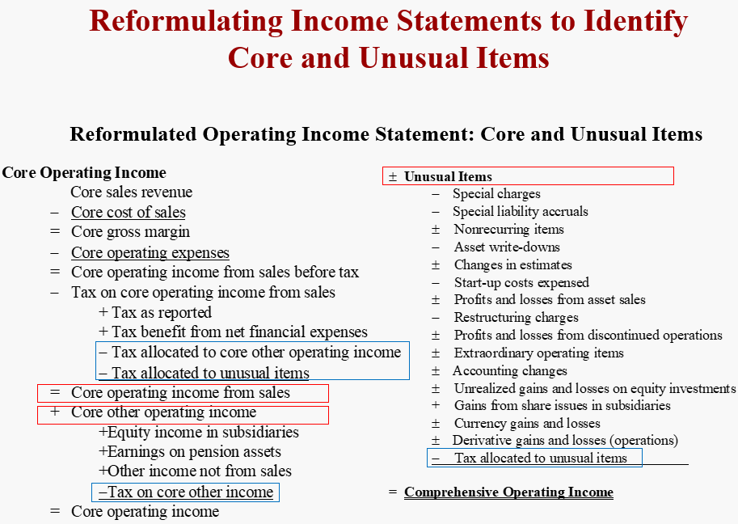

> 公司的core earning 由其经营策略决定，所以分析师必须要找到公司的business model才能更准确的预估未来的发展，也就是说找到了公司的sustainable earnings，也就相当于找到了公司的competitive advantage。

### Process

想要distinguish core earnings from transitory earnings，需要考虑以下几项：

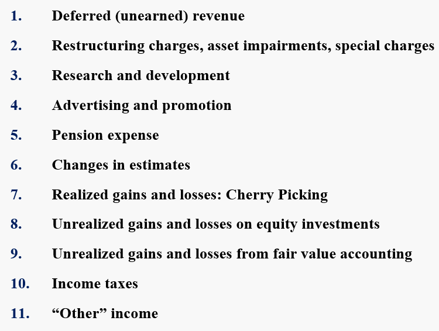

#### Deferred Revenue <!-- {docsify-ignore} -->

当一个合同的收入没有完全实现时【特别是对于多年的合同来说】，未来预计会得到的收入就会记为deferred (or Unearned)。当对于未来收入做出估计时，有的公司会比较aggressive【booking too much revenue to the 
current income statement】，有的公司会比较conservative【deferring too much to the future】。

在实际操作中，conservatism会比较普遍，因为给未来留下了很大的操作空间。当一个公司需要Income时，就可以从deferred revenue中拿出来一部分记录，这也被称之为 **BleedBack**。

#### R&D or Advertising <!-- {docsify-ignore} -->

A drop in these terms expenditure *increases current earnings* but may *damage future earnings*. Investigate whether changes in them are temporary.

可以通过二者与Sales的比值来看其效果如何。

#### Pension Costs <!-- {docsify-ignore} -->

养老金包括许多组成部分：

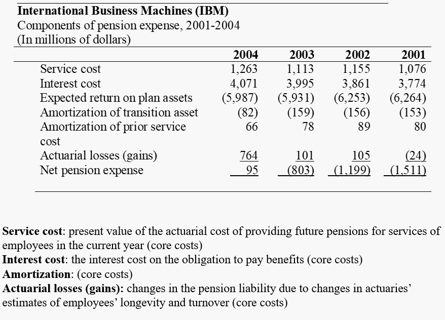

- Service cost is a part of the core cost of paying employees. 
- Interest cost is also a core cost

因为这两项本质上属于**给工人的工资**，只不过是延迟发放，所以计入core cost。

而类似于expected earnings on the assets，则不属于core business。

#### Cherry Picking <!-- {docsify-ignore} -->

Cherry Picking 指的是公司可以选择卖出盈利的证券而实现收入【特别是在销量下行的时候】，而留下亏损的证券【记录在equity statement】，特别是对于持有大量投资组合的公司来说，这一情况更应该注意。

解决的办法就是realized和unrealized共同计入comprehensive income中。

对于Unrealized gain or loss，因为我们要预测未来的增长，而未来市场走势无法预测，因此这些应被列入transitory项。

#### Changes in Estimates <!-- {docsify-ignore} -->

- Bad debt allowances
- Deferred revenue 
- Warranty allowances
- Residual values for leases

这些应该被列入 **unusual terms**。

#### Income Taxes <!-- {docsify-ignore} -->

**Unusual** aspects of income tax expense such as *one-time* or *expiring credits and loss carry forwards* can be found in the tax footnote.

## Analysis of Changes in ROCE

在区分Core earning的基础上，本节包括两部分：

- Analyse Change in Profitability of Operations (RNOA)
- Analyze the Effects of Changes in Financing

$$
\text{ROCE = RNOA} + (\text{FLEV} \times \text{SPREAD})
$$

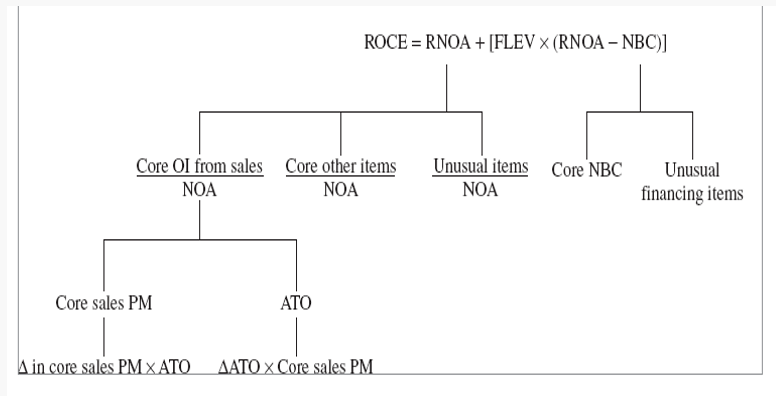

### Change in RNOA <!-- {docsify-ignore} -->

$$
\begin{aligned}
\mathrm{RNOA}& ={\frac{\mathrm{CoreOI}}{\mathrm{NOA}}}+{\frac{\mathrm{UI}}{\mathrm{NOA}}}  \\
&=\frac{\mathrm{Core~OI~from~Sales}}{\text{NOA}}+\frac{\mathrm{Core~Otherwise~OI}}{\text{NOA}}+\frac{\mathrm{UI}}{\mathrm{NOA}} \\
&= [\text{Core Sales PM}\times \text{ATO}]+\frac{\mathrm{Core~Otherwise~OI}}{\text{NOA}}+\frac{\mathrm{UI}}{\mathrm{NOA}} \\
\text{where} \quad & \text{Core Sales PM} = {\text{Core OI from Sales}\over \text{Sales}}
\end{aligned}
$$

区分完了之后就是分析他们各自的drivers of changes

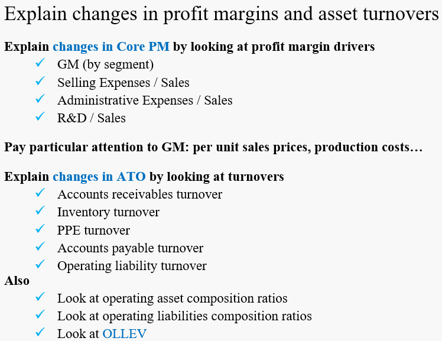

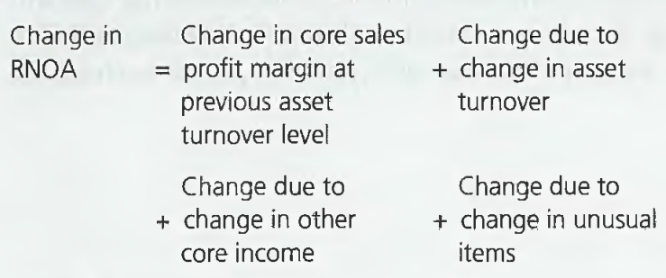

$$
\Delta \text{RNOA}_1=\left[\Delta \text{Core PM}_1 \times \text{ATO}_0\right]+\left[\Delta \text{ATO}_1 \times \text{Core PM}_1\right]+\Delta\left[\frac{\text{Core other OI}}{\text{NOA}}\right]+\Delta\left[\frac{\text{UI}}{\text{NOA}}\right]
$$

**Examples**

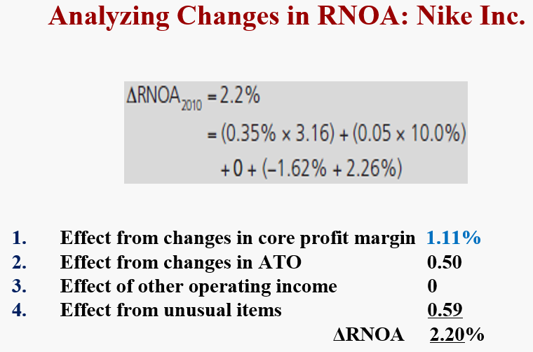

### Change in Leverage <!-- {docsify-ignore} -->

#### Operating Leverage <!-- {docsify-ignore} -->

#### Financial Leverage <!-- {docsify-ignore} -->

## Growth with PB PE ratios

PB 和 PE之间不具有必然的联系，当 PB 高时，PE可能高也可能低 

- expected future residual earnings must be zero here because PB is normal
- expected future RE must be the same as current RE for the PE to be normal

#### Exercise <!-- {docsify-ignore} -->

***Analyzing a Change in Core Operating Profitability***

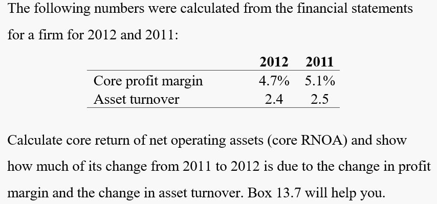

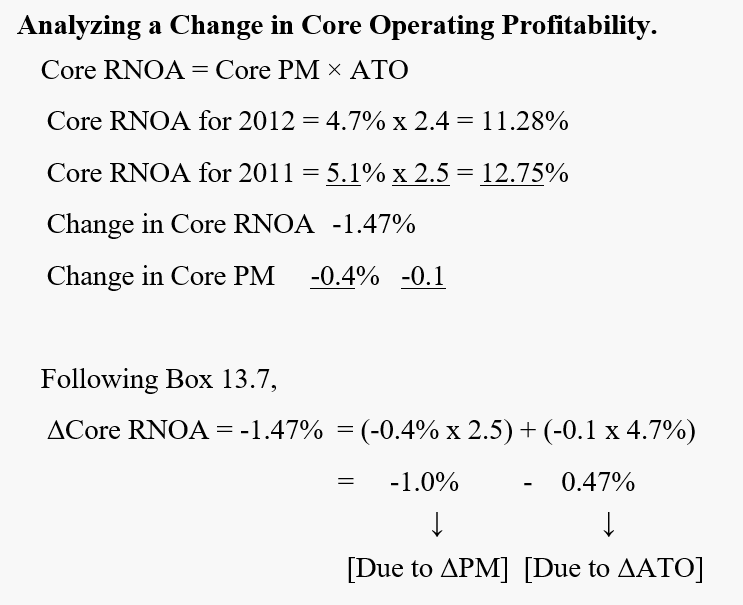

***Analyzing a Change in Return on Common Equity***

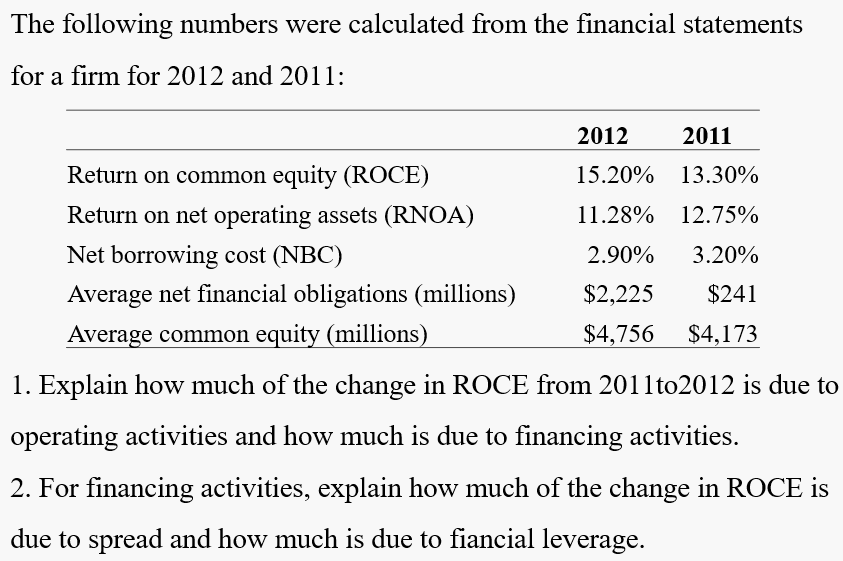

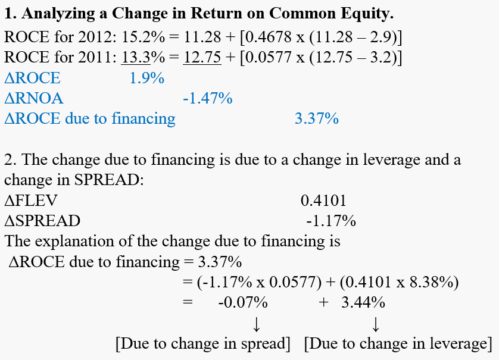

***Analyzing the Growth in Shareholders' Equity***

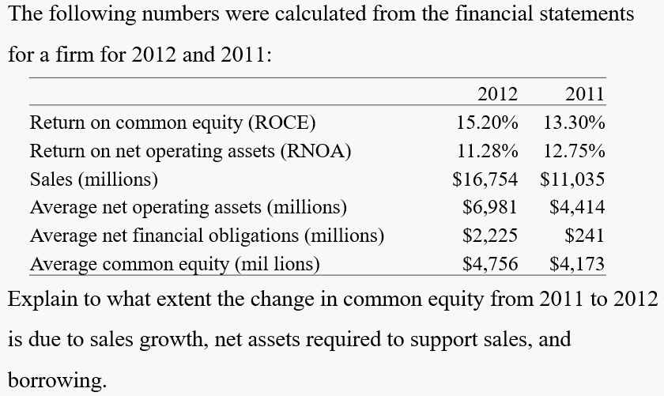

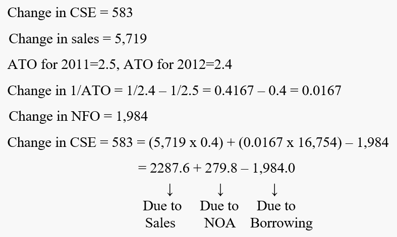

#### conceptual questions <!-- {docsify-ignore} -->

***What is a growth firm?***

A growth firm is one that is expected to grow residual earnings or one that can generate abnormal earnings growth.

***What features in financial statements would you look for to identify a firm as a growth company?***

An ROCE greater than the cost of capital or Increasing residual earnings due to Sales growth, increasing profit margins, increasing asset turnover, or growing net investment producing these features.

A growth company is one that is expected to have these attributes in the future. It is
possible that a firm may have had these attributes in the past but is not expected to
have them in the future. And it is possible that a firm may not have these features
currently (a start-up, for example), but is expected to have them in the future.

***Why would an analyst wish to distinguish the part of earnings that is sustainable?***

Sustainable matters in the future, so when an analyst wants to predict the future statements, she has to identify sustainable parts.

***What are transitory earnings? Give some examples***

Transitory earnings are aspects of current earnings that have no bearing on future earnings. For instance, a one-time contract, a one-time uninsured loss of property.

***Are unrealized gains and losses on financial assets persistent or transitory income?***

In one sense, these gains and losses are persistent because they occur every period.
 But a gain or loss in the current period gives no indication of whether there will be a gain
or loss in the future. That is, the expected future gain or loss is zero, irrespective of the
current gain or loss. So these gains and losses are treated as transitory

***Distinguish operating leverage from operating liability leverage.***

Operating leverage is the proportion of fixed and variable costs in a firm's cost
structure; it is an income statement concept.  Operating liability leverage is the proportion of operating liabilities in net operating  assets; it is a balance sheet concept.

Both create leverage. Operating leverage levers the operating income from sales.
Operating liability leverage levers operating income from net operating assets (RNOA)

***The higher a firm's contribution margin ratio, the more leverage it gets from increasing sales. Correct?***

This is correct. A higher contribution margin means lower variable costs. So more
of each dollar of sales "goes to the bottom line

***Would you see a high profit margin of, say, 6 percent for a grocery retailer as sustainable?***

Profit margins in retailing tend to be low because the business is very competitive.

***A firm can have a high trailing PE ratio, yet have a low expected earnings growth rate in the future. Is this so?***

Yes, this is correct. A trailing P/E can be high because current earnings are temporarily low.

***Can a firm have a high PIE ratio yet a low PIB ratio? How would you characterize the growth expectations for this firm?***

Yes. See the cell analysis of the chapter. A firm with a high P/E and a low P/B is one where residual earnings are expected to increase from their current level but are expected to be lower than zero.

***Firms with high unsustainable earnings s hould have low trailing P/E ratios. Is this correct?***

Yes, correct. Temporarily high earnings are expected to decline, so should have a low P/E ratio

