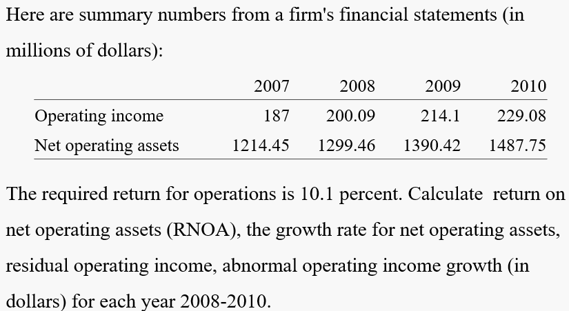
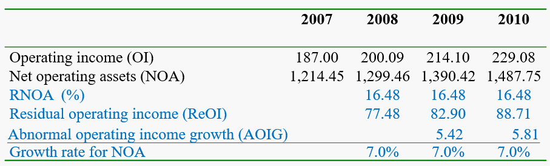

# The Value of Operations and the Evaluation of Enterprise Price-to-Book Ratios and Price-Earnings Ratios

#### Exercise <!-- {docsify-ignore} -->

***Calculating Residual Operating Income and Its Drivers***

#### conceptual questions <!-- {docsify-ignore} -->

***If assets are measured at their fair (intrinsic) value, the analyst must forecast that residual earnings from those assets will be zero. Is this correct?***

This is correct. The assets are expected to earn at their required return. Therefore expected residual income is zero.

***Why might the market value of the assets of a pure investment fund that holds only equity securities not be an indication of the fund's (intrinsic) value?***

The shares held may not be priced efficiently. If the fund is an actively managed fund, the fund managers are investing in shares that they think are under-priced. So the fund might trade at a premium.

***What drives growth in residual operating income?***

Residual operating income growth is driven by an increase in RNOA and in the NOA that earn at this RNOA. Breaking it down further, ReOI growth is driven by

1. Growth in sales (that drives growth in NOA) 
2. Increase in operating profit margins
3. Increase in asset turnovers (so NOA increases but sales increase more that NOA)

***Explain what is meant by a financing risk premium in the equity cost of capital. When will a financing risk premium be negative?***

A financing risk premium is the additional risk that equity holders have of losing value because the firm cannot meet obligations on its net debt. The premium will be negative if the firm has net financial assets rather than net financial obligations.

***A firm with positive net financial assets will typically have a required return for equity that is greater than the required return for its operations. Is this correct?***

This statement is incorrect. The required return for operation is a weighted average of the required return for equity and that for net financial assets. As the required return on net financial assets is typically less than that for operations, the required return for equity is greater than that for operations. (The relationship is reversed if the firm has net financial obligations.)

***What is wrong with tying management bonuses to earnings per share? What measure would you propose as a management performance metric?***

Earnings per share can be increased by increasing leverage. So management can increase their bonuses without creating value for shareholders by increasing leverage. They increase risk, but not value.

*Residual operating income* is a more desirable metric. It focuses on operations (where value is created) and is not affected by financing.

***The management of a firm that ties employee bonuses to return on common equity repurchases some of the firm's outstanding shares. What is the effect of this transaction on shareholders' wealth?***

Shareholders’ wealth declines. A share repurchase increases ROCE so, in this case, increases management’s bonus pay. But a change in ROCE does not create value for shareholders – unless the repurchase is at a price that is less than fair value. The shareholders are paying a bonus for nothing.

***An increase in financial leverage increases return on common equity (if the operating spread is positive), and thus increases residual earnings. The value of equity is based on forecasted residual earnings, yet it is claimed that the value of equity is not affected by a change in financial leverage. How is this seeming paradox explained?***

ROCE and residual earnings are indeed affected by a change financial leverage. But, following the argument through, *the required return* for equity also changes with leverage such that the present value of forecasted residual earnings (and thus the equity value) is unchanged

***Levered price-to-book ratios are always higher than unlevered price-to-book ratios. Is this correct?***

No. This statement is only correct for a firm with *positive financial leverage* (FLEV greater than zero which implies financial obligations are greater than financial assets) and *unlevered price-to-book ratios* greater than 1.0. See formula 14.9.

***During the 1990s and 2000s, many firms repurchased stock and borrowed to do so. What is the typical effect of stock repurchases on earnings-per-share growth and return on common equity? Predict how a firm that excessively engaged in these practices would have fared in the downturn in 2008.***

The effect of these repurchases and borrowings was to increase earnings per share growth and ROCE for the time that the leverage remained **favorable** (that is, operations were profitable). In the downturn, leverage turned unfavorable, damaging the equity value of highly leveraged firms.

***Does an increase in financial leverage increase or decrease the (levered) P/E ratio?***

An increase in financial leverage increases equity risk and the required return for equity. On the one hand, the levered P/E declines, provided the operating income yield is higher than the net borrowing cost. On the other hand, this means that the P/E decreases provided that growth is not particularly high.

***Noting the large amount of stock repurchases in 2009-2010, an equity strategist at a leading Wall Street firm predicted that earnings per share would increase and "we'll see a jump in P/E ratios." Does he have the correct analysis?***

He is correct with the statement that EPS will increase. But he is not correct in saying the P/E ratios will increase. Stock repurchases increase leverage and leverage reduces P/E ratios (typically).

***A Wall Street analyst predicted in 2010 that, after the considerable deleveraging during the financial crisis, firms would begin once again to lever up with more borrowing. "They must defend their return on equity," he claimed. As a result, "investors should look for a rise in dividends and share buy-backs and an expansion of PE multiples, leading to equity market outperformance." Is he correct?***

He is correct is saying that increased leverage will typically result in higher ROCE. But an increase in leverage does not increase equity value. And an increase in leverage will reduce P/E ratios (see the leverage example in Box 14.5 and formula 14.12.). It may be that there will be more share buy-backs and dividends of firms use the borrowed funds for such purpose, but that will not add to shareholder value. 

