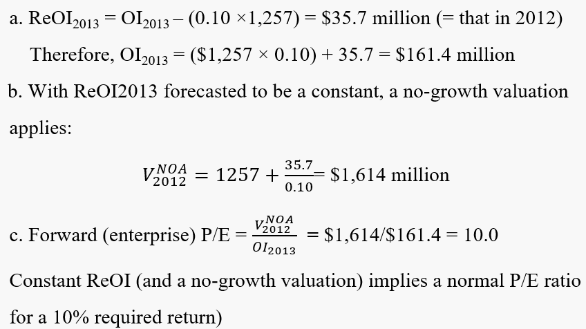
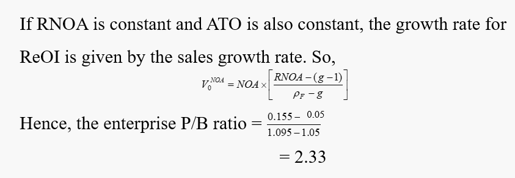

# Anchoring on the Financial Statements: Simple Forecasting and Simple Valuation

#### Excersise <!-- {docsify-ignore} -->

***A No-growth Forecast and a Simple Valuation***

An analyst calculates residual operating income of \$35.7 million from financial statements for 2012, using a required return for operations of 10 percent. She also forecasts residual operating income at the same level for 2013 and years after on net operating assets of $1,257 million at the end of 2012.

a. What is the analyst's forecast of operating income for 2013?

b. What is the value of the operations based on these forecasts?

c. What is the forward enterprise P/E ratio implied by the forecasts?

***Simple Valuation with Sales Growth Rates***

An analyst forecasts that the current core return on net operating assets of 15.5 percent will continue indefinitely in the future with a 5 percent annual sales growth rate. She also forecasts that the current asset turnover ratio of 2.2 will persist. Calculate the enterprise price-to-book ratio if the required return for operations is 9.5 percent

#### Conceptual questions  <!-- {docsify-ignore} -->

***A valuation that simply capitalizes a forecast of operating income for the next year implicitly assumes that residual operating income will continue as a perpetuity. Is this correct?***

Yes, this is correct. The two equation are equal.

***A valuation that simply capitalizes a forecast of operating income for the next year implicitly assumes that residual operating income will continue as a perpetuity. Is this correct?***

The forecast is a good one if:

1. RNOA will be the same
2. NOA will be the same $\text{Core OI}_1 = \text{Core OI}_0 + (\text{Required return}\times \delta \text{NOA})$

***When is the forecasted growth rate in residual operating income the same as the forecasted growth rate in sales?***

when RNOA, ATO, PM are constant.

***Would you call a firm that is expected to have a high sales growth rate agrowth firm?***

Sales growth does not necessarily imply residual income growth. A firm that is expected to have a high residual income growth would be called a growth firm.

***The higher the anticipated return on net operating assets (RNOA) relative to the anticipated growth in net operating assets, the higher will be the unlevered price-to-book ratio. Is this correct?***

