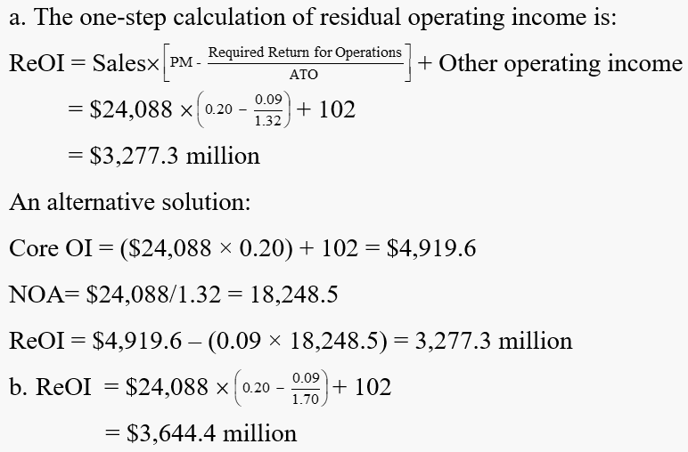
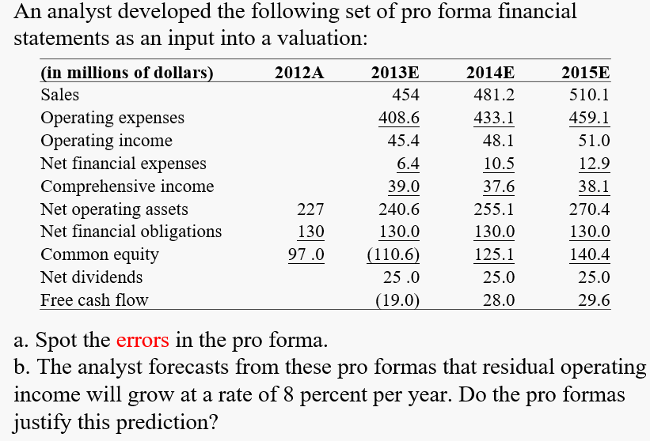
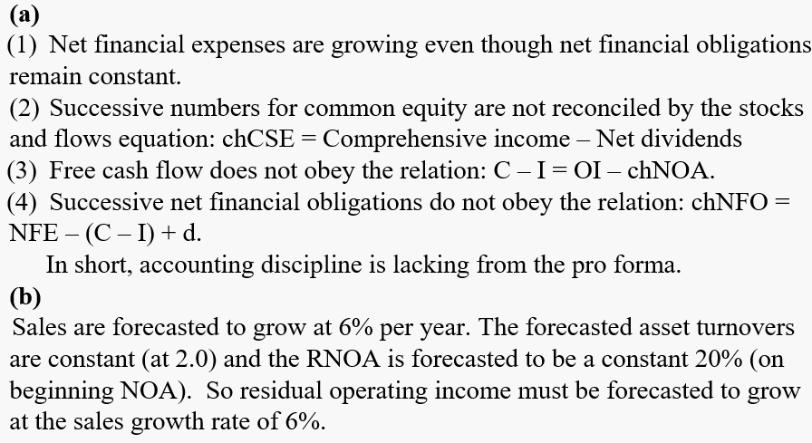

# Full-information forecasting

第15章仅使用了财务报表信息做预测，而本章为Full-information forcasting，还利用了财务报表之外的信息。

包括商业模式，公司产品，营销策略，竞争优势等等，这些因素会深刻地影响公司价值，但是却往往以定性的术语表达，而非具体的数字。

将公司商业互动转化为估值的过程中，需要注意以下四点：

1. **Focus on Residual Operating Income and Its Drivers**

如果使用PB估值，那么需要计算ReOI（residual operating income），如果使用PE估值，则需要计算AOIG（abnormal operating income growth），但实际上AOIG is just the change of ReOI，因此最终落脚还是在ReOI。**所有的business activities都可以表达为其对于ReOI的影响**。

RNOA有四个drivers：

$$
\text{RNOA}=(\text{Core sales PM}\times\text{ATO})+\frac{\text{Core other OI}}{\text{NOA}}+\frac{\text{Unusual iems}}{\text{NOA}}
$$

因此ReOI有5个drivers：

$$
\begin{aligned}
\mathop{\mathrm{ReOI}}& =\mathrm{Sales}\times\left[\mathrm{Core~sales~PM}-\frac{\mathrm{Required~return~for~ operations}}{\mathrm{ATO}}\right]  \\
&\text{+Core other OI}+\text{Unusual items}
\end{aligned}
$$

因此预测ReOI也就是预测五个drivers的变化：

1. Sales
2. Core sales profit margin
3. Asset turnover
4. Core other operating income
5. Unusual items

通常来说Sales是最重要的，没有customers和sales，不会产生任何价值。但是通常来说Sales的预测有不少难度，需要分析市场需求、产品价格等因素。

2. **Focus on Change**

分析一个公司的未来表现需要分析其drivers的变化。对于the changes in drivers的分析实际上也是对于ReOI sustainability的分析。

*（1）Understand the Typical Driver Pattern for the Industry*

drivers通常会呈现出均值回复的特征，因为一个行业总会呈现出典型的发展特征，长期来看没有谁能摆脱这种规律。通常来说unusual terms会revert更快一些，core items会慢一些，但是趋势都是一样的【mean reverting】。

这就与资产定价中的long-short不符，书中的解释是：

> The contrarians have these change patterns in mind but believe that **the market does not**. They beli eve that the market gets too excited about high sales and profit growth and thinks growth will continue rather than fade; and they believe the market does not understand that drops in sales and profits are often temporary

> [!TIP|label:Common fallacy]
> "*the rate of return must decline to the required return in the long run*"
>
> 由于会计方法的保守性，部分资产常常不计入会计报表中，因此会造成：即使公司只获得了 required return，但是由于分母因为漏记资产而变小，使得RNOA大于required return。例如制药企业的研发成本，可口可乐的品牌价值等等。

#### Exercise <!-- {docsify-ignore} -->

***One-Stop Residual Operating Income Calculation: Coca-Cola***

The Coca-Cola Company reported an after-tax profit margin of 20% on its sales of \$24,088 million in 2006. It also reported $102 million of other core income, mainly from equity investments in its bottling companies. Further analysis of the financial statements reveals an asset turnover (on net operating assets) of 1.32. Coke uses a hurdle of 9% for its investment in operations.

a. What was Coke's residual operating income for 2006?

b. What would Coke's residual operating income be if the asset turnover increased to 1. 7?

> [!TIP]
$$\begin{aligned}
\operatorname{ReOI}_t=\operatorname{OI}_t-\left(\rho_F-1\right)\mathrm{NOA}_{t-1}&=\left[\operatorname{RNOA}_t-\left(\rho_F-1\right)\right]\mathrm{NOA}_{t-1} \\
\text{RNOA} = \text{PM} \times \text{ATO} \quad &\text{NOA} = \text{Sales} \times {1\over\text{ATO}}
\end{aligned}
$$
> 

***Integrity of Pro Formas***

#### Conceptual questions <!-- {docsify-ignore} -->

***Why is it important to understand the "business concept" before valuing a firm?***

To forecast future financial statements, the analyst must know where the business is going. And the key drivers which determine future financial statements are determined by business concpet.

***Explain why a fade diagram is helpful for forecasting.***

Fade diagram gives a typical patterns of changes in drivers over time. The forecaster takes these patterns as a starting point and asks how the individual firms in question might be different from the average firm.

***What factors determine the rate at which high operational profitability declines over time?***

Competition is the primary determinant. But the ability of a firm to challenge the competition slows the fade rate. A slow fade rate indicates durable competitive advantage.

***What is meant by the "integrity" of a proforma?***

The various part tie together according to the accounting relations that govern the statements.

***Forecasted dividends affect forecasted shareholders' equity but do not affect the value calculated from forecasted financial statements. Why?***

Values are calculated from forecasts of operations, and dividends do not affect operations. Dividends, rather, are a disposition of the free cash flow from operations.

***What is a red-flag indicator?***

A red flag indicator is a feature within or outside the financial statements that indicates
deterioration in profitability in the future.

***What is an unarticulated strategy?***

An unarticulated strategy is a business idea that is not developed enough to quantify it
into pro forma statements

***Why must the effect of a merger or acquisition on shareholder value be calculated on a per-share basis?***

When shares are issued in a merger or acquisition, the analyst must be concerned with
the division of the value of the merged company between the shareholders of the two firms in the
merger. That division is determined by the terms under which shares are issued in the merger

***When might management of a firm consider a leveraged buyout?***

A firm generates value for shareholders when it buys the firm’s shares at less than intrinsic value. If management considers the shares to be undervalued in the market, buying them generates value.

***Why might the shares of the acquiring firm in an acquisition decline on announcement of the acquisition?***

The acquirer’s shares will decline if the market thinks the acquirer is overpaying for the
acquisition

