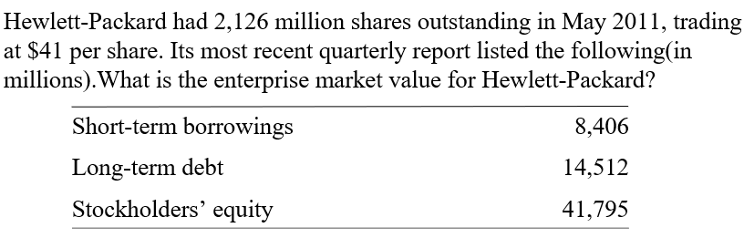

# Introduction to investing, valuation

In this chapter, you will learn:
* **Who** invests in firms and **what** analysis do they need? 
* How is **fundamental investing** different from other **investment styles**?
* What is the role of the professional **analyst**? 
* How are business analysis and financial statement analysis **connected**?

## Users of Firms’ Financial Information (**Demand Side**)
- Equity Investors
  - Investment analysis
  - Management performance evaluation
- Debt Investors
  - Probability of default
  - Determination of lending rates
  - Covenant violations
- **Management** (insiders; management accounting)
  - Strategic planning
  - Investment in operations
  - Evaluation of **subordinates**
- Employees
  - Security and remuneration
- **Litigants**
  - Disputes over value in the firm
- Customers
  - Security of supply
- Governments
  - Policy making
  - Regulation
  - Taxation
  - Government contracting
- Competitors

## Investment Style
* Intuitive Investing
  * Rely on intuition(no analysis, ALL IN!)
* Passive Investing 
  * Accept the market, which is a '**Market Efficient**' Approach
* **Fundamental** Investing: Challenge market prices (Fundamental investor)
  * Active investing (Active investor)：to find mispriced investments
  * Defensive investing (Defensive investor): a defense against paying the wrong price (or selling at the wrong price)

## Cost of Each Approach
- Danger in intuitive approach:
  - Self deception
- Danger in passive approach:
  - Price is what you pay, value is what you get
  - Passive investor is in danger if the stocks are mispriced, i.e., the market is not efficient
- Fundamental analysis:
  - Requires work ! (The costs to collect, process, and analyze information, including taking this course!)

> [!TIP]
> When information is costly, is it possible that the market is efficient? Why?

**Grossman-Stiglitz Paradox**: if prices perfectly reflected available information, there is no profit to gathering information(cause there is no misprice), in which case there would be little reason to trade and markets would eventually collapse.【？】

## Alpha and Betas
- Beta Technologies
  - risk-based return
  - Example: CAPM
- Alpha Technologies
  - abnormal return by exploiting the arbitrage opportunity from mispricing

Passive investment needs a beta technology (except for index investing【？】) .
**Fundamental investing needs both a beta and an alpha technology**.

## Risk and Return

- **Fundamental risk** is the risk that results from business operations (Passive investors also see this)
- **Price risk** is the risk of trading at the wrong price (Fundamental investors see this) : Paying too much or Selling for too little
  
Meanwhile, the returns to active stock selection can be very large, if the investor **is either fortunate or skilled enough** to select a concentrated port- folio containing stocks that go on to earn extreme positive returns.

## Business Activities
- **Financing Activities**: 
  - Raising cash from investors and returning cash to investors

- **Investing Activities**: 
  - Investing cash raised from investors in operational assets

- **Operating Activities**: 
  - Utilizing investments to produce and sell products

> [!NOTE]
> Need to know how to differentiate

## Valuation
### Firm Valuation
#### Formula
$$
\text{Value of the Firm} = \text{Value of Debt} + \text{Value of Equity}
$$
Typically, valuation of debt is a relatively easy task.

#### Example

You may think the answer is just the sum of the numbers listed by using the formula above. However, the value of equity does not equal to stockholder's equity which is a book value.

The value of debt is just $\text{\textdollar}8,406+\text{\textdollar}14,512=\text{\textdollar}22,918 \text{ million}$ while the value of equity is $\text{\textdollar}41\times 2,126 \text{ million} = \text{\textdollar}87,166 \text{ million}$

#### Formula
$$
\text{Value} = \text{Anchor} + \text{Extra Value}
$$

#### Example
A firm reports book value of shareholders' equity of $\text{\textdollar}850 \text{ million}$ with $25 \text{ million}$ shares outstanding. Those shares trade at $\text{\textdollar}45$ each in the stock market. An analyst values the equity by setting the book value as an anchor. She calculates extra value of $\text{\textdollar}675 \text{ million}$. Should she issue a buy or a sell recommendation to her clients?

The analyst evaluates the equity value as $\text{\textdollar}850 \text{ million} + \text{\textdollar}675 \text{ million} = \text{\textdollar}1,525 \text{ million}$. Under this valuation, the price of the stock should be $\frac{\text{\textdollar}1,525 \text{ million}}{25 \text{ million}}=\text{\textdollar}61$, which is higher than the current price. Thus, she should issue a buy recommendation.

## The Analysis of Business
***The financial statements are a lens on the business.【[蓝田之谜](/Courses_in_SUSTech/财务报表分析/《蓝田之谜》(全文).pdf)】***

- Business (Firm's Products)
  - Types of products
  - Consumer demand
  - Substitutes
  - ...
- Technology
  - Production, marketing and distribution processes
  - Supplier network
  - Cost structure
  - ...
- Firm's Knowledge Base
  - Direction and pace of technological change and the firm's grasp of it
  - Research and development programs
  - Innovation ability
  - ...
- Industry Competition
  - Industry concentration and the firm's position
  - Barriers to entry the industry
  - Competitiveness of suppliers and the capacity 【工会、上下游供应商（台积电）】
  - ...
- Management
  - Whether the management focus on shareholders or their own interests
  - Strength of corporate governance mechanisms
  - ...
- Political, Legal and Regulatory Environment
  - Political influence
  - Legal and regulatory constraints
  - Taxation
  - ...

## Key Questions about Firms
- Does the firm have **competitive advantage**?
- How **durable** is the firm’s competitive advantage?
- What forces are in play to promote competition?
- What **protection** does the firm have from competitors?

## Chinese analysts Website
- Analyst report:
  - https://data.eastmoney.com/report/info/AP202302111583050311.html
  - https://data.eastmoney.com/report/info/AP202302101583000711.html

- New Fortune Star Analyst:
  - https://www.xcf.cn/zhuanti/2022/fxs/voterPub2.html

- Analyst profile:
  - http://exam.sac.net.cn/pages/registration/sac-publicity-report.html

