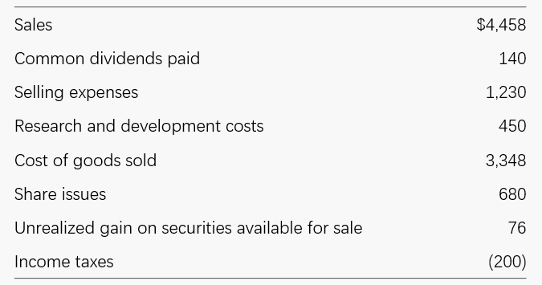
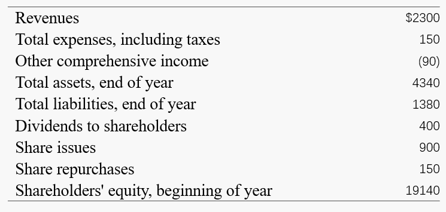
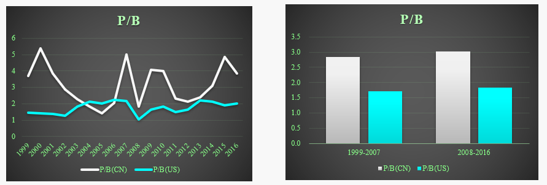
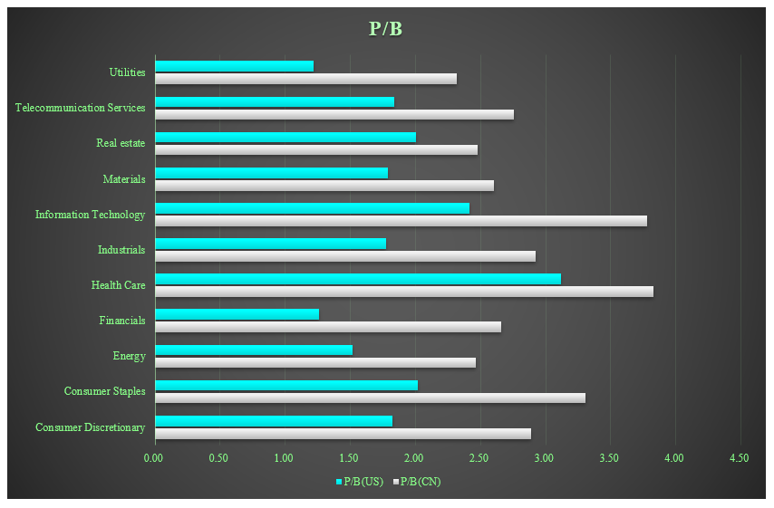

# Introduction to the financial statements
In this Chapter we will go through 4 Statements.

- **What** are the financial statements telling us? 
- How are the financial statements **organized**?
- How are book value and earnings **measured**? 
- How do accounting rules **affect** price-to-book ratios and price-earnings ratios?

## Balance Sheet
$$
Assets = Liabilities + Shareholders' \ Equity 
$$

## Income Sheet

***What does high gross margin rate mean?***

The product has competitive advantage.

***Is there any costs associated with disclosing high gross margin rate?***

pressure from customers & Government, so not going public perhaps is a choice

### The Components of the Income Statement

$\text{Net Revenue}$

$- \text{ Cost of Goods Sold}$

$\overline{\qquad \qquad \qquad \qquad \qquad \qquad \qquad \qquad \qquad \qquad \ }$

$\pmb{\text{Gross Margin}}$

$- \text{ Operating Expenses}$

$\overline{\qquad \qquad \qquad \qquad \qquad \qquad \qquad \qquad \qquad \qquad \ }$

$\pmb{\text{Operating Income (EBIT)}}$

$- \text{ Interest Expense}$

$+ \text{ Interest Income}$

$\overline{\qquad \qquad \qquad \qquad \qquad \qquad \qquad \qquad \qquad \qquad \ }$

$\text{Income before Taxes}$

$- \text{ Income Taxes}$

$\overline{\qquad \qquad \qquad \qquad \qquad \qquad \qquad \qquad \qquad \qquad \ }$

$\text{Income before Extraordinary Items}$

$+ \text{ Extraordinary Items}$

$\overline{\qquad \qquad \qquad \qquad \qquad \qquad \qquad \qquad \qquad \qquad \ }$

$\pmb{\text{Net Income (NI)}}$

$- \pmb{\text{ Preferred Dividends}}$

$\overline{\qquad \qquad \qquad \qquad \qquad \qquad \qquad \qquad \qquad \qquad \ }$

$\text{Net Income Available to Common Shareholder}$

> [!TIP|label:Extraordinary Items]
> Extraordinary items consisted of gains or losses from events that were unusual and infrequent in nature that were separately classified, presented and disclosed on companies' financial statements. Extraordinary items were **usually explained further in the notes to the financial statements**. Companies showed an extraordinary item separately from their operating earnings because it was typically a **one-time gain or loss** and was not expected to recur in the future.

### <mark> Example </mark>

**(1)** From the following information for the year 2012, prepare an income statement and a statement of shareholders' equity, under GAAP rules (R&D expenses are expensed as incurred), for a company with shareholders' equity at the beginning of 2012 of $3,270 million. Amounts are in millions.
> GAAP is used in America, while IFRS is the international version. China uses a version closed to IFRS.

Also calculate comprehensive income and net payout. Income taxes are negative. How can this be?

$$\begin{aligned}
\text{Gross Margin} &= 4458-3348 = 1110  \\
\text{EBIT} &= \text{Gross Margin} - 1230-450 = -570 \\
\text{NI} &= \text{EBIT} - (-200) = -370
\end{aligned}$$

> [!TIP|label:Comprehensive Income]
> It includes all revenues, gains, expenses, and losses incurred during a period as well as **unrealized gains and losses** during an accounting period. In this sense, it gives external users a full view of all the accounts that affect equity during a period.

> [!TIP|label:Share Issue]
> A share issue refers to the process of a company releasing shares to sell either to existing shareholders or the public. 

$$\begin{aligned}
\text{Comprehensive Income} &=  \text{NI} + 76 = -294 \\
\text{Net Payout} &= \text{Pay} - \text{Receive} \\
&= 140-680 = -540 \\
\text{Ending Equity} &= 3270 + \text{Comprehensive Income} - \text{Net Payout} \\
&= 3516
\end{aligned}$$

**(2) Using Accounting Relations to Check Errors.**

A chief executive reported the following numbers for fiscal year 2012 to an annual meeting of shareholders (in millions):
Show that at least one of these numbers must be wrong because it does not obey accounting relations.

$$\begin{aligned}
\text{Given ending equity} &= 4340-1380 = 2960 \\
\text{Comprehensive Income} &= 2300-150-90=2060 \\
\text{Net Payout} &= 150+400-900 = -350\\
\text{Calculated ending equity} &= \text{beginning equity} + \text{comprehensive income + net payout} \\
&= 19140+2060-(-350)=21550
\end{aligned}$$

## Intrinsic Value, Market Value, and Book Value

$$\begin{aligned}
\text{Intrinsic Premium} &= \text{Intrinsic Value of Equity- Book Value of Equity} \\
\text{Market Premium} &= \text{Market Value of Equity- Book Value of Equity} \\ 
\text{Price-to-Book ratio} &= {\text{Market Value of Equity} \over \text{Book Value of Equity}} \\
\text{Intrinsic Price-to-Book ratio} &= {\text{Intrinsic Value of Equity} \over \text{Book Value of Equity}}
\end{aligned}$$

### PB discussion
**(1) Can P/B lower that 1? Why?**

可以，因为存在表外负债，以及高估资产价值（60万的商品计100万，大大高估B）。

> [!NOTE|label:注意]
> 因此，low P/B don't always mean undervalue.

**(2) 为何中国P/B平均高于美国？**

GDP增速更快，因此全国范围内的企业整体上More Growth，赋予更多溢价，类似于成长股

**(3) Why Information Technology and HealthCare have bigger P/B?**

- IT more growth like China
- HealthCare has more R&D, which is not included in B till it's products go public, but the market will credit it and give a high price.

**(4) Why B should smaller than P?**
- 会计谨慎性原则用于计算B
- 会计面向过去（B），市场面向未来（P），因此，预期成分包含一定溢价

## Where to get financial statements

- Firms listed in SSE/SZSE
  - http://www.cninfo.com.cn/new/index
- Firms listed in HKEX
  - https://www.hkexnews.hk/index_c.htm
- Firms listed in US exchanges
  - https://www.sec.gov/edgar/searchedgar/companysearch

