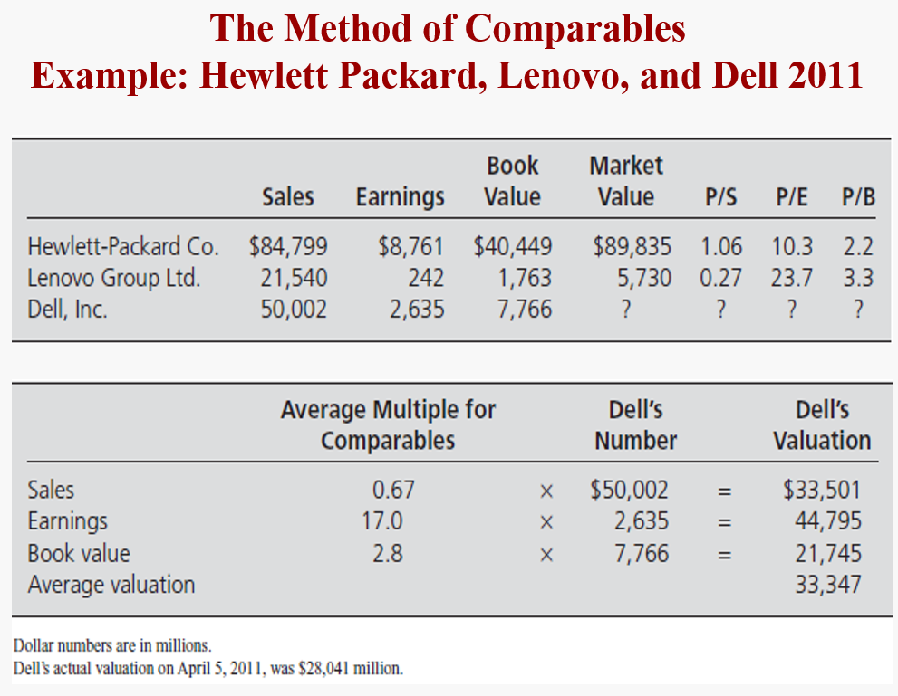
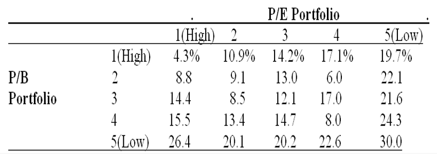
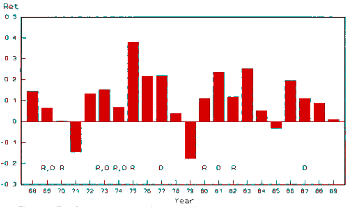

# How Financial Statements Are Used in Valuation

- What is the method of **comparables**? 
- How are technical and fundamental **screens** used in investing?
- What is **asset-based valuation**? 
- How is **fundamental analysis** carried out? How is a valuation model constructed? 
- What generates value in a business: operating, investing, or financing activities?

## Simple method 
Simple approaches minimize information analysis (and thus the cost). But they lose precision.

On the contrary, A full-fledged fundamental analysis is detailed and costly

- The Method of Comparables
- Screening on Multiples
- Asset-Based Valuation

### The Comparable Method

1. Identify comparable firms that have similar operations to the firm whose value is in question (the “target”).
2. Identify measures for the comparable firms in their financial statements – e.g. earnings, book value, sales, cash flow – and calculate multiples of those measures at which the firms trade.
3. Apply an average or median of these multiples to the corresponding measures for the target to get that firm’s value.

> [!NOTE|label:Commonly used multiples]
> price-to-sales ratio; price-to-earnings ratio; price-to-book ratio

***PROBLEM***

- Conceptual Problems:
  - Circular reasoning: Price is ascertained from price (of the comps)
  - Violates the tenet: “When calculating value to challenge price, don’t put price into the calculation”
  - If the market is efficient for the comparable companies....Why is it not for the target company ?
- Implementation Problems:
  - Finding the comparables that match precisely
  - Different accounting methods for comps and target
  - Different multiples give different valuations
  - What about negative denominators?
- Applications:
  - HUAWEI(firms that are not publicly traded)

### Screening Analysis
***just like sorting***

- Identify a multiple on which to screen stocks.
- Rank stocks on that multiple, from highest to lowest.
- Buy stocks with the lowest multiples and (short) sell stocks with the highest multiples 

> [!NOTE|label:What can we learn from this table]
> 二者都可measure intrinsic value, 互不重叠

Technical Analysis(price and volume) or Fundamental Screens (fundamental indicators)

***PROBLEM***
- You could be loading up on a risk factor
- You are in danger of trading with someone who knows more than you
  - A low multiple stock could be overpriced, and a high multiple stock could be underpriced
- You are trading on a small amount of information

### The interpretation of why contrarian investment can work <!-- {docsify-ignore} -->

高PE的股票被称之为glamour stocks（growth stock），而低PE则被称为constrain stocks（value stock）。那么为什么constrain investment有用呢？有以下两种解释

> [TIP|Constrain]
> It is said to be out of favor and trades at a low multiple

- Bet against those “naïve” investors who extrapolate past performance too far into the future 
- **Value stocks are fundamentally riskier** 

### Asset-Based Valuation
Values the firm’s assets and then subtracts the value of debt:
$$
V^E = V^A - V^D
$$

The balance sheet does this calculation, but **imperfectly** 

***Problems*** 
- Getting the value of operating assets when there is no market for them
- Identifying value in use for a particular firm 
- Getting the value of intangible assets  (brand names, R&D)
- Getting the value of “synergies” of assets being used together
**Applications:**
- “Asset-base” firms such as oil and gas and mineral products
- Calculating liquidation values 【清算时部分资产很难找到买家】

## Fundamental Analysis
***more expensive and complicated way***

The method of analyzing information, **forecasting** payoffs from that information, and arriving at a valuation based on those forecasts. Usually require a **technology** to receive V.

### The process of Fundamental Analysis
- Knowing the business
- Analyzing information
- Forecasting Payoffs
- Convert forecast to a valuation
- trade on the valuation

### Different payoffs
For a terminal investment：有固定期限，类似于债券

For a going concern investment in equity：无固定期限，所以叫going concern，卖出时结束，类似于股票

但本质区别不大，都是forecast未来payoff然后discount

> [!NOTE|label:Hurdle rate]
> The minimum rate of return required on a project or investment，用于discount project

相比于project，bond并不创造价值，**NPV = 0**

### Criteria for Practical Valuation
1. **Finite horizon forecasting**
   - Forecasting over infinite horizons is impractical

2. **Validation**
   - Whatever we forecast must be observable ex post, so
   - the forecast can be verified for its accuracy.

3. **Parsimony**
   - Information gathering & analysis should be straightforward
   - The fewer pieces of information, the better

### What Creates Value in a Firm

***What Creates Value in a Firm***

Value is created by **investing assets in operations** to develop products to sell to customers.  

Financing activities typically **do not create value**.因此，在随后的计算现金流中，我们并不考虑融资活动所带来的现金流。

> [!NOTE|label:Question]
> When capital market is inefficient, whether equity financing activities can affect firm value? Why?

当市场不有效时，意味着无法区分好公司和坏公司。这时，发红利将会成为一个criteria，因为发红利代表着能够盈利，并且属于一种cost，这是坏公司所不能承担的。

### Required return

以下三种表述是等价的：
- Required return
- Discount rate
- **The cost of Capital**

## Conceptual Questions

***Should a firm that pays higher dividends have a higher share value?***

No. Paying a dividend actually reduces share value by the amount of the dividend (but
does not affect the cum-dividend value). Shareholders are no better off, cum-dividend. Of course,
it could be that firms that pay higher dividends are also more profitable (and so have higher
prices), but that is due to the profitability, not the dividend.

