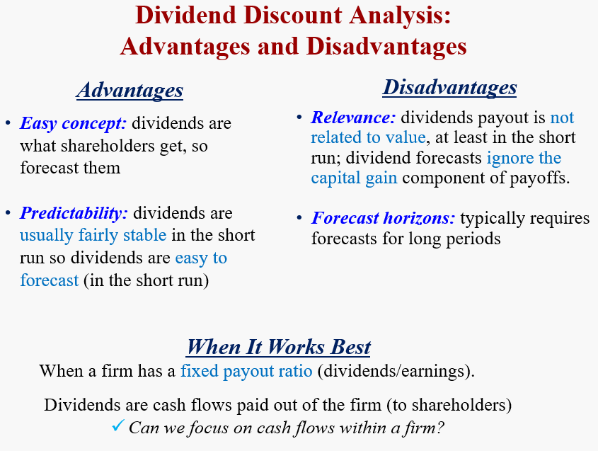
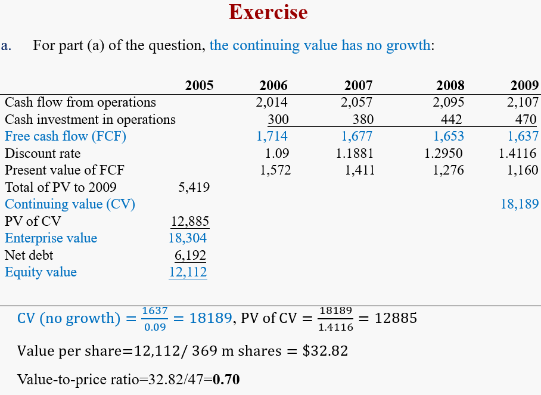
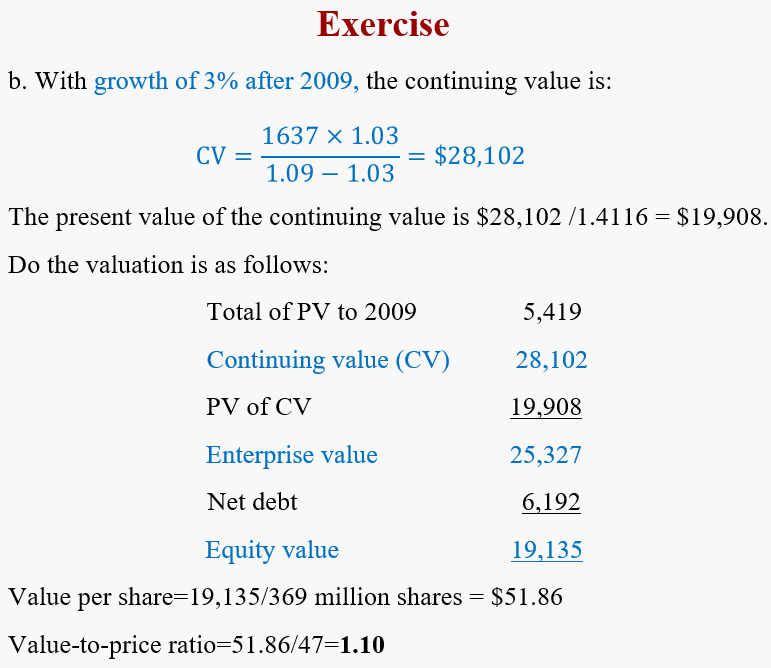
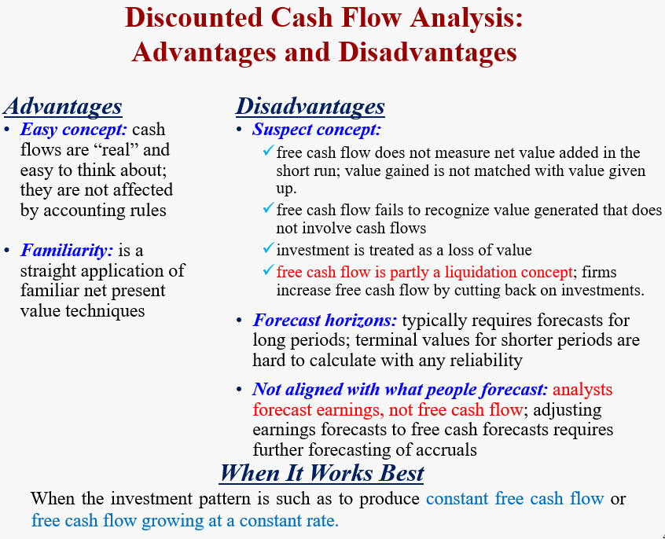
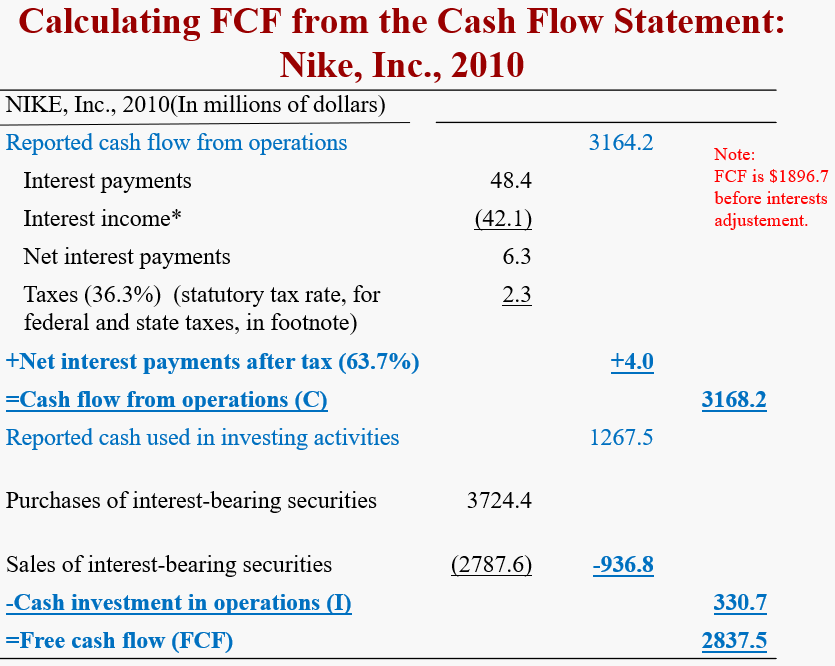
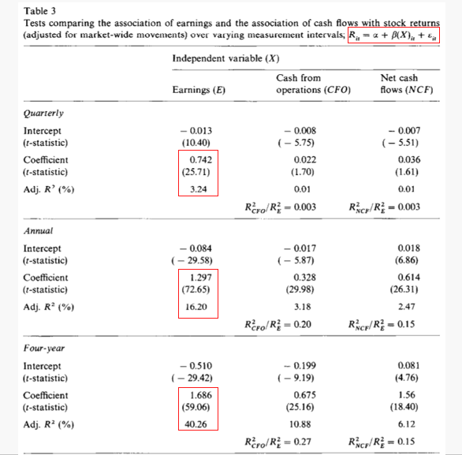

# Cash Accounting, Accrual Accounting, and Discounted Cash Flow Valuation

- What is the **dividend discount model**?  Does it work? 
- What is the **discounted cash flow model**? Does it work? 
- What is the difference between cash accounting and accrual accounting?
- What type of accounting best captures value added in operations: **cash accounting** or **accrual accounting**?

## Dicount Dividend Model（DDM）

DDM就是根据discount rate把未来红利全部折现。
$$
\rho (discount\ rate) = 1+r(required\ return)
$$

### Perpetuity

***A perpetuity is a constant stream that continues without end.***

**Constant dividend**

$$
V^E = {d_1\over \rho^E -1}
$$

**Dividend with Growth $g$**
$$
V^E = {d_1\over \rho^E - (1+g)}
$$

**PROBLEM**
- Dividend policy can be arbitrary and not linked to value added
- Dividends paid before $T$ reduce $P_T$ to leave the present value unaffected

> [!TIP|label:The dividend conundrum]
> Equity value is based on future dividends, but forecasting dividends over finite horizons dose not give an indication of this value

**Conclusion**: Focus on creation of wealth rather than distribution of wealth  

因为dividend本质上是distribution of wealth，而并不是真正的creation of wealth，而且，如果公司短期内不发dividend，那么就无法通过DDM定价。因此，下面会提出DCF，试图measure creation of wealth。

### Analysis of DDM

> [!NOTE|label:Important]
> DDM 折现的是股利，反映的是权益的价值，所以**贴现和应该是权益价值**
>
> 而DCF 折线的是现金流，反应的是公司价值，最终**贴现和是公司价值**

## Discount Free Cash Flow Model（DCF）

$$
FCF = OCF-CAPX
$$

> [!TIP|label:FCF]
> Free Cash Flow: ***The part of cash flow from operations that is free after the firm reinvests in new assets***

**Capital expenditure (CAPX)** are funds used by a company to acquire, upgrade, and maintain physical assets such as property, industrial buildings, or equipment. 

CAPX can be found in the cash flow from investing activities, such as capital spending, purchases of property, plant, and equipment (PPE), acquisition expense, etc.

### Basic equations

$$\begin{aligned}
V^E &= V^F - V^{ND} \\
&= {C_1 - I_1 \over \rho_F}+{C_2 - I_2 \over \rho_F^2}+......+{C_T - I_T \over \rho_F^T} +{CV_T\over \rho_F^T}- V^{ND}
\end{aligned}$$

**CV**: continuing value

**Net Debt**: the debt firms hold as liabilities less debt investments that firms hold as assets

***Calculating CV***

**Constant Free Cash Flow**
$$
CV_T = {C_{T+1} - I_{T+1}\over \rho_T-1}
$$

**Free Cash Flow with growth $g$**
$$
CV_T = {C_{T+1} - I_{T+1}\over \rho_T-g}
$$
> [!NOTE|label:注意]
> 这里用的是下一期自由现金流，当给出本期现金流以及增长率时，**下一期现金流为二者的乘积**

### Process

- Forecast free cash flow to a horizon, e.g., 5 years
- Discount the free cash flow to present value
- Calculate a continuing value at the horizon with an estimated growth rate
- Discount the continuing value to the present
- Add 2 and 4
- Subtract net debt

<mark> ***Example*** </mark>

**A Discounted Cash Flow Valuation: General Mills, Inc. .**

At the beginning of its fiscal year 2006, an analyst made the following forecast for General Mills, Inc., the consumer foods company, for 2006-2009 (in millions of dollars):

| |2006|2007|2008|2009| 
|:--:|:--:|:--:|:--:|:--:|
|Cash Flow from Operations|2014|2057|2095|2107| 
|Cash investment in Operations|300|380|442|470|

General Mills reported $6, 192 million in short-term and long-term debt at the end of 2005 but very little in interest-bearing debt assets. Use a required return of 9 percent to **calculate both the enterprise value and equity value** for General Mills at the beginning of 2006 under two forecasts for long-run cash flows:
1. Free cash flow will remain at 2009 levels after 2009.
2. Free cash flow will grow at 3 percent per year after 2009.
   
General Mills had 369 million shares outstanding at the end of 2005, trading at $47 per share. **Calculate value per share and a value-to-price ratio under both scenarios.**

**Free cash flow with growth**

> [!ATTENTION|label:问题]
> Will DCF Valuation Always Work?

**A firm with negative cash flows**

### Analysis of DCF
Formal valuation aims to reduce our uncertainty about value and to discipline speculation. However, **the most uncertain (speculative) part of a valuation is the continuing value.**

并且有时这种计算方法还会带来问题。因为DCF包括短期的cash flow和未来的continuing value，当短期cash flow为负数时，就要求continuing value大于当前价值，这是不合逻辑的。

So valuation techniques are preferred if they result in <u>a smaller amount of the value attributable to the continuing value</u>.

公司可以通过减少投资来增加现金流，然而这并不能真正体现公司价值

## Problem in Reported Cash Flow from Operations
**按照会计准则要求**：Reported cash flows from operations in U.S. cash flow statements includes <u>interest</u> (a financing cash flow):

背后含义是：利息实际上形成了税盾的作用，因此应该被记入现金流。在Net Income项里利息已经导致了现金流的减少，通过After-tax Net Interest恢复其贡献。

> [!TIP]
> 例如一个公司，资金30，其中20是equity，10是bond，赚了10，产生1利息，那么最终profit就是9，税率30%，那么最终cash flow为$ 9\times 0.7=6.3$。
>
> 然而，真正由于operation产生的现金流应该是$ 10\times 0.7=7$，这其中的差别就是由于融资活动（利息）引起的。
> 
> 利息的影响是多重的，由于有1的利息，导致现金流减少了1，但是税也少交了0.3，因此最终的净影响是减少了0.7。将这一部分由于融资活动引起的现金流变化recover，就得到了真正由于经营活动产生的现金流。

$$\begin{aligned}
\text{Cash flow from operations (C)}&= \text{Reported cash flow from operations + \pmb{After-tax net interest payments}} \\
\text{After-tax Net Interest} &= \text{Net Interest × (1 - tax rate)} \\
\text{Net interest} &= \text{Interest payments – Interest receipts}
\end{aligned}$$

Reported cash flow from operations is sometimes referred to as <u>*levered cash flow from operations*</u>

Reported cash investments include <u>net investments</u> in interest bearing financial assets (excess cash) (which is a financing flow):

$$\begin{aligned}
\text{Cash investment in operations (I)}&= \text{Reported cash flow from investing − \pmb{Net investment in interest-bearing securities}} \\
\text{Net investment} &= \text{purchases of investments – sales of investments}
\end{aligned}$$

这一部分对涉及投资的现金流做了调整：
- Operation view：因为会计准则要求，所以将金融资产的利息收入纳入考量【税盾】
- Investing view：投资金融资产也是投资的一部分【例如控股】，也应该计入现金流

调整后计算流程，在Operation加入了利息获得，在investing加入了金融投资：

<mark> ***Example*** </mark>

## Accural accounting for value added

上文中我们使用了Cash Flow这一概念来计算公司价值。然而，Cash Flow本质上还是属于清算指标（a liquidation concept），而不能够完美的对应公司价值。就像上文提到的，公司可以减少生产资料投资而增加流动性，而这实际上是减损了公司价值。

> [!NOTE]
> *Analysts forecast earnings, not cash flows.*

因此，也许应计盈余（Accural Accounting）是更好的选择？

通过这个图，我们可以发现，**短期Earnings有着更高的解释力度，然而长期来看二者区别正在逐渐缩小。**

这个也很好理解：例如在一年里的一月份收到订金，此时现金流增加而盈余并没有增加。直到三月份将货送出去，才能算是交易完成，此时没有现金流增加而盈余增加。在短期来看二者不同，但若是从一整年（更长期）的角度出发，都属于在一年内完成了交易，收到了货款。

$$\begin{aligned}
\text{from FCF} &=\text{OCF − CAPX}\\
\text{to FCF} &= \text{OCF + Accurals(noncash value flows)}
\end{aligned}
$$

$$
\text{Accurals} = \text{Net Income - Cash flow from Operations}
$$
这里我们假设Net Income里**没有financing activities**，也即没有利息支付等。

### Features of the Income Statement

1. **Dividends don’t affect income**
2. **Investment doesn’t affect income**
3. There is a **matching** of
   1. Value added		(revenues)
   2. Value lost	   	(expenses)
   3. Net value added	(net income)

### Earnings and Cash Flows

$$\begin{aligned}
\text{\pmb{Earnings}}&=\text{OCF+accruals} \\
&=\text{Operating earnings-Net interest (after tax)} \\
&= \text{\pmb{FCF + I + Accruals-Net interest (after tax)}}
\end{aligned}
$$

同样地，在计算operating earning的时候，相比于正常earning多了利息项

$$\begin{aligned}
\text{Earnings from the business (\pmb{Operating earnings})}&= \text{Earnings + Net interest (after tax)} \\
&= \text{OCF+Accruals+Net interest (after tax)} \\
&= \text{C + Accruals} \\
&= \text{[C - I]+ I + Accruals} \\ 
&= \text{\pmb{FCF + I + Accruals}}
\end{aligned}
$$

## Conceptual Questions

***Investors receive dividends as payoffs for investing in equity shares. Thus the value of a share should be calculated by discounting expected dividends. True or false?***

The first sentence is true: dividends are the payoff to equity investing. The second sentence
is true in theory but not in practice. Equity value is the present value of the infinite stream of
expected dividends that a going concern generates. But, in practice, one can’t forecast to infinity.
Dividends paid over practical, finite forecast horizons are not relevant to value: the dividends
firm pay up to the liquidating dividend can be any amount but that amount does not affect its
present value. Consider the case of a firm that pays no dividend (in the short run), for example.
Apple Inc., is a case in point: Apple pays no dividends (as of 2012). Cisco paid no dividends for
many years, nor did Microsoft. Dell pays no dividends. Yet these are companies that have
considerable value. This is this dividend conundrum: Value is based on expected dividends, but
forecasting dividends is not relevant to value as a practical matter.

***What explains the difference between cash flow from operations and earnings?***
$$
\text{Earnings = Cash from operations – net interest payments + accruals}
$$

***Interest payments should not be part of cash flow from operations. Why?***

Interest is a **distribution** of cash flow generated by the firm (to debtholders), not part of the
cost of generating that cash flow

