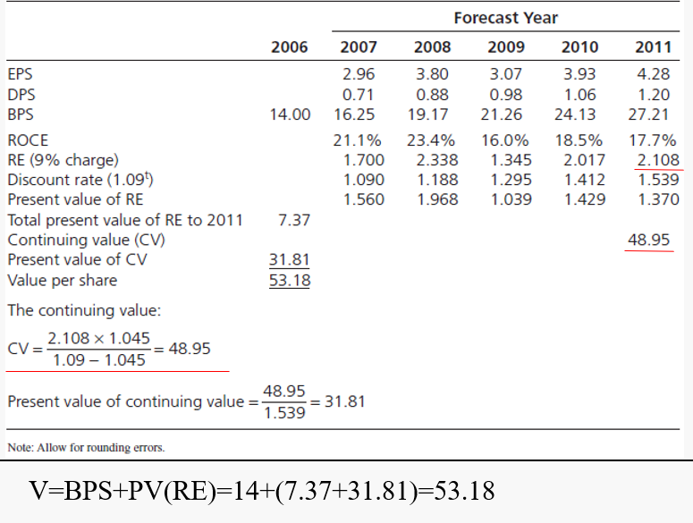

# Accrual Accounting and Valuation Pricing Book Values

引入了 **Discounted Residual Earning model**

***The Big Picture for the Chapter***

$$
\text{Value = Anchor + Extra Value}
$$

Anchor通常为Book Value

$P/B > 1$ if $\text{Extra Value} > 0$。Extra value bigger than 0 when **the rate of return of book value is expected to be <u>greater than</u> the required return**

## Residual Earning Model

Residual Earning 指的是超出要求报酬的收益，如下图所示：

当 Earning Forcast为40时，则没有Residual Earning。

### The Normal Price-to-Book Ratio

$$
\text{Normal P/B} = 1
$$

当未来没有超过the required return的增长预期时【可理解为CV = 0】，其Book Value就应该是当前价格。

### <mark>  Residual Earning  </mark>

$$
\text{Value of common equity}(V_0^E) = B_0+\pmb{{RE_1\over \rho_E}+{RE_2\over \rho_E^2}+{RE_3\over \rho_E^3}}.....
$$

Where $\text{RE}$ is residual earnings for equity

$$\begin{aligned}
\text{Residual earnings} &= \text{Comprehensive earnings - (Required return for equity × Beginning-of-period book value)} \\
\text{RE}_t &= \text{Earn}_t - (\rho_E - 1)B_{t-1}
\end{aligned}
$$

将 $\text{RE}$ 视作 dividend分给股东，移项可得 ***Clean Surplus Relation***
$$
\text{Book Value}_t = \text{Book Value}_{t-1} + \text{Earnings}_t – \text{Dividend}_{t-1}
$$

#### Finite horizon

当用于finite horizon时，预测期之外的价值用**Continuing value**表示：

$$
\text{Value of common equity}(V_0^E) = \underbrace{B_0}_{Book \ Value \ Anchor} +\underbrace{{RE_1\over \rho_E}+{RE_2\over \rho_E^2}.....+{RE_T\over \rho_E^T}}_{Residual \ Earning \ Forecast} +\underbrace{{V^E_T-B_T\over \rho_E^T}}_{Continuing \ value}
$$

**Residual earnings** is the return on common equity, expressed as a **dollar** excess return rather than a **ratio**

上述公式也可以表达为 **Return on Common Shareholders’ Equity** (ROCE) 的形式：

$$\begin{aligned}
\text{RE}_t &= \text{Earn}_t - (\rho_E - 1)B_{t-1} \\
&= [\pmb{\text{ROCE}_t} - (\rho_E - 1)]\pmb{B_{t-1}} \\
\text{ROCE}_t &= {\text{Comprehensive Earnings to Common}_t \over \text{Book Value}_{t-1}}
\end{aligned}
$$

#### Two Drivers

There are two drivers of Residual Earnings: **ROCE** and **growth in book value**.

**(1) ROCE**
- If forecasted ROCE equals the required return, then RE will be zero, and V = B
- If forecasted ROCE > the required return, then V > B
- If forecasted ROCE < the required return, then V < B

**(2) Growth in book value**
$$\begin{aligned}
\text{BPS}_{t+1}&=\text{BPS}_t+\text{EPS}_{t+1}-\text{DPS}_{t+1} \\
\text{Growth in book value}&={(\text{BPS}_{t+1}-\text{BPS}_t) \over \text{BPS}_t} \\
& ={(\text{EPS}_{t+1}-\text{DPS}_t) \over \text{BPS}_t }                               
\end{aligned}$$

<mark>  ***Example***  </mark>

### <mark>  Calculation </mark>

***Case 1 Zero RE after the Forecast Horizon***

***Case 2 Constant RE after the Forecast Horizon***

***Case 3 Growing RE after T, g = 4.5%*** 

***Project Evaluation***

***Strategy Evaluation***

### Discussion of Continuing Value

- The continuing value is the <u>most speculative</u> part of the valuation.
  - 在上面的Strategy Evaluation我们会看到REM和DCF模型的对比，届时，估值中CV占比越少的模型结果也就越可靠
- Anchor on what you know: Cases 1, 2, and 3 use growth rates in years prior to the continuing value year for an estimate of the long-term growth rate

### Analysis of REM

### Protection

