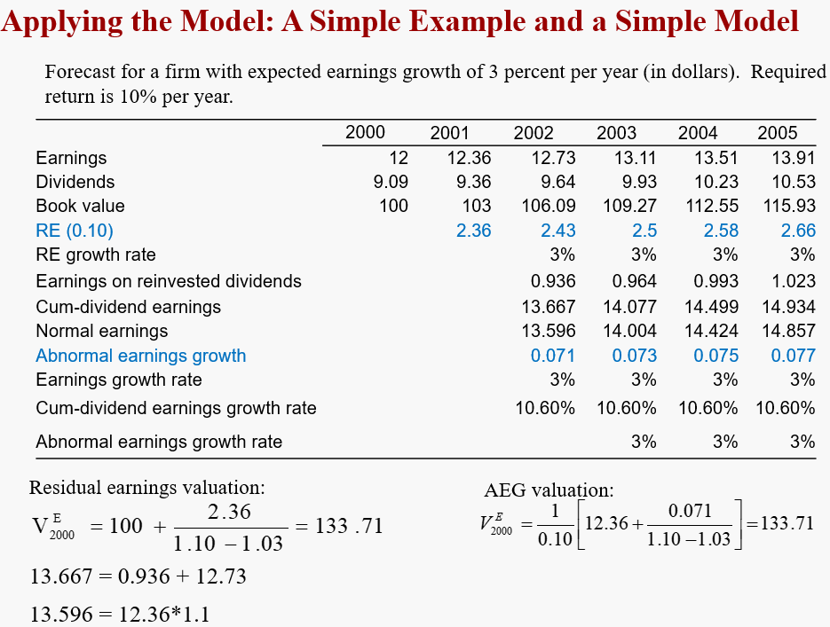

# Accrual Accounting and valuation: Pricing Earnings

本章仍然是通过该公式进行估值，但是视角从PB转向PE。
$$
\text{Value = Anchor + Extra Value}
$$

***The big picture for this chapter***

To price earnings, one thinks of earnings growth: <u>more growth, higher P/E</u>

But:  Beware of paying for growth
- Only pay for growth that adds value 【我们只需要pay for 超过正常增长的部分】
- <u>Growth is risky</u>:  Beware of paying for risky growth 【有些增长是不可持续的，竭泽而渔式的】

**Abnormal earnings growth** is the metric that protects from paying too much for growth

## From PB to PE

在PB valuation中，我们可以通过计算Residual Earning并折现，而在PE Valuation中，我们通过计算**RE的变化**来得到估值。

$$
V_0^E = {1\over \rho_E -1} \Big[ EPS_1 + {\Delta RE_2\over \rho_E}+{\Delta RE_3\over \rho_E}+{\Delta RE_4\over \rho_E}+{\Delta RE_4\over \rho_E}  \Big]
$$

## Abnormal Earnings Return

### Change in Residual Earnings and Abnormal Earnings Growth

$$\begin{aligned}
\text{V} &= \text{Book Value + PV of Residual Earnings} \\
&= \text{Capitalized forward earnings + PV of Changes in Residual Earnings}
\end{aligned}
$$

实际上，这二者是等价的
$$
\text{Change in Residual Earnings = Abnormal Earnings Growth}
$$

Abnormal Earnings Growth (AEG), which is the center for P/E valuation, is **growth in earnings over the required growth rate**

### Saving Account

在这个例子中，每年分红并不会影响对于该账户的估值，即使而这个Earning Growth Rate和Book Value增长不同。原因就在于Cum Dividend Earnings。

在这个例子中并不存在 Residual Earning，只是为了引入Cum-dividend earnings的概念。

### Cum dividend earnings

Cum dividend earnings代表着不仅考虑earning的growth，也考虑前一年的分红再投资所能产生的报酬。这样二者就是等价的。

***Normal Earnings***

Normal Earnings 相对的就是abnormal，也就是说不存在超出要求报酬之外的收益，earnings growing at the required rate of return:
$$
\text{Normal Earnings}_t = \rho_E \text{Earnings}_{t-1}
$$

For the savings account:
$$
\text{Normal Earnings}_{2014} = 1.05 \times 5 = 5.25
$$

***Abnormal Earnings Growth (AEG)***

Abnormal Earning Growth 与 Residual Earnings有着close relation，通过简单推导即可得出：
$$\begin{aligned}
\text{AEG}_t &= \text{RE}_t - \text{RE}_{t-1} \\
&= [\text{Earn}_t+(\rho_E-1)d_{t-1}]-\rho_E \text{Earn}_{t-1} \\
&= \pmb{\text{Cum-dividend earn}_t - \text{Normal Earn}_t}
\end{aligned}$$

> [!TIP|label:推导]
$$
\begin{aligned}
\text{RE}_t &= [\text{Earn}_t-(\rho_E-1)B_{t-1}] \\
\text{AEG}_t &= [\text{Earn}_t+(\rho_E-1)d_{t-1}]-\rho_E \text{Earn}_{t-1} \\
&= \text{Earn}_t-\text{Earn}_{t-1}-(\rho_E-1)[\text{Earn}_{t-1}-d_{t-1}]
\end{aligned}
$$
>
> 根据Clean Surplus equation:
$$
\begin{aligned}
B_{t-1} &= B_{t-2} + \text{Earn}_{t-1}-d_{t-1} \\
\text{so} \quad \text{Earn}_{t-1}-d_{t-1}  &= B_{t-1}-B_{t-2} \\
\text{thus} \quad \bm{AEG}_t &= \text{Earn}_t-\text{Earn}_{t-1}-(\rho_E-1)[B_{t-1}-B_{t-2}] \\
&= [\text{Earn}_t - (\rho_E-1)B_{t-1}]-[\text{Earn}_{t-1} - (\rho_E-1)B_{t-2}] \\
&= \bm{RE}_t-\bm{RE}_{t-1}
\end{aligned}
$$
> AEG与前面RE的区别就在于将红利的计算从Anchor【book value】中移到了Extra Value【AEG】

### Lessons from the Savings Account

#### <mark> Exercise </mark> <!-- {docsify-ignore} -->

这里我们引入了Cum-dividend earnings, Normal earnings, abnormal earning growth的计算

## A Model of the Forward P/E

$$
\text{Value of equity = Capitalized forward earnings + Extra value for abnormal earnings growth}
$$
根据上述等价关系，value of equity也有两种等价表达：
$$\begin{aligned}
V_0^E &= {1\over \rho_E-1}\Big[ Earn_1+{AEG_2\over \rho_E}+{AEG_3\over \rho_E^2} +{AEG_4\over \rho_E^3}+\cdots \Big] \\
&= {1\over \rho_E-1}\Big[ Earn_1+{\Delta RE_2\over \rho_E}+{\Delta RE_3\over \rho_E^2} +{\Delta RE_4\over \rho_E^3}+\cdots \Big]
\end{aligned}$$

当abnormal项为0，也就得到了normal PE：
$$
{V_0^E \over Earn_1} = \text{Normal  PE} = {1\over \rho_E-1} = {1\over \text{required return}}
$$

### Cum-dividend Earnings Growth Rate

$$
G_t = {\text{Cum dividend earnings}_t \over \text{Earnings}_{t-1}}
$$

> [!NOTE]
$$
\pmb{NOT} \quad {\text{Cum dividend earnings}_t \over \text{Cum dividend earnings}_{t-1}}
$$
> 

根据$ G_t $的定义，AEG还有另一种表达：

$$\begin{aligned}
AEG_t &= \text{Cum dividend earnings}_t - \text{Normal earn}_t \\
&= \text{G}_T \times \text{Earnings}_{t-1} - \rho_E \times \text{Earnings}_{t-1} \\
&= [\text{G}_T-\rho_E]\times\text{Earnings}_{t-1}
\end{aligned}$$

#### <mark> Example </mark> <!-- {docsify-ignore} -->

### PE Calculation 

> [!TIP|label:PE]
> Market’s anticipation of value to be added from sales **in the future** / value added from current sales (an interpretation for P/E)

#### Forward P/E <!-- {docsify-ignore} -->
$$
\text{Forward P/E} = \frac{\text{Price}_0}{\text{Earnings}_1}
$$

#### Trailing P/E <!-- {docsify-ignore} -->
$$
\text{Trailing P/E} = \frac{\text{Price}_0+\text{Dividend}_0}{\text{Earnings}_0}
$$

#### Normal P/E <!-- {docsify-ignore} -->
$$
\text{Normal P/E} = \frac{1}{\text{Required Return}}
$$

#### Normal Trailing P/E <!-- {docsify-ignore} -->
$$
\text{Normal Trailing P/E} = \frac{1+\text{Required Return}}{\text{Required Return}}
$$
因此：
$$
\text{Normal P/E} = \text{Normal Trailing P/E} -1
$$
> [!NOTE]
> Dividends affects prices but not earnings.

#### <mark> Exercise </mark> <!-- {docsify-ignore} -->

In 2010, some fundamental investors believed that Microsoft, after being overpriced in the stock market for many years, was now a firm to buy. Microsoft's shares traded at 24.30 in September 2010, down from a peak of 60 (split-adjusted) in January 2000. Analysts' consensus EPS forecasts for 2011 and 2012 fiscal years (ending in June) were 2.60 and 2.77, respectively. A dividend of 0.40 per share was indicated for fiscal year 2011.

**a. Calculate Microsoft's normal forward P/E and the forward P/E at which it traded in September 2010. Use a required return of 9 percent.**

11.11, 9.346

**b. Calculate the intrinsic P/E implied by the analysts' forecasts with the assumption that there will be no abnormal earnings growth after 2012.**

$$
V_{2010} = {1\over 0.09} \Big[ 2.60+{-0.028\over 1.09} \Big] = 28.6
$$

$$
\text{Intrinsic P/E} = {28.6\over2.6} =11 
$$

**c. If you forecast that there will be significant abnormal earnings growth after 2012, do you think this stock is appropriately priced at $24.30?**

if there is AEG, the price must be higher than the market price

### Protections from earning created by Accounting

### Analysis of AEG

## Conceptual Questions

***The historical earnings growth rate for the S&P 500 companies has been about 8.5 percent. Yet the required growth rate for equity investors is considered to be about 10 percent. Can you explain the in consistency?***

The historical 8.5% growth rate that is often quoted is the **ex-dividend growth rate**. It
ignores the fact that earnings were also earned by investors from reinvesting dividends (in the
S&P 500 stocks, for example) that were typically 40% of earnings. The cum-dividend rate is
about 13%.

***Why the following equation leads to error?***

$$
\text{Value of equity} = {\text{Earn}_1 \over r-g}
$$

- This formula capitalizes earnings at the ex-dividend earnings growth rate, g. This ignores growth that comes from reinvesting dividends. 
- Further, if earnings are expected to grow at a rate equal to the required return, r, then the growth should not be valued , and forward earnings should be capitalized at the rate, r, not r – g. Only growth in excess on the required rate should be recognized.
- The formula also has mathematical problems. If g = r, then the denominator is zero and the value is infinite. If g is greater than r (which is necessary for growth to have value), the denominator is negative.

***A firm's earnings are expected to grow at a rate equal to the required rate of return for its equity, 12 percent. What is the trailing PIE ratio? What is the forward PIE ratio?***

Trailing P/E = 1.12/0.12 = 9.33, Forward PE = 1/0.12 = 8.33

***The normal forward P/E and the normal trailing P/E always differ by 1.0. Explain why***

The difference is that, for the trailing P/E, one more years of earnings are involved (**the current year**). The trailing P/E can be interpreted as paying for the value of forward earnings (at
the multiple for forward earnings) plus a dollar for every dollar of current earnings

***Abnormal earnings growth is always equal to growth of (change in) residual earnings. Correct?***

Correct

***A P/E ratio for a bond is always less than that for a stock. Correct?***

Incorrect. As the normal (forward) P/E ratio is the inverse of the required return and the
required return for a bond is (usually) lower than that for a stock, the normal P/E ratio for a bond
is greater than that for a stock. But P/E also values abnormal earnings growth. A bond cannot
deliver abnormal earnings growth, so the P/E ratio for a growth stock might well be greater than
that for a bond.

***Why might an analyst refer to a leading (forward) P/E ratio rather than a trailing PIE ratio?***

The trailing P/E, based on current earnings, is affected by **transitory** (one-time) earnings.
The forward P/E based on next years' forecasted earnings is less likely to be so affected, and so
is a better base for growth.

***Can a firm increase its earnings growth yet not affect the value of its equity?***

Yes; eps growth can be increased with investment, but the investment may earn only the
required return, and thus not add value. A firm can also increase its expected earnings growth
through accounting methods, but not add value

