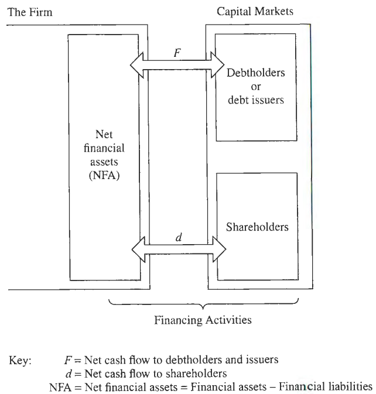

# Viewing the Business Through the Financial Statements

The transaction between debtholders and shareholders and the firm are the firm's financing activities.

In this chapter, we **reformulate** the statements in a way that aligns the statements with business activities.

**reformulation的关键在于seperate operating from financial activities**

## The reformulation of Statements

### The Cash flow

<mark>

**The sources and uses of cash equantion 【always true】**
</mark>

这个等式永远成立，如同这个等式的名字，讲的就是钱从哪来，要往哪去，下面会有诸多变形，但万变不离其宗。

$$\begin{aligned}
\text{C - I} &= \text{d + F} \\
\text{the sources} &= \text{the uses}
\end{aligned}
$$

根据cash equation，假设不减少d的情况下，能够得到 **the treasurer's rule**

> [!NOTE]
> 这里的d指的是net dividend，包括Cash dividend，share repurchases和share issues等。
>
> 同样，F指的是net payments to debtholders and issuers，所以既包括利息收入与指出（i），也包括债券的购买与发行。
>
> 当现金流偿付完利息后不足以支付net dividend，就要发行债券，反之同理。

$$\begin{aligned}
& \text{If C - I - i > d, then lend ro buy down own debt} \\
& \text{If C - I - i < d, then borrow or reduce lending}
\end{aligned}
$$

### The Balance sheet

在报表中，一般将资产和负债分为短期和长期，这种划分对于credit analysis比较有用，但是对于权益分析【equity analysis】来说，分为operating和financial更加合适。

可以理解为：operating assets or liabilities面向消费者和供应商；financial assets or liabilities面向资本市场。

为了进一步将financial activities与其他的operation区分开，可以reformulate为：

$$\begin{aligned}
\text{OA + FA} &= \text{OL + FO + CSE} \\
\text{rearranged, OA - OL + FA - FO} &= \text{CSE}\\
\text{Net operating assets (NOA)} &= \text{OA- OL} \\
\text{Net financial assets (NFA)} &= \text{FA - FO} \\
\text{thus, CSE} &= \text{NOA + NFA}
\end{aligned}$$

通常情况下，$\text{NFA (Assets)}$ 为负数，因此也被写为 $\text{NFO (Obligation)}$：
$$
\text{CSE = NOA - NFO}
$$

### The Income sheet

完整的operating activities还包括interaction with customer and supplier，如下图：

 

**Fig 1**

OE指的是operating expense，OR指的是operating revenue，OI为operating Income。OI为正则代表公司价值增加，反之价值减少。

OE和OI并不代表现金流【cash flow】，而是价值流【value flow】，相应地，为了更好的衡量价值流动，引入了Accrual accounting。同样地，interest income and expense也通过accrual来衡量

Income sheet reformulation 如下：

## Relations between reformulated statements

在Fig 1下方展示了三者之间的联系，这种联系不仅反映了其相关性，也写明了各项目背后的驱动因素【driver】是什么。

### The drivers for Cash Flow and Dividend

1. Free cash flow is what’s left over from OI after adding to the balance sheet

$$\begin{aligned}
\Delta\text{NOA = OI - (C - I)} \\
\text{C - I = OI - } \Delta \text{NOA}
\end{aligned}$$

2. Free cash flow is applied to pay $\text{NFE}$, reduce debt and pay dividends

$$\begin{aligned}
\Delta\text{NFO = NFE - (C - I) + d} \\
\text{C - I = NFE - } \Delta \text{NFO + d}
\end{aligned}$$

3. Net dividend is the cash left over from free cash flow after paying $\text{NFE}$ and reducing debt.
$$\begin{aligned}
\Delta\text{NFO = NFE - (C - I) + d} \\
\text{d = }\text{(C - I) - NFE + } \text{NFO}
\end{aligned}$$

## Try it together
### The big picture

> [!ATTENTION|label:Typo]
> 第三行 $CSE_{t-1}$ 后应为加号

### What Generates Value?

根据公式：
$$
CSE_t = NOA_t - NFO_t
$$

带入得：
$$\begin{aligned}
CSE_t &= NOA_{t-1}+OI_t - (C_t-I_t)-NFO_{t-1}+(C_t-I_t)-NFE_t-d_t \\
&= NOA_{t-1}-NFO_{t-1}+OI_t-NFE_t-d_t \\
&= CSE_{t-1}+Earn_t-d_t
\end{aligned}$$

Clean Surplus 【noncontrolling?】

现金流 $(C_t-I_t)$ 并不对股东产生价值，因为其减少NOA的同时也减少了NFO，在计算中被抵消掉

**真正影响股东价值**的是 $OI_t-NFE_t$，分别对应operating和financial activities

**Example**

