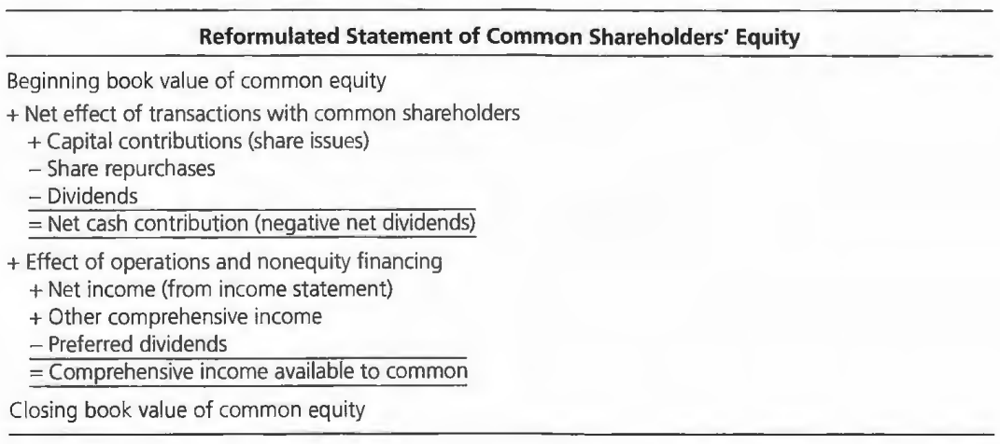

# The Analysis of the Statement of Shareholders' Equity

This chapter reformulates the statement of **owners' equity**, which highlights **comprehensive income**.

本节的reformulation 是站在**Common shareholders**视角来说的，之前的报表并不能反应Common shareholders的利益。

- 如何重构股东权益表
- 如何处理 dirty-surplus
- 如何处理 hidden dirty-surplus

尽管一般意义上来说股东权益表不是最重要的，但是在分析时，最应该先看的就是这个表

## Reformulating the statement of owners' equity

股票发行和回购一般不会产生价值，但是有时可以作为等价物**交换货物或服务**，例如员工持股计划。

1. preferred equity【优先股】被视作债务，而非权益。所以 the beginning and ending balance refer only to common shareholder's equity。

redeemable？

2. 与股东有关的股权交易【the negative net dividend】与商业活动中的股权变化剥离出来
3. 优先股股利被视作expense，类似于 interest，因此从comprehensive income中去除

### Reformulation Procedures

**Accounting relation**

$$
\text{CSE}_t = \text{CSE}_{t-1} + \text{CI} - \text{d}
$$

根据这一公式，重构分为三步骤：

1. **Restate beginning and ending balances for the period for items【CSE】**

- preferred stock
- noncontrolling interest
- dividend payable

non-controlling interest and preferred stock are treated as obligations to others，同时，dividend payable应该被计为equity 而非liability【shareholders cannot owe dividends to themselves】

因此，common shareholders' equity 【CSE】调整如下：
$$\begin{aligned}
\text{CSE}_{new} = \text{CSE}_{old}&- \text{ Preferred stock } \\
&-\text{ Noncontrolling interest reported within equity} \\
&+\text{Dividends payable}
\end{aligned}$$

2. Calculate **net transactions with shareholders【d】**

$$
\text{Cash dividends = Dividends declared} - \text{change in dividends payable}
$$

3. Calcualte **comprehensive income【CI】**

需要考虑包含在equity statement里的other income

$$\begin{aligned}
\text{Comprehensive Income} = \text{Net Income}& +\text{"Other comprehensive income"}\\
&- \text{Preferred dividends } \\
&-\text{Earnings from accounting changes} \\
&-\text{Noncontrolling interest in earnings} \\
&- \text{Hidden dirty-surplus losses}
\end{aligned}$$

相当于在原来 $\text{Other comprehensive income}$ 的基础上又多考虑了几项。

> [!TIP]
> 所有包含在comprehensive income里的东西都是税后

## Dirty-Surples Accounting

在报表中，还有一部分**收入被记在了equity里，而没有反映到income statement中**，这一部分收入被称作dirty surplus，对应的Accounting就称之为Dirty-Surples Accounting ，相对的仅考虑income statement中的net income被称之为Clean-Surples Accounting。

这里关注最常见的三项：
- Currency translation gains and losses 【汇率带来的本外币转换盈亏】
- Unrealized gains and losses on securities (debt and equity)
- Gains and losses on derivative instruments 【硅谷银行】

Dirty-Surplus 一般计入到 Other Comprehensive Income中

## Hidden dirty surplus
在dirty surplus之外，还有Hidden dirty surplus，是由**期权**引起的复杂情况。

期权本身也有不同，如果期权是来自于员工补偿或福利，那么应该记作**employee compensation expense**，但如果来自于可转债、权证或优先股等融资工具，那么应该记作**financing expense**。

> [!NOTE|label:stock-based compensation]
> 当公司发放期权时，GAAP和IFRS要求将期权记作compensation，应作为wage expense记入income statement，这是正确的。但是equity被记作同样数量的增加就是**错误**的，因为这一增一减最终代表wage expense最终对于公司equity没有影响。
>
> 期权应被记作liability而非equity，因为当期权被以低于市场价格执行时，股东会损失权益。

#### Example <!-- {docsify-ignore} -->

A company grants $100$ shares options to $10$ members of its executive management team on Jan 1, 2015. Each executive manager has the right to buy $10$ shares of the company's stock at $\text{\textdollar}13$ if he serves the company for $3$ years. Each option has a fair value $\text{\textdollar}15$ at the date of grant.

Assume the company records its financial statements *every half a year*. On June 30, 2015, i.e., after half a year, the company expects that all $100$ shares options will vest in the future. Therefore it records 

$$
\frac{100\times \text{\textdollar15}}{6} = \text{\textdollar}250
$$

as its option expense at <mark>debt side</mark> and as its paid in capital at <mark>credit side</mark> since the $3$-year period is divided to $6$ half-a-year periods.

> [!TIP]
> For assets, debt side is + and credit side is -; for liabilities and equity, debt side is - and credit side is +. If there is a change in debt side, then there must be a change in credit side.

One member of the executive management team leaves during the second half of 2016, therefore forfeiting $10$ options. Thus, on Dec 31, 2016, it should change the number to record. Suppose there was only $9$ members at the beginning, then the company should record 
$$
\frac{90\times \text{\textdollar}15}{6} = \text{\textdollar}225
$$

every reporting period. However, the company has recorded $\text{\textdollar}250 \times 3=\text{\textdollar}750$. Thus, the number recorded on Dec 31, 2016 should be 
$$
\text{\textdollar}225\times 4 - \text{\textdollar}750 = \text{\textdollar}150
$$

代表过去4个半年中，应该记录 $\text{\textdollar}225\times 4$，但是已经记录了750，因此在2016年底记录150就可以了。

and it will record $\text{\textdollar}225$ in the following periods.

The remaining $9$ members exercise the options on Dec 31, 2017, when the company's stock price is $\text{\textdollar}18$. The company first records $\text{\textdollar}225$ at both debt and credit side. Then, it will record $90\times \text{\textdollar}13=\text{\textdollar}1170$ as cash received and $90\times \text{\textdollar}15=\text{\textdollar}1350$ as paid in capital at debt side, and record $90$ common stock with par value $\text{\textdollar}1$ and the remaining $\text{\textdollar}1170+\text{\textdollar}1350-\text{\textdollar}90=\text{\textdollar}2430$ as paid in capital in excess of par value at credit side.

However, this recording method omits the **actual loss** $(\text{\textdollar}18-\text{\textdollar}13)\times 90=\text{\textdollar}450$. 

We can use 2 different methods to do the adjustment.

According to IRS, this loss (from **non-qualified options**) can be used for tax deduction. Suppose the tax rate is $36.3\%$, then this tax benefit implies $\frac{\text{\textdollar}450}{36.3\%}=\text{\textdollar}1239.67$ of expense, which means the after-tax expense is $\text{\textdollar}1239.67-\text{\textdollar}450=\text{\textdollar}789.67$.

The other method is used when tax benefit is not reported or when the loss is from **incentive options** (IRS does not allow tax decuction). We first calculate the average stock price $\frac{\text{\textdollar15+\text{\textdollar}18}}{2} = \text{\textdollar}16.5$. Then, the after-tax expense is given by $(\text{\textdollar}16.5-\text{\textdollar}13)\times 90\times (1-36.3\%)=200.66$.

尽管严格意义上来说方法2并不正确，但是却很方便，属于一种便利处理。
> [!TIP]
> Stock-based compensation includes non-qualified options and incentive (qualified) options. Incentive options have favorable tax treatment for employees, and thus have many restrictions for a company to grant (e.g., only available to employees, maximal issuance, etc.). The cost of non-qualified options can be deducted as an operating expense while that of incentive options cannot.

#### Example: Reformulate Statement of Common Stockholder's Equity for Nike (Continued)
Using the first method, the tax benefit and its implication are shown below.

Using the second method, we have

This after-tax expense is also called **option overhang** or **contingent liability**, which should be **deducted in comprehensive income and added in shares issues**: 

where stock issues for stock options can be calculated by **sum of capital in excess of stated value and after-tax expense** (the right side) or by **sum of proceeds from exercise and before-tax expense** (the left side).

## Ratio Analysis

$$
\text{Dividend Payout Ratio} = \frac{\text{Dividends}}{\text{Comprehensive Income}}\\
{}\\
\text{Total Payout Ratio} = \frac{\text{Dividends}+\text{Stock Repurchases}}{\text{Comprehensive Income}}\\
{}\\
\text{Retention Ratio} = \frac{\text{Comprehensive Income}-\text{Dividends}}{\text{Comprehensive Income}}=1-\text{Dividend Payout Ratio}\\
{}\\
\text{Dividends-to-Book Value} = \frac{\text{Dividends}}{\text{Book Value of CSE}+\text{Dividends}+\text{Stock Repurchases}}\\
{}\\
\text{Total Payout-to-Book Value} = \frac{\text{Dividends}+\text{Stock Repurchases}}{\text{Book Value of CSE}+\text{Dividends}+\text{Stock Repurchases}}\\
$$

### Shareholder Profitability Ratio <!-- {docsify-ignore} -->
$$
\text{ROCE}_t = \frac{\text{Comprehensive Earnings}_t}{1/2(\text{CSE}_t+\text{CSE}_{t-1})}
$$

### Growth Ratios <!-- {docsify-ignore} -->
$$
\text{Net Investment Rate} = \frac{\text{Transactions with Shareholders}}{\text{Beginning CSE}}\\
{}\\
\text{Growth Rate of CSE} = \frac{\text{Change in CSE}}{\text{Beginning CSE}} = \frac{\text{Net Transactions with Shareholders}+\text{Comprehensive Income}}{\text{Beginning CSE}}
$$

## Conceptual questions

***Losses on Convertible Securities, The market value method or the book value method ?***

Existing shareholders lose when shares are issued to new shareholders at less than the market price. The accounting treatment (the “market value method”) that records the issue of the shares in the conversion at market value, along with a loss on conversion, reflects the effect on existing shareholders’ wealth.

***Do share issues from the exercise of employee stock options cause dilution?***

Yes. Issuing shares at less than the market price dilutes the per-share value of the existing
shares

***Do share repurchases reverse dilution?***

No. Repurchasing shares at market value has no effect on the per-share value of existing
shares. 

***Why would Microsoft feel that repurchasing shares is "too expensive"?***

If Microsoft felt its shares were overvalued in the market it would feel they are too expensive.

***The recognition of the expense?***

It should be matched to revenue over a service period during which the employees worked for the compensation rather than recognized at exercise date.

***Why might Microsoft pay for the acquisition with its own stock rather than in cash?***

Microsoft might think its own shares are overvalued in the market. So it uses them
as “currency” to get a “cheap buy.” Buy when price is less than value. 

