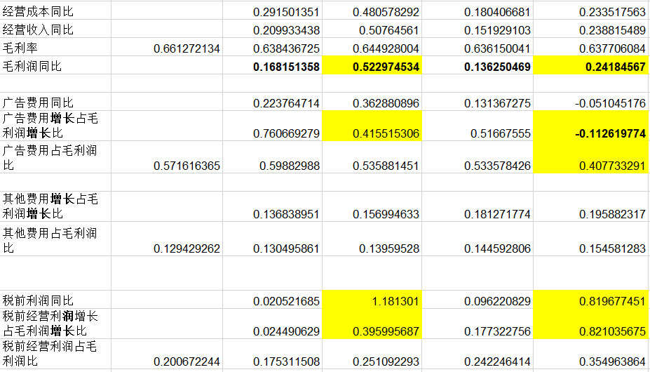

# The reformulation of Income and Balance Sheet

## Income sheet

2018年至2019年，综合收益并没有明显改变。然而从2019-2020年，由于疫情的爆发，综合收益大涨6个亿，同比增长 **103.4%** ，随后在2021年继续增长1个亿，同比 **10.7%** ，2022再次迎来大爆发，猛增10个亿，同比 **76.56%** 。

其中产品收入占比如下【以2022为例】：

| 主营产品 |收入总额（亿）|占总收入比|同比增速|
|:--:|:--:|:--:|:--:|
| 心脑血管类 |41.8|33.4%|-7.9%|
| 呼吸系统类 |68.7|54.9%|67.3%|

公司呼吸系统类产品主要指的是**连花清瘟**，连花清瘟产品以 35.71%的市场份额在 2022 年上半年公立医疗市场中成药感冒用药销售排名**位列第 1**；而心脑血管类产品包括：通心络胶囊、参松养心胶囊和芪苈强心胶囊。

毫无疑问，由于其主营业务，以岭药业是疫情的受益者。但是在疫情持续的三年里，*为什么2021年的增长明显落后于2020和2022呢？*

由于以岭公司所在行业决定的生产特性，其产品一般配方固定，因此生产成本稳定，而售价也不会发生明显的波动，因此其**并不是由于生产活动的收入引起**的，这一点也可以从其毛利率始终维持 63% 附近而确认。

进一步分析，other comprehensive income变化幅度太小，税费与收入相关，因此重点放在对于**各项费用**的分析。

在各项费用当中，管理费用每年的变化额在2019-2022仅有五千万，在2021-2022为一亿左右，在这期间其他费用增速稳定，不作为波动来源。而**销售费用**的变化额高出管理费用一个数量级，接下来我们从销售费用入手展开分析。

首先，通过数据我们可以发现，销售费用、其他费用、以及税前利润三者占毛利润比达 **90%** 以上，其次，三者的增速变化呈现**负相关关系**，当费用增速提高时，相应地税前利润增速就会下跌。

毛利润仅在2020年疫情元年有一波明显提升【0.523】，后续增长趋于稳定【0.136，0.242】。

进一步查看各项费用占毛利润比，以及各项费用增长占毛利润增长比，我们发现基本可以由**特殊事件、销售收入的增加和广告费用的变动**所解释。

> [!NOTE|label:增长比]
> 因为增长涉及到两年数据做差，因此数据点只有4个，正常占比数据点为5个。

从2019年到2020年，销售费用增长比大幅减少，从0.76下降到了0.41。这是因为当2020疫情爆发后，公司大幅提高了销售费用支出【同比增长0.36】，**这一阶段的营销起到了很好的作用**，同期毛利润同比增长0.53。由于**销售费用的增速远低于毛利润增速**，因此最终综合收益仍然提高，同期税前经营利润直接翻倍。

2020-2021，由于封控政策，未发生全国性大面积流行，我们发现广告费用增速与毛利润增速基本持平，因此税前利润同比无明显变化。

同样地，从2021年至2022年，销售费用不增反降，因此税前利润再次暴涨。这一点并不难理解：在经过了2021年销售费用的投入后，市场结果已经显示：在这一阶段连花清瘟市占率已经非常高了，同时由于疫情的严控导致市场需求也受到了限制，此时**继续增加销售费用并不能很好的提升毛利润**，因此，在2022年，公司减少了销售费用的投入。

2022年前三季度，以岭药业净利润同比增加1.9亿，而销售费用同比减少6.25亿，如果不是2022Q4由于疫情的突然放开再次造成了全国性的大流行使得以岭药业单季度营业收入 **45.87** 亿，实现归母净利润 **9.47** 亿，分别同比增加 **128.75%** 和 **688.32%** ，那么该年的综合收益断然不可能出现如此大的爆发。

综上所述，**综合收益的大幅波动可主要由特殊事件、销售收入的增加和广告费用的变动所解释**。

> 怎样可视化会好一些？

### 销售广告费用细分 <!-- {docsify-ignore} -->

由上述分析可知，销售费用的明显变化在于2020年和2022年，接下来我们细分一下这两年的销售费用。

#### 2020 <!-- {docsify-ignore} -->

2020销售费用大幅增加，细分如下：

| 项目 |本年发生额|上年发生额|
|:--:|--:|--:|
| **市场活动费、推广及办公费** |1,729,481,707|1,458,128,124|
| **工资薪金** |839,390,285.69|435,554,533|
|广告费|318,239,357|191,246,458|
|差旅运杂费|69,070,155|82,034,031|
|其他费用|79,086,982|60,134,243|
|合计|3,035,268,488|2,227,097,391|

2020销售费用增加了8个亿，而其中市场活动费、推广及办公费和工资分别增加了3个亿和4个亿。

令人不解的是，在疫情防控之下，差旅费减少了一千三百万，在这种情况下，如何使得工资和市场活动费、推广及办公费大幅增加呢？

结合网络上铺天盖地的宣传【如“世卫组织推荐”，“某知名院士推荐”】，或许可以有些许的窥探与理解。

#### 2022 <!-- {docsify-ignore} -->

| 项目 |本年发生额|上年发生额|
|:--:|--:|--:|
| **市场活动费、推广及办公费** |1,527,262,370|2,050,458,064|
| **人工成本** |1,118,353,364|1,025,370,524|
|广告费|437,281,181|174,233,259|
|差旅费|77,892,212|104,855,862|
|其他|97,924,999|79,085,727|
|合计|3,258,714,129|3,434,003,439|

在2022年，市场活动费、推广及办公费大幅减少4个亿，这在上述已经解释过，在没有大规模流行和连花清瘟市占率已经难再提升了的条件下，再增加销售费用并不能对净利润的增加做出贡献。

## Balance sheet

## Balance sheet and Income statement ratios

