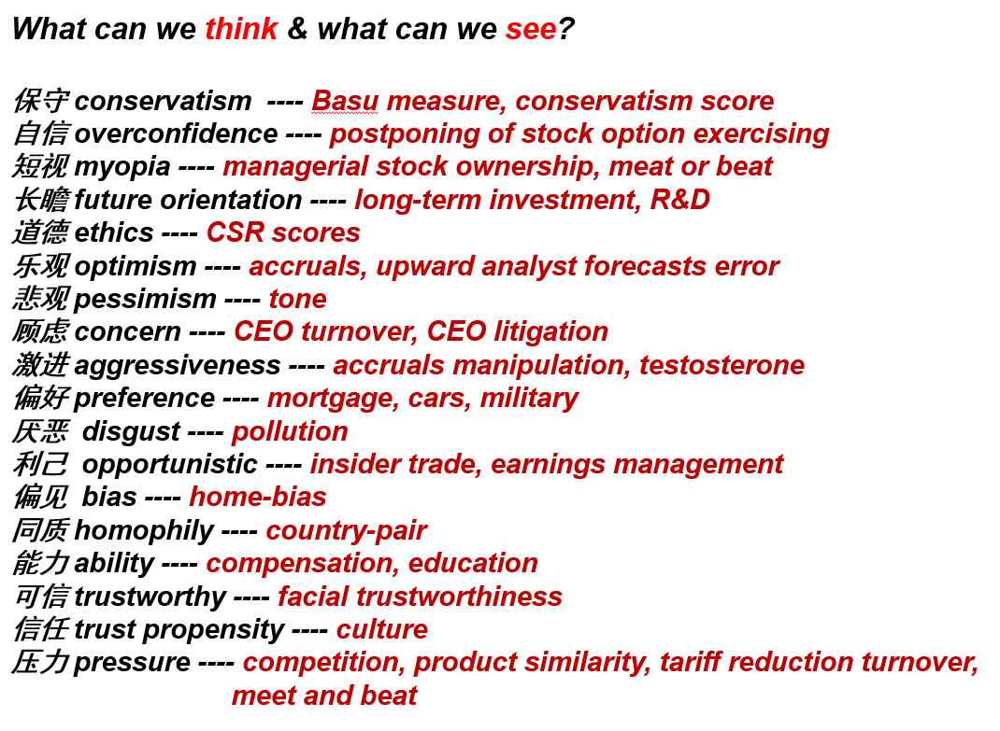

# What is Research?

> ***See what others see and think what others don't think***

## Review one's type

不同的choice体现出不同的type，例如一个人在吃饭时在可乐和啤酒间选择了啤酒，那么说明这个人可能比较喜欢喝酒。

谈到读书：读书如果是为了学知识，那么迟早会忘记。实际上读书本身也可以被理解为一种choice，读书是为了make better choice。随之想到了奥巴马的一次开学演讲，只有上过学，上过各种各样课程，才能知道自己适合什么，如写作、医生、研究。可能这才是学习与读书的意义？

[Obama's Speech](https://www.bilibili.com/video/BV1qQ4y1U7SP/?spm_id_from=333.880.my_history.page.click)

## Proxy

会计是放大版的行为金融，背后体现的是不同的人性，而我们是在找一把尺子来度量（proxy）。

通过这把尺子，能够让我们通过表层看到内在。

例如名字，曾有三种写法，Tsang、Tseng以及Zeng，分别对应中国香港，中国台湾以及中国大陆。名字（last name）这一proxy的背后又能反应什么呢？

Last Name：
- Rival Attitude
  - Kumar A, Niessen-Ruenzi A, Spalt O G. What's in a name? Mutual fund flows when managers have foreign-sounding names[J]. ***The Review of Financial Studies***, 2015, 28(8): 2281-2321.
- The Person’s Corruption Culture 
  - Liu X. Corruption culture and corporate misconduct[J].***Journal of Financial Economics***, 2016, 122(2): 307-327.
- The Person’s Uncertain Avoidance
  - Pan Y, Siegel S, Yue Wang T. The cultural origin of CEOs’ attitudes toward uncertainty: Evidence from corporate acquisitions[J]. ***The Review of Financial Studies***, 2020, 33(7): 2977-3030.

## Understand paper
***如何读懂、构建、分析、评论文章？***

- First layer: Proxy (everyone see)
- Second layer: Underlying constrcut (story, what we think)
- **Third layer:** Motivations (what make "what we think" reasonable)
  - 很多时候也不总是基于理论依据，有合理性足以。

## What is the take-away?
时常记住一个问题：**What is the take-away of your paper?**

