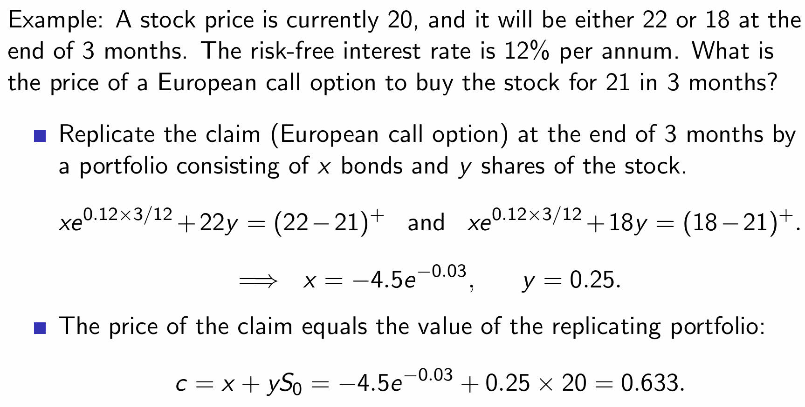
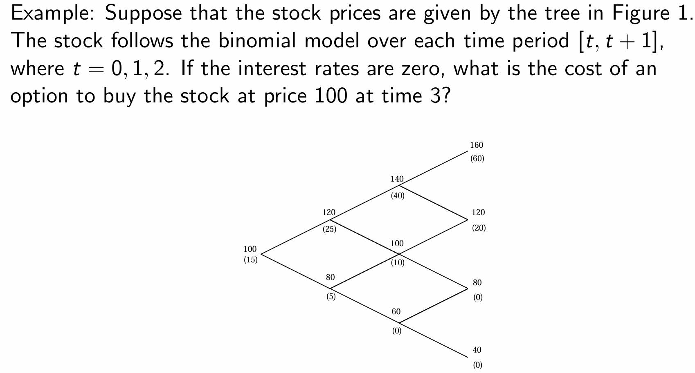
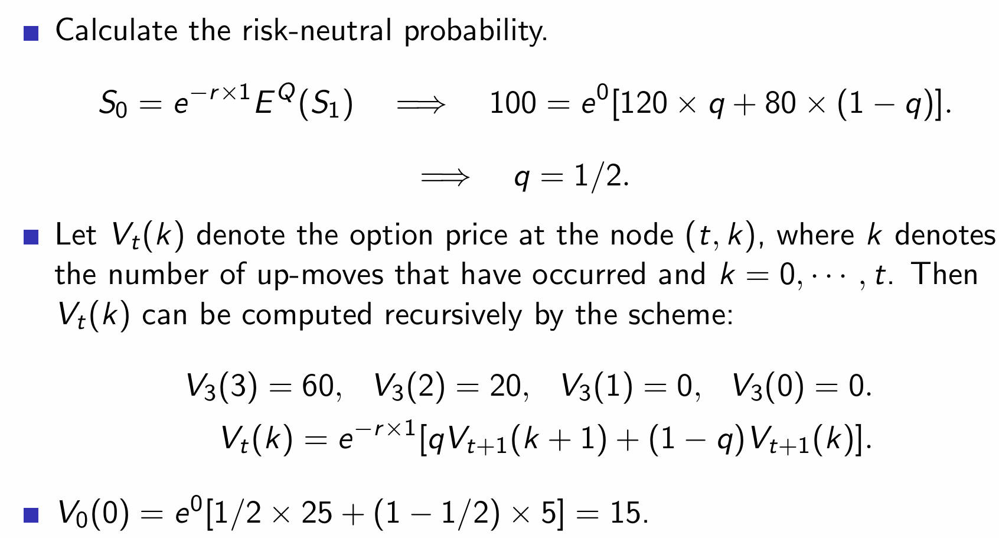

# Final

## Chapter 1

**Lemma 1**

It is never optimal to exercise an American **call** option on a non-dividend-paying stock before the expiration date.

**Upper bound for European call and put options**

- $c \leq S_0$
- $p \leq Ke^{-rT} $

**Put-call parity**

$$
c + Ke^{-rT} = p + S_0
$$

## Chapter 2

**Single Period Binomial model**

The stock price $S_T$ only has two states at time $T$

$$
P(S_T = S_0 u) = p, \quad P(S_T = S_0 d) = 1-p
$$

> Lemma 2: The single period binomial model is **free of arbitrage** if and only if the following conditions hold
$$
d < e^{rT} < u
$$
> 

The **delta** of a stock option is the ratio of the change in the price of the stock option to the change in the price of the underlying stock. It is the number of units of the stock we hold for each option shorted in order to create a riskless portfolio.

The principle of replication

Construct a portfolio $h=(x,y)$ that replicates the long position of a call option:

$$
x e^{rT} + yu S_0 = c_u, \quad xe^{rT} + yd S_0 = c_d
$$

then 

$$
x=\frac{uc_d-dc_u}{(u-d)e^{rT}}\leq0,\quad y=\frac{c_u-c_d}{(u-d)S_0}\geq0.
$$

No arbitrage gives the option pricing formula

$$
c = x+y S_0 = e^{-rT}[qc_u+(1-q)c_d]
$$

where $q = \frac{e^{rT -d}}{u-d} $.

$$
E^Q (S_T) = qS_0 u + (1-q) S_0 d \Longrightarrow S_0 = e^{-rT}E^Q (S_T)
$$

> the price of option can follow the same principle as $S_0$

## Chapter 3

**Brownian motion**

A continuous time stochastic process ${W_t: t \geq 0}$ is a standard Brownian motion if 

- $\forall t>s $, the increment $W_t - W_s$ has the normal distribution $N(0,t-s)$
- The process $W_t$ has independent increments: For any set of times $0 \leq t_1 < t_2 < \cdots < t_n$, the random variable $W_{t_2} - W_{t_1}, W_{t_3} - W_{t_2}, \cdots W_{t_n} - W_{t_{n-1}} $ are independent.
- $W_0 = 0$
- The sample paths ${W_t:t \geq 0}$ are continous function of $t$.

Any Brownian motion with drift $\mu$ and volatility $\sigma$ can be written as 

$$
\hat{W_t} = \mu t + \sigma W_t
$$

where $W_t$ is a standard Brownian motion.

## Put call parity

