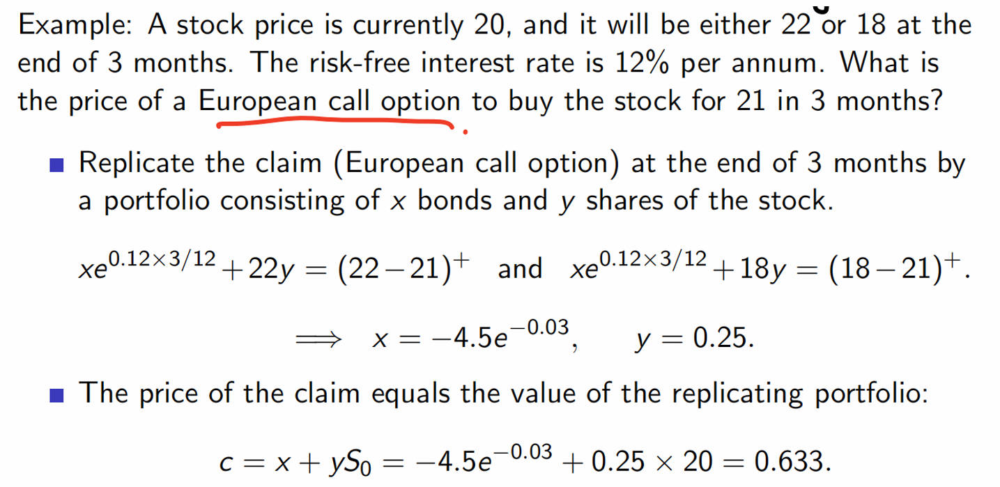
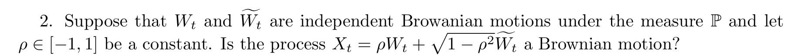

# Midterm 

1. **Put-Call parity**

$$
c + K e^{-rT} = p + S_0
$$

背后的原理是 看涨期权+无风险债券 的组合在 $T$ 时刻支付等于 看跌期权 + 标的资产。

2. **Lemma about American option**

It is never optimal to exercise an American call option on a non-dividend-paying stock before the expiration date.

这是因为持有股票期权并不享受分红，但是分红会对股票价格产生影响，所以有额外的考虑。

3. **No-arbitrage for options pricing**

用 标的资产+无风险债券 的组合复制期权，使得其在 $T$ 时刻的支付相等，那么在当前 $0$ 时刻他们的价格也应该相等。

4. **Risk-hedging portfolio**

A short position of $\Delta$ shares of stocks and a long position in one call option, and make them get same payoff at time $T$ to calculate delta, and then get the price of options.

$$
-\Delta*22+(22-21)^+=-\Delta*18+(18-21)^+
$$

then $\Delta = \frac{1}{4}$, 那么就可以直接贴现 $T$ 时刻的价格求解

$$
\frac{1}{4} S_0 + c = \frac{1}{4} \times 18 \times e^{-rt}
$$

5. **No-arbitrage for options pricing (Generalization)**

$$
xe^{rT}+yuS_0=c_u\quad\mathrm{and}\quad xe^{rT}+ydS_0=c_d.
$$

在上涨和下跌的两种情况下，都可以用一个组合去模拟期权的价值，$x,y$ 指的是无风险资产和股票的数量，$u,d$ 表示上涨因子和下跌因子，例如 $u = 1.06$，通过这个公式，可以求解出

$$
x=\frac{uc_d-dc_u}{(u-d)e^{rT}}\leq0,\quad y=\frac{c_u-c_d}{(u-d)S_0}\geq0.
$$

所以，通过这种方式构造出的组合往往是卖空无风险资产，买入股票。

期权定价公式为

$$
c=x+yS_0=e^{-rT}[qc_u+(1-q)c_d],
$$

其中

$$
\mathbf{q=\frac{e^{rT}-d}{u-d}}
$$

其中 $q$ 也被称为**风险中性测度**。

6. **Standard Brownian motion**

> or Wiener process

- $\forall t >s$, the increment $W_t - W_s$ has the normal distribution $N(0,t-s)$
- The process $W_t$ has independent increments: For any set of times $0\leq t_1 \leq t_2 \cdots \leq t_n$, the random variable $W_{t_2} - W_{t_1}, W_{t_2} - W_{t_1}, \cdots W_{n} - W_{t_{n-1}}$ are independent.
- $W_0 = 0$

7. **Martingale**

$\{W_t\}_{t\geq0}$ generate filtration $\{\mathcal{F}_t\}_{t\geq0}.$ If $\{W_t\}_{t\geq0}$ is a standard Brownian motion under probability measure $P$, then:

**Proving**

(a) $W_t$ is a $ (\mathbb{P}, \{\mathcal{F}_t\}_{t\geq0})$-martingale.

$$
\begin{aligned}
E(W_t | \mathcal{F}_s) &= E(W_t - W_s + W_s | \mathcal{F})\\
&= E(W_t - W_s | \mathcal{F}_s) + E(W_s | \mathcal{F}_s) \\
&= 0 + W_s 
\end{aligned}
$$

(b) $W_t^2 - t$ is a $ (\mathbb{P}, \{\mathcal{F}_t\}_{t\geq0})$-martingale.

$$
\begin{aligned}
E(W_t^2 -t |\mathcal{F}_s) &= E(W_t^2 - W_s^2 + W_s^2 - 2W_tW_s + 2W_tW_s | \mathcal{F}_s) + E(-t+s-s|\mathcal{F}_s) \\
&= E[(W_t - W_s)^2 | \mathcal{F}_s] - E(W_s^2 | \mathcal{F}_s) + 2E(W_tW_s |\mathcal{F}_s) - E(t-s|\mathcal{F}_s) - E(s|\mathcal{F}_s) \\
&= (t-s) - W_s^2 + 2E(W_tW_s|\mathcal{F}_s) - (t-s) - s \\
&= -W_s^2 + 2E(W_tW_s|\mathcal{F}_s) -s
\end{aligned}
$$

> 其中第三行的等式是因为 $W_t - W_s$ 服从正态分布，方差为 $t-s$

$$
\begin{aligned}
E(W_t W_s | \mathcal{F}_s) = W_s E(W_t|\mathcal{F}_s) = W_s^2
\end{aligned}$$

Then 

$$
E(W_t^2 - t |\mathcal{F}_s) = W_s^2 - s
$$

(c) Exponential martingale $\exp(\sigma W_t - \frac{1}{2}\sigma^2 t)$

$M_t = \exp(\sigma W_t - \frac{1}{2}\sigma^2 t) $

$$
\begin{aligned}
E(M_t | \mathcal{F}_s) &= E( \exp(\sigma W_t - \frac{1}{2}\sigma^2 t) | \mathcal{F}_s) \\
&= E(\exp(\sigma W_t - \sigma W_s - \frac{1}{2}\sigma^2 t + \frac{1}{2} \sigma^2 s ) | \mathcal{F}_s) \times E(\exp(\sigma W_s - \frac{1}{2}\sigma^2 s)| \mathcal{F}_s) \\
&= E(\exp(\sigma (W_t - W_s))) E(\exp(-\frac{1}{2} \sigma^2 t + \frac{1}{2}\sigma^2 s)|\mathcal{F}_s) \times \exp(\sigma W_s - \frac{1}{2}\sigma^2 s)
\end{aligned}$$

since $M_x(t) = \exp(\mu t - \frac{1}{2}\sigma^2 t^2) $, thus

$$
M_{W_t - W_s}(t) = \exp(\frac{1}{2}(t-s) \sigma^2)
$$

thus $E(\exp(\sigma (W_t - W_s))) E(\exp(-\frac{1}{2} \sigma^2 t + \frac{1}{2}\sigma^2 s)|\mathcal{F}_s) = e^0 = 1$.

8. **Test Browanian motions**

(a) Continuity of Path

Since both sample paths of the process $W_t, \tilde{W_t}$ are continuous functions of $t$, so does $X_t$.

(b) Start point

$$
X_0 = \rho W_0 + \sqrt{1 - \rho^2} \tilde{W_0} = 0
$$

(c) Normality

For a fixed $t$ and $s$, 

$$
X_t - X_s = \rho (W_t - W_s) + \sqrt{1 - \rho^2} (\tilde{W_t} - \tilde{W_s})
$$

since $W_t - W_s$ and $\tilde{W}_t - \tilde{W}_s$ are independent normal variable, and with mean $0$ and variance $t-s$. So

$$
E(W_t - W_s) = 0, Var(W_t - W_s) = t-s
$$

(d) Independent increments

Since $W_t, \tilde{W_t}$ have independent increments, so $X_t$ has independent increments.

