# Qualification exam

1. (Chapter 2-3) Let $X$ be a random vairable with finite moment generating function $M_X(t),\ -h <t <h$.

(a) Prove the limitation.

$$
\lim_{n \to \infty} \left[ M_X\left(\frac{t}{n}\right) \right]^n = e^{t \mathbb{E}[X]}.
$$

> [!TIP]
> 泰勒展开求极限
$$
M_X(\frac{t}{n}) = \frac{M_X^n(0) x^n}{n!} 
$$
> 极限公式
$$
(1 + \frac{x}{n})^n \rightarrow e^x
$$
> 

$$
M_X (\frac{t}{n}) = 1 + \mathbb{E}[X] \cdot \frac{t}{n} + o(\frac{1}{n})
$$

Then 

$$
\lim_{ n\rightarrow \infty} \left[ M_X (\frac{t}{n}) \right]^n = \left[ 1 + \frac{1}{n} \cdot (t\mathbb{E}[X]) \right]^n = e^{t \mathbb{E}(X)}
$$

(b) Prove that

$$
\begin{aligned}
P(X \geq a) &\leq e^{-at} M_X(t), \quad 0 < t < h, \\
P(X \leq a) &\leq e^{-at} M_X(t), \quad -h < t < 0.
\end{aligned}
$$

and what are general conditions on a function $h(t,x)$ such that $P(X \geq 0) \leq Eh(t,X) $ for all $t \geq 0$ for which $Eh(t,X)$ exists?

> [!TIP]
> 随机变量的指数变换
$$
P(X\geq a) = P(e^X \geq e^a)
$$
> Chebychev's inequality
$$
P(Z \geq t) \leq \frac{E[Z]}{t} 
$$
> 

**$P(X\geq a) = P(e^X \geq e^a)$**, and for $0<t<h$, $P(X\geq a) = P(e^{tX} \geq e^{at}) \leq {E[tX]}/{e^{at}} = M_X(t) / e^{at} $, for $-h < t<0$,

$$
P(X \leq a) = P(e^X \leq e^a) = P(e^{tX} \geq e^{at}) \leq \frac{M_X(t)}{e^{at}}
$$

Then

$$
E h(t, X) \overset{1}{\geq} \int_0^\infty h(t, x) f(x) \, dx \overset{2}{\geq} \int_0^\infty f(x) \, dx = P(X \geq 0), \quad t > 0.
$$

- $\overset{1}{\geq}$ holds for $h(t,x) \geq 0$ with respect to all $x$
- $\overset{2}{\geq}$ holds for $h(t,x) \geq 1$ with respect to $x\geq 0$

(c) A random variable $Y$ is sub-Gaussian with variance proxy $\sigma^2$ if $EY =0$ and its mgf satisfies $Ee^{sY} \leq e^{\frac{\sigma^2 s^2}{2}} $ for all $s \in \mathbb{R}$. For such a $Y$ and a constant $t >0$, show that $E(Y >t) \leq e^{-\frac{t^2}{2\sigma^2}} $.

For $t >0$, let $s = \frac{t}{\sigma^2} >0$

$$
E(Y > t) = P(e^{sY} > e^{st} ) \leq \frac{Ee^{e^{sY} }}{e^{st}} \leq \frac{e^{\frac{t^2}{2\sigma^2}}}{e^{\frac{t^2}{\sigma^2}}} = e^{-\frac{t^2}{2\sigma^2}}
$$

2. (Chapter 2) Let $X$ be a standard normal random vairable and set $Y = \exp (X)$

(a) Find the distribution of $Y$

> [!TIP]
> pdf of normal distribution
$$
f(x) = \frac{1}{\sqrt{2\pi \sigma^2}} e^{-\frac{(x-\mu)^2}{2\sigma^2}}, \ -\infty < x < \infty
$$
> 

$$
f_Y(y) = \frac{1}{y} f_X(\log y) = \frac{1}{\sqrt{2\pi}} \frac{1}{y} \exp\left\{-\frac{1}{2} (\log y)^2\right\}, \quad y > 0.
$$

(b) Show that all the moments of $Y$ exist

> [!TIP]
> The MGF of normal distribution is
$$
M_X(t) = e^{\frac{t^2}{2}}
$$
> 

$$
EY^k = Ee^{kX} = e^{\frac{k^2}{2}}
$$

is the mgf of normal distribution

(c) Show that the random variable $Y$ does not have a moment generating function

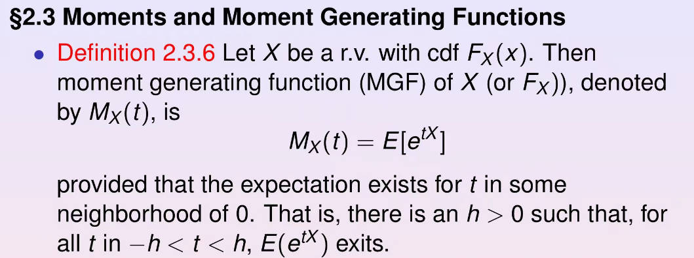

We need to find a neighborhood of zero for $t$ and prove the existence of mgf of $Y$.

Since $y>0, EY=1$, when $t <0$, $e^{tY} < 1$, we have $Ee^{tY} \leq 1$ for all $t<0$. Then for $t >0$,

$$
M_Y(t)=\mathrm{E}e^{tY}=\frac1{\sqrt{2\pi}}\int_0^\infty\frac{e^{ty}}ye^{-\frac12(\log y)^2}\mathrm{d}y=\frac1{\sqrt{2\pi}}\int_{-\infty}^\infty e^{te^x-x^2/2} \mathrm{d}x
$$

Using that for $x>0, e^x \geq 1 + x+ x^2/2 + x^3/6 $, we see that for large enough $x, te^x - x^2/2 \geq t + tx$ for some $K>0$, so $M_Y(t) \geq \int_{K}^{\infty} e^{t+tx}dx$. So the mgf of $Y$ does not exist.

3. (Chapter 3-4) (a) If $X$ and $Y$ are mean zero random variables with unit variance, and correlation $\rho$, establish that $E\max \{ X^2, Y^2 \} \leq 1 + \sqrt{1 - \rho^2}$. (Hint: $\max\{ x,y \} = \frac{1}{2}(x+y - |x-y|) $).

$$
\mathbb{E} \max\{X^2, Y^2\} = \frac{1}{2} \mathbb{E}\left(X^2 + Y^2 + |X^2 - Y^2|\right) 
= 1 + \frac{1}{2} \mathbb{E}|X^2 - Y^2|.
$$

Then

$$
\begin{aligned}
\left(\mathbb{E}|X^2 - Y^2|\right)^2 
&= \left(\mathbb{E}|(X - Y)(X + Y)|\right)^2 \\
&\leq \mathbb{E}(X - Y)^2 \mathbb{E}(X + Y)^2 \\
&= \mathbb{E}\left(X^2 + Y^2 - 2XY\right) \mathbb{E}\left(X^2 + Y^2 + 2XY\right) \\
&= 4\left(1 - \text{Cov}(X, Y)\right)\left(1 + \text{Cov}(X, Y)\right) \\
&= 4\left(1 - \text{Cov}(X, Y)^2\right) \\
&= 4\left(1 - \rho^2\right).
\end{aligned}
$$

(b) Let $X$ and $Y$ be random vairables with $EX=\xi, Var X = \tau^2$, and $EY=\mu, Var Y = \sigma^2$, and correlation coefficient $\rho$. Show that

$$
P\left(\{|X - \xi| \geq \varepsilon \tau\} \cup \{|Y - \mu| \geq \varepsilon \sigma\}\right) 
\leq \frac{1 + \sqrt{1 - \rho^2}}{\varepsilon^2}.
$$

Following (a), we have 

$$
\begin{aligned}
LHS &= P\left(\left\{\frac{|X - \xi|}{\tau} \geq \varepsilon\right\} \cup \left\{\frac{|Y - \mu|}{\sigma} \geq \varepsilon\right\}\right) \\
&= P\left(\{|V| \geq \varepsilon\} \cup \{|W| \geq \varepsilon\}\right) \\
&= P\left(\{V^2 \geq \varepsilon^2\} \cup \{W^2 \geq \varepsilon^2\}\right) \\
&= P\left(\max\{V^2, W^2\} \geq \varepsilon^2\right) \\
&\leq \frac{\mathbb{E} \max\{V^2, W^2\}}{\varepsilon^2} \\
&\leq \frac{1 + \sqrt{1 - \rho^2}}{\varepsilon^2} = RHS.
\end{aligned}
$$

4. (Chapter 4) (a) For hierarchy in Example 4.4.6, show that the marginal distribution of $X$ is given by the beta-binomial distribution,

$$
P(X = x) = \binom{n}{x} \frac{\Gamma(\alpha + \beta) \Gamma(x + \alpha) \Gamma(n - x + \beta)}{\Gamma(\alpha) \Gamma(\beta) \Gamma(\alpha + \beta + n)}.
$$

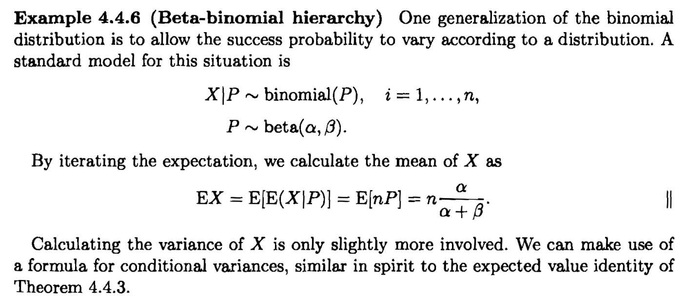

> [!TIP]
> If $P \sim \text{Beta}(\alpha, \beta)$,
$$
f_P(p)=\frac{p^{\alpha-1}(1-p)^{\beta-1}}{B(\alpha,\beta)},\quad p\in[0,1],
$$
> 其中 $B(\alpha,\beta)=\frac{\Gamma(\alpha)\Gamma(\beta)}{\Gamma(\alpha+\beta)}$ 是 Beta 函数。
>
> Beta distribution
$$
\mathbf{Beta}(\alpha, \beta) = \int_{0}^{1} t^{\alpha-1} (1-t)^{\beta -1} dt
$$
>
> 在二项分布中，概率密度函数可以表示为
$$
P(X=x) = \binom{n}{x} p^x (1-p)^{n-x}
$$
> 其中 $\binom{n}{x} = \frac{n!}{x!(x-n)!}$.
>
> 二项分布的均值和方差分别为

$$
\begin{aligned}
P(X=x) &= \int_0^1 P(X=x | P=p) f_P(p) dp \\
&= \int_0^1 \binom{n}{x} p^x (1-p)^{n-x}\cdot \frac{p^{\alpha-1}(1-p)^{\beta-1}}{B(\alpha,\beta)} dp \\
&= \left(\begin{array}{c}n\\x\end{array}\right)\frac{\Gamma(\alpha+\beta)}{\Gamma(\alpha)\Gamma(\beta)}\int_0^1p^{x+\alpha-1}(1-p)^{n+\beta-x-1}dp \\
&= \left(\begin{array}{c}n\\x\end{array}\right)\frac{\Gamma(\alpha+\beta)}{\Gamma(\alpha)\Gamma(\beta)}\frac{\Gamma(x+\alpha)\Gamma(n+\beta-x)}{\Gamma(n+\alpha+\beta)}
\end{aligned}
$$

for $x = 0,1,\cdots n$

(b) A variation on the hierarchical model in part (a) is

$$
X \mid P \sim \text{negative binomial}(r, P), \quad \text{and} \quad P \sim \text{beta}(\alpha, \beta).
$$

Find the marginal pmf of $X$ and its mean and variance.

(Note: A nonnegative distribution is defined as the trail $X$ at which the $r$th success occurs in a sequence of independent Bernoulli(p) trails, where $r$ is a fixed integer. Let $Z=$ number of failures before the $r$th success. Then $Z=X-r$. The alternative form of the nonnegative binomial distribution is

$$
P(Z = z \mid r, p) = \binom{r + z - 1}{z} p^r (1 - p)^z, \quad z = 0, 1, \ldots.
$$

We say that $Z$ has a negative binomial (r,p) distribution)

Following the procedure in a, we have

$$
\begin{aligned}
P(X=x)& \begin{aligned}=&&\int_0^1P(X=x|p)f_P(p)dp\end{aligned} \\
&=\quad\int_0^1\left(\begin{array}{c}r+x-1\\x\end{array}\right)p^r(1-p)^r\frac{\Gamma(\alpha+\beta)}{\Gamma(\alpha)\Gamma(\beta)}p^{\alpha-1}(1-p)^{\beta-1}dp \\
&=\quad\left(\begin{array}{c}r+x-1\\x\end{array}\right)\frac{\Gamma(\alpha+\beta)}{\Gamma(\alpha)\Gamma(\beta)}\int_{0}^{1}p^{r+\alpha-1}(1-p)^{x+\beta-1}dp \\
&=\quad\left(\begin{array}{c}r+x-1\\x\end{array}\right)\frac{\Gamma(\alpha+\beta)}{\Gamma(\alpha)\Gamma(\beta)}\frac{\Gamma(r+\alpha)\Gamma(x+\beta)}{\Gamma(r+\alpha+x+\beta)}
\end{aligned}
$$

The mean is

$$
E(X)=E[E(X|P)]=E[\frac{r(1-P)}P]=\frac{r\beta}{\alpha-1}.
$$

in which

$$
\begin{aligned}
\begin{aligned}\mathbb{E}\left[\frac{1-P}{P}\right]\end{aligned}& \begin{aligned}=\int_0^1\left(\frac{1-P}{P}\right)\frac{\Gamma(\alpha+\beta)}{\Gamma(\alpha)\Gamma(\beta)}p^{\alpha-1}(1-p)^{\beta-1}\mathrm{d}p\end{aligned} \\
&\begin{aligned}&=\frac{\Gamma(\alpha+\beta)}{\Gamma(\alpha)\Gamma(\beta)}\int_{0}^{1}p^{(\alpha-1)-1}(1-p)^{(\beta+1)-1}\mathrm{d}p\end{aligned} \\
&\begin{aligned}=\frac{\Gamma(\alpha+\beta)}{\Gamma(\alpha)}\cdot\frac{\Gamma(\alpha-1)\Gamma(\beta+1)}{\Gamma(\alpha+\beta)}\end{aligned} \\
&=\frac{\beta}{\alpha-1}.
\end{aligned}
$$

Then the variance

$$
\begin{aligned}
\operatorname{Var}(X)& \begin{aligned}=\mathbb{E}(\operatorname{Var}(X|P))+\operatorname{Var}(\mathbb{E}(X|P))\end{aligned} \\
&\begin{aligned}&=\mathbb{E}\left[r\frac{(1-P)}{P^2}\right]+\mathrm{Var}\left(r\frac{(1-P)}{P}\right)\end{aligned} \\
&\begin{aligned}&=r\frac{\beta(\alpha+\beta-1)}{(\alpha-2)(\alpha-1)}+r^2\frac{\beta(\alpha+\beta-1)}{(\alpha-1)^2(\alpha-2)}\end{aligned} \\
&\begin{aligned}=\frac{r\beta(\alpha+\beta-1)}{(\alpha-1)^2(\alpha-2)}\left(1+\frac{r}{\alpha-1}\right).\end{aligned}
\end{aligned}
$$

since

$$
\begin{aligned}
\mathbb{E}\left[\frac{1-P}{P^{2}}\right]& \begin{aligned}=\int_0^1\frac{\Gamma(\alpha+\beta)}{\Gamma(\alpha)\Gamma(\beta)}p^{(\alpha-2)-1}(1-p)^{(\beta+1)-1}\mathrm{d}p\end{aligned} \\
&\begin{aligned}&=\frac{\Gamma(\alpha+\beta)}{\Gamma(\alpha)}\cdot\frac{\Gamma(\alpha-2)\Gamma(\beta+1)}{\Gamma(\alpha+\beta-1)}\end{aligned} \\
&=\frac{\beta(\alpha+\beta-1)}{(\alpha-2)(\alpha-1)}.
\end{aligned}
$$

and 

$$
\begin{aligned}
\mathrm{Var}\left(\frac{1-P}{P}\right)& \begin{aligned}&=\mathbb{E}\left[\left(\frac{1-P}{P}\right)^2\right]-\left(\mathbb{E}\left[\frac{1-P}{P}\right]\right)^2\end{aligned} \\
&=\frac{\beta(\alpha+\beta-1)}{(\alpha-1)^2(\alpha-2)}-\left(\frac\beta{\alpha-1}\right)^2 \\
&=\frac{\beta(\alpha+\beta-1)}{(\alpha-1)^2(\alpha-2)},
\end{aligned}
$$

where

$$
\begin{aligned}
\mathbb{E}\left[\left(\frac{1-P}{P}\right)^2\right]& \begin{aligned}=\int_0^1\frac{\Gamma(\alpha+\beta)}{\Gamma(\alpha)\Gamma(\beta)}p^{(\alpha-2)-1}(1-p)^{(\beta+2)-1}\mathrm{d}p\end{aligned} \\
&=\frac{\Gamma(\alpha+\beta)}{\Gamma(\alpha)\Gamma(\beta)}\cdot\frac{\Gamma(\alpha-2)\Gamma(\beta+2)}{\Gamma(\alpha-2+\beta+2)} \\
&=\frac{\beta(\beta+1)}{(\alpha-2)(\alpha-1)}.
\end{aligned}
$$

5. (Chapter 4,5) Let $X_1,\cdots X_n$ be a random sample from a population with pdf, each having density function

$$
f_X(x)=\begin{cases}1/\theta&\text{if }0<x<\theta\\0&\text{otherwise}.\end{cases}
$$

Let $X_{(1)} < X_{(2)} < \ldots < X_{(n)}$ be the order statistics. Show that 

(a) $X_{(1)}/X_{(n)}$ and $X_(n)$ are independent random variable.

> [!TIP]
> Jacobian 行列式是向量值函数的偏导数矩阵（即 Jacobian matrix）的行列式。假设有一个从 $\mathbb{R}^n$ 到 $\mathbb{R}^m$ 的向量值函数
$$
\mathbf{F}(\mathbf{x})=\begin{bmatrix}f_1(x_1,x_2,\ldots,x_n)\\f_2(x_1,x_2,\ldots,x_n)\\\varvdots\\f_m(x_1,x_2,\ldots,x_n)\end{bmatrix},
$$
> Jacobian 矩阵是由 $\mathbf{F(x)}$ 的偏导数组成的矩阵
$$
J(\mathbf{x})=\begin{bmatrix}\frac{\partial f_1}{\partial x_1}&\frac{\partial f_1}{\partial x_2}&\cdots&\frac{\partial f_1}{\partial x_n}\\\frac{\partial f_2}{\partial x_1}&\frac{\partial f_2}{\partial x_2}&\cdots&\frac{\partial f_2}{\partial x_n}\\\varvdots&\varvdots&\ddots&\varvdots\\\frac{\partial f_m}{\partial x_1}&\frac{\partial f_m}{\partial x_2}&\cdots&\frac{\partial f_m}{\partial x_n}\end{bmatrix}.
$$
> 

Consider the transform

$$
U = \frac{X_{(1)}}{X_{(n)}}, \quad V=X_{(n)}
$$

Then the inverse transformation is 

$$
X_{(1)} = UV, X_{(n)} = V
$$

The Jacobian of the transformation is

$$
J = \begin{vmatrix}
v & u \\
0 & 1
\end{vmatrix} = v.
$$

The joint distribution of $X_{(1)}$ and $X_{(n)}$ is 

$$
f_{X_{(1)}, X_{(n)}}(x_1, x_2) = \frac{n(n-1)(x_2 - x_1)^{n-2}}{\theta^n}, \quad 0 < x_1 < x_2 < \theta.
$$

Using the formula for the pdf of the transformation, we have 

$$
f_{U,V}(u, v) = \frac{n(n-1) v^{n-1} (1-u)^{n-2}}{\theta^n}, \quad 0 < u < 1, \quad 0 < v < \theta.
$$

$$\begin{aligned}
f_U(u) &= (n-1)(1-u)^{n-2}, \quad 0 < u < 1. \\
f_V(v) &= \frac{n v^{n-1}}{\theta^n}, \quad 0 < v < \theta.
\end{aligned}
$$

Thus we have 

$$
f_{U,V}(u, v) = f_U(u) f_V(v), \quad 0 < u < 1, \quad 0 < v < \theta.
$$

Hence $U$ and $V$ are independent.

(b) Find Cov($X_{(1)}, X_{(2)}$)

$Cov(X_{(1)}, X_{(n)}) = EX_{(1)}EX_{(n)}- EX_{(1)}EX_{(n)}$

$$
\begin{aligned}
\mathbb{E}[X_{(1)}X_{(n)}] &= \int_0^\theta \int_0^{x_2} x_1 x_2 f_{X_{(1)}, X_{(n)}}(x_1, x_2) \, dx_1 dx_2 \\
&= \int_0^\theta \frac{n(n-1)x_2}{\theta^n} \left[\int_0^{x_2} (x_2 - x_1)^{n-2} x_1 \, dx_1\right] dx_2 \\
&= \int_0^\theta \frac{n(n-1)x_2}{\theta^n} \left[\frac{x_2^n}{n(n-1)}\right] dx_2 \\
&= \int_0^\theta \frac{x_2^{n+1}}{\theta^n} \, dx_2 \\
&= \frac{\theta^2}{n+2}.
\end{aligned}
$$

6. (Chapter 5,7) Let $X_1, \cdots X_n $ be an i.i.d. sample from Poisson($\lambda$) distribution truncated on the left at $0$, the density is given by 

$$
P(X=x)=\frac{e^{-\lambda}\lambda^x}{(1-e^{-\lambda})x!},\quad x=1,2,\cdots.
$$

(a) Find the Cramer-Rao lower bound for the variance of an unbiased estimator of $\lambda$

> [!TIP]
> 在参数估计问题中，我们希望找到一个估计量 $\hat{\theta}$ 来估计某个参数 $\theta$，并且希望 $\hat{\theta}$ 的方差尽可能小。Cramer-Rao 不等式指出，对于任意无偏估计量，其方差不能小于一个特定的下界，这个下界由样本数据的分布特性决定。

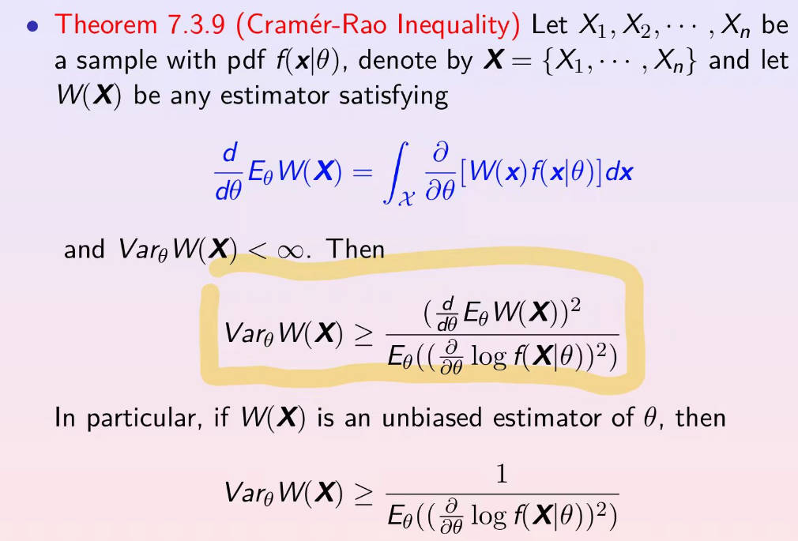

For the unbiased estimator of λ the CR Inequality should satisfies

$$
\operatorname{Var}_\theta W(\mathbf{X})\geq\frac{\left(\frac{d}{d\theta}\operatorname{E}_\theta W(\mathbf{X})\right)^2}{nE_\theta\left(\left(\frac{\partial}{\partial\theta}\log f(X\mid\theta)\right)^2\right)}=\frac{1}{-nE_\theta\left(\frac{\partial^2}{\partial\theta^2}\log f(X\mid\theta)\right)}.
$$

> 分子中 $E_{\theta}W(\mathbf{X})$ 是无偏估计的均值，因此求导为1。其次，分母中是 $N$ 个 $X$ 取值，所以乘 $n$。

Now we consider

$$
\begin{aligned}
\begin{aligned}-n\mathrm{E}_\lambda\left(\frac{\partial^2}{\partial\lambda^2}\log f(X\mid\lambda)\right)\end{aligned}& \begin{aligned}=-n\mathrm{E}_\lambda\left(-\frac{x}{\lambda^2}+\frac{e^{-\lambda}}{(1-e^{-\lambda})^2}\right)\end{aligned} \\
&\begin{aligned}&=\frac{n}{\lambda(1-e^{-\lambda})}-\frac{ne^{-\lambda}}{(1-e^{-\lambda})^2}.\end{aligned}
\end{aligned}
$$

> 这一步可以直接对原 pdf 求导。

where 

$$
\begin{aligned}
E_{\lambda}X &= \sum_{x=1} x\frac{e^{-\lambda}\lambda^x}{(1-e^{-\lambda})x!},\quad x=1,2,\cdots \\
&= \frac{e^{-\lambda}}{(1-e^{-\lambda})} \sum_{x=1} \frac{x\lambda^x}{x!} \\
&= \frac{e^{-\lambda} \lambda}{(1-e^{-\lambda})} \sum_{x=1} \frac{\lambda^{x-1}}{(x-1)!} \\
&= \frac{e^{-\lambda} \lambda}{(1-e^{-\lambda})} \sum_{x=0} \frac{\lambda^{x}}{x!}\\
&=\frac{e^{-\lambda} \lambda}{(1-e^{-\lambda})} e^{\lambda} = \frac{\lambda}{(1-e^{-\lambda})}
\end{aligned}
$$

> $e^x = \sum_{n} \frac{x^n}{n!} $

So the CR lower bound is $\frac{\lambda\left(1-e^{-\lambda}\right)^{2}}{n\left(1-e^{-\lambda}-\lambda e^{-\lambda}\right)}.$

(b) Please find the asymptotic variance of the MLE estimator of $\lambda$ (Hints: You can use the Delta method in Theorem 5.5.24)

The MLE is 

$$
MLE = \prod_i \frac{e^{-\lambda}\lambda^{ x_i }}{(1-e^{-\lambda})x_i!} = \frac{e^{-\lambda n}}{(1-e^{-\lambda})^n}  \frac{\lambda ^{\sum_i x_i}}{\prod_i x_1!}
$$

Then the log-likelihood function is

$$
l(\mathbf{x}, \lambda) = -n\lambda - n\log (1-e^{-\lambda}) + \sum_i x_i \log \lambda  - \log (\prod_i x_i !)
$$

then 

$$
\begin{aligned}
\frac{dl}{d\lambda} &= -n - \frac{n e^{-\lambda}}{1- e^{-\lambda}} + \frac{\sum x_i}{\lambda} = 0 \\
\Longrightarrow \bar{x} &=\frac{\lambda}{1-e^{-\lambda}}
\end{aligned}$$

> 这里我们无法获取到 $\lambda$ 的表达式，因为是超越方程，所以只能通过逆函数的方式表达出 $\hat{\lambda}$

Since $\bar{x} = c(\lambda)$, then $\lambda = c^{-1}(\bar{x})$, then by delta method

$$
E(\bar{x}) = E(x), \quad Var(\bar{x}) = \frac{1}{n} Var(x)
$$

From $(a)$ we now $\mu = EX = \frac{\lambda}{1- e^{-\lambda}} $, following the same procedure, 

$$
\begin{aligned}
E_{\lambda}X^2 &= \sum_{x=1} x^2\frac{e^{-\lambda}\lambda^x}{(1-e^{-\lambda})x!},\quad x=1,2,\cdots \\
&= \frac{e^{-\lambda}}{(1-e^{-\lambda})} \sum_{x=1} \frac{x^2 \lambda^x}{x!} \\
&= \frac{e^{-\lambda} \lambda}{(1-e^{-\lambda})} \sum_{x=1} \frac{x \lambda^{x-1} - \lambda^{x-1} + \lambda^{x-1} }{(x-1)!} \\
&= \frac{e^{-\lambda} \lambda}{(1-e^{-\lambda})} \left(\sum_{x=1} \frac{\lambda^{x-1}}{(x-1)!} + \lambda \sum_{x=2} \frac{\lambda^{x-2}}{(x-2)!} \right)\\
&=\frac{e^{-\lambda} \lambda}{(1-e^{-\lambda})} (e^{\lambda} + e^{\lambda} \lambda) = \frac{\lambda + \lambda^2}{(1-e^{-\lambda})}
\end{aligned}
$$

Thus

$$
\sigma^2 = (EX)^2 - EX^2 = \frac{\lambda(\lambda + e^{-\lambda} + \lambda e^{-\lambda} )}{(1-e^{-\lambda})^2}
$$

> 我们现在想要根据 $\bar{x}$ 得到 $\lambda$ 的分布，需要通过 delta method $g(\bar{x})$，这里的 $g$ 就是 $c^{-1}$，接下来只需要得到 $g'(\mu)$ 就好了。

> [!TIP]
$$
y = f(x), \quad x = f^{-1} (y), \\
\Longrightarrow f'(x) = \frac{dy}{dx}, \quad (f^{-1}(y))'  = \frac{dx}{dy}, \\
\Longrightarrow f'(x) = \frac{1}{(f^{-1}(y))'}
$$
> 

Thus 

$$
g'(\mu) = \frac{d[c^{-1}(\mu)]}{d \mu} = \frac{1}{\frac{d c(\lambda)}{d \lambda}} = \frac{(1-e^{-\lambda})^2}{1 - e^{-\lambda} - \lambda e^{-\lambda}}
$$

Then 

$$
\sigma^2_{\lambda} =\sigma^2[g^{\prime}(\mu)]^2=\frac{\lambda(1-e^{-\lambda})^2}{(1-e^{-\lambda}-\lambda e^{-\lambda})}.
$$

7. (Chapter 5) Let $X_1, \cdots X_n$ be IID random variables, $EX_i = \mu, VarX_i = \sigma^2 < \infty$. Define the mean of the random sample $\bar{X}_n  = n^{-1}\sum_i X_i $.

(a) If $X_i$s are observations from $U(0,\theta)$, find the limit distribution of $\bar{X}_n$

Since $EX_i = \frac{\theta}{2}, VarX_i = \frac{\theta^2}{12}$

$$
\begin{aligned}
EX &= \int_{0}^{\theta} x \frac{1}{\theta} dx \\
&= \frac{1}{\theta} \frac{1}{2}x^2 |_0^{\theta} = \frac{\theta}{2}
\end{aligned}
$$

$$
\begin{aligned}
EX^2 &= \int_{0}^{\theta} x^2 \frac{1}{\theta} dx \\
&= \frac{1}{\theta} \frac{1}{3}x^3 |_0^{\theta} = \frac{\theta^2}{3}
\end{aligned}
$$

Thus 

$$
VarX = (EX)^2 - EX^2 = \frac{\theta^2}{12}
$$

then by CLT,

$$
\sqrt{n}\left(\bar{X}_{n}-\frac{\theta}{2}\right)\overset{D}{\operatorname*{\to}}N\left(0,\frac{\theta^{2}}{12}\right).
$$

(b) Based on $(a)$, find a continuous function $g(\cdot)$ such that the limiting distribution of 

$$
Y_n=\sqrt{n}\begin{bmatrix}g\left(2\bar{X}\right)-g(\theta)\end{bmatrix}
$$

does not depend on $\theta$. Find the limiting distribution of $Y_n$.

Base on (a), we have

$$
\sqrt{n}\left(2\bar{X}_{n}-\theta\right)\overset{D}{\operatorname*{\to}}N\left(0,\frac{\theta^{2}}{3}\right)
$$

By delta method,

$$
\sqrt{n}\left(g(2\bar{X}_n)-g(\theta)\right)\xrightarrow{D}N\left(0,\frac{\theta^2}3[g^{^{\prime}}(\theta)]^2\right).
$$

If the limit distribution does not depend on $\theta$, it means that $\frac{\theta^2}3[g^{^{\prime}}(\theta)]^2 = c, c>0$, the equation can be solved as $g(\theta)=\log(\theta) $. 

The limiting distribution of $Y_n$ is $N(0,1)$. Generally, $g(\theta) = C_1 \log (\theta) + C_2 $, $C_1, C_2$ are constant, $C_1 >0$.

8. (Chapter 5) Let $X_1, \cdots X_n$ be independent continuous random variables, each having density function

$$
p(x;\theta)=\exp(-(x-\theta))I(x>\theta)
$$

Let $X_1, \cdots X_n$ be the corresponding order statistics.

(a) Find the joint density function of $X_{(1)},X_{(2)}$, and the marginal densities of $X_{(1)},X_{(2)}$.

(Hints: The pdf of $X_{(i)}$ and $X_{(j)}$, $1\leq i < j \leq n$ is 

$$
\begin{aligned}f_{X_{ (i) },X_{(j)}}&=\quad\frac{n!}{(i-1)!(j-1-i)!(n-j)!}f_X(u)f_X(v)[F_X(u)]^{i-1}\\&\times\quad[F_X(v)-F_X(u)]^{j-1-i}[1-F_X(v)]^{n-j}\end{aligned}
$$
for $-\infty < u<v < \infty$.)

The cumulative distribution function is 

$$
F(x)=P(X\leq x)=\int_\theta^x\exp^{-(t-\theta)}dt=1-\exp^{-(x-\theta)}.
$$

The joint distribution is 

$$
\begin{aligned}f_{X_{(1)},X_{(2)}}(x_1,x_2)&=\quad\frac{n!}{(n-2)!}f_{X_{(1)}}(x_1)f_{X_{(2)}}(x_2)(1-F(x_2))^{n-2}\\&=\quad n(n-1)\exp^{-(x_1-\theta)}\exp(-(n-1)(x_2-\theta)).\end{aligned}
$$

As for the marginal densities, we have 

$$
\begin{aligned}
f_{X_{ (1) }} (x_1) &= \int_{x_1}^{+\infty} n(n-1) e^{-(x_1 - \theta)} e^{-(n-1)(x_2 - \theta)} dx_2 \\
&=n e^{-n(x_1-\theta)}
\end{aligned}$$

$$
\begin{aligned}
f_{X_{ (2) }} (x_2) &= \int_{\theta}^{x_2} n(n-1) e^{-(x_1 - \theta)} e^{-(n-1)(x_2 - \theta)} dx_1 \\
&= n(n-1)(1 - e^{-(x_2 - \theta)})e^{-(n-1)(x_2 - \theta)}
\end{aligned}$$

(b) Show that

$$
T=X_{(1)}-(n-1)(X_{(2)}-X_{(1)})/n
$$

is an unbiased estimator of $\theta$.

$$
\begin{aligned}
EX_{(1)} &= \int_{\theta}^{\infty} x_1 e^{-n(x_1-\theta)} d x_1 \\
&= - x_1 e^{-n(x_1 - \theta)} |_{\theta}^{\infty} - \int_{\theta}^{\infty} - e^{-n(x_1 - \theta)} dx_1 \\
&= \theta + \frac{1}{n}
\end{aligned}$$

$$
\begin{aligned}
EX_{(2)} &= \int_{\theta}^{\infty}  x_2 n(n-1)(1 - e^{-(x_2 - \theta)})e^{-(n-1)(x_2 - \theta)} d x_2 \\
&= -n \int_{\theta}^{\infty} x_2 d e^{-(n-1)(x_2 - \theta)} + (n-1) \int_{\theta}^{\infty} x_2 d e^{-n (x_2 - \theta)}   \\
&= \theta + \frac{2n-1}{n(n-1)}
\end{aligned}$$

Then 

$$
ET = E_{X(1)} - \frac{n-1}{n} (E_{X(2)} - E_{X(1)}) = \theta
$$

(c) Find the maximum likelihood estimate of $\theta$.

The log-likelihood function is 

$$
L(\theta) = - \sum_{i=1}^n X_i + n\theta
$$

then 

$$
\frac{d L(\theta)}{ d\theta} = n > 0
$$

因此，随着 $\theta$ 变大，MLE 持续在增加，所以直接取 $\theta$ 的最大值，也就是 $\hat{\theta} = X_{(1)} $.

9. (Chapter 6). Let $X_1, \cdots, X_n$ be a random sample from the pdf $f(x|\mu) = e^{-(x-\mu)}$, where $-\infty < \mu < x < \infty $.

(a) Show that $X_{(1)}=\min_i X_i $ is a complete sufficient statistics.

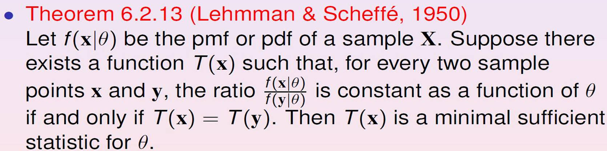

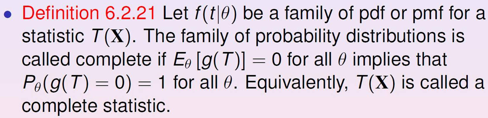

Minimal Sufficient: Consider

$$
\begin{aligned}
\begin{aligned}\frac{f(\mathbf{x}\mid\theta)}{f(\mathbf{y}\mid\theta)}\end{aligned}=&\displaystyle\frac{\prod_{i=1}^{n}\left(e^{-(x_{i}-\theta)}I_{(\theta,\infty)}\left(x_{i}\right)\right)}{\prod_{i=1}^{n}\left(e^{-(y_{i}-\theta)}I_{(\theta,\infty)}\left(y_{i}\right)\right)} \\
=&\frac{e^{n\theta}e^{-\Sigma_ix_i}\prod_{i=1}^nI_{(\theta,\infty)}\left(x_i\right)}{e^{n\theta}e^{-\Sigma_iy_i}\prod_{i=1}^nI_{(\theta,\infty)}\left(y_i\right)}=\frac{e^{-\Sigma_ix_i}I_{(\theta,\infty)}\left(\min x_i\right)}{e^{-\Sigma_iy_i}I_{(\theta,\infty)}\left(\min y_i\right)}
\end{aligned}
$$

$T(X)=X_{(1)} $ is a minimal sufficient statistic in this case, since tha ratio is independent to $\theta$ iff. $X_{(1)}=Y_{(1)} $. Thus $X_{(1)}$ is minimal sufficient.

> [!TIP]
> The pdf of order statistics. First we get the cdf
$$
P(X_{(1)}<X ) = 1 - P(X_{(1)}>X )  = 1 - P(X_{(1)}>X )P(X_{(2)}>X )\cdots P(X_{(n)}>X ) = 1 - [1-F(X)]^n
$$
> Thus, the pdf is 
$$
\frac{dP}{dx} = f_{X_{(1)}} = n[1-F(X)]^{n-1} f(x)
$$
> 

Completeness: Consider $f_{X_{(1)}} = n[1-F(X)]^{n-1} f(x) = ne^{-n(x-n)}$, where $x > \mu$. Now discuss

$$
\begin{aligned} Eg(X_1) \int_{\mu}^{\infty}g(x)ne^{-n(x-\mu)}dx=ne^{n\mu}\int_{\mu}^{\infty}g(x)e^{-nx}dx.\end{aligned}
$$

we set $Eg(X_1) =0$, because $ne^{n\mu} >0 $, then the derivative of $\mu$ on the second term is 

$$
\frac{ d[\int_\mu^\infty g(x)e^{-n(x-\mu)}dx] }{d \mu} =  g(\mu) e^{-n\mu} = 0
$$

This implies $g(\mu)=0$ for all $\mu$. By definition, $X_{(1)}$ is complete.

(b) Use Basu's Theorem to show that $X_{(1)}$ and $S^2$ are independent. 

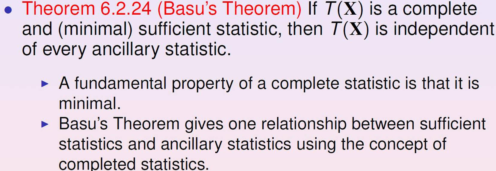

Since $X_{(1)}$ is a complete sufficient statistic for $\mu$. And $S^2$ isa ancillary statistic due to location shift, $X_i = Z_i + \mu$,

$$
S^2=(n-1)^{-1}\sum(X_i-\bar{X})^2=(n-1)^{-1}\sum((Z_i+\mu)-(\bar{Z}+\mu))^2=(n-1)^{-1}\sum(Z_i-\bar{Z})^2,
$$

which does not dependent to $\mu$. By Basu's Theorem, they are independent.

> $X_1$ 是对于 $\mu$ 的估计，所以说明 $S^2$ 和 $\mu$ 无关就可以说明 $X_1$ 和 $S^2$ 无关。

10.  (Chapter 6-7) Let $X_1, \cdots, X_n$ be iid random variable with pdf

$$
f(x|\theta)=\frac{2x}\theta e^{-x^2/\theta},x>0.
$$

(a) Show that $X_1^2$ is an unbiased estimator of $\theta$.

Let $W = X^2$, then

$$
f(\omega) = f_X (\sqrt{w}) \frac{1}{2 \sqrt{w}} = (\frac{1}{\theta}) \exp (\frac{-\omega}{\theta})
$$

then 

$$
\begin{aligned}
EW &= \int_0^{\infty} w \frac{1}{\theta} e^{-w/\theta} dw \\
&= \int_0^{\infty} \theta t e^{-t} dt  \\
&= \theta \left[ -te^{-t} |_0^{\infty} + \int_0^{\infty}e^{-t} dt  \right] = \theta
\end{aligned}
$$

(b) Verify that $\sum_1^n X_i^2 $ is a complete and sufficient statistic.

$\sum_i^n X_i^2 $ is a complete sufficient statistic due to $f$ is an exponential family.

> 根据定理 6.2.25 指数族的 Complete statistic 公式。

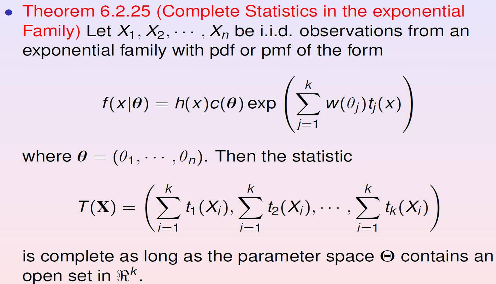

(c) Show that the variance of $n^{-1}\sum_1^n X_i^2 $ attains the Cramer-Rao lower bound, and hence it is the UMVUE of $\theta$.

> [!TIP]
> The pdf of exponential distribution
$$
f(x;\lambda)=
\begin{cases}
\lambda e^{-\lambda x}, & x\geq0 \\
0, & x<0 & & 
\end{cases}
$$
> the **mean** of it is $\mathbf{E}[X] = \frac{1}{\lambda}$, the variance of it is $Var(X) =\frac{1}{\lambda^2} $.

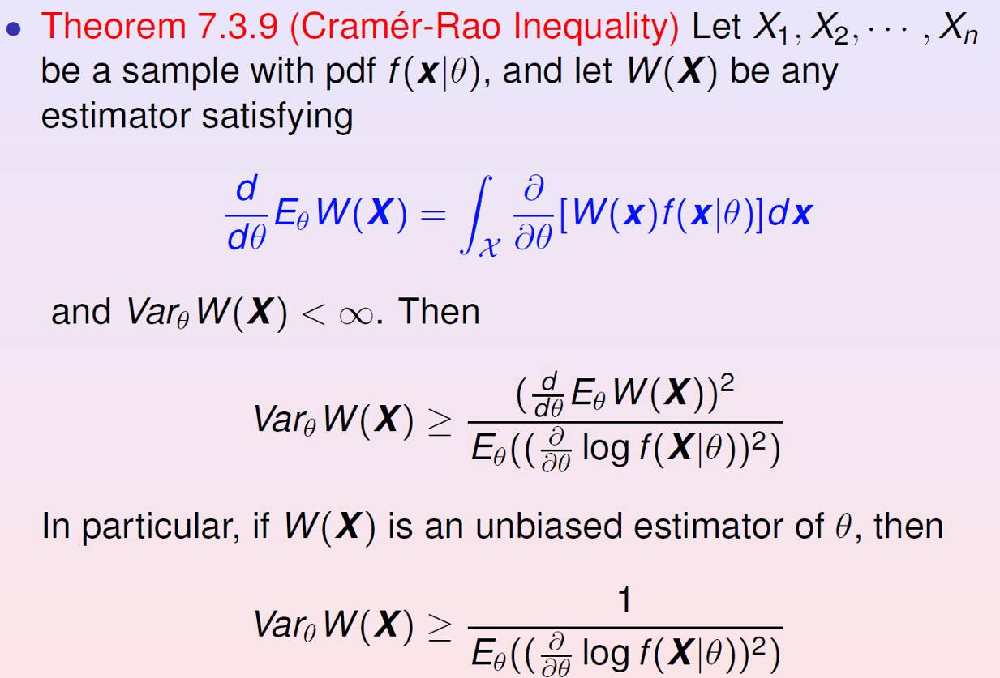

> 一阶导的平方等于负二阶导，大多数采用后者计算，因为比较好求。

Since the pdf of $X_i$ is in an exponential family, and 

$$
\log(f(x|\theta))=\log(2x)-\log(\theta)-\frac1\theta x^2.
$$

When $x>0$, we have 

$$
\frac\partial{\partial\theta}f(x\mid\theta)=\frac{-1}\theta+\frac1{\theta^2}x^2
$$

and

$$
\frac{\partial^2}{\partial\theta^2}f(x\mid\theta)=\frac1{\theta^2}+\frac{-2}{\theta^3}x^2.
$$

hence

$$
-nE_\theta\left(\frac{\partial^2}{\partial\theta^2}\log f(X\mid\theta)\right)=\frac n{\theta^2}.
$$

And the CR lower bound for $\theta$ is $\theta^2 / n$. Since $Var(n^{-1}\sum_1^nX_i^2) = \theta^2/n$, it attains the CR lower bound. Hence it is the UMVUE of $\theta$.

> 直接计算 Fisher information number 代公式就可以了，也就是 Cramer-Rao 不等式的分母。

11. (Chapter 7) Data ($x_i, Y_i$), $i = 1, \cdots,n$ are modeled, assuming $x_1, \cdots, x_n$ are fixed and positive constants; $Y_1, \cdots, Y_n$ are independent; $Y_i$ is distributed as $\text{Exponential}(\theta x_i)$ with mean $\theta x_i$ for each $i$, and $\theta > 0$ is an unknown parameter.

(a) Find the uniform minimum variance unbiased estimator (UMVUE) of $\theta$.

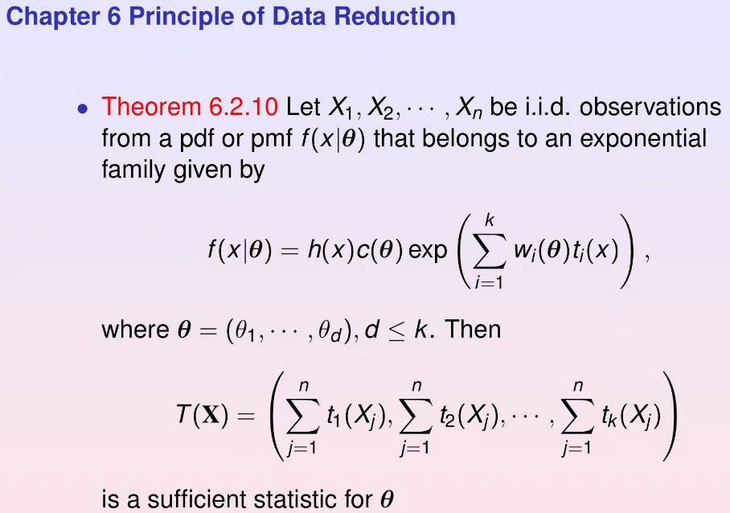

> 结合定理 6.2.25，一般来说都是 complete and sufficient。

> [!TIP]
> Theorem 7.3.23: Let $T$ be a complete sufficient statistic for a parameter $\theta$, and let $\phi(T)$ be any estimator based only on $Y$. Then $\phi(T)$ is the unique best unbiased estimator of its expected value.
>
> Special case (Rao-Blackwell Theorem): If $T$ is a complete sufficient statistic for a paremeter $\theta$ and $h(X_1,\cdots, X_n)$ is any unbiased estimator of $\tau(\theta)$, then $\phi(T)=E(h(X_1,\cdots,X_n)|T) $ is the best unbiased estimator of $\tau(\theta)$.

The likelihood of $\theta$ is

$$
L(\theta)=\prod_{i=1}^n\frac{1}{\theta x_i}\exp(-Y_i/(x_i\theta))=\frac{1}{\theta^n\prod_{i=1}^nx_i}\exp(-S_n/\theta)
$$

where $S_n = \sum_{i=1}^n \frac{Y_i}{x_i} $. By theorem (6.2.25) (Complete Statistic in the Exponential Family), $S_n$ is complete and sufficient for $\theta$. And $ES_{n}/n=\frac{1}{n}\sum_{i=1}^{n}\frac{EY_{i}}{x_{i}}=\theta.$ 

> 在已知

Thus $S_n /n$ is UMVUE by Theorem (7.3.23 or Rao-Blackwell Theorem).

> 充分统计量的函数也是充分统计量，所以正负没关系。
>
> UMVUE 的理解在于，相当于是通过无偏限定了一个范围，在这个范围内找最小方差。

(b) Suppose $\theta$ has an inverse Gamma $IG(\alpha, \beta)$ prior distribution and $\alpha >1, \beta >0$. Find the Bayes estimator of $\theta$.

Fact: If $W \sim IG(\alpha, \beta)$, then its pdf is given by 

$$
f_W(w)=\left\{\begin{array}{cc}\frac{1}{\Gamma(\alpha)\beta^\alpha}\frac{1}{w^{\alpha+1}}\exp(-\frac{1}{\beta w})&if \ w>0\\0&otherwise\end{array}\right.
$$

where $\Gamma(\cdot)$ denotes the gamma function and $EW = \frac{1}{\beta(\alpha-1)}$.

> [!TIP]
> 这一题有传统的技巧，观察 IG 分布概率密度的形式，我们会发现，只要得到后面跟 $w$ 有关的两项，就可以得到第一项的系数，所以，在求解时，我们可以只关注与 $w$ 有关的部分，这样就可以得到完整的分布形状。
 
根据 Bayes posterior density

$$
\pi(\theta | y) = \frac{f(y,\theta)}{\int f(y,\theta) d \theta} = \frac{f(y|\theta)f(\theta)}{\int f(y,\theta) d \theta}
$$

$f(y|\theta)$ 就是似然函数，$f(\theta)$ 就是 IG 分布，于是有

$$
\begin{aligned}
\pi(\theta|y) &\propto \prod_i \frac{1}{\theta x_i} e^{- \frac{Y_i}{\theta x_i}} \cdot \frac{1}{\theta^{\alpha+1}} \cdot e^{-\frac{1}{\beta \theta}} \\
& \propto \frac{1}{\theta^n} \cdot \frac{1}{\theta^{\alpha+1}} \cdot e^{-\frac{S_n}{\theta}} \cdot e^{-\frac{1}{\beta \theta}}  \\
& \propto \frac{1}{\theta^{n+\alpha+1}} \cdot e^{-[\frac{1}{\theta} (\frac{1}{\beta} + S_n) ]}
\end{aligned}$$

> 在求解的过程中，似然函数中的 $\prod x_i$ 与 $\theta$ 无关，因此可以直接 drop。

因此，参照 IG 分布的参数，有 $\alpha = 1 + \alpha, \beta = \frac{1}{\frac{1}{\beta} + S_n}$, thus, the bayes estimator is 

$$
E(\theta | S_n) = \frac{S_n + 1/\beta}{n+\alpha-1}
$$

12. (Chapter 7) Let $X_1, \cdots, X_n$ be a random sample from a normal distribution $N(\theta, \sigma^2)$ population, and suppose that the prior distribution on $\theta$ is $N(\mu, \tau^2)$. Here we assume that $\sigma^2, \mu, \tau^2$ are known.

(a) Show that the marginal distribution of $\bar{X}$ is $N(\mu, (\sigma^2/n) + \tau^2)$

> 我们想通过 marginal distribution 将 $\bar{X}$ 中的 $\theta$ 项去除。

Since $\bar{X} \sim N(\theta, \frac{\sigma^2}{n}), \ \pi(\theta) \sim N(\mu, \tau^2) $, we have the joint distribution of $\bar{X}$ and $\theta$ is

$$
\begin{aligned}
f(\bar{X},\theta)\quad & \propto\quad\exp\left\{-\frac{1}{2}\left[\frac{\bar{X}^2\tau^2+\theta^2(\frac{\sigma^2}{n}+\tau^2)-2\theta(\bar{X}\tau^2+\mu\frac{\sigma^2}{n})+\mu^2\frac{\sigma^2}{n}}{\frac{\sigma^2}{n}\tau^2}\right]\right\} \\
& \propto \exp\left\{-\frac{1}{2}\frac{n\bar{X}^2}{\sigma^2}\right\}\exp\left\{-\frac{1}{2}\frac{\mu^2}{\tau^2}\right\}\exp\left\{-\frac{1}{2}\left[\theta^2\left(\frac{1}{\tau^2}+\frac{n}{\sigma^2}\right)-2\theta\left(\bar{X}\frac{n}{\sigma^2}+\mu\frac{1}{\tau^2}\right)\right]\right\} \\
& \propto \exp\left\{-\frac{1}{2}\left[A\theta^{2}-2B\theta+C\right]\right\},
\end{aligned}
$$

$\mathrm{where~}A=\frac{1}{\tau^2}+\frac{n}{\sigma^2},B=\bar{X}\frac{n}{\sigma^2}+\mu\frac{1}{\tau^2}\mathrm{~and~}C=\frac{n\bar{X}^2}{\sigma^2}+\frac{\mu^2}{\tau^2}.$ Then we have 

$$
f(\bar{X},\theta)\quad\propto\quad\exp\left\{-\frac{(\theta-B/A)^2}{2/A}-\frac{1}{2}(C-B^2/A)\right\}.
$$

> 沿用上一题的技巧

thus $m(\bar{X})=\int f(\bar{X}, \theta)d \theta \propto \exp{-\frac{1}{2}(C - \frac{B^2}{A})} \sim N(\mu, (\sigma^2 / n) + \tau^2) $.

(b) Show that the posterior distribution of $\theta$ is

$$
N((\tau^2\bar{x}+(\sigma^2/n)\mu)/((\sigma^2/n)+\tau^2),(\sigma^2\tau^2/n)/((\sigma^2/n)+\tau^2)),
$$

> 同理，只拿出与 $\theta$ 相关的部分就可以了

$$
\begin{aligned}
\pi(\theta|\bar{X})=f(\bar{X},\theta)/m(\bar{X})=-(2\pi/A)^{1/2}\exp\{-\frac{1}{2/A}(\theta-B/A)^2\}\sim N(B/A,1/A).
\end{aligned}
$$

13. (Chapter 7). Independent data $\{ (x_i, Y_i) \}_{i=1}^n $ are modeled as $Y_i \sim \text{Poisson} (x_i \theta) $, where $x_i, \cdots, x_n$ are strictly positive and known constants. Let $\mathbf{Y}=(Y_1,\cdots,Y_n), \bar{Y} = \frac{1}{n} \sum_{i=1}^n Y_i  $, and $\bar{x}=\frac{1}{n}\sum_{i=1}^n x_i $.

> [!TIP]
> If $Y_i \sim \text{Poisson}(x_i \theta)$, then the pdf is 
$$
P(Y_i=y_i)=\frac{(x_i\theta)^{y_i}e^{-x_i\theta}}{y_i!},
$$
> $\mathbf{E}[X] = Var(X) = \lambda$

(a) Find the maximal likelihood estimator of $\theta$. Does its variance attains the Cramer-Rao lower bound?

Log-likelihood 如下

$$
l(\theta)=-\theta\sum_{i=1}^nx_i+\sum_{i=1}^ny_i\log\left(\theta x_i\right)-\sum_{i=1}^n\log\left(y_i!\right).
$$

Then setting $\frac{\partial l}{\partial\theta}=-n\bar{x}+n\bar{y}/\theta$ to zero, we have $\hat{\theta}_{MLE} = \bar{y} / \bar{x} $.

Compute $E\left(\hat{\theta}_{\mathrm{MLE}}\right)=\frac{E\bar{Y}}{\bar{x}}=\frac{\theta\bar{x}}{\bar{x}}=\theta$, unbiased.

Calculate lower bound,

$$
E_{\theta} (- \frac{\partial^2 l}{\partial \theta^2} ) = E_{\theta} (\frac{n \bar{y}}{\theta}) = \frac{n\bar{x}}{\theta}
$$

then 

> 先计算参数的 MLE 的 lower bound，再计算参数统计量的方差，看能否达到这个 lower bound。

$$
Var( \frac{\bar{y}}{\bar{x}} ) = \frac{ \frac{\theta \bar{x}}{n}}{ \bar{x}^2} = \frac{\theta}{n \bar{x}} 
$$

then $\hat{\theta}_{MLE}$ is the UMVUE of $\theta$ and attains the CRLB.

(b) Assume that $\theta$ has a gamma prior distribution $\theta \sim \text{Gamma} (wb_0,\frac{1}{w}) $, where $b_0$ is our prior best guess and $w > 0$ is a weight attached to this guess. If $Z \sim \text{Gamma}(\alpha, \beta) $, the pdf is given by 

$$
f\left(z|\alpha,\beta\right)=\frac{1}{\Gamma\left(\alpha\right)\beta^\alpha}z^{\alpha-1}e^{-z/\beta},z>0,
$$

where $\Gamma(\cdot)$ denotes the gamma function and $\Gamma(n) = (n-1)! $. Find the Bayes estimator of $\theta$.

> Find the Bayes estimator 指的就是计算 $\theta$ 的 mean。

Parameter $\theta$ has the prior density

$$
\pi\left(\theta|w,b_0\right)=\frac{w^{wb_0}}{\Gamma\left(wb_0\right)}\theta^{wb_0-1}e^{-w\theta}.
$$

Then the posterior density of $\theta$ given $Y$ is

$$
\begin{aligned}
\pi(\theta|\mathbf{Y}) &\propto f(\mathbf{y}|\theta)\pi\left(\theta|w,b_0\right) \\
&\propto \left\{ \prod_{i=1}^{n} (\theta x_i)^{y_i} \cdot e^{- x_i \theta} \right\} \cdot \theta^{wb_0 - 1} \cdot e^{-\theta w} \\
& \propto  \theta^{n\bar{y} +wb_0 -1 } \cdot e^{-(n\bar{x}+w)\theta}
\end{aligned}
$$

thus, the Bayes estimator of $\theta$'s mean is $\frac{wb_0 + n \bar{y}}{w + n\bar{x}}$.

(c) Show that the Bayes estimator of $\theta$ is the weighted average of the prior mean and the MLE. What does the Bayes estimator converge to when the weight $w \rightarrow 0$ and $w \rightarrow \infty$ respectively?

$$
\begin{aligned}
E(\theta|\mathbf{Y}) & 
\begin{aligned}
=\frac{wb_{0}+n\bar{Y}}{w+n\bar{x}}
\end{aligned} \\
 & =\frac{wb_0}{w+n\bar{x}}+\frac{n\bar{Y}}{w+n\bar{x}} \\
 & =b_{0}\frac{w}{w+n\bar{x}}+\frac{\bar{Y}}{\bar{x}}\frac{n\bar{x}}{w+n\bar{x}}.
\end{aligned}
$$

The posterior mean converges to the MLE $\frac{\bar{y}}{\bar{x}}$ when the weight $w \rightarrow 0$, and converges to prior mean $b_0$ when $w \rightarrow \infty$.

14.  (Chapter 7) Let $X_1, \cdots, X_n$ be iid with pdf

$$
f(x|\theta)=\frac{1}{\theta},0\leq x\leq\theta,\theta>0
$$

(a) Estimate $\theta$ using both the method of moments and maximum likelihood.

> Method of moments 值得就是用样本矩来代替总体矩。

Since $EX = \frac{0+\theta}{2} = \theta /2$. The method of moments estimator is the solution to the equation $\theta /2 = \bar{X}$, that is, $\hat{\theta}_{MM} =2\bar{X} $.

The likelihood function is

$$
L(\theta|x)=\prod_{i=1}^n\frac{1}{\theta}I_{[0,\theta]}(x_i)=\frac{1}{\theta^n}I_{[0,\theta]}(x_{(n)})I_{[0,\infty]}(x_{(1)}),
$$

For $\theta \geq x_{(n)}, L= \frac{1}{\theta^n} $, a decreasing function. So for $\theta \geq x_{(n)}$, $L$ is maximized at $\hat{\theta}=x_{n}$. $L=0$ for $\theta < x_{(n)}$. So the overall maximum, the MLE, is $\hat{\theta}_{MLE} = X_{(n)}$.

(b) Calculate the means and variances of the two estimators.

$\hat{\theta}_{MM}$ is a simple function of the sample mean, its mean and variance are easy to calculate. We have

$$
E(\hat{\theta}_{MM})=\theta,\quad Var(\hat{\theta}_{MM})=\frac{4}{n}\times\frac{\theta^2}{12}=\frac{\theta^2}{3n}.
$$

The pdf of $\hat{\theta}_{MLE} = X_{(n)} $ is $n x^{n-1} / \theta^n, 0 \leq x \leq \theta $. This can be used to calculate

$$
E(\hat{\theta}_{MLE})=\frac{n}{n+1}\theta,E(\hat{\theta}_{MLE}^2)=\frac{n}{n+2}\theta^2,Var(\hat{\theta}_{MLE})=\frac{n\theta^2}{(n+2)(n+1)^2}.
$$

(c) Which one should be preferred and why?

$\hat{\theta}_{MM}$ is an unbiased estimator of $\theta$; $\hat{\theta}_{MLE}$ is a biased estimator. If $n$ is large, the bias is not large because $n/(n+1)$ is close to one. But if $n$ is small, the bias is quite large. 

On the other hand, $Var(\hat{\theta}_{MLE} \leq \hat{\theta}_{MM})$ for all $\theta$. So, if $n$ is large, $\hat{\theta}_{MLE}$ is probably preferable to $\hat{\theta}_{MM}$.

15. (Chapter 7-8). Let $X_1, \cdots, X_n$ be an i.i.d. sample from a shifted exponential distribution with the density $f(x)=e^{-(x-\theta)} $, where $x > \theta,\theta \in (-\infty, \infty) $.

(a) Consider testing $H_0: \theta=-\theta_0 $ versus $H_1: \theta = \theta_1 $, where $\theta_0$ and $\theta_1$ are fixed, with $\theta_1 > \theta_0$. Show that the most powerful test will reject $H_0$ if $X_{(1)} >c$ for some constant $c, X_{(1)} = \min{ X_1, \cdots, X_n} $.

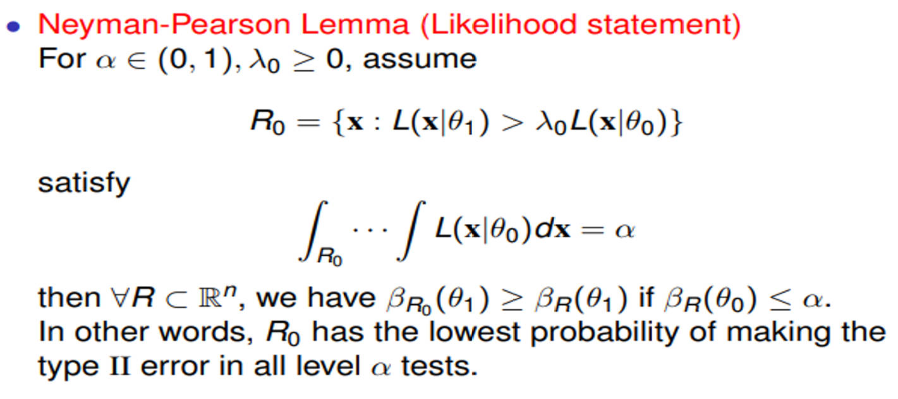

> Most powerful test 也称为 UMP (Unifomly Most Powerful)，ratio 为 $f(x|\theta_1)/ f(x|\theta_0)$，$\theta_0$ 代表原假设，$\theta_1$ 代表备择假设，这一 ratio 衡量了 **拒绝原假设的概率**，$f(x|\theta_1)$ 表示概率密度函数参数为 $\theta_1$ 的情况下，$x$ 落入其中的概率。

The joint density is

$$
f(\boldsymbol{x}|\theta)=\prod_{i=1}^nf(x_i)=\prod_{i=1}^ne^{-(x_i-\theta)}I_{(\theta,\infty)}(x_i)=e^{-\sum_{i=1}^n(x_i-\theta)}I_{(\theta,\infty)}(x_{(1)}).
$$

The ratio of pdf is given by 

$$
\frac{f(\boldsymbol{x}|\theta_1)}{f(\boldsymbol{x}|\theta_0)}=e^{n(\theta_1-\theta_0)}\frac{I_{(\theta_1,\infty)}(x_{(1)})}{I_{(\theta_0,\infty)}(x_{(1)})}.
$$

> 根据题目要求，想要拒绝原假设的话，需要这个比值尽可能地大，因为是一个 indicator function，所以要尽可能取 1，只需要 $x_1$ 尽可能大，大于 $\theta_1$ 即可。

Accoding to the Neyman-Pearson Lemma, the most powerful test rejects $H_0$ iff the ratio is big which is equivalent to $x_{(1)}$ being big. Therefore, the most powerful test rejects $H_0$ iff $x_{(1)}$ is bigger than some constant $c$.

(b) For a specified $\alpha \in (0,1)$, find the constant $c$ so that the size of the test in (a) is $\alpha$.

To satisfy $P_{\theta_0}(X_(1) >c) = \alpha $, we cauculate

> $P_{\theta_0}(X_(1) >c) = \alpha $ 表示的是在 $\theta_0$ 成立的情况下，落入拒绝域的概率。

$$
c=\theta_0-\frac{\log\alpha}{n}.
$$

Setting this euqal to $\alpha$ and solving gives

$$
c = \theta_0 - \frac{\log \alpha}{n}
$$

(c) Under (a) and (b), calculate the power. What happens to the power function as $n \rightarrow \infty$?

> power function 指的就是在两种情况下分别落入拒绝域的概率。$\theta_0$ 成立的情况在 (b) 中已经说过了。
>
> Specially, $\theta_0$ 成立的情况对应的是 **Type I error**，$\theta_1$ 对应的是 **1 - Type II error**。

$$
\beta(\theta)=P_{\theta_1}(X_{(1)}>c)=e^{-n\max\{c-\theta_1,0\}}=\min\{1,\alpha e^{-n(\theta_0-\theta_1)}\}.
$$

Since $\theta_1 > \theta_0$, the second term in the minimum tends to $\infty$ as $n \rightarrow \infty$. Therefore, the power is converging to 1 as $n \rightarrow \infty$.

16. Suppose $X$ is one observation from a population with $\text{Beta} (\theta,1)$ whose pdf is $f(x|\theta)$. The pdf of $\text{Beta}(\alpha, \beta)$ distribution is given by 

$$
f(x|\alpha,\beta)=\frac{\Gamma(\alpha+\beta)}{\Gamma(\alpha)\Gamma(\beta)}x^{\alpha-1}(1-x)^{\beta-1},0\leq x\leq1,\alpha>0,\beta>0
$$

with $\Gamma(\alpha +1) = \alpha \Gamma(\alpha) $ and $\Gamma(n)=n !$.

(a) For testing $H_0: \theta \leq 1$ versus $H_1: \theta >1$, find the size and the power function of the test that rejects $H_0$ if $X > \frac{1}{2}$.

The power function of the test is 

$$
\beta(\theta)=P(X>\frac{1}{2})=\int_{1/2}^1\frac{\Gamma(\theta+1)}{\Gamma(\theta)\Gamma(1)}x^{\theta-1}(1-x)^0dx=1-\frac{1}{2^\theta}.
$$

thus the size is $\sup_{\theta\in H_0}\beta(\theta)=\sup_{\theta\leq1}(1-1/2^\theta)=1-\frac{1}{2}=\frac{1}{2}.$

> 此处要取 $\beta_{\theta}$ 的最大值，含义是最大犯 Type I error 的概率也要小于 $\alpha$。

(b) Find the most powerful level $\alpha$ test of $H_0 : \theta  = 1$ versus $H_1: \theta =2$.

By Neyman-Pearson Lemma, consider

$$
\frac{f(x|2)}{f(x|1)}=\frac{\frac{\Gamma(3)}{\Gamma(2)\Gamma(1)}x^{2-1}(1-x)^{1-1}}{\frac{\Gamma(2)}{\Gamma(1)\Gamma(1)}x^{1-1}(1-x)^{1-1}}=\frac{\Gamma(3)}{\Gamma(2)\Gamma(1)}x=2x>k,
$$

for some $k$. Thus the most powerful test is reject $H_0$ when $X > k/2$. And 

$$
\alpha=\sup_{\theta\in\Theta_0}\beta(\theta)=\beta(1)=\int_{k/2}^1f_X(x|1)dx=\int_{k/2}^1\frac{\Gamma(2)}{\Gamma(1)\Gamma(1)}x^{1-1}(1-x)^{1-1}dx=1-\frac{k}{2}.
$$

So the most powerful $\alpha$ level test is reject $H_0$ if $X > 1 - \alpha$.

(c) Is there a UMP test of $H_0 : \theta \leq 1$ versus $H_1 : \theta >1$? If so, find it. If not, prove so.

> [!TIP]
> 在原假设和备择假设不为点估计的情况下，一般不存在 UMP，但是在特殊情况下，仍然可以找到 UMP。

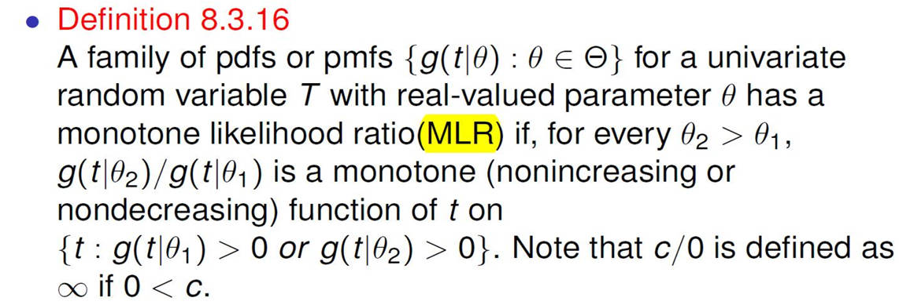

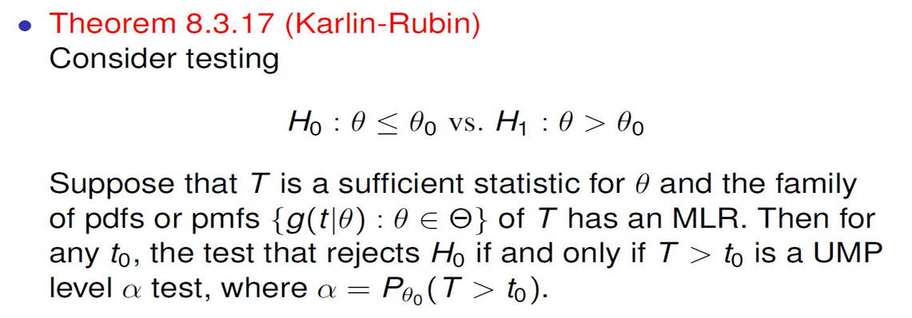

Since 

$$
\frac{f(x|\theta_2)}{f(x|\theta_1)}=\frac{\theta_2}{\theta_1}x^{\theta_2-\theta_1}=h(x),
$$

$h(x)$ is an increasing function of $x$ if $\theta_2 > \theta_1$. Therefore, $f(x|\theta)$ is a MLR family. Also, $X$ is a sufficient statistics because its pdf $f(x|\theta)$ is distributed as exponential family.

Then by Karlin-Rubin Theorem, the test is the UMP level $\alpha$ test by rejecting $H_0 : X > 1 - \alpha$.

$$
\alpha = \beta_{\theta} = P_{\theta_0}( X > t_0) = \int_{t_0}^1 f_X(x|1) dx = 1 - t_0
$$

thus $ X > t_0 = X > 1 - \alpha$.

17. (Chapter 6-8). Let $X_1, \cdots, X_n$ be an iid sample from $N(\mu,1)$ with an unkonwn $\mu$. Suppose that one does not record the values of $X_1, \cdots, X_n$ in a study and instead only records $Y_i = I(X_i > 0)$ for $i = 1,\cdots,n$.

(a) Find the MLE of $\mu$ based on the observed data, $\mathbf{Y} = (Y_1,\cdots, Y_n) $

> [!TIP]
> 伯努利分布的 pdf
$$
P(y) = p^y (1-p)^{1-y}
$$
> and $EY = p, Var(Y) = p(1-p)$
> 
> 这一题需要通过反函数来求解。

$Y_i$ follows $Bernoulli(p)$ with $p = P(X_i > 0) = P(X_i - \mu > -\mu)= 1 - \Phi(-\mu) = \Phi(\mu) $, where $\Phi(\cdot)$ is the CDF of $N(0,1)$. Then $\hat{p}_{MLE} = \bar{Y}$ and $\hat{\mu}_{MLE} = \Phi^{-1}(\bar{Y})$.

(b) Prove or disprove that $\sum_{i=1}^n Y_i $ is a complete sufficient statistic for $\mu$.

> 根据指数族的定理，这里我们只需要证明 Bernoulli 是指数族就可以了。

Since $Y_i \sim Bernoulli(p) $, which is an exponential family with $w = \log (\frac{p}{1-p})$ for $0<p<1$ and $t(x)=x$, given by

$$
f(y|p)=p^y(1-p)^{1-y}=(1-p)\left(\frac{p}{1-p}\right)^y=(1-p)\exp\left(\log\left(\frac{p}{1-p}\right)y\right).
$$

Thus, $T = \sum_{i=1}^{n} Y_i $ is sufficient and complete for $p$.

(c) Use the observed data $\mathbf{Y}$ to construct a level-$\alpha$ uniformly most powerful (UMP) test for testing 

$$
H_0: \mu \leq \mu_0 \quad vs. \quad H_1: \mu > \mu_0
$$

Please describe the form of the rejection region in terms of $\mathbf{Y}$, and give a normal approximation to this rejection region.

The sufficient $T$, we have 

$$
\frac{f\left(T\mid\mu_2\right)}{f\left(T\mid\mu_1\right)}=\left\{\frac{p_2}{p_1}\frac{1-p_1}{1-p_2}\right\}^T\left(\frac{1-p_2}{1-p_1}\right)^n
$$

which is non-decreasing in $T$, has a MLR. Define $p_0 = \Phi(\mu_0)$. By Karlin-Rubin theorem, the size $\alpha$ test is: reject $H_0$ if $T>t_0$, where $t_0$ is chosen such that

$$
P_{p_0}\left(T>t_0\right)=\alpha
$$

Using the normal approximate $T \sim N(np_0, np_0 (1-p_0)) $, then we can get $t_0 = np_0 + z_{\alpha}\sqrt{np_0 (1-p_0)} $.

$$
P(T > t_0) = \alpha \Rightarrow P(\frac{T-\mu}{\sigma} > \frac{t_0 - \mu}{\sigma}) = z_{\alpha}
$$

thus $\frac{t_0 - \mu}{\sigma} = z_{\alpha} $.

18. (Chapter 9) Let $X_1, \cdots, X_n$ be iid $f(x|\theta)=\frac{\theta}{x^2},x\geq\theta.$

(a) Find the MLE of $\theta$, denoted by $Y$.

$$
L(\mathbf{x},\theta) = \prod_i \frac{\theta}{x^2} I_{(\theta, \infty)}(x_i) = \frac{\theta^n}{\prod_i x_i^2} I_{(\theta, \infty)}(x_i) = \frac{\theta^n}{\prod_i x_i^2} I_{(\theta, \infty)}(x_i)
$$

then the MLE of $\theta$ is $Y = \min_i X_i = X_{(1)} $.

(b) Prove that $Y/\theta$ is a pivotal quantity

> [!TIP]
> **Pivotal quantity**. A random variable $Q(\mathbf{X}|\theta)=Q(X_1,X_2,\ldots,X_n|\theta)$ is a pivotal quantity (or pivot) if the distribution $Q(\mathbf{X}|\theta)$ is indenpendent of all parameters. That is, if $\mathbf{X}\sim F(\mathbf{X}|\theta) $, then $Q(\mathbf{X}|\theta)$ has the same distribution for all values of $\theta$.
>
> 也可以理解为 $X$ 与 $\theta$ 有关，但是 $X$ 的分布与 $\theta$ 无关。

$$
F(x)  = P(X < x) = \int_{\theta}^{x} \frac{\theta}{t^2} dt = 1 - \frac{\theta}{x}, \theta < x
$$

Hence, the cdf of $Y$ is

$$
F(y)=1-[1-F(y)]^n=1-(\frac{\theta}{y})^n.
$$

The pdf of $Y$ is 

$$
f(y)=n\theta^n/y^{n+1},
$$

Let $Z = \frac{Y}{\theta}$, then the pdf of $Z$ is 

$$
f_Z(z)=n\frac{\theta^n}{(z\theta)^{n+1}}\theta=nz^{-(n+1)},\quad 1<z
$$

which does not depend on $\theta$. Therefore, $Z = Y/ \theta$ is pivotal quantity.

(c) Show that the interval

$$
\{\theta:\frac{y}{\alpha^{-1/n}}\leq\theta\leq y\}
$$

is the shortest $1 - \alpha$ pivotal interval.

> 对于正态分布来说，有许多 interval 都可以实现例如 95% 的置信水平，但是最短的那一个就是沿中央对称的那一个。
>
> 此题需要通过 $a ,b$ 之间的关系求解。

Let $1 \leq a < b < + \infty$ be the constants (Note： $Z= Y / \theta > 1$) such that

$$
1-\alpha=P(a\leq Z\leq b)=P(a\leq Y/\theta\leq b).
$$

This leads to a $(1 - \alpha)$ confidence interval of $\theta$ as $\{\theta:y/b\leq\theta\leq y/a\}$. The size of the above CI is $\frac{1}{a} - \frac{1}{b}$. 

Treat $b = b(a)$ as a function of $a$. To find the shortest $1 - \alpha$ interval, we need to solve the following constrained minimization problem: minimize, with respect to $a$, the term $h(a) = \frac{1}{a} - \frac{1}{b(a)}$, subject to 

$$
\int_a^{b(a)}f_Z(z)dz=1-\alpha
$$

By leibnitz's rule, taking the derivative of the above equation leads to 

$$
\frac{db}{da}f_Z(b)-f_Z(a)=0,
$$

that is, 

$$
\frac{db}{da}=\frac{f_Z(a)}{f_Z(b)}=\frac{b^{n+1}}{a^{n+1}}.
$$

Applying the above result to the derivative of $h(a)$ leads to 

$$
\frac{d}{da}h(a)=-\frac{1}{a^2}+\frac{1}{b^2}\frac{db}{da}=\frac{1}{a^2}((\frac{b}{a})^{n-1}-1)>0,\quad b>a.
$$

Now since the size of the interval, $h(a)$, is a monotone increasing function of $a$, the shortest interval achieves on its left side. This implies that $a = 1$ and further

$$
\int_1^bf(z)dz=1-\alpha\Rightarrow b=\alpha^{-1/n}.
$$

Therefore, the interval $\{\theta:\frac{y}{\alpha^{-1/n}}\leq\theta\leq y\}$ is the shortest $1 - \alpha$ pivotal interval.

19. (Chapter 9). Let $X$ be a single observation from the $beta(\theta,1)$ pdf.

(a) Let $Y = -(\log X)^{-1}$. Evaluate the confidence coefficient of the set $[y/2,y]$

For $Y = -(\log X)^{-1} $, the pdf of $Y$ is $f_Y(y)=\frac{\theta}{y^2}e^{-\theta/y},0<y<\infty,$

$$
P(y/2<\theta<y)=\int_\theta^{2\theta}\frac{\theta}{y^2}e^{-\theta/y}dy=\left.e^{-\theta/y}\right|_\theta^{2\theta}=0.239
$$

(b) Find a pivotal quantity and use it to set up a confidence interval having the same confidence coefficient as the interval in part (a)

Since $f_X(\theta)=\theta x^{\theta-1},0<x<1,T=X^\theta(\theta>0)$ is a good guess at a pivot, and it is since $f_T(t)=1,0<t<1.$

$$
\theta \log x = \log T \Rightarrow \log x = \frac{\log T}{\theta} \Rightarrow x = e^{\frac{\log T}{\theta}} \Rightarrow \frac{dx}{dT} = \frac{1}{T \theta} e^{\frac{\log T}{\theta}}
$$

thus 

$$
\begin{aligned}
f(T) &= \theta (e^{\frac{\log T}{\theta}})^{\theta - 1} \frac{1}{T \theta} e^{\frac{\log T}{\theta}} \\
&= \theta e^{\log T} \frac{1}{T \theta} \\
&= 1
\end{aligned}
$$

Thus a pivotal interval is formed from $P(a<X^\theta<b)=b-a$. Since $X^{\theta} \sim uniform (0,1) $, the interval will have confidence 0.239 as long as $b-a = 0.239$.

(c) Compare the two confidence intervals.

> 这里找的并不是 $T$ 的区间，而是 $\theta$ 的区间

To find the best interval, we minimize $\log b - \log a$ subject to $b - a = 1 - \alpha$, or $b = 1 - \alpha + a$. Thus we want to minimize $\log (1 - \alpha + a) - \log a = \log (1+ \frac{1-\alpha}{\alpha})$, which is minimized by taking $a$ as big as possible. Thus, take $b=1$ and $a = \alpha$, and the best $1 - \alpha$ pivotal interval is $\{\theta:0\leq\theta\leq\frac{\log\alpha}{\log x}\}$. Thus the interval in part (a) is nonoptimal. A shorter interval with confidence coefficient $0.239 (b -a =1-\alpha)$ is $\{\theta:0\leq\theta\leq\log(1-0.239)/\log(x)\}.$

