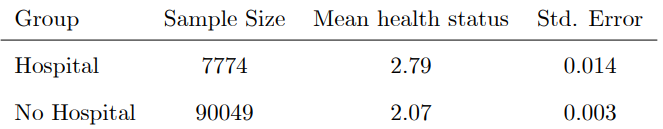

# Mostly Harmless Econometrics: An Empiricistís Companion

Angrist J D, Pischke J S. Princeton university press, 2009.

## I Introduction

### Question about *Questions* 

有关research agenda的四个问题，能够帮助我们建立分析问题的逻辑

1. **What is the causal relationship of interest?** 

因果关系是研究中最有趣的部分，而当因果关系明了后，能够帮助我们做出决策。

2. **What is the experiment that could ideally be used to capture the causal effect of interest?**

想象一个理想的实验环境，没有资金限制、伦理约束等等，然后设计实验。尽管这种假设是不成立的，但却有助于问题的梳理。

如果在一个完美的、各项条件都符合的环境里仍然不能设计出实验，那么在现实中也基本不可能得到有用的结论。

> [!NOTE|label:Fundamentally Unidentified Questions]
> 不能被任何实验设计回答的问题称之为FUQ，因为这些东西无法控制，例如性别、种族。

另外有些情况下，靠想象也不能解决所有问题。

现在有一个研究问题：**晚入学是否会影响学生成绩表现？**

一个自然而然的想法是，**找一个六岁入学的孩子和七岁入学的孩子**，对比他们的成绩。然而，这引起了**maturation**的问题，因为7岁入学的孩子年龄更大，而年龄更大的孩子各方面发育更成熟，所以更可能获得好成绩，这与入学的时间早晚没有关系，而仅仅是生理成熟引起的。

另外一种思路是，不再固定年级一样，而是固定年龄。找到**两个同样是7岁，但一个上二年级，一个上一年级**，对比他们的成绩。可是这仍然引发了问题，因为上二年级的孩子在学校里多呆了一年，因此任何在学校里的其他因素都有可能改变最终结果。

3. **what is your identification strategy?**

identification strategy是指通过使用可观测数据来模拟真实实验的方式。

4. **what is your mode of statistical inference?**

这个问题涉及到总体、样本以及假设。有时统计推断很简单，但有时受限于数据，又会变得很复杂。下文介绍了我们处理问题4时会遇到的问题。

### The Experimental Ideal

最可信的研究就是随机试验。然而，有时候试验会被**选择性偏误**【selection bias】所干扰。下面通过一个经典例子来解释这一概念。

#### Selection bias <!-- {docsify-ignore} -->

**去医院会让人变得健康吗**

对于这个问题，我们可以选取去医院接受治疗的样本和不去医院的样本，然后对比健康情况，得到数据如下：

可以看出去医院使得健康水平下降了，这也许是一个正确的答案，因为医院很多病人可能会传染我们，并且有些药的副作用可能会伤害我们。

但实际上，更严重的问题是：**只有有病的人才会去医院，没去医院的人说明健康水平本身就会比较高**。

下面通过公式来更加精准的描述这一问题：

设置去医院接受治疗的变量为 $D_i = \{ 0,1 \} $，1代表去医院接受治疗，0代表没去。健康状态变量为 $Y_i$，问题的关键就是 $Y_i$ 是否会被治疗影响，而这应该由以下公式表达：

$$\begin{align}
Y_i &=  
\begin{cases}
    Y_{1i} \text{ if } D_i=1 \\
    Y_{0i} \text{ if } D_i=0 
\end{cases}
\\
&= Y_{0i}+(Y_{1i}-Y_{0i}) D_i \label{2} 
\end{align}
$$

上述公式含义为，对于**同一个人**，如果这个人没去医院的健康水平，和这个人去了医院之后的健康水平。然而在现实情况中，不存在一个人既去医院又不去医院的完美对照组，所以我们必须试图构建接近完美对照组的实验样本。

在从个人到样本的过程中，选择性偏误出现了。在上述数据样本中我们观测到的是：
$$\begin{align}
\underbrace{E[Y_{i}|D_i=1] - E[Y_{i}|D_i=0]}_{Observed \ difference\ in\ average\ health} &= E[Y_{1i}|D_i=1] - E[Y_{0i}|D_i=0] \\
&= \underbrace{E[Y_{1i}|D_i=1] - E[Y_{0i}|D_i=1]}_{average\ treatment\ effect\ on\ the\ treated} \\
&+ \underbrace{E[Y_{0i}|D_i=1] - E[Y_{0i}|D_i=0]}_{selection\ bias}
\end{align}$$

真正对我们结论有帮助的是第一项：
$$
E[Y_{1i}|D_i=1] - E[Y_{0i}|D_i=1]
$$

可以理解为**样本去医院接受【有效】治疗后的平均健康水平，和样本去医院接受【无效（安慰剂）】治疗的平均健康水平差别**。这样才能在病人群体中构建最接近完美的对照组。

但是在实际情况中，从观测数据中很难剥离出 treatment effect，会受到选择性偏误的影响。当选择性偏误足够大，就会影响观测数据的结果。

#### Random assignment <!-- {docsify-ignore} -->

通过随机试验可以解决这一问题，因为随机分配 $ D_i $ 使得 $ D_i $ 与 $ Y_i $ 无关，从而消除选择性偏误，从公式上直观来看：
$$ \begin{equation}
\underbrace{E[Y_{0i}|D_i=1] - E[Y_{0i}|D_i=0]}_{selection\ bias} = E[Y_{0i}] - E[Y_{0i}] = 0
\end{equation}$$
通过随机，不仅选择性偏误得到缓解，因果效应也得到进一步简化：
$$ \begin{align}
E[Y_{i}|D_i=1] - E[Y_{i}|D_i=0] &= E[Y_{1i}|D_i=1] - E[Y_{0i}|D_i=1] \\
&= E[Y_{1i}] - E[Y_{0i}]
\end{align}$$

也就是说：通过随机抽取样本分配治疗，**直接观测样本健康的水平差别**，就可得到医院治疗带来的影响。

> [!ATTENTION]
> 这并不代表随机试验是problem-free，但是足已解决很多问题。

#### Regression Analysis of Experiments <!-- {docsify-ignore} -->
假设treatment effect对所有人一样，则式 $\eqref{2}$ 可以被重写为：

$$\begin{equation}
Y_i = \underset{E(Y_{0i})}{\underset{\lVert}{\alpha}}  + \underset{(Y_{1i}-Y_{0i})}{\underset{\lVert}{\rho}}  \ D_i +  \underset{Y_{0i}-E(Y_{0i})}{\underset{\lVert}{\eta_i}}  \label{7}
\end{equation}
$$

则式 $\eqref{7}$ 的条件期望为：

$$\begin{aligned}
E[Y_i|D_i=1] &= \alpha+\rho+E[\eta_i|D_i=1] \\
E[Y_i|D_i=0] &= \alpha+E[\eta_i|D_i=0]
\end{aligned}
$$

所以：
$$
E[Y_i|D_i=1]-E[Y_i|D_i=0] = \rho+\underbrace{E[\eta_i|D_i=1]-E[\eta_i|D_i=0]}_{selection\ bias}
$$

在没有选择性偏误【随机试验】的情况下，回归系数 $\rho$ 项就是我们想要的treatment effect。这说明了回归对于实验数据有很好的解释能力。

## II The Core

### Making Regression Make Sense

### Instrumental Variables in Action: Sometimes You Get What You Need

### Parallel Worlds: Fixed Effects, Differences-in-differences, and Panel Data 

## III Extensions

