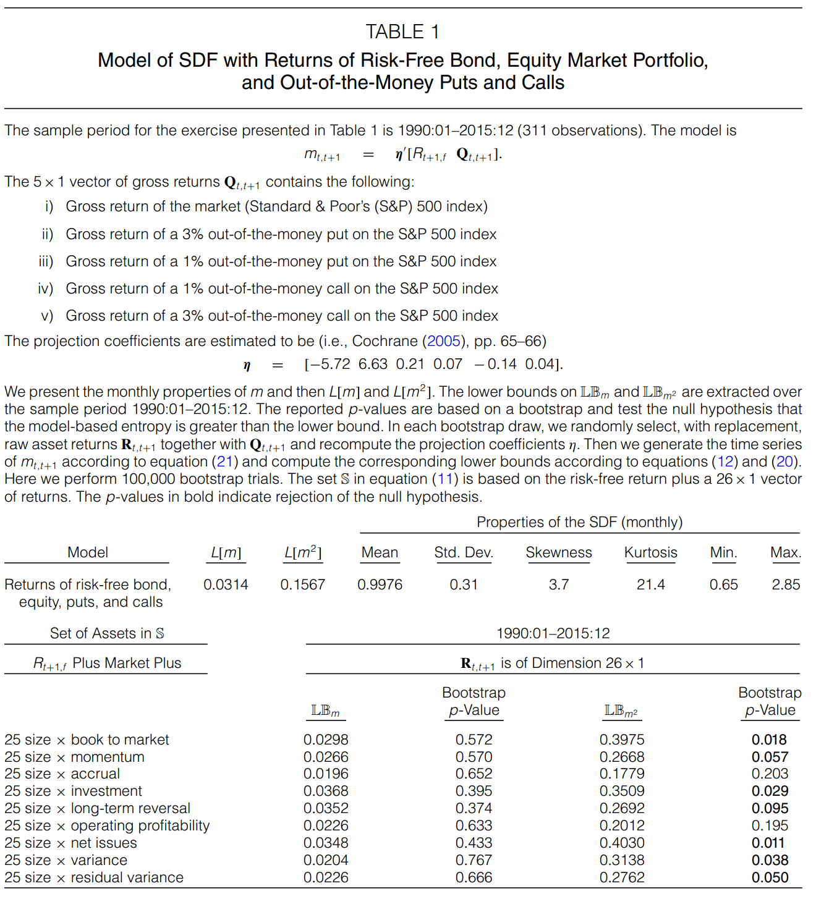
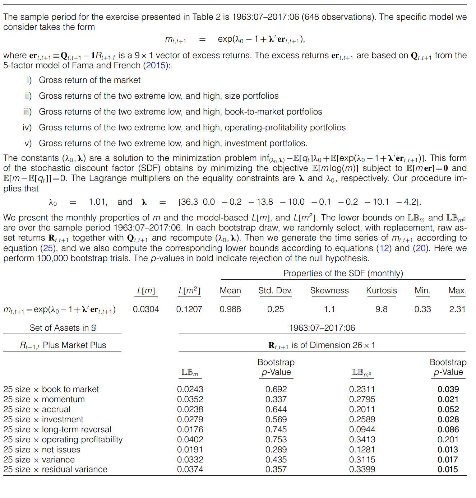
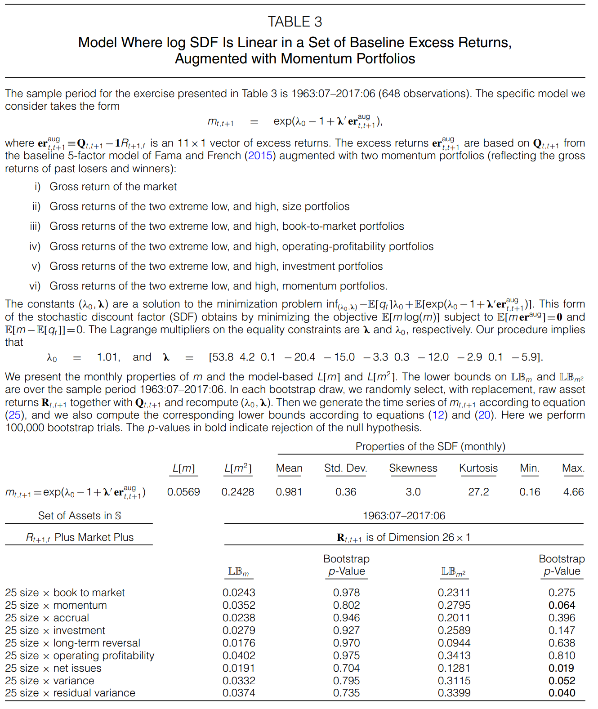
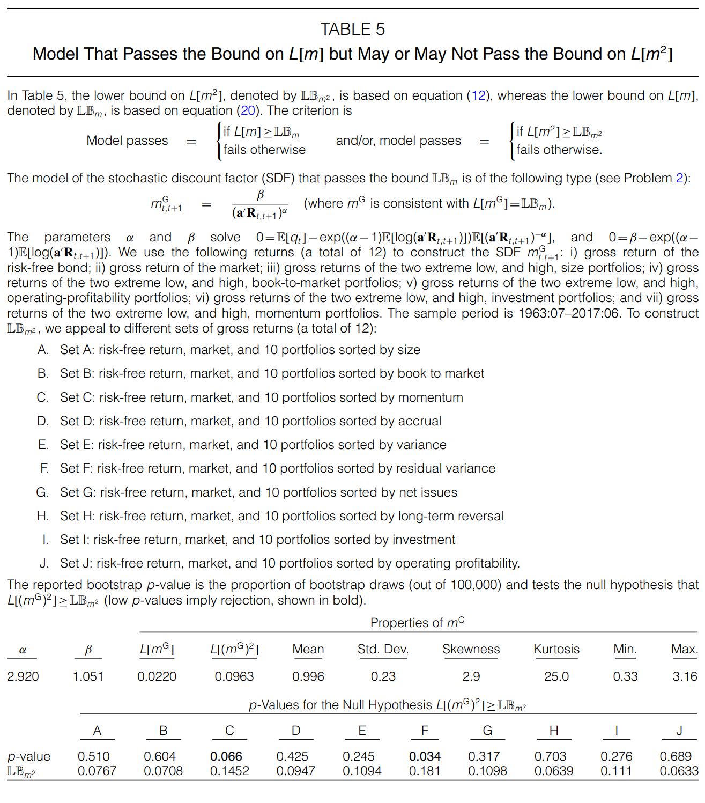

<!-- @import "[TOC]" {cmd="toc" depthFrom=1 depthTo=6 orderedList=false} -->

<!-- code_chunk_output -->

- [1. Preview of Hansen Jagannathan Bound](#1-preview-of-hansen-jagannathan-bound)
  - [1.1 Why Hansen Jagannathan Bound?](#11-why-hansen-jagannathan-bound)
  - [1.2 How to get?](#12-how-to-get)
  - [1.3 Flaws](#13-flaws)
    - [1.3.1 Conditional or unconditional?](#131-conditional-or-unconditional)
- [2. Introduction of entropy](#2-introduction-of-entropy)
  - [2.1 From relative entropy and probability](#21-from-relative-entropy-and-probability)
  - [2.2 From a unified form of volatility](#22-from-a-unified-form-of-volatility)
    - [2.2.1 Generalization of variance](#221-generalization-of-variance)
      - [2.2.1.1 Advantages](#2211-advantages)
  - [2.3 Exploration for entropy $ L(m) $](#23-exploration-for-entropy--lm-)
    - [2.3.1 A unified form](#231-a-unified-form)
    - [2.3.2 Entropy Spectrum](#232-entropy-spectrum)
- [3. Empirical results for source of entropy](#3-empirical-results-for-source-of-entropy)
  - [3.1 Derivation and Details](#31-derivation-and-details)
    - [3.1.1 Entropy](#311-entropy)
    - [3.1.2 Horizon Dependence](#312-horizon-dependence)
    - [3.1.3 Choose the benchmark](#313-choose-the-benchmark)
  - [3.2 Representative Agent Models](#32-representative-agent-models)
    - [3.2.1 SDF Case](#321-sdf-case)
      - [3.2.2 LogLinear Case](#322-loglinear-case)
      - [3.2.3 A unified form](#323-a-unified-form)
      - [3.2.4 Philosophical insights](#324-philosophical-insights)
  - [3.3 Empirical Results](#33-empirical-results)
    - [3.3.1 Vasicek model](#331-vasicek-model)
      - [3.3.1.1 The values for vasicek](#3311-the-values-for-vasicek)
    - [3.3.2 Flaws for models](#332-flaws-for-models)
- [4. Empirical Results for New Restrictions](#4-empirical-results-for-new-restrictions)
  - [4.1 Rationale for $ L(m^2) $](#41-rationale-for--lm2-)
    - [4.1.1 Lower entropy bound](#411-lower-entropy-bound)
    - [4.1.2 Economic Interpretation](#412-economic-interpretation)
  - [4.2 Empirical Results](#42-empirical-results)
    - [4.2.1 class one](#421-class-one)
    - [4.2.2 class two](#422-class-two)
    - [4.2.3 class three](#423-class-three)

<!-- /code_chunk_output -->

# 1. Preview of Hansen Jagannathan Bound
> *Cochrane J H, Hansen L P. Asset pricing explorations for macroeconomics[J]. **NBER macroeconomics annual**, 1992, 7: 115-165.*
## 1.1 Why Hansen Jagannathan Bound?
***Asset market data are often ignored in evaluating macroeconomic models, and aggregate quantity data are often avoided in empirical investigations of asset market returns***. While there may be short-term benefits to proceeding along separate lines, we argue that security market data are among the most sensitive and, hence, attractive proving grounds for models of the aggregate economy. 

***Not only can security data be informative for macroeconomic modeling, but macroeconomic modeling should be also valuable in interpreting the cross-sectional and time-series behavior of asset returns.***

A large body of empirical work on asset pricing aims ***simply at reducing*** asset valuation to the pricing of a relatively small number of "factors," ***without explicit reference to the fundamental sources of risk***. While these dimensionality-reduction exercises can be quite useful in some contexts, it is difficult, if not impossible, to evaluate the significance of apparent asset-pricing anomalies without specifying an underlying valuation model that ties asset prices to fundamental features of the underlying economic environment, that is, without using some dynamic economic model.

## 1.2 How to get?
**Simplest version.**

We study a regression of a discount factor $ m $ onto a constant and the vector $ x $ of asset payoffs observed by an econometrician:
$$ m = a+x'b + e $$

where $ a $ is a constant term, $ b $ is a vector of slope coefficients, and $ e $ is the regression error. The standard least-squares formula for the regression coefficients gives:
$$\begin{aligned}
b &\equiv [cov(x,x)]^{-1}cov(x,m) \\
a &\equiv Em - Ex'b
\end{aligned}$$

Without **direct data on the stochastic discount factor** $ m $, these regression coefficients cannot be estimated in the usual fashion. Instead, we can exploit the fact that $ y $ must be a valid discount factor to infer them. The pricing relation q = E(mx) implies:
$$ cov(x,m) = q - E(m)E(x) $$

After substitution, we obtain:
$$ b = [cov(x,x)]^{-1}[q-E(m)E(x)] $$

***Hence, asset information alone can be used to construct the regression coefficients $b$, given $E(m)$.***

Because the right-hand side variables of a regression are **uncorrelated with residuals** by construction:
$$ var(m) = var(x'b) + var(e) $$

It follows that $var(x'b)^{1/2}$ gives a lower bound on the standard deviation of $m$. Thus, **we have a lower bound on the standard deviation of all admissible stochastic discount factors** y in J with the pre-specified mean, $Em$.

If there is no real risk-free interest rate. As a consequence, the price of a unit payoff is not known, and $Em$ cannot be inferred from the asset market data. Instead, **we must calculate the lower bound on the standard deviation of $m$ for each possible value of the mean**. This computation leads to the **lower envelope** of the set of means and standard deviations of admissible discount factors.

## 1.3 Flaws
- The restriction on SDF derived in Hansen and Jagannathan(1991) all pertain to ==***first and second moments***==. (**Author**)  
- Suppose some clever economist does discover nonlinear transformation of the aggregate consumption series that plots in the Hansen-Jagannathan feasible region fro discount factors. Does this mean we should adopt the corresponding model of utility?(**Campbell 1**)
- This paper takes the second moment of realized returns as given, rather than as something to be explained. But to a macroeconomist, it is more natural to think of realized returns as endogenous, determined along with other variables.(**Campbell 2**)
- Although there are no ***false positives*** in the Hansen-Jagannathan diagnostic tests, there are ***false negatives*** which is very prominent in the habit formation model.(**Philippe Weil 1**)
- Because its very **theoretical agnosticism**, the Hansen-Jagannathan framework in itself ***offers very few insights*** as to why specific models pass or fail the Hansen-Jagannathan tests.(**Philippe Weil 2**)

### 1.3.1 Conditional or unconditional?
>*Incomplete market models and subsistence level models may perform adequately in terms of the **unconditional bounds** on the stochastic discount factor. However, as emphasized in the paper, **unconditional bounds represent only one of many possible moment restrictions**. With respect to the bounds on the **conditional moments**, these models are unlikely to perform as well.*

# 2. Introduction of entropy
## 2.1 From relative entropy and probability
**The distinction between true and risk-adjusted(risk neutral) probabilities** is central to asset pricing. The relative entropy of the risk-adjusted distribution is then 

$$\begin{aligned}
L_t({p_{t,t+n}^\star}/{p_{t,t+n}}) =& \sum_{n=1}^n{p_{t,t+n}}log({p_{t,t+n}/p_{t,t+n}^\star}) \\
=& -E_t(log({p_{t,t+n}^\star/p_{t,t+n}}))
\end{aligned}$$   

$$
 with \quad E_t({p_{t,t+n}^\star/p_{t,t+n}}) = 1 \\
\Longrightarrow L_t({p_{t,t+n}^\star}/{p_{t,t+n}}) = log(E_t({p_{t,t+n}^\star/p_{t,t+n}}))  -E_t(log({p_{t,t+n}^\star/p_{t,t+n}})) 
$$  

$$
 with\quad {{p_{t,t+n}^\star \over p_{t,t+n}}} = {m_{t+n} \over {E_t^p}(m_{t+n})} \\
\Longrightarrow  L_t(m_{t,t+n}) = log E_t m_{t,t+n}-E_t log m_{t,t+n} 
$$  

Take unconditional expectation
$$\Longrightarrow  E(L_t(m_{t,t+n})) = E(log E_t m_{t,t+n})-E log m_{t,t+n} $$ 

Scale this by horizon n, and we get the so-called ***entropy*** in the article:
$$ I(n) = n^{-1}E L_t (m_{t,t+n}) $$  

## 2.2 From a unified form of volatility
### 2.2.1 Generalization of variance
Jensen's gap, applied to ***convex function***:

$$\begin{aligned}
L[m] &= E[f(m)] - f(E[m]) \\
f(m) &= -log(m) \qquad entropy \; measure \\
f(m) &= m^2 \qquad \qquad variance \; measure 
\end{aligned}$$

!!! +  ==$ L(m)\geq 0 $  can be used as a *loss function*==

#### 2.2.1.1 Advantages

1. Entropy contains ***higher moments information*** which is the whole point.
2. Entropy extends more easily to ***multiple periods*** than standard deviation
3. ***Easy computation***. Many popular asset pricing models are loglinear, or nearly so. Logarithmic measures are conveniently computed for them.

## 2.3 Exploration for entropy $ L(m) $
### 2.3.1 A unified form
***Cumulant generating function***

The relation between one-period entropy and the conditional distribution of $logm_{t,t+1}$ is captured by its **cumulant generating function and cumulants**. 

$ k(s) $ is **cumulant generating function**:
$$\begin{aligned}
k(s) &= logE(e^{s w_t}) \\
&= \sum_{i=1}^{\infty}\kappa_{j,t} s^j /j!
\end{aligned}  $$

The cumulant $ \kappa_{j,t} $ is the $ j $ th derivative of $ k(s) $ at $ s = 0 $; $ \kappa_{1,t} $ is the mean; $ \kappa_{2,t} $ is the variance; the third and fourth cumulants capture skewness and **excess** kurtosis, respectively.

So then $ \omega_t $ is normal:
$$ k(s) = s^2/2 $$

In general we have
$$
\begin{aligned}
L_t(m_{t,t+1})&=k_t(1)-\kappa_{1t}\\
&=\underbrace{\kappa_{2t}\frac{logm_{t,t+1}}{2!}}_{normal~term}+\underbrace{\kappa_{3t}\frac{logm_{t,t+1}}{3!}+ \cdots}_{nonnormal ~terms}
\end{aligned}\tag{8}
$$

这个通式用以说明熵包括了高阶矩的信息，但在使用过程中我们**并不只是着眼于使用高阶矩**，因为均值和方差也包含了不可忽略的信息，我们是将 $L[m]$ 作为整体使用。

==Taylor Expansion==

Unified form of Jensen's gap, also, ***convex function***:
$$\begin{aligned}
L[m^2] &= E[f(m^2)] - f(E[m^2]) \\
f(m) &= -log(m) 
\end{aligned}$$

Taylor Expansion of $ e^{log(m^n)} $ around $ E[nlog(m)] $:
$$\begin{aligned}
e^{log(m^n)} = e^{nE[log(m)]}\{1+n(log(m)-E[log(m)])+{n^2\over 2!}(log(m)-E[log(m)])^2  \\
+{n^3\over 3!}(log(m)-E[log(m)])^3+................\}
\end{aligned}$$  

Take expectation and taking logs on both side:
$$\begin{aligned}
L[m^n] &= log(E[m^n]) - E[log(m^n)] \\
&= log(1+\sum_{j=2}^n {{n^j}\over j!}\mu^{[j]}_{log(m)})\\
where \qquad \mu^{[j]}_{log(m)} &=  E[(log(m)-E[log(m)])^j]
\end{aligned}$$ 

**The equation shows that $ L[m^n] $ assigns a bigger weight to each central moment of log(m) than $ L[m] $**

!!! + ==Choose the best n or allocate weights separately== 

### 2.3.2 Entropy Spectrum
From time series perspective, we have two ends of the entropy spectrum, the short end $ I(1) $ which is the essential ingredient of entropy and the long end $ I(\infty) $. The difference between them is **horizon dependence**.

# 3. Empirical results for source of entropy
## 3.1 Derivation and Details
### 3.1.1 Entropy
From above, the definition of entropy 
$$ I(n) = n^{-1}E L_t (m_{t,t+1}) $$

First result, **entropy bound**, connects **one-period** entropy to **one-period** excess return:
$$ I(1) = EL_t(m_{t,t+1}) \geq E(\underbrace{log r_{t,t+1} - log r_{t,t+1}^1}_{excess \; log \; return})$$
where $ r_{t,t+1} $ is the return on a one-period bound. In words, mean excess log return are bounded above by the entropy of pricing kernel.

!!! + Entropy, as a measure of volatility of $ m_{t,t+1} $ 

### 3.1.2 Horizon Dependence
Second result, **Horizon Dependence**, use the behavior of entropy over different time horizons to characterize the **dynamics** of the pricing kernel.

$$\begin{aligned}
H(n) &= I(n) - I(1) \\
&= n^{-1}EL_t(m_{t,t+n}) - EL_t(m_{t,t+1}) \\
&= -E(y_t^n - y_t^1)
\end{aligned}$$

In iid case, $ EL_t(m_{t,t+n}) = nEL_t(m_{t,t+1}) $, so $ H(n) = 0 $, 
This is a generalization of a well-known property of random walks: *the variance is proportional to the time interval*.

In other cases, horizon dependence reflects **departure from the iid case**, and in this sense is a measure of the pricing kernel's dynamics. 

Perhaps the most useful feature of horizon dependence is that it is observable and can be connected to bond yields, ***which give us some insight of its property***.

$ {y^n_t} $ 反映了在n horizons 内定价核的平均定价能力，因此$ H(n) $反映了定价核在n horizons 内的**定价能力变化**。

***【接下来请欣赏抽象粗糙的推导过程，主要为了方便理解。】***

$$ E_{t+1}(m_{t+1,t+2}\underbrace{{R_{t+1,t+2}}}_{f_{t+1}}) = 1 $$

$$ E_{t+1}(m_{t+1,t+2}) = {1\over{f_{t+1}}} $$

$$\begin{aligned}
from \qquad H(n) &= -E(y_t^n - y_t^1) \\
E_{t+1}(m_{t+1,t+2}\underbrace{{R_{t+1,t+2}}}_{f_{t+1}}) &= 1 \\
E_{t+1}(m_{t+1,t+2}) &= {1\over{f_{t+1}}} \\
with \qquad n{y^n_t} &= \sum_{j=1}^n{f_t^{j-1}} \\
y^n_t &= n^{-1}({1\over{E_t(m_1)}}+{1\over{E_{t+1}(m_2)}}+.....{1\over{E_{t+n-2}(m_{n-1})}}) \\
y^1_t &= {1\over{E_t(m_1)}}
\end{aligned}$$

>**Alvarez and Jermann(2005):** '***Prices of long-term bonds are particularly informative about the persistence of pricing kernels because they are the markets forecast of the long-term changes in the pricing kernel***.'

!!! + Horizon Dependence, as a measure of mean of $ m_{t,t+1} $

!!! + Entropy 与 Horizon Dependence用于衡量模型内核是否贴合数据  . *In modern asset pricing theory, a pricing kernel accounts for asset returns. The reverse is also true: asset returns contain information about the pricing kernel that gave rise to them.*

### 3.1.3 Choose the benchmark

* **Entropy**: log excess return is less than 1% 
* **Horizon Dependence**： term spread is more than 0.1%

These properties of returns are estimates. The exact number is not critical, but it is helpful to have ***a clear numerical benchmark***.

## 3.2 Representative Agent Models
### 3.2.1 SDF Case
To explain equity premium or other financial facts, the **macro -finance** literature explored a wide range of alternative preferences and market structure. A sampling with a prominent example of each case:

1. **Habits** (Campbell and Cochrane 1999a, 1999b)
2. **Recursive Utility** (Epstein and Zin 1989)
3. Long run risks (Bansal and Yaron 2004; Bansal, kiku, and Yaron 2012)
4. idiosyncratic risk (Constantinides and Duffie 1996)
5. Heterogenous preference (Garleanu and Panageas 2015)
6. **Rare Disasters** (Reitz 1988; Barro 2006)
7. Utility non separable across goods (Piazzesi, Schneider, and Tuzel 2007)
8. Leverage; balance-sheet; "institutional finance"(Brunnermeier 2009, Krishnamurthy and He2013, many others)
9. Ambiguity aversion, min-max preferences (Hansen and Sargent 2001)
10. Behavioral finance; probability mistakes (Shiller 1981,2014)

These approaches look different, but in the end the ideas are quite similar. ***Each of them boils down to a generalization of marginal utility or discount factor***, most of the same form,
$$ M_{t+1} = \beta ({C_{t+1}\over C_t})^{-\gamma}Y_{t+1} $$

Take logs and we get:
$$ logM_{t+1} = constant - \gamma log g_t + logY_{t+1} $$

***So when we model SDF, we can handle $ g_t $ or $ Y_{t+1} $ , this subsection mostly handles latter, and next subsection handles former.***

For example, habit model:
$$ log h_{t+1} = log h + \eta(B)log c_t $$

#### 3.2.2 LogLinear Case
!!! + LogLinear or numerical solution?
- **Models with Constant Variance**
$$ logg_t = logg + \gamma(B)v^{1/2}w_t $$
where $ \gamma_0 = 1, \sum_j \gamma_j^2 ~<~ \infty $ and innovation $ w_t $ are iid with mean zero, variance one.

- **Models with Stochastic Variance**
$$\begin{aligned}
logg_t &= logg + \gamma(B)v_{t-1}^{1/2}w_t \\
v_t &= v +v(B)w_{vt}
\end{aligned}$$

- **Models with Jumps**

    **Disaster model**
$$\begin{aligned}
logg_t &= logg + \gamma(B)v^{1/2}w_{gt}+\psi(B)z_{gt}-\psi(1)h_{t-1}\theta \\
h_t &= h +\eta(B)w_{ht}
\end{aligned}$$
    > *There is a whole resurgent interest in "**rare disasters**" that I have not covered. Plus, there is a lot of macro/asset pricing literature that is trying to put in various financial frictions at the core of both. Some of this is an attempt to understand the 2008 financial crisis, a worthy subject. **The big question is whether such frictions are important for every day asset pricing.***

#### 3.2.3 A unified form 
**Contains everything**.

$$\begin{aligned} 
log m_{t+1} &= logm+\alpha_g(B)(v_t/v)^{1/2}w_{gt+1}+\alpha_z(B)z_{gt+1}+\alpha_v(B)w_{vt+1}+\alpha_h(B)w_{ht+1} \\
v_t &= v+v(B)w_{vt} \\
h_t &= h+\eta(B)w_{vt}
\end{aligned}$$

#### 3.2.4 Philosophical insights
> **Cochrane J H. Macro-finance[J]. *Review of Finance*, 2017, 21(3): 945-985.** 

**Different microeconomic stories for the *same aggregate* outcomes have different policy implications**.How to choose the best among so many models?

One might distinguish models by which data for Y turn out to work best. But ***most of the candidates are highly correlated with each other*** – most models end up adding a recession state variable, and it is practically a defining feature of recessions that many variables move together – so telling models apart will be hard this way. That fact also means that telling them apart is less important than may seem.

There is some hope in formally testing models – do their moment conditions and cross equation restrictions hold? – and in checking models’ additional assumptions – do conditional moments vary as much and in the way that long-run risk or rare disaster models specify? ***But though most models are easily rejected, those rejections correspond to economically uninteresting moments***. And by ***publication selection bias*** if nothing else, models are cleverly constructed that there auxiliary assumptions are not easily falsified; the variation in moments they require is small, hard to measure, or depends on rare events.

The models also differ in their ***tractability, elegance, and the number and fragility of extra assumptions*** needed to get from theory to central facts. I think it is a ***mistake*** to embrace too quickly a formalistic scientism that ignores these features. In explaining which models become popular throughout economics, tractability, elegance, and parsimony ***matter more than probability values of test statistics***. Economics needs simple tractable models
that help to capture the bewildering number of mechanisms people like to talk about.

There is some wisdom in the joke about ***the drunk who looks for his keys under the light, not in the dark where he lost them***. Black boxes are not convincing. Elegance matters. ***Economic models are more quantitative parables than scientifically precise models, and elegant parables are more convincing***. Models that need an extra assumption for every fact are less convincing than are models that tie several facts together with a small number of assumptions. 

[**not quite understand**]Financial economics is always in danger of being simply an interpretive or poetic discipline: Markets went down, sentiment must have fallen. Markets went down, risk aversion must have risen. Markets went down, there must have been selling pressure. Markets went down, the Gods must be displeased. Models that rejectably tie their central explanations to other data, and cannot ”explain” any event are more convincing.

***Partially answer my question about empirical results.***

## 3.3 Empirical Results
### 3.3.1 Vasicek model 
!!! + Benchmark model

The defined pricing kernel:
$$\begin{aligned}
log m_{t,t+1} &= logm + \sum_{j=0}^{\infty}a_j w_{t+1-j} \\
-f_t^n &= logm + k(A_n) +[a(B)/B^{n+1}]_+ w_t 
\end{aligned}$$
for $ n \geq 0 $ and $ A_n = \sum_{j=0}^n a_j$; the subscript "+" means ignore negative powers of $ B $.

So the mean forward rate and mean yields:
$$\begin{aligned}
with \quad y_t^n &= n^{-1}\sum_{j=1}^n f_t^{j-1} \\
-E(f_t^n) &= logm +k(A_n) \\
-E(y_t^n) &= logm + n^{-1}\sum_{j=1}^n k(A_{j-1})
\end{aligned}$$

With simple manipulation, we can get $ I(n) $:
$$ I(n) = n^{-1}Elogq_t^n - Elogm_{t+1} $$
From vasicek model, we can get:
$$ Elog(m_{t+1}) = logm $$

so:
$$\begin{aligned}
I(n) &= n^{-1}\sum_{j=1}^n k(A_{j-1}) \\
I(1) &= k(A_0) \\
&= a_0^2/2 \\
H(n) &= I(n) - I(1) \\
&= n^{-1}\sum_{j=1}^n [k(A_{j-1}) - k(A_0)]
\end{aligned}$$

In this setting, ***the initial coefficient $ a_0 $ governs one-period entropy and the others ($ a_j $ for $ j \geq 1 $) combine with it to govern horizon dependence.***

#### 3.3.1.1 The values for vasicek
* We make $ logm_{t+1} $ an ARMA(1,1) process, and we need to estimate three parameters ($ a_0,a_1,\varphi $), because $ a_{j+1} = \varphi a_j $ .

* From Chernov and Mueller report, $ \vert a_1 \vert = 0.878 \times 10^{-3} $ , and we set $ \varphi = 0.85 $. And all the parameters we need to estimate is $ a_0 $ .

* Finally, we use the benchmark horizon dependence value to get $ a_0 $ .

### 3.3.2 Flaws for models
我们通过给定bound值，反推出vasicek model参数，也就是说vasicek model是能够刚好满足bound的模型，以及对应的bench 参数值。

对于其余模型，根据现实消费等数据计算模型参数，测试其是否满足bound。

!!! + 为什么这些模型不行呢【参考slides, loglinear 通式】

# 4. Empirical Results for New Restrictions
## 4.1 Rationale for $ L(m^2) $
From above,  $ L[m^2] $ assigns bigger weights to each central moment of $ log(m) $ than $ L[m] $:
$$\begin{aligned}
L[m^n] &= log(E[m^n]) - E[log(m^n)] \\
&= log(1+\sum_{j=2}^n {{n^j}\over j!}\mu^{[j]}_{log(m)})\\
where \qquad \mu^{[j]}_{log(m)} &=  E[(log(m)-E[log(m)])^j]
\end{aligned}$$ 

When $ m $ is **lognormal**, $ L[m^2] = 4L[m] $.

The **link** among the entropy of $ m $ , the entropy of $ m^2 $ and variance of $ m $ :
$$ L[m^2] = 2L[m] + log(1+{var[m]\over (E[m])^2}) $$

When the bounds are not unique, lower bounding the parts in a sum **might not be a proper way** to lower bound the sum in the right-hand side of equation.

>*Suppose you have a function $ K[m]= H[m]+G[m] $. If one could bound the function as $ H[m]>h^\star~and~G[m]>g^\star $, then $ h^\star +g^\star $ can only be a unique lower bound for $ K[m] $ if $ h^\star ~and~ g^\star $ are unique lower bounds*

### 4.1.1 Lower entropy bound
Under the SDF set:
$$
S=\{m_{t,t+1}>0: E[m_{t,t+1}]=E[q_t]~and~E[m_{t,t+1}R_{t,t+1}]=1\}
$$

We have
$$
\begin{aligned}
L[m^2] ~&~\geq LB_{m^2} \equiv\\
&2 \left( E \left[ log \left(\frac{(1 - E[q_t]E[R_{t,t+1}] )'\Sigma^{-1}}{1'\Sigma^{-1} (1 - E[q_t]E[R_{t,t+1}])} R_{t,t+1} \right) \right] - log((E[q_t])^{-1}) \right)\\
&+ log(1 + (1 - E[q_t]E[R_{t,t+1}])'\Sigma^{-1} (1 - E[q_t]E[R_{t,t+1}])/(E[q_t])^2 )
\end{aligned}
$$
with :
$$
a \equiv \underbrace{\frac{\Sigma^{-1}(1-E[q_t]E[R_{t,t+1}])}{1'\Sigma^{-1}(1-E[q_t]E[R_{t,t+1}])}}_{{\equiv \bf{y}}}
$$
and through Taylor Expansion, finally we get:

$$
\begin{aligned}
LB_{m^2}=& 2{log(E[a'R_{t,t+1}])-log((E[q_t])^{-1})}\\
&+log(1+y'\Sigma y/(E[q_t]^2))\\
&+2\Sigma^\infty_{i=1}\frac{(-1)^{1+i}}{i}\frac{E[(a'R_{t,t+1}-E[a'R_{t,t+1}])^i]}{(E[a'R_{t,t+1}])^i}
\end{aligned}
$$

!!! + *which is computable from the time-series of asset returns*

For $ LB_m $ :

$$ L[m] \; \geq \; LB_m \; \equiv \; E[log(a'R_{t,t+1})] - log((E[q_t])^{-1}) $$ 

### 4.1.2 Economic Interpretation
Focusing on the theoretical and economic rationale, we next show that $ L[m^2] $ encodes information about the expected excess (log) return of a security that entitles the investor to a payoff of $ m_{t,t+1} $. The security with SDF payoff has the return(***Cochrane***):

$$\begin{aligned}
E[mx] &= p \\
when \; x = m \quad E[m^2] &= p = {m\over 1+r_{SDF}} \\
r_{SDF} &= {m\over {E[m^2]}} -1
\end{aligned}$$

**We can establish that the expected excess log return of a security with SDF payoff is related to $ L[m^2] $ as follows:**
$$ L[m^2] \geq \underbrace{E[{log(R_{t+1,f}-log(1+r_{t,t+1}^{SDF}))}]}_{Expected \; excess(log)\; return \;of \;SDF\; security} $$

!!! + *Not practically use*
## 4.2 Empirical Results
### 4.2.1 class one
We have Two **hypothesis**:
$$\begin{align}
L[m] - LB_m \; &\geq \; 0 \\
L[m^2] - LB_{m^2} \; &\geq \; 0
\end{align}$$

One method: **bootstrap**. During each bootstrap of each test, we generate time series of $ m_{t,t+1} $, and then calculate the $ L[m^2] $ and $ L[m] $. And we calculate $ LB_m $ and $ LB_{m^2} $ via the asset returns.

One statistics: **empirical p-value**. The bootstrap procedure is repeated 100,000 times, and we count **the proportion of bootstrap draws that satisfy the two hypothesis**. We record this proportion as the empirical p-value.

We consider **models of SDFs** that are based on the **excess return of out-of-the-money index puts and calls**, as well those that incorporate **the excess return of return-based equity characteristics**. Each considered model of the SDF accommodates ***positivity***.

==**Table 1**==
$$ m_{t,t+1} =  \eta'[R_{t+1,f} Q_{t,t+1}] $$

$$
Q_{t,t+1}=
\left(
\begin{matrix}  
\frac{S_{t+1}}{S_t} \\  
\frac{max(S_te^{-0.03}-S_{t+1},0)}{P_t[S_te^{-0.03}]} \\  
\frac{max(S_te^{-0.01}-S_{t+1},0)}{P_t[S_te^{-0.01}]} \\
\frac{max(S_{t+1}-S_te^{0.01},0)}{C_t[S_te^{0.01}]}\\
\frac{max(S_{t+1}-S_te^{0.03},0)}{C_t[S_te^{0.03}]}\\
\end{matrix}
\right)
$$

==**Table 2**==

In table 2, ***SDF Is Exponentially Linear in Returns based on Fama and French(2015).***
$$\begin{aligned}
m_{t,t+1} &= e^{\lambda_0 - 1 + \lambda'er_{t,t+1}} \\
er_{t,t+1} &\equiv Q_{t,t+1} - 1R_{t+1,f}
\end{aligned}$$
where $ er_{t,t+1} $ is a 9$\times$1 vector of excess returns, where $ Q_{t,t+1} $ is based on market, plus the low and high extreme portfolios of Fama and French(2016).

==**Table 3**==

In table 3, ***SDF Is Augmented Fama and French(2015) with momentum portfolio.***

### 4.2.2 class two
==**Table 4**==

Models that pass the bound on $ L[m^2] $ ***also pass*** the bound on $ L[m] $.

$$\begin{aligned}
we \; set & \quad L[(m^{\bullet})^2] = LB_{m^2}  \\
we \; test & \quad L[m^{\bullet}] - LB_m \; \geq \; 0 \\
m^{\bullet}_{t,t+1} &=\frac{\Psi}{(a'R_{t,t+1})^v}
\end{aligned}$$

### 4.2.3 class three
==**Table 5**==

Models that pass the bound on $ L[m] $ ***need not pass*** the bound on $ L[m^2] $.

!!! + What could be a possible rationale for findings of class two and three？

* $ L[m^2] - L[m] $ ***captures the tail behavior of the SDF distribution.***
* The returns used to build $ m^{\bullet} $ are ***not the same as*** those used to construct $ LB_m $. Our approach aligns with Hansen Jagannanthan(1991), who propose a minimum-variance SDF consistent with a lower bound on the variance of the SDFs when 

