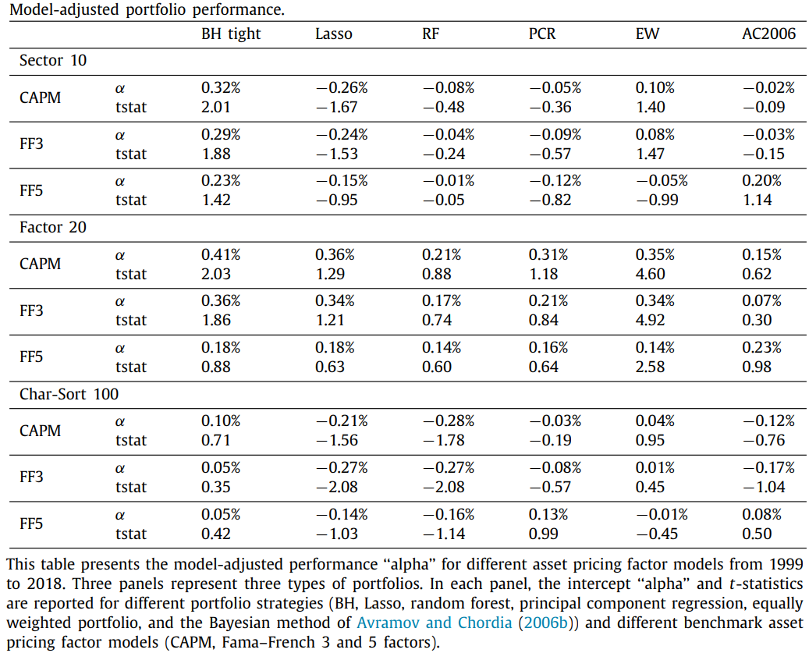
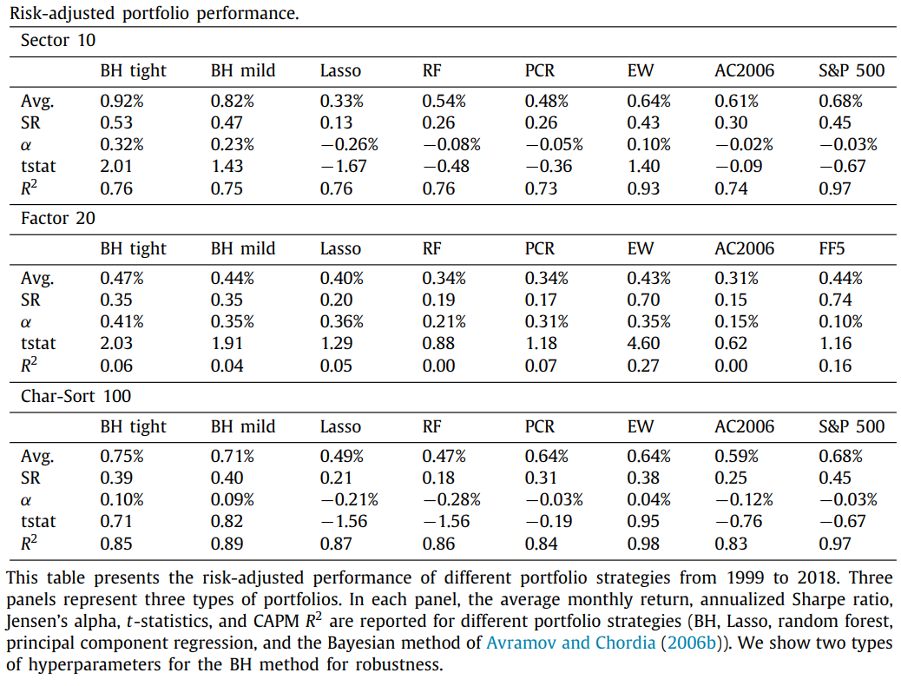

# Factor investing: A Bayesian hierarchical approach

Guanhao Feng1, Jingyu He 1, ***Journal of Econometrics***, 2022

1. *City University of Hong Kong*

## Abstract 

This paper investigates the **asset allocation** problem when **returns are predictable**1. We introduce a market-timing **Bayesian hierarchical (BH)** approach that adopts **heterogeneous** time-varying coefficients driven by lagged fundamental characteristics. Our approach estimates the conditional expected returns and residual covariance matrix2 **jointly** enables evaluating the **estimation risk**3 in the portfolio analysis. The hierarchical prior allows the modeling of different assets separately while **sharing information** across assets. 

We demonstrate the performance of the U.S. equity market, and our BH approach <u>outperforms most alternative methods in terms of point prediction and interval coverage</u>. In addition, the BH efficient portfolio achieves monthly returns of 0.92% and a significant Jensen’s alpha of 0.32% in sector investment over the past twenty years. We detect that technology, energy, and manufacturing are the most critical sectors in the past decade, and size, investment, and short-term reversal factors are heavily weighted in our portfolio. Furthermore, the stochastic discount factor constructed by our BH approach can explain many risk anomalies.

> [!TIP]
> 1. means **conditional**. If returns are unpredictable, the mean–variance efficient portfolio is time-invariant. Therefore, the econometric interest lies in the estimation property of unconditional expected returns and the covariance matrix
> 2. not **return** covariance matrix
> 3. investor uncertainty about the **parameters** of the return

***Main contributions***

- Estimates the conditional expected returns and residual covariance matrix **jointly**
- The hierarchical prior allows the modeling of different assets separately while **sharing information** across assets
- The stochastic discount factor constructed by our BH approach can explain many risk anomalies

## Conceptual Details
factor rotation?
### Uncertainty of Parameters

贝叶斯方法允许我们将经济学先验加入到统计模型中，以及评估参数估计中的不确定性。

然而，在传统频率学派的方法以及现代机器学习方法中，并没有考虑参数的不确定性，特别是在高维的情况下，需要面临更加huge的参数空间。

we project the time-varying coefficients of each asset onto its fundamental characteristics

### Motivation
#### Hierachical Modeling

- The existing empirical literature focuses on testing the existence of return predictability for a single market index using market-timing macro predictors
- current literature struggles to find consistent predictability evidence across multiple assets
 
When we try to model multiple assets, **the time series of asset return is usually short (e.g., monthly data with hundreds of observations), but the number of time series is relatively large (e.g., hundreds or even thousands of assets)**

Researchers either sacrifice the potential benefit from massive data and model each asset independently (time series modeling) or ignore the heterogeneity of assets, stack all time-series together, and train a single model (pool modeling).

**Neither way properly takes advantage of information from massive data**. Time series fits individual assets poorly due to the small sample size used, whereas pooled modeling is naive and loses heterogeneous signals

Our BH approach sheds light on this problem from **a Bayesian perspective**. BH provides a framework for studying the joint predictability for multiple assets. The hierarchical model4 provides a way to **share information** across numerous assets. Hence, it can handle the cross-sectional return dependence. **The Markov chain Monte Carlo (MCMC)** sampling process of our BH approach can be interpreted as two intuitive cyclic steps. 

### Variables
Market-timing macro predictors and fundamental characteristics

sector portfolios, tradable risk factors, and characteristics-sorted portfolios.

## Empirical results

## Technical Details
The first step (information sharing step) takes condition on the hierarchical prior and updates regression coefficients of each asset separately. Note that the
hierarchical prior provides information from all other assets. The second step (information grouping step) evaluates
regression coefficients of all asset returns and updates parameters of the hierarchical prior to gathering information from
individual assets. Intuitively, the hierarchical prior builds an overline bridge linking multiple asset returns. The within asset part describes the predictor-return dynamics, and the cross-asset part incorporates the heterogeneity of predictor existence and strength.

Despite the advantages above, our Bayesian framework is flexible enough to model heterogeneous time-varying
coefficients driven by lagged fundamental characteristics of each asset. Avramov and Chordia (2006b) find these macro
predictors are linked to the underlying business cycles for conditional investing or market timing, and their analysis
focuses on individual stocks. Our paper pursues a similar goal: to assess the economic value of predictability and show
portfolio strategies successfully rotate across different risk factor styles during changing business conditions. Furthermore,
our BH approach models the covariance matrix simultaneously with the expected return, thus enabling the creation of
mean–variance efficient portfolios.

### BayesIan predictive model

Historical return$ R_t = (r_{1,t}.....,r_{N,t}) $, $ P $asset characteristics$ z_t $ for each asset, and $Q$ market-timing macro predictors $x_t$, we denote them as $D_t = (R_t.x_t,z_t) $. Investor updates his or her portfolio regularly, at time period $t$, models the joint predictive distribution of returns $f(R_{t+1}|D_t)$, and calculates **asset allocation weight** $W_t = (w_t^1.....w_t^N)$ accordingly. 

In the next time period, the realized return of the portfolio is
$$
R_{t+1}^P = W_t^T R_{t+1} \tag{1}
$$

- If returns are **unpredictable**, the mean–variance efficient portfolio is time-invariant. Therefore, the econometric interest lies in the estimation property of unconditional expected returns and the covariance matrix.
- If returns are **predictable**, one needs to learn the source and mechanism of return predictability
 
$$
r_{i,t+1} = \alpha_{i,t} + x_t^T \beta_{i,t} + \epsilon_{i,t+1} \tag{2}
$$

The regression coefficients $\alpha_{i,t}$ and $\beta_{i,t}$ are assumed to be **time-varying**, driven by asset characteristics as follows:

$$\begin{aligned}
\alpha_{i,t} &= \eta_i^a + z_{i,t}^T \theta_i^a \\
\beta_{i,t} &= \eta_i^b + \theta_i^b z_{i,t} \tag{3}
\end{aligned}
$$

where $\theta_i^b$ is a matrix coefficient of size $Q \times P$, and $z_{i,t}$ is the vector for $P$ portfolio characteristics.

Combined Eq.(3) with Eq.(2), 
$$
r_{i,t+1} = \eta_i^a +z_{i,t}^T \theta_i^a + x_t^T \eta_i^b + (x_t \otimes z_{i,t})^T \theta_i^b +\epsilon_{i,t+1} \tag{4}
$$
where $\otimes$ stands for kronecker product (克罗内克积).

不同于前述对单个资产单独建模，本文通过**SUR以及系数的结构化先验**来估计不同资产的协方差。SUR使我们能够同时估计资产收益率和协方差，而结构化先验为资产间的信息共享搭建了桥梁，即使我们model each asset's  return by its characteristics。

### Seemingly unrelated regressions

为了简化notation，将Eq.(4)表示为：
$$
r_{i,t+1} = f_{i,t}^T + \epsilon_{i,t+1} \tag{5}
$$
where $f_{i,t} = [1,z_{i,t},x_t,(x_t \otimes z_{i,t})]$ indicates all **regressors**, and $b_i = [\eta_i^a,\theta_i^a,\eta_i^b,\theta_i^b] $ is a vector of all corresponding **regression coefficients**.

For each asset $i$, we stack the equations of different time periods $t$ as 
$$
r_i = f_i^T b_i + \epsilon_i \tag{6}
$$
where $r_i =(r_{i,2}.....,r_{i,T+1})^T,\ \epsilon_i = (\epsilon_{i,2}.....\epsilon_{i,T+1})$, and $f_i$ is matrix with $T$ rows.

The system of all $i=1,....N$ assets is written as an SUR setup as follows. **Stacking all equations** yields 
$$
R = FB + E \tag{7}
$$

where
$
R = \left[ \begin{matrix}
r_1 \\ r_2 \\ \vdots \\ r_N
\end{matrix}  \right],
$
$
\qquad F= \left[ \begin{matrix}
f_1 &0 &0 &0 \\
0 & f_2 &0 &0 \\
0 &\cdots &\cdots &0 \\
0 &0 &0 & f_N
\end{matrix}  \right],
$
$
\qquad B = \left[ \begin{matrix}
b_1 \\ b_2 \\ \vdots \\ b_N
\end{matrix}  \right],
$
$
\qquad E = \left[ \begin{matrix}
\epsilon_1 \\ \epsilon_2 \\ \vdots \\ \epsilon_N
\end{matrix}  \right]
$

In the expression above, $R$ is an $NT \times 1$ vector of a stacked vector of firm returns, $F$ is an $NT × NK$ block diagonal matrix, $B$ is an $NK × 1$ vector, and $E$ is an $NT × 1$ stacked vector of residuals.

Estimating the covariance matrix of many assets, $\Sigma$, **is a challenging problem in general**.

The literature of portfolio optimization primarily develops a covariance matrix estimator **independently from** return predictions. Researchers either ***assume a low-dimensional factor structure*** or ***shrink the empirical estimator*** for the covariance matrix.

Our SUR setup allows for <mark>**joint**</mark> modeling for asset returns and the covariance matrix.

We assume the **covariance matrix of the stacked residual** $E$ has the form $Cov(E) := \Omega = \Sigma \otimes I_T$ , where $\Sigma$ is a **dense** matrix of cross-sectional covariance, and $I_T$ is an T × T identity matrix. This structure implies that assets are correlated in the cross-section but are independent across different time periods, which is a standard assumption in the empirical asset pricing literature.

This specification differs from the standard SUR model in Zellner (1962) as well as Polson and Tew (2000), which do not assume any constraint of $\Omega$ and estimate the $NT × NT$ matrix directly.

Therefore, we ***reduce the dimension of its parameter space*** dramatically from $NT (NT + 1)/2$ to $N(N + 1)/2$.

Estimating the dense covariance matrix, $\Sigma$ **enables us to create the mean–variance portfolio**. Many popular machine learning algorithms, such as Lasso and neural network, cannot model this common shock jointly with returns but **assume a constant variance over time or across assets**.

### Hierarchical prior specification

To study the joint predictability across assets, rather than **putting an independent prior** on $b_i$ for each asset, we assume a hierarchical structure with a common prior mean.

Suppose $b_i$ has **an independent and identical normal prior**
$$
b_i \sim N(\bar{b},\Delta_{b}), \forall i=1,....N, \tag{8}
$$
where, $\bar{b}$ is the prior mean of $b_i$, and $\Delta_b$ is a dense prior covariance matrix. Futhermore, **the prior mean and covariance are assumed to have a hierarchical prior**:
$$
\bar{b} \sim N(\bar{\bar{b}},\Delta_{\bar{b}}) \tag{9}
$$
$$
\Delta_b \sim IW(v_b,V_b) \tag{10}
$$
This setup is **the standard normal-inverse-Wishart conjugate prior** for $\bar{b}$ and $\Delta_b$. It assumes the average predictability of all predictors is $\bar{\bar{b}}$, and $\Delta_b$ represents the confidence of this predictability belief. We set $\bar{\bar{b}}$ in practice, ***implying the belief a priori that the average predictability of those predictors is zero***. This prior specification contains four groups of hyperparameters: $\{ \bar{\bar{b}},\ \Delta_{\bar{b}},\ v_b, \ V_b  \}$

> [!TIP:Wishart distribution]
> 在算multivariate normal distribution 的posterior distribution的时候，inverse Wishart是协方差矩阵的conjugate prior

The normal prior on $b_i$ **is equivalent to $L_2$ shrinkage** of coefficients similar to the ridge regression. The prior covariance $\Delta_{\bar{b}}$ updates from the data, thus our model can **adapt the shrinkage level based on the information from the data**. It highlights the primary advantage of our BH approach over alternatives. **When many potential and weak predictors exist, the hierarchical prior can properly shrink coefficients**. From the frequentists’ perspective, simply testing H0 : $\bar{b}_j = 0$ reveals the joint predictability implication of the jth predictor.

Notice the dimension reduction assumption $\Omega = \Sigma \otimes I_T$ , where $\Sigma$ is assumed a standard inverse-Wishart prior on
with **two hyper-parameters** $v_{\Sigma}$ , and $V_{\Sigma}$ as:
$$
\Sigma \sim IW(v_{\Sigma},V_{\Sigma}) \tag{11}
$$

**The MCMC sampler updates $\Sigma$**, and $\Omega$ can be recovered by simple calculation.

The model likelihood function is multivariate normal:
$$
l(E|B,\Omega) \propto |\Omega|^{-1\over2} exp \{ {-1\over2}(R-FB)^T \Omega^{-1} (R-FB) \} \tag{12}
$$
Hence, the joint posterior distribution can be expressed as
$$
p(B,\Omega,\bar{b},\Delta_b|R,F) \propto l(E|B,\Omega) p(\Omega) p(B|\bar{b},\Delta_b)p(\bar{b})p(\Delta_b) \tag{13}
$$

### Markov chain Monte Carlo scheme

> [!NOTE|label:MCMC]
> 理论上来说MCMC能够得到真实值，就像理论上来说Mixture of Gaussian能够拟合一切分布。但是MCMC extremely computational expensive
>
> Variational Inference算起来就比较快，但是它假设了隐变量之间独立性，which 并不适用于现实情况

[为什么要用MCMC采样](https://www.zhihu.com/question/45196331/answer/2376274957)

[Gibbs sampler(alternative conditional sampling)](https://zhuanlan.zhihu.com/p/25072161)

[Gibbs sampler and EM algorithem](https://www.zhihu.com/question/361989539/answer/943850257)

The design of our Gibbs sampler is straightforward since all priors are conjugate to the likelihood. 

We assume $\Omega = \Sigma \otimes I_T $ and update samller $\Sigma$ instead of $\Omega$.

The corresponding Gibbs sample is

(1) Sampling B from a multivariate normal distribution (**information sharing step**):

$$
B|\bar{b},\Delta_b,\Omega,R,F \sim N \Big(b*,(F^T\Omega^{-1}F+I_N\otimes \Delta_b^{-1})^{-1} \Big) \tag{14}
$$

$$
b* = (F^T\Omega^{-1}F+I_N\otimes \Delta_b^{-1})^{-1} F^T\Omega^{-1}F+\Big((I_N\otimes \Delta_b^{-1})(\pmb{1}_N \otimes \bar{b}) \Big) \tag{15}
$$

$I_N$ is an $NxN$ dimensional identity matrix, and $\pmb{1}_N$ denotes an $Nx1$ vector of ones.

(2) Sampling $\bar{b}$ from a multivariate normal distribution (**information grouping step**):

$$
\bar{b}|B,\Delta_b \sim N \bigg( \Big( \Delta_{\bar{b}}^{-1}+N \Delta_{b}^{-1} \Big)^{-1} \Big( \Delta_{\bar{b}}^{-1} \bar{\bar{b}}+\Delta_{b}^{-1} (\pmb{1}_N \otimes I_K)^TB\Big),\ \Big( \Delta_{\bar{b}}^{-1}+N \Delta_{b}^{-1} \Big)^{-1}  \bigg) \tag{16}
$$
where $\bar{\bar{b}}$ is set to 0 for the purpose of shrinkage.

(3) Sampling ∆b from an inverse-Wishart distribution:

$$
\Delta_b | B,\bar{b} \sim IW \Big(v_b+N, ((D-\bar{b}\otimes\pmb{1}_N^T)(D-\bar{b}\otimes\pmb{1}_N^T)^T + V_b)^{-1} \Big) \tag{17}
$$

(4) Sampling $\Sigma$ from an inverse-Wishart distribution:

$$
\Sigma | B,R,F \sim IW(v_{\Sigma}+T,V_{\Sigma}+\tilde{E}^T\tilde{E}) \tag{18}
$$
where $\tilde{E} = [\hat{\epsilon_1},\cdots,\hat{\epsilon_N}]$ is a $TxN$ matrix of residuals, $\hat{\epsilon_i} = r_i-f_i^T b_i$. Calculate $\Omega = \Sigma \otimes I_T$ accordingly.

**Convergence is always a concern for MCMC algorithms**. We confirm the convergence of the algorithm by examining the trace plot of posterior samples and effective sample size (ESS) for all parameters using the R package coda.The trace plot stabilizes fast, and we achieve an average effective sample size of 1800 out of 2000 posterior draws, which indicates that the sampler explores the posterior efficiently.

> [!ATTENTION|label:Convergence]
> MCMC方法的难点是如何判断我们已经到达稳态了，**目前还没有明确的理论指导表明其是否到达稳态，何时能到达稳态**，所以需要一些直观判断方法如人为的检验样本或观察连续采样间的关联。

### Predicting returns and creating efficient portfolio

